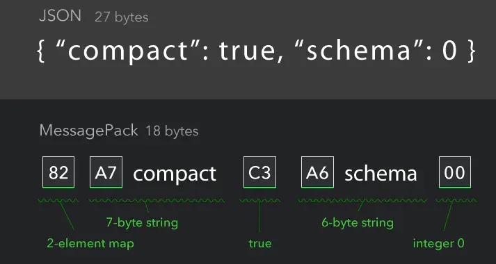

[TOC]

# MessagePack编码

It's like JSON, but fast and small.

它的数据格式与json类似，但是在存储时对数字，多字节字符，数组等都做了很多优化，减少了无用的字符，二进制格式，也保证不用字符化带来额外的存储空间的增加。

官网给出的msgpack与json的对比：




## 语法

### 元素类型

- `Integer` 整数型
- `Nil` 空值型
- `Boolean` 布尔型
- `Float` 浮点型
- `Raw` 不定长类型
  - `String` 字符串，扩充了Raw类型，用来表示UTF-8编码
  - `Binary` 二进制对象，扩充了Raw类型，用来表示一个字节数组
- `Array` 数组
- `Map` 字典
- `Extension` 自定义类型
  - `Timestamp` 时间戳

### 限制

- `Integer`类型的取值范围为`[-(2^63), (2^64)-1]`
- `Binary`类型的最大长度为`(2^32)-1`
- `String`类型的最大长度为`(2^32)-1`
- `String`可能包含无效的字节序，反序列化时的解码取决于提供的代码逻辑
- `Array`的最大容量为`(2^32)-1`
- `Map`的最大容量为`(2^32)-1`

### 自定义类型

MessagePack允许使用数字`0~127`来唯一标识自定义类型，`-1~-128`保留给预定义的类型用；

以下为预定义的类型表：


| 类型      | 值   |
| --------- | ---- |
| Timestamp | -1   |


## 原理

编码表(默认大端编码)

| 类型            | first byte (二进制) | first byte (十六进制) |
| --------------- | ------------------- | --------------------- |
| positive fixint | 0xxxxxxx            | 0x00 - 0x7f           |
| fixmap          | 1000xxxx            | 0x80 - 0x8f           |
| fixarray        | 1001xxxx            | 0x90 - 0x9f           |
| fixstr          | 101xxxxx            | 0xa0 - 0xbf           |
| nil             | 11000000            | 0xc0                  |
| (never used)    | 11000001            | 0xc1                  |
| false           | 11000010            | 0xc2                  |
| true            | 11000011            | 0xc3                  |
| bin 8           | 11000100            | 0xc4                  |
| bin 16          | 11000101            | 0xc5                  |
| bin 32          | 11000110            | 0xc6                  |
| ext 8           | 11000111            | 0xc7                  |
| ext 16          | 11001000            | 0xc8                  |
| ext 32          | 11001001            | 0xc9                  |
| float 32        | 11001010            | 0xca                  |
| float 64        | 11001011            | 0xcb                  |
| uint 8          | 11001100            | 0xcc                  |
| uint 16         | 11001101            | 0xcd                  |
| uint 32         | 11001110            | 0xce                  |
| uint 64         | 11001111            | 0xcf                  |
| int 8           | 11010000            | 0xd0                  |
| int 16          | 11010001            | 0xd1                  |
| int 32          | 11010010            | 0xd2                  |
| int 64          | 11010011            | 0xd3                  |
| fixext 1        | 11010100            | 0xd4                  |
| fixext 2        | 11010101            | 0xd5                  |
| fixext 4        | 11010110            | 0xd6                  |
| fixext 8        | 11010111            | 0xd7                  |
| fixext 16       | 11011000            | 0xd8                  |
| str 8           | 11011001            | 0xd9                  |
| str 16          | 11011010            | 0xda                  |
| str 32          | 11011011            | 0xdb                  |
| array 16        | 11011100            | 0xdc                  |
| array 32        | 11011101            | 0xdd                  |
| map 16          | 11011110            | 0xde                  |
| map 32          | 11011111            | 0xdf                  |
| negative fixint | 111xxxxx            | 0xe0 - 0xff           |

### 序列化

- `String`

  - 字符串长度<=31字节

    序列化格式为：`|类型|内容|` (长度信息隐藏在类型的后5位中)
    
    | 类型             | 最大长度 |
    | ---------------- | -------- |
    | fixstr(101XXXXX) | 31 byte  |

  - 字符串长度>31字节

    序列化格式为：`|类型|长度|内容|`
    
    | 类型  | 最大长度      |
    | ----- | ------------- |
    | str8  | (2^8)-1 byte  |
    | str16 | (2^16)-1 byte |
    | str32 | (2^32)-1 byte |

​		例：

​		一个160个字符长度的字符串的表示为：`|D9|A0|内容xxx|`；D9表示str8, A0表示160;

- `Binary`

  序列化格式为：`|类型|长度|内容|`


  | 类型   | 长度          |
  | ------ | ------------- |
  | bin 8  | (2^8)-1 byte  |
  | bin 16 | (2^16)-1 byte |
  | bin 32 | (2^32)-1 byte |

  例：

- `Array`

  - 数组元素个数<=15

    序列化格式为：`|类型|内容|` (长度信息隐藏在类型的后4位中)
    
    | 类型               | 元素最大个数 |
    | ------------------ | ------------ |
    | fixarray(1001XXXX) | 15           |

  - 数组元素个数>15

    序列化格式为：`|类型(8bit)|长度(取决于类型)|内容(取决于长度值)|`
    
    | 类型     | 元素最大个数 |
    | -------- | ------------ |
    | array 16 | (2^16)-1     |
    | array 32 | (2^32)-1     |

- `Map`

  - 字典元素个数<=15

    序列化格式为：`|类型(8bit)|内容(取决于元素最大个数)|` (长度信息隐藏在类型的后4位中)
    
    | 类型             | 元素最大个数 |
    | ---------------- | ------------ |
    | fixmap(1000XXXX) | 15           |

  - 字典元素个数>15

    序列化格式为：`|类型(8bit)|长度(取决于类型)|内容(取决于长度值)|`
    
    | 类型   | 元素最大个数 |
    | ------ | ------------ |
    | map 16 | (2^16)-1     |
    | map 32 | (2^32)-1     |

- `Extension`

  自定义类型有以下表示方式：

  - 固定长度

    序列化格式为：`|类型(8bit)|自定义类型标识(8bit)|内容(取决于类型)|`
    
    | 类型      | 长度    |
    | --------- | ------- |
    | fixext 1  | 1 byte  |
    | fixext 2  | 2 byte  |
    | fixext 4  | 4 byte  |
    | fixext 8  | 8 byte  |
    | fixext 16 | 16 byte |

  - 可变长度

    序列化格式为：`|类型(8bit)|长度(变长)|自定义类型标识(8bit)|内容(取决于长度值)|`
    
    | 类型   | 最大长度       |
    | ------ | -------------- |
    | ext 8  | (2^8)-1 byte   |
    | ext 16 | (2^16)-1 byte  |
    | ext 32 | (2^32)-1 bytes |

- `Timestamp`

  - `tiemstamp 32`

    序列化格式为：`|0xd6(8bit)|-1(8bit)|自时间1970-01-01 00:00:00 UTC以来的秒数(32bit)|`

  - `timestamp 64`

    序列化格式为：`|0xd7(8bit)|-1(8bit)|纳秒值(30bit)|自时间1970-01-01 00:00:00 UTC以来的秒数(34bit)|`

  - `timestamp 96`

    序列化格式为：`|0xc7(8bit)|12(8bit)|-1(8bit)|纳秒值(32bit)|自时间1970-01-01 00:00:00 UTC以来的秒数(64bit)|`


## 对比

| -        | MessagePack | JSON | Protobuf |
| -------- | ----------- | ---- | -------- |
| 压缩效率 | 一般        | 低   | 高       |
| 序列化   | 快          | 慢   | 一般     |
| 反序列化 | 快          | 慢   | 一般     |
| 可调试性 | 差          | 优   | 差       |


## 示例

1. 序列化时间

   ```c
   struct timespec {
       long tv_sec;  // seconds
       long tv_nsec; // nanoseconds
   } time;
   if ((time.tv_sec >> 34) == 0) {
       uint64_t data64 = (time.tv_nsec << 34) | time.tv_sec;
       if (data64 & 0xffffffff00000000L == 0) {
           // timestamp 32
           uint32_t data32 = data64;
           serialize(0xd6, -1, data32)
       }
       else {
           // timestamp 64
           serialize(0xd7, -1, data64)
       }
   }
   else {
       // timestamp 96
       serialize(0xc7, 12, -1, time.tv_nsec, time.tv_sec)
   }
   ```

2. 反序列化时间

   ```c
    ExtensionValue value = deserialize_ext_type();
    struct timespec result;
    switch(value.length) {
    case 4:
        uint32_t data32 = value.payload;
        result.tv_nsec = 0;
        result.tv_sec = data32;
    case 8:
        uint64_t data64 = value.payload;
        result.tv_nsec = data64 >> 34;
        result.tv_sec = data64 & 0x00000003ffffffffL;
    case 12:
        uint32_t data32 = value.payload;
        uint64_t data64 = value.payload + 4;
        result.tv_nsec = data32;
        result.tv_sec = data64;
    default:
        // error
    }
   ```


## 参考

- [msgpack官网](https://msgpack.org/)
- [github-msgpack](https://github.com/msgpack/msgpack)
- [github-msgpack的C语言实现](https://github.com/msgpack/msgpack-c/tree/c_master)
- [维基百科-MessagePack](https://en.wikipedia.org/wiki/MessagePack)
- [MessagePack简介及使用](https://www.jianshu.com/p/8c24bef40e2f)

