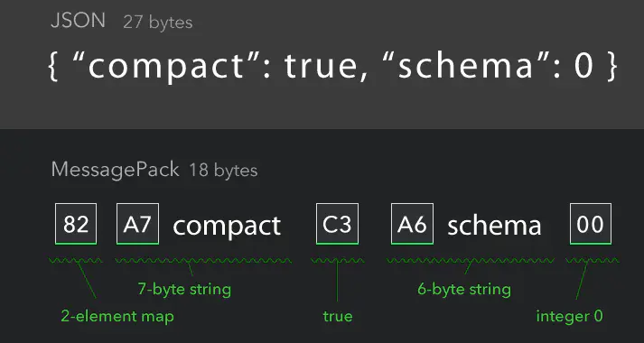

English | [中文版](msgpack_zh.md)

# MessagePack Encoding

[TOC]

It's like JSON, but fast and small.

Its data format is similar to JSON, but it optimizes storage for numbers, multibyte characters, arrays, etc., reducing unnecessary characters. The binary format also ensures that no extra storage space is used due to character encoding.

The official website provides a comparison between msgpack and json:



## Syntax

### Element Types

- `Integer` Integer type
- `Nil` Null type
- `Boolean` Boolean type
- `Float` Floating point type
- `Raw` Variable length type
	- `String` String, an extension of Raw type, used to represent UTF-8 encoding
	- `Binary` Binary object, an extension of Raw type, used to represent a byte array
- `Array` Array
- `Map` Dictionary
- `Extension` Custom type
	- `Timestamp` Timestamp

### Limits

- `Integer` value range: `[-(2^63), (2^64)-1]`
- `Binary` max length: `(2^32)-1`
- `String` max length: `(2^32)-1`
- `String` may contain invalid byte sequences; decoding on deserialization depends on the provided code logic
- `Array` max capacity: `(2^32)-1`
- `Map` max capacity: `(2^32)-1`

### Custom Types

MessagePack allows using numbers `0~127` to uniquely identify custom types; `-1~-128` are reserved for predefined types.

The following is the table of predefined types:

| Type      | Value |
| --------- | ----- |
| Timestamp | -1    |

## Principle

Encoding table (default big-endian encoding)

| Type            | first byte (binary) | first byte (hex) |
| --------------- | ------------------- | ---------------- |
| positive fixint | 0xxxxxxx            | 0x00 - 0x7f      |
| fixmap          | 1000xxxx            | 0x80 - 0x8f      |
| fixarray        | 1001xxxx            | 0x90 - 0x9f      |
| fixstr          | 101xxxxx            | 0xa0 - 0xbf      |
| nil             | 11000000            | 0xc0             |
| (never used)    | 11000001            | 0xc1             |
| false           | 11000010            | 0xc2             |
| true            | 11000011            | 0xc3             |
| bin 8           | 11000100            | 0xc4             |
| bin 16          | 11000101            | 0xc5             |
| bin 32          | 11000110            | 0xc6             |
| ext 8           | 11000111            | 0xc7             |
| ext 16          | 11001000            | 0xc8             |
| ext 32          | 11001001            | 0xc9             |
| float 32        | 11001010            | 0xca             |
| float 64        | 11001011            | 0xcb             |
| uint 8          | 11001100            | 0xcc             |
| uint 16         | 11001101            | 0xcd             |
| uint 32         | 11001110            | 0xce             |
| uint 64         | 11001111            | 0xcf             |
| int 8           | 11010000            | 0xd0             |
| int 16          | 11010001            | 0xd1             |
| int 32          | 11010010            | 0xd2             |
| int 64          | 11010011            | 0xd3             |
| fixext 1        | 11010100            | 0xd4             |
| fixext 2        | 11010101            | 0xd5             |
| fixext 4        | 11010110            | 0xd6             |
| fixext 8        | 11010111            | 0xd7             |
| fixext 16       | 11011000            | 0xd8             |
| str 8           | 11011001            | 0xd9             |
| str 16          | 11011010            | 0xda             |
| str 32          | 11011011            | 0xdb             |
| array 16        | 11011100            | 0xdc             |
| array 32        | 11011101            | 0xdd             |
| map 16          | 11011110            | 0xde             |
| map 32          | 11011111            | 0xdf             |
| negative fixint | 111xxxxx            | 0xe0 - 0xff      |

### Serialization

- `String`
	- String length <= 31 bytes
		Serialization format: `|type|content|` (length info is hidden in the last 5 bits of the type)
		| Type             | Max length |
		| ---------------- | ---------- |
		| fixstr(101XXXXX) | 31 bytes   |
	- String length > 31 bytes
		Serialization format: `|type|length|content|`
		| Type  | Max length      |
		| ----- | --------------- |
		| str8  | (2^8)-1 bytes   |
		| str16 | (2^16)-1 bytes  |
		| str32 | (2^32)-1 bytes  |
		Example:
		A string of length 160: `|D9|A0|contentxxx|`; D9 means str8, A0 means 160.
- `Binary`
	Serialization format: `|type|length|content|`
	| Type   | Max length      |
	| ------ | --------------- |
	| bin 8  | (2^8)-1 bytes   |
	| bin 16 | (2^16)-1 bytes  |
	| bin 32 | (2^32)-1 bytes  |
- `Array`
	- Number of elements <= 15
		Serialization format: `|type|content|` (length info is hidden in the last 4 bits of the type)
		| Type               | Max elements |
		| ------------------ | ------------ |
		| fixarray(1001XXXX) | 15           |
	- Number of elements > 15
		Serialization format: `|type(8bit)|length(depends on type)|content(depends on length)|`
		| Type     | Max elements |
		| -------- | ------------ |
		| array 16 | (2^16)-1     |
		| array 32 | (2^32)-1     |
- `Map`
	- Number of elements <= 15
		Serialization format: `|type(8bit)|content(depends on max elements)|` (length info is hidden in the last 4 bits of the type)
		| Type             | Max elements |
		| ---------------- | ------------ |
		| fixmap(1000XXXX) | 15           |
	- Number of elements > 15
		Serialization format: `|type(8bit)|length(depends on type)|content(depends on length)|`
		| Type   | Max elements |
		| ------ | ------------ |
		| map 16 | (2^16)-1     |
		| map 32 | (2^32)-1     |
- `Extension`
	Custom types have the following representations:
	- Fixed length
		Serialization format: `|type(8bit)|custom type id(8bit)|content(depends on type)|`
		| Type      | Length   |
		| --------- | -------- |
		| fixext 1  | 1 byte   |
		| fixext 2  | 2 bytes  |
		| fixext 4  | 4 bytes  |
		| fixext 8  | 8 bytes  |
		| fixext 16 | 16 bytes |
	- Variable length
		Serialization format: `|type(8bit)|length(variable)|custom type id(8bit)|content(depends on length)|`
		| Type   | Max length      |
		| ------ | -------------- |
		| ext 8  | (2^8)-1 bytes  |
		| ext 16 | (2^16)-1 bytes |
		| ext 32 | (2^32)-1 bytes |
- `Timestamp`
	- `timestamp 32`
		Serialization format: `|0xd6(8bit)|-1(8bit)|seconds since 1970-01-01 00:00:00 UTC (32bit)|`
	- `timestamp 64`
		Serialization format: `|0xd7(8bit)|-1(8bit)|nanoseconds(30bit)|seconds since 1970-01-01 00:00:00 UTC (34bit)|`
	- `timestamp 96`
		Serialization format: `|0xc7(8bit)|12(8bit)|-1(8bit)|nanoseconds(32bit)|seconds since 1970-01-01 00:00:00 UTC (64bit)|`

## Comparison

| -        | MessagePack | JSON | Protobuf |
| -------- | ----------- | ---- | -------- |
| Compression | Medium    | Low  | High     |
| Serialization | Fast    | Slow | Medium   |
| Deserialization | Fast  | Slow | Medium   |
| Debuggability | Poor    | Good | Poor     |

## Examples

1. Serialize time
	 ```c
	 struct timespec {
			 long tv_sec;  // seconds
			 long tv_nsec; // nanoseconds
	 } time;
	 if ((time.tv_sec >> 34) == 0) {
			 uint64_t data64 = (time.tv_nsec << 34) | time.tv_sec;
			 if (data64 & 0xffffffff00000000L == 0) {
					 // timestamp 32
					 uint32_t data32 = data64;
					 serialize(0xd6, -1, data32)
			 }
			 else {
					 // timestamp 64
					 serialize(0xd7, -1, data64)
			 }
	 }
	 else {
			 // timestamp 96
			 serialize(0xc7, 12, -1, time.tv_nsec, time.tv_sec)
	 }
	 ```
2. Deserialize time
	 ```c
		ExtensionValue value = deserialize_ext_type();
		struct timespec result;
		switch(value.length) {
		case 4:
				uint32_t data32 = value.payload;
				result.tv_nsec = 0;
				result.tv_sec = data32;
		case 8:
				uint64_t data64 = value.payload;
				result.tv_nsec = data64 >> 34;
				result.tv_sec = data64 & 0x00000003ffffffffL;
		case 12:
				uint32_t data32 = value.payload;
				uint64_t data64 = value.payload + 4;
				result.tv_nsec = data32;
				result.tv_sec = data64;
		default:
				// error
		}
	 ```

## References

- [msgpack official site](https://msgpack.org/)
- [github-msgpack](https://github.com/msgpack/msgpack)
- [github-msgpack C implementation](https://github.com/msgpack/msgpack-c/tree/c_master)
- [Wikipedia - MessagePack](https://en.wikipedia.org/wiki/MessagePack)
- [Introduction and usage of MessagePack](https://www.jianshu.com/p/8c24bef40e2f)
