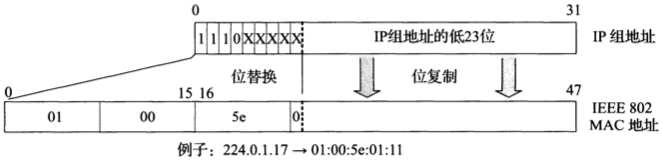
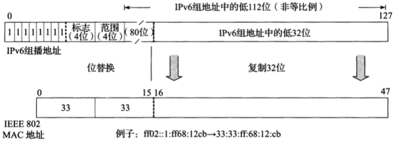
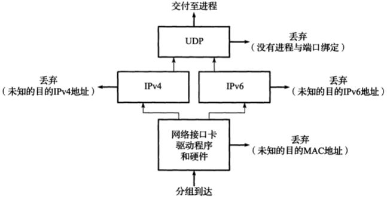
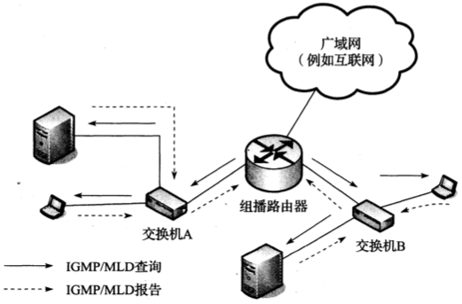
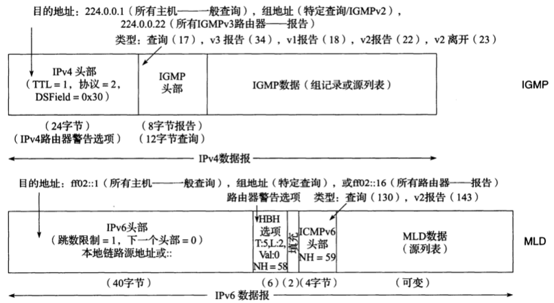
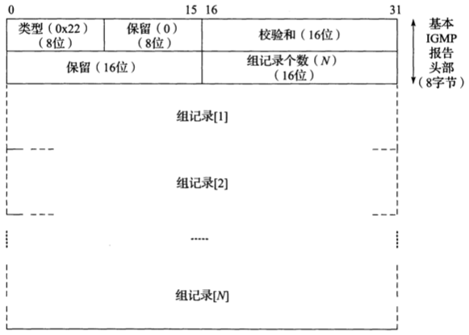
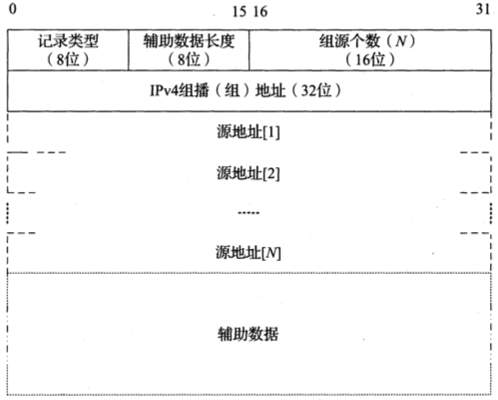
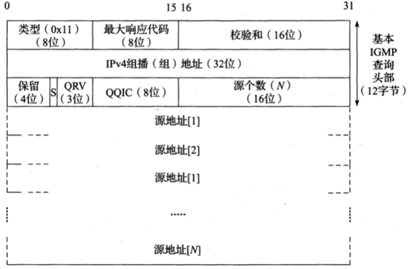

English | [中文版](multicast_zh.md)

# Multicast

[TOC]

## Address Mapping

*IPv4-to-IEEE 802 MAC multicast address mapping uses the lower 23 bits of the IPv4 multicast address as the suffix of the MAC address starting with 01:00:5e. Since only 23 of the 28 group address bits are used, 32 group addresses are mapped to the same MAC layer address.*

*IPv6-to-IEEE-802 MAC multicast address mapping uses the lower 32 bits of the IPv6 multicast address as the suffix of the MAC address starting with 33:33. Since only 32 of the 112 multicast address bits are used, $2^{80}$ groups are mapped to the same MAC layer address.*

## Host Address Filtering

*Each layer implements partial filtering of received packets. MAC address filtering can occur in software or hardware. Cheaper NICs tend to impose a greater processing burden on software, as they perform fewer functions in hardware.*

## Internet Group Management Protocol and Multicast Listener Discovery Protocol

IPv4 uses the `Internet Group Management Protocol (IGMP)` to query which groups a host belongs to.

IPv6 uses the `Multicast Listener Discovery Protocol (MLD)` to query which groups a host belongs to.

*Multicast routers periodically send IGMP (MLD) queries to each connected subnet to determine which group and source pairs are of interest to connected hosts. Hosts respond with reports indicating which groups and sources are of interest. If membership changes, hosts can also send unsolicited reports.*

### Message Structure

*In IPv4, IGMP is encapsulated as a separate protocol. MLD is a type of ICMPv6 message.*

### Handling Group Member Section

*IGMPv3 membership reports contain group records for N groups. Each group record indicates a multicast address and an optional source list.*

*An IGMPv3 group record includes a multicast address (group) and an optional source list. The source group is either allowed (include mode) or filtered out (exclude mode) by the sender. Previous versions of IGMP reports did not include a source list.*

The type value of the IGMP and MLD source list indicates the filter mode (include or exclude) and whether the source list has changed:

| Type | Name and Meaning                                                                 | When Sent                                      |
| ---- | ------------------------------------------------------------------------------- | ---------------------------------------------- |
| 0x01 | MODE_IS_INCLUDE(IS_IN): Traffic from any relevant source address is not filtered | In response to a query from a multicast router |
| 0x02 | MODE_IS_EXCLUDE(IS_EX): Traffic from any relevant source address is filtered     | In response to a query from a multicast router |
| 0x03 | CHANGE_TO_INCLUDE_MODE(TO_IN): Change from exclude mode; traffic from any relevant source address should now not be filtered | In response to a local action changing filter mode from exclude to include |
| 0x04 | CHANGE_NEW_SOURCES(TO_EX): Change from include mode; traffic from any relevant source address should now be filtered | In response to a local action changing filter mode from include to exclude |
| 0x05 | ALLOW_NEW_SOURCES(ALLOW): Change in source list; traffic from any relevant source address should now not be filtered | In response to a local action allowing new sources |
| 0x06 | BLOCK_OLD_SOURCES(BLOCK): Change in source list; traffic from any relevant source address should now be filtered | In response to a local action blocking previously allowed sources |

- Current-state record
	- 0x01
	- 0x02
- Filter-mode-change record
	- 0x03
	- 0x04
- Source-list-change record
	- 0x05
	- 0x06

### Handling Multicast Router Section

*IGMPv3 queries include a multicast group address and an optional source list. General queries use a group address of 0 and are sent to the all-hosts multicast address 224.0.0.1. The QRV value encodes the maximum number of retransmissions the sender will use, and the QQIC field encodes the periodic query interval. Before ending traffic flow, specific queries are used for a group or source/group combination. In this case (and in all cases using IGMPv2 or IGMPv1), the query is sent to the address of the subject group.*

### Lightweight IGMPv3 and MLDv2

Comparison of the full versions of IGMPv3 and MLDv2 with their lightweight versions LW-IGMPv3 and LW-MLDv2

| Full Version | Lightweight Version | When Sent                          |
| ------------ | ------------------ | ---------------------------------- |
| `IS_EX({})`  | `TO_EX({})`        | In response to a `(*, G)` join     |
| `IS_EX(S)`   | `N/A`              | In response to an `EXCLUDE(S, G)` join |
| `IS_IN(S)`   | `ALLOW(S)`         | In response to an `INCLUDE(S, G)` join |
| `ALLOW(S)`   | `ALLOW(S)`         | `INCLUDE(S, G)` join               |
| `BLOCK(S)`   | `BLOCK(S)`         | `INCLUDE(S, G)` leave              |
| `TO_IN(S)`   | `TO_IN(S)`         | Change to `INCLUDE(S, G)` join     |
| `TO_IN({})`  | `TO_IN({})`        | `(*, G)` leave                     |
| `TO_EX(S)`   | `N/A`              | Change to `EXCLUDE(S, G)` join     |
| `TO_EX({})`  | `TO_EX({})`        | `(*, G)` leave                     |

### IGMP and MLD Counters and Variables

Parameters and timer values for IGMP and MLD. Most values can be changed as configuration parameters in some implementations.

| Name and Meaning                                                                                                   | Default Value (Limit)                        |
| ------------------------------------------------------------------------------------------------------------------ | -------------------------------------------- |
| Robustness Variable (RV) -- up to RV-1 retransmissions for some state change reports/queries                       | 2 (cannot be 0; should not be 1)             |
| Query Interval (QI) -- time between general queries sent by the current querier                                    | 125s                                         |
| Query Response Interval (QRI) -- max response time to generate a report. This value encodes the max response field | 10s                                          |
| Group Membership Interval (GMI) in IGMP and Multicast Address Listening Interval (MALI) in MLD -- time for a multicast router to declare no interest in a group or source/group after not seeing a report | $RV * QI + QRI$ (cannot be changed)          |
| Other Querier Present Interval in IGMP and Other Querier Present Timeout in MLD -- time for a non-querier multicast router to declare no active querier after not seeing a general query | $RV * QI + (0.5) * QRI$ (cannot be changed)  |
| Startup Query Interval -- time between general queries sent when the querier starts up                             | $(0.25) * QI$                                |
| Startup Query Count -- number of general queries sent when the querier starts up                                   | $RV$                                         |
| Last Member Query Interval (LMQI) in IGMP and Last Listener Query Interval (LLQI) in MLD -- max response time to generate a report for a specific query | 1s                                           |
| Last Member Query Count in IGMP and Last Listener Query Count in MLD -- number of specific queries sent without receiving a response before declaring no interested hosts | RV                                           |
| Unsolicited Report Interval -- time between retransmissions of initial state change reports by hosts               | 1s                                           |
| Older Version Querier Present Timeout -- time a host waits before reverting to IGMPv3 after not receiving IGMPv1 or IGMPv2 requests | $RV * QI + QRI$ (cannot be changed)          |
| Older Host Present Interval in IGMP and Older Version Host Present Timeout in MLD -- time a querier waits before reverting to IGMPv3 after not receiving IGMPv1 or IGMPv2 reports | $RV * QI + QRI$ (cannot be changed)          |

### IGMP and MLD Snooping

IGMP (MLD) snooping: A snooping switch monitors IGMP (MLD) traffic between hosts and multicast routers, and records which ports need which specific multicast flows.
