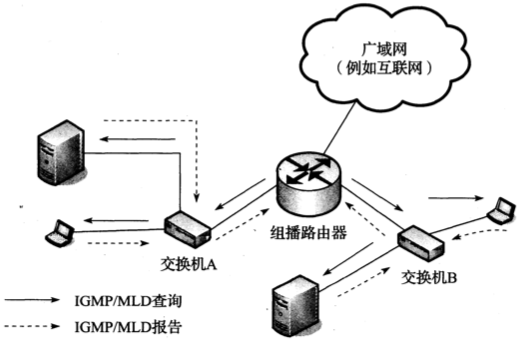
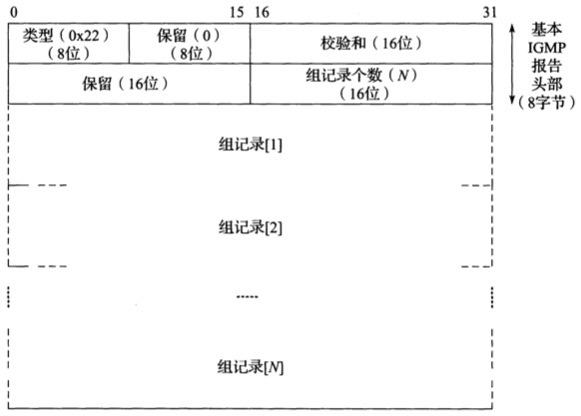
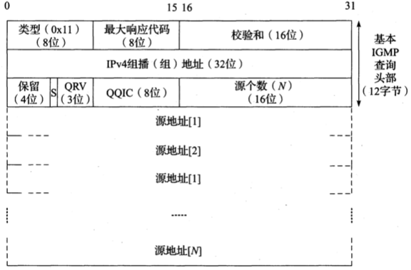

# 组播

[TOC]

## 地址映射

*IPv4-到IEEE 802 MAC组播地址的映射使用IPv4组播地址的低序23位作为以01:00:5e开始的MAC地址的后缀。因为只使用了28个组地址中的23位，32个组地址被映射到相同的MAC层地址*

*IPv6到IEEE-802 MAC组播地址映射使用IPv6组播地址的低序32位作为以33:33开始的MAC地址的后缀。因为只使用了112个组播地址位中的32位，所以$2^{80}$个组映射到相同的MAC层地址*

## 主机地址过滤

*每层实现对接收报文的部分过滤。MAC地址过滤可以发生于软件或硬件中。更便宜的NIC往往倾向于向软件强加更大的处理负担，因为它们在硬件上执行较少的功能*

## 互联网组管理协议和组播侦听发现协议

IPv4使用`互联网组管理协议（IGMP）`查询主机所属于哪些组；

IPv6使用`组播侦听发现协议（MLD）`查询主机所属于哪些组。

*组播路由器定期向每个连接的子网发送IGMP（MLD）请求，以确定哪些组和源对连接的主机来说是感兴趣的。主机使用报告响应，说明哪些组和源是感兴趣的。如果成员资格变化了，主机也可以发送主动提供的报告*

### 报文结构

*在IPv4中，IGMP被封装为一个单独的协议。MLD是ICMPv6报文的一种类型*

### 处理组成员部分

*IGMPv3成员资格报告包含N组的组记录。每个组记录表明一个组播地址和可选源列表*

*IGMPv3的组记录包括一个组播地址（组）和一个可选的源列表。源组或是由发送方允许（包含模式），或是过滤掉（排除模式）。以前版本的IGMP报告不包括源列表*

IGMP和MLD源列表的类型值指明过滤模式（包含或排除）以及源列表是否已经改变：

| 类型 | 名称和意义                                                   | 何时发送                                 |
| ---- | ------------------------------------------------------------ | ---------------------------------------- |
| 0x01 | MODE_IS_INCLUDE(IS_IN)：来自任意相关源地址的流量不会被过滤   | 响应来自一个组播路由器的查询             |
| 0x02 | MODE_IS_EXCLUDE(IS_EX)：来自任意相关源地址的流量会被过滤     | 响应来自一个组播路由器的查询             |
| 0x03 | CHANGE_TO_INCLUDE_MODE(TO_IN)：来自排除模式的改变；来自任意相关源地址的流量现在不应该被过滤 | 响应过滤器模式从排除变成包含的本地动作   |
| 0x04 | CHANGE_NEW_SOURCES(TO_EX)：来自包含模式的改变；来自任意相关源地址的流量现在应该被过滤 | 响应过滤器模式从包含变为排除的本地动作   |
| 0x05 | ALLOW_NEW_SOURCES(ALLOW)：源列表中的改变；来自任意相关源地址的流量现在不应该被过滤 | 响应源列表变为允许新源的本地动作         |
| 0x06 | BLOCK_OLD_SOURCES(BLOCK)：源列表中的改变；来自任意相关源地址的流量现在应该被过滤 | 响应源列表变为禁止先前允许的源的本地动作 |

- 当前状态记录（current-state record）
  - 0x01
  - 0x02
- 过滤器模式改变记录（filter-mode-change record）
  - 0x03
  - 0x04
- 源列表变更记录（source-list-change record）
  - 0x05
  - 0x06

### 处理组播路由器部分

*IGMPv3查询包含组播组地址和可选源列表。一般查询使用为0的组地址，并被发送到所有主机组播地址224.0.0.1。QRV值编码发送方将使用的最大重传次数，QQIC字段编码定期查询间隔。在结束流量流动之前，特定的查询用于组或是源/组的组合。在这种情况下（和使用IGMPv2或IGMPv1的所有情况下），该查询被发送到的主题组的地址*

### 轻量级IGMPv3和MLDv2

IGMPv3和MLDv2的完整版本与它们的轻量级版本LW-IGMPv3和LW-MLDv2的对比

| 完整版      | 轻量级      | 何时发送                          |
| ----------- | ----------- | --------------------------------- |
| `IS_EX({})` | `TO_EX({})` | 对于`(*, G)`加入的查询响应        |
| `IS_EX(S)`  | `N/A`       | 对于`EXCLUDE(S, G)`加入的查询响应 |
| `IS_IN(S)`  | `ALLOW(S)`  | 对于`INCLUDE(S, G)`加入的查询响应 |
| `ALLOW(S)`  | `ALLOW(S)`  | `INCLUDE(S, G)` 加入              |
| `BLOCK(S)`  | `BLOCK(S)`  | `INCLUDE(S, G)`离开               |
| `TO_IN(S)`  | `TO_IN(S)`  | 改变为`INCLUDE(S, G)`加入         |
| `TO_IN({})` | `TO_IN({})` | `(*, G)`离开                      |
| `TO_EX(S)`  | `N/A`       | 改变为`EXCLUDE(S, G)`加入         |
| `TO_EX({})` | `TO_EX({})` | `(*, G)`离开                      |

### IGMP和MLD计数器和变量

IGMP和MLD的参数和计时器的值。大多数值可以作为配置参数在一些实现中改变

| 名称和意义                                                   | 默认值（限制）                      |
| ------------------------------------------------------------ | ----------------------------------- |
| 鲁棒性变量（Robustness Variable, RV）--为一些状态改变报告/查询安排多达RV-1次的重传 | 2（不能为0；不应该为1）             |
| 查询间隔（Query Interval, QI）--当前查询器发送的一般查询之间的时间 | 125s                                |
| 查询响应间隔（Query Response Interval, QRI）--等待产生报告的最大响应时间。该值编码形成最大响应字段 | 10s                                 |
| IGMP中的组成员间隔（Group Membership Interval, GMI）和MLD中的组播地址侦听间隔（Multicast Address Listening Interval, MALI）--对于组播路由器来说，没有看到一个报告所必须经过的时间，用以宣布对于一个组或是源/组的组合没有兴趣了 | $RV * QI + QRI（不能改变）$         |
| IGMP中的其它查询出现间隔（Other Querier Present Interval）和MLD中的其它查询出现超时（Other Querier Present Timeout）--对于一个非查询器组播路由器来说，没有看到一个一般查询所必须经过的时间，用以宣布没有活动的查询器 | $RV * QI + (0.5) * QRI（不能改变）$ |
| 启动查询间隔（Startup Query Interval）--查询器刚启动时发送的一般查询之间的时间间隔 | $(0.25) * QI$                       |
| 启动查询数量（Startup Query Count）--查询器刚启动时发送的一般查询的数量 | $RV$                                |
| IGMP中的最后成员查询间隔（Last Member Query Interval, LMQI）和MLD中的最后侦听方查询间隔（Last Listener Query Interval, LLQI）--等待响应特定查询的报告产生的最大响应时间。该值编码形成特定查询中的最大响应字段 | 1s                                  |
| IGMP中的最后成员查询数量（Last Member Query Count）和MLD中的最后侦听方查询数量（Last Listener Query Count）--发送特定查询而没有接收到响应的数量，用以宣布没有感兴趣的主机 | RV                                  |
| 主动报告间隔（Unsolicited Report Interval）--主机初始状态改变报告重传之间的时间 | 1s                                  |
| 旧版本查询器出现超时（Older Version Querier Present Timeout）--主机没有收到IGMPv1或IGMPv2请求报告而恢复到IGMPv3所需要等待的时间 | $RV * QI + QRI（不能改变）$         |
| IGMP中的旧主机出现间隔（Older Host Present Interval）和MLD中旧版本主机出现超时（Older Version Host Present Timeout）--查询器没有接收到IGMPv1或IGMPv2报告报文而恢复到IGMPv3所需要等待的时间 | $RV * QI + QRI（不能改变）$         |

### IGMP和MLD探听

IGMP（MLD）探听(snooping)：探听交换机监控主机和组播路由器之间的IGMP（MLD）流量，并且记录哪些端口需要哪些特定的组播流动。
