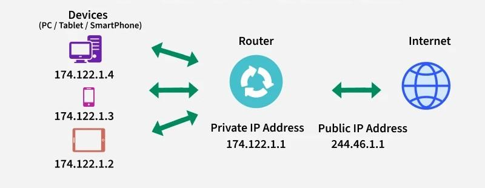
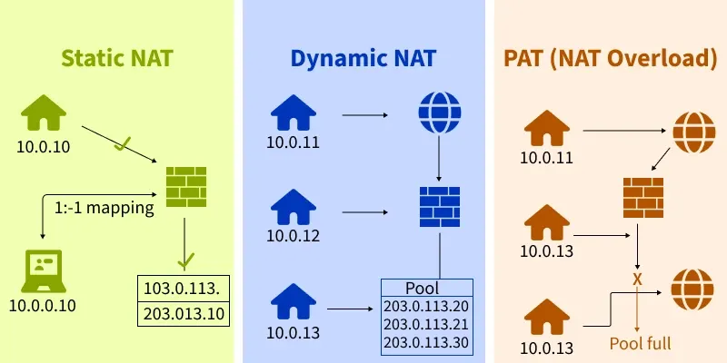
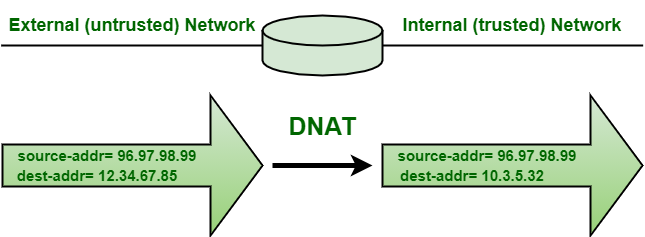
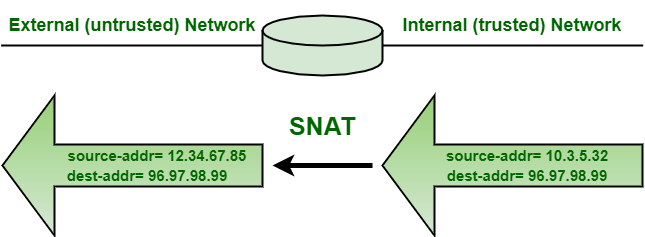
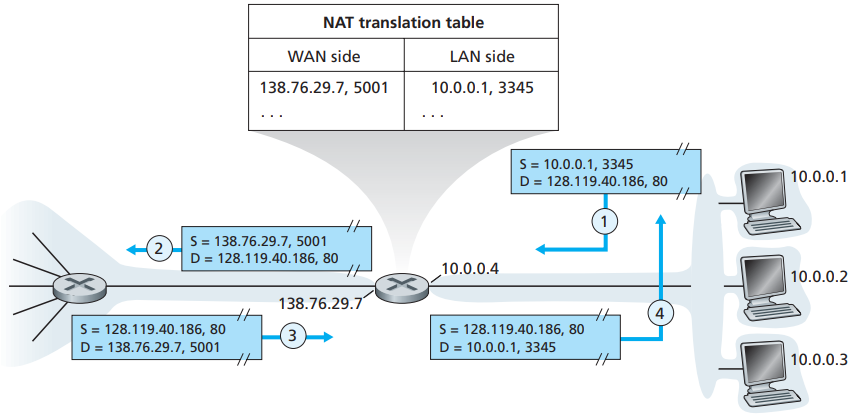
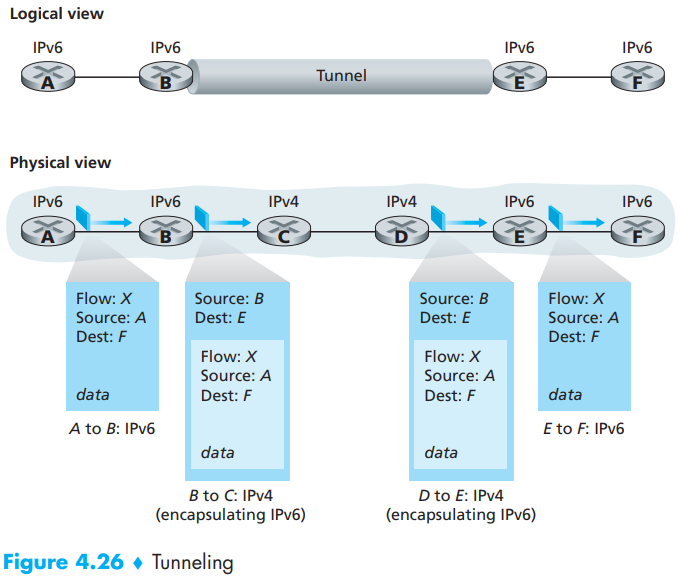
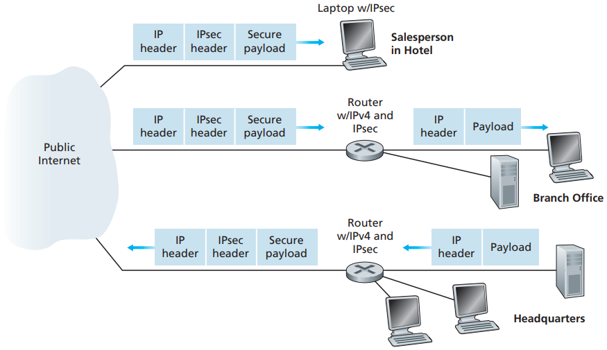
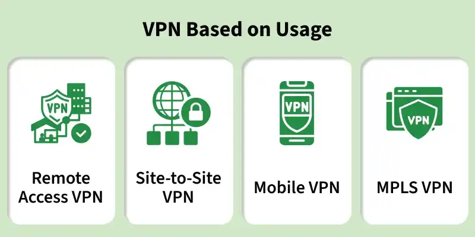
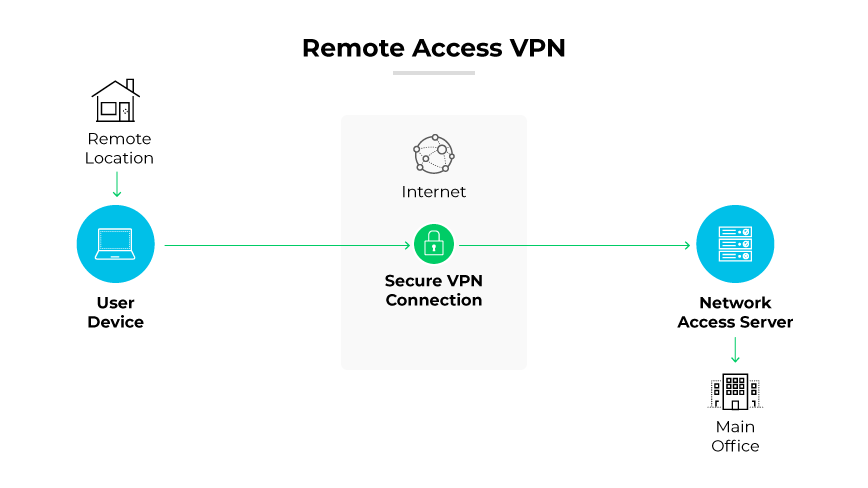
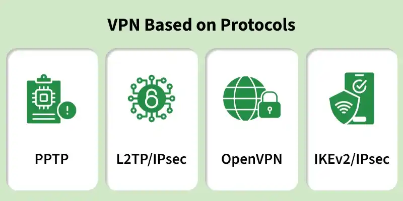

 English | [中文版](nat_zh.md)

 # Network Address Translation (NAT)

 [TOC]

 

Network Address Translation (NAT) allows multiple devices in a private network to access the internet using a single public IP address. It helps conserve IPv4 addresses and hides internal systems for added security.

## NAT Types

### Static NAT (One-To-One)

Static NAT creates a one-to-one mapping between a private IP address and a public IP address.

### Dynamic NAT (Pool)

Dynamic NAT maps private IP addresses to public IP addresses from a predefined pool.

### Port Address Translation (PAT)

PAT, also known as NAT Overload, allows multiple private IPs to share a single public IP using different port numbers.

### Destination NAT (DNAT)

DNAT, as the name suggests, is a technique that translates the destination IP address generally when connecting from a public IP address to a private IP address.

### Source NAT (SNAT)

SNAT, as the name suggests, is a technique that translates source IP addresses generally when connecting from a private IP address to a public IP address. It maps the source client IP address in a request to a translation defined on a BIG-IP device.

### Hairpin NAT (NAT loopback)

TODO

## NAT Inside and Outside Addresses

In NAT terminology, inside and outside describe the location of devices relative to the local network and define which addresses are subject to translation.

### Workflow

 ##  Tunneling

 NAT interacts with tunneling protocols in different ways:

 - IPsec in tunnel mode: NAT breaks authentication/integrity checks unless NAT-T (NAT Traversal) is used, which encapsulates ESP in UDP.
 - GRE and other tunnels: may require special handling (NAT traversal, port mapping) because tunnels encapsulate original headers.
 - When IP-in-IP or layer-2 tunnels traverse NAT, the outer headers must be translated; this can complicate path MTU discovery.

### STUN (Session Traversal Utilities for NAT)

discovers the public mapping created by NAT; works with some NAT types but fails with symmetric NAT.

### TURN (Traversal Using Relays around NAT)

relays media through a public server; works reliably but consumes bandwidth on the relay.

### ICE (Interactive Connectivity Establishment)

coordinates candidate addresses (host, reflexive, relay) and attempts connectivity in order of preference.

### UPnP and NAT-PMP

protocols that let hosts request port mappings from a local NAT device (common on consumer routers).

## Virtual Private Networks (VPNs)

VPNs (Virtual Private Networks) provide private, secure connectivity over shared/public networks. Organizations use VPNs to connect remote users to corporate resources (remote‑access VPNs) or to interconnect branch offices and data centers (site‑to‑site VPNs). This note summarizes common VPN technologies, how they secure traffic, and operational considerations.

### Types based on usage(deployment)

| Type                      | Connection        | Typical Users            | Use Case                                      |
| :------------------------ | :---------------- | :----------------------- | :-------------------------------------------- |
| **Remote Access VPN**     | User → Network    | Employees, contractors   | Secure access from home, travel               |
| **Site-to-Site VPN**      | Network → Network | Branch offices, partners | Connecting entire LANs across locations       |
| **Personal/Consumer VPN** | User → Internet   | Individual consumers     | Privacy, geo-spoofing, public Wi-Fi           |
| **Mobile VPN**            | Device → Network  | Mobile workers           | Persistent connection despite network changes |
| **Cloud VPN**             | Cloud resources   | Cloud-native teams       | Secure cloud access without on-prem hardware  |

#### Remote Access VPN

It allows an individual user to securely connect to a private network over the internet, and it is widely used by employees working remotely.

#### Site-to-Site VPN

It securely connects two or more separate networks, such as a head office and branch offices, so internal communication remains protected across locations.

#### Mobile VPN

It is designed for mobile users and keeps the VPN session stable even when the device switches between Wi-Fi and cellular networks.

#### MPLS VPN

It is a provider-managed enterprise WAN solution that offers scalable connectivity and traffic prioritization, but it typically does not provide end-to-end encryption by default.

### Types based on protocols(tunnelling technology)

#### PPTP

It is an older protocol that can be fast, but it provides weak security, so it is mainly used only for legacy systems.

#### L2TP/IPsec

It combines L2TP tunneling with IPsec encryption, which improves security, but it can add performance overhead.

#### OpenVPN

It is an open-source protocol that uses SSL/TLS for encryption, and it is widely adopted because it provides strong security and flexibility.

#### IKEv2/IPsec

It is a secure and fast protocol that works very well on mobile devices because it reconnects quickly when network conditions change.

### VPN Protocols

| Protocol          | Speed     | Security        | Best For              | Platform Support              |
| :---------------- | :-------- | :-------------- | :-------------------- | :---------------------------- |
| **WireGuard**     | Very Fast | Excellent       | Modern general use    | Most platforms (3rd party)    |
| **OpenVPN**       | Moderate  | Excellent       | Enterprise, firewalls | All platforms (3rd party)     |
| **IKEv2/IPsec**   | Fast      | Excellent       | Mobile users          | Native on iOS/Android/Windows |
| **IPsec (IKEv1)** | Moderate  | Good            | Site-to-site          | Universal                     |
| **SSL/TLS**       | Moderate  | Good            | Web-based access      | Browser only (no client)      |
| **L2TP/IPsec**    | Moderate  | Good            | Legacy compatibility  | Native on most OS             |
| **PPTP**          | Fast      | Poor/DEPRECATED | Avoid completely      | Being removed from OS         |

#### OpenVPN

OpenVPN is an open-source VPN protocol that uses SSL/TLS to provide secure authentication and encryption.

#### WireGuard

WireGuard is a modern VPN protocol designed to be lightweight, fast, and easier to secure due to a small codebase.

#### IKEv2/IPsec

IKEv2/IPsec uses IKEv2 to set up secure tunnels and IPsec to provide encryption and integrity.

#### L2TP/IPsec

L2TP/IPsec combines L2TP tunnelling with IPsec encryption to secure traffic.

#### PPTP

PPTP is an older VPN protocol that is fast but not secure by modern standards.

#### SSTP

SSTP is a Microsoft VPN protocol that tunnels traffic over SSL/TLS using TCP port 443.

## Summary

### SNAT vs DNAT

|                             SNAT                             |                             DNAT                             |
| :----------------------------------------------------------: | :----------------------------------------------------------: |
| It is generally used to change the private address or port into a public address or port for packets leaving network. | It is generally used to redirect incoming packets with a destination of a public address or port to a private IP address or port inside the network. |
| It translates the source IP address within a connection to the BIG-IP system IP address that one defines. | It translates the IP addresses of internal servers that are protected by the device to public IP addresses. |
|    It is used to change the source address of the packet.    | It is used to change the destination address of the packet.  |
|     It also changes the source port in TCP/UDP headers.      |   It also changes the destination port in TCP/UDP headers.   |
| It generally allows multiple hosts on the inside to get any host on the outside. | It generally allows multiple hosts on the outside to get a single host on the inside. |
|     It is performed after the routing decision is made.      |     It is performed before the routing decision is made.     |
| In this, the destination IP address is maintained and the source IP address is changed. | In this, the source IP address is maintained and the destination IP address is changed. |
| Client inside LAN and behind Firewall needs to browse the Internet. | Website hosted inside data center behind Firewall and needs to be accessible to users over the Internet. |

## Refernces

[1] James F. Kurose and Keith W. Ross. COMPUTER NETWORKING: A Top-Down Approach. 6th ed.

[2] RFC 4301: Security Architecture for the Internet Protocol

[3] RFC 5996 / RFC 7296: IKEv2

[4] RFC 2401–2412: IPsec (historical foundational RFCs)

[5] WireGuard documentation and modern deployment guides

[6] Kurose & Ross. Computer Networking: A Top‑Down Approach (VPN and IPsec sections)

[7] [Types of Virtual Private Network (VPN) and its Protocols](https://www.geeksforgeeks.org/computer-networks/types-of-virtual-private-network-vpn-and-its-protocols/)

[8] [Network Address Translation (NAT)](https://www.geeksforgeeks.org/computer-networks/network-address-translation-nat/)

[9] [Difference Between SNAT and DNAT](https://www.geeksforgeeks.org/computer-networks/difference-between-snat-and-dnat/)

