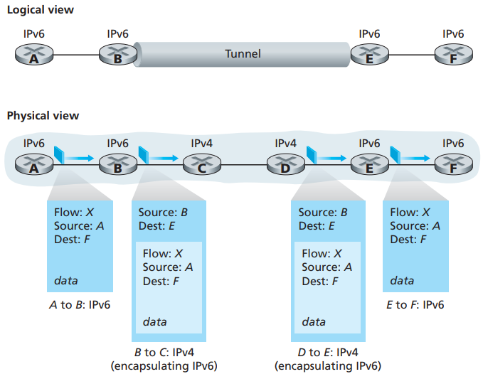

# Network Address Translation

[TOC]

*Network address translation*

## Tunneling

*Tunneling*

The link-state routing algorithm we present below is known as `Dijkstra's algorithm`, named after its inventor. Dijkstra's algorithm is iterative and has the property that after the $k$th iteration of the algorithm, the least-cost paths are known to $k$ destination nodes, and among the least-cost paths to all destination nodes, these $k$ paths will have the $k$ smallest costs. Let us define the following notation:

- $D(v)$: cost of the least-cost path from the source node to destination $v$ as of this iteration of the algorithm.
- $p(v)$: previous node (neighbor of $v$) along the current least-cost path from the source to $v$.
- $N'$: subset of nodes; $v$ is in $N'$ if the least-cost path from the source to $v$ is definitively known.

## Congestion-Sensitive Routing

*Oscillations with congestion-sensitive routing*

### Distance Vector

The `distance vector (DV)` algorithm is iterative, asynchronous, and distributed. Let $d_x(y)$ be the cost of the least-cost path from node $x$ to node $y$. Then the least costs are related by the celebrated Bellman-Ford equation, namely,
$$
d_x(y) = min_v\{c(x, v) + d_v(y)\} \qquad (4.1)
$$
where the $min_v$ in the equation is taken over all of x's neighbors. The Bellman-Ford equation is rather intuitive. Indeed, after traveling from $x$ to $v$, if we then tak the least-cost path from $v$ to $y$, the path cost will be $c(x, v) + d_v(y)$. Since we must begin by traveling to some neighbor $v$, the least cost from $x$ to $y$ is the minimum of $c(x, v) + d_v(y)$ taken over all neighbors $v$.

The basic idea is as follows. Each node $x$ begins with $D_x(y)$, an estimate of the cost of the least-cost path from itself to node $y$, for all nodes in $N$. Let $D_x = [D_x(y):y\ in\ N]$ be node x's distance vector, which is the vector of cost estimates from $x$ to all other nodes, $y$, in $N$. With the DV algorithm, each node $x$ maintains the following routing information:

- For each neighbor $v$, the cost $c(x, v)$ is the cost from $x$ to the directly attached neighbor, $v$.
- Node x's distance vector, that is, $D_x = [D_x(y): y\ in\ N]$, containing x's estimate of tis cost to all destinations, $y$, in $N$.
- The distance vectors of each of its neighbors, that is, $D_v = [D_v(y): y\ in\ N]$ for each neighbor $v$ of $x$.

In the distributed, asynchronous algorithm, from time to time, each node sends a copy of its distance vector to each of its neighbors. When a node $x$ receives a new distance vector from any of its neighbors $v$, it saves v's distance vector, and then uses the Bellman-Ford equation to update its own distance vector as follows:
$$
D_x(y) = min_v\{c(x, v) + D_v(y)\} \qquad for\ each\ node\ y\ in\ N
$$

*Distance-vector (DV) algorithm*

Conclude LS and DV algorithms with a quick comparison of some of their attributes. Recall that $N$ is the set of nodes (routers) and $E$ is the set of edges (links).

- `Message complexity`.
- `Speed of convergence`.
- `Robustness`.

In practice, this model and its view of a homogenous set of routers all executing the same routing algorithm is a bit simplistic for at least two important reasons:

- `Scale`.
- `Administrative autonomy`.

## Reference

[1] James F. Kurose, Keith W. Ross . Computer Networking: A Top-Down Approach . 6ED
