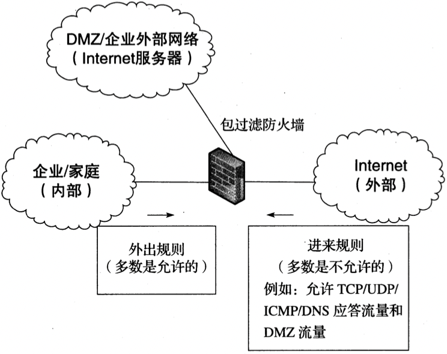
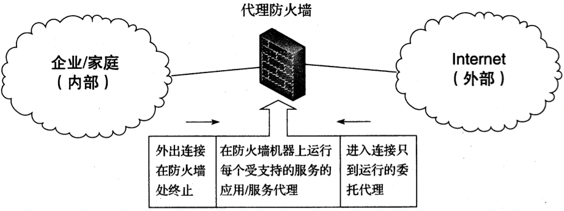
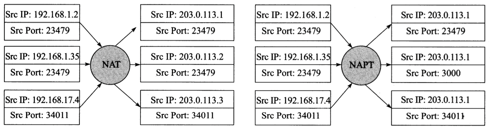
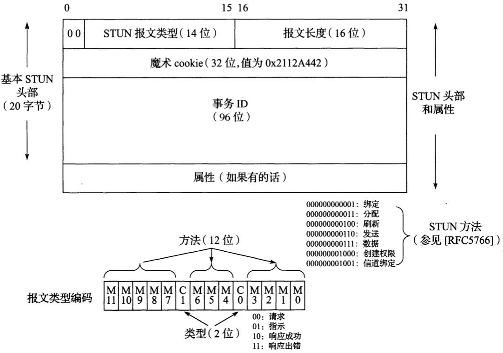
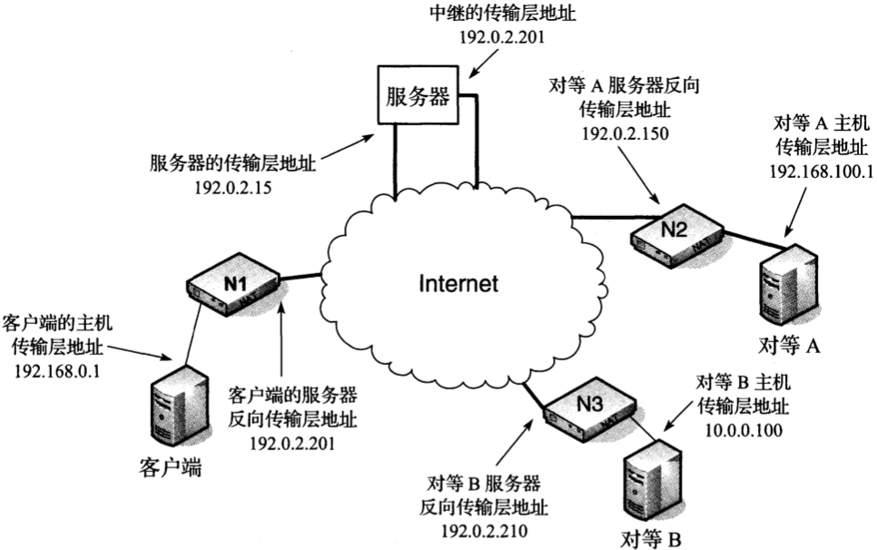

# 网络地址转换

[TOC]

## 术语

- 代理防火墙（proxy firewall）
- 包过滤防火墙（packet-filter firewall）
- 数据报拥塞控制协定（Datagram Congestion Control Protocol, DCCP）
- 流控传输协议（Stream Control Transmission Protocol，SCTP）
- 发夹（hairpinning）
- NAT环回（NAT loopback）
- 服务提供者NAT（service provider NAT，SPNAT）
- 运营商级NAT（carrier-grade NAT，CGN）
- 大规模NAT（large-scale NAT，LSN）
- 针孔（pinhole）
- 打孔（hole punching）
- 单边的自地址确定（UNilateral Self-Address Fixing, UNSAF）
- 交互式连接建立（Interactive Connectivity Establishment，ICE）
- 可扩展的报文和现场协议（Extensible Messaging and Presence Protocol，XMPP）
- 通用即插即用（Universal Plug and Play，UPnP）
- NAT端口映射协议（NAT Port Mapping Protocol，NAT-PMP）
- 简单服务发现协议（Simple Service Discovery Protocol，SSDP）
- 通用事件通知架构（General Event Notification Architecture，GENA）
- 简单对象访问协议（Simple Object Access Protocol，SOAP）
- 远程过程调用（Simple Procedure Call，RPC）
- 可扩展标记语言（eXtensible Markup Language，XML）
- 互联网网关设备（Internet Gateway Device，IGD）
- 端口控制协议（Port Control Protocol，PCP）

## 防火墙

### 包过滤防火墙

*一个典型的包过滤防火墙的配置。防火墙作为IP路由器位于一个“内”网和“外”网之间，有时是在第三个“DMZ”或外联网，只允许某些特定的流量通过。一种常见的配置是允许所有从内网到外网的流量通过，但相反的方向只允许小部分的流量。当使用一个DMZ时，只允许从Internet访问其中的某些特定服务器*

### 代理防火墙

*代理防火墙作为一个多宿主的Internet主机，终止在应用层的TCP和UDP的连接。它不像一个传统的IP路由器，而更像一个ALG。单个应用程序或代理为了其所支持的每个服务，必须具备和代理防火墙进行通信交互的能力*

- `HTTP代理防火墙(HTTP proxy firewall)` Web代理，只能用于HTTP和HTTPS协议；
- `SOCKS防火墙(SOCKS firewall)` SOCKS协议比HTTP代理访问使用更广泛，可用于Web之外的其他服务，目前有2个版本：`版本4`和`版本5`；

## 网络地址转换

### NAPT

*一个基本的IPv4 NAT（左）利用地址池中地址重写IP地址，但是保留端口不变。NAPT（右）也称为IP伪装，通常将所有的地址都重写到一个地址。NAPT有时必须重写端口号，以避免冲突。在这种情况下，第二个实例的端口号23479被重写为3000，以便区分返回的192.168.1.2和192.168.1.35的流量*

### TCP

TODO

### UDP

TODO

### ICMP

`ICMP（Internet控制报文协议）`：

- `错误报文` 当一个ICMP错误报文通过NAT时，需要改写“错误数据报”的IP地址，以便他们能被终端客户机识别（称为ICMP的修复行动（ICMP fix-up））
- `信息报文` 处理信息报文的NAT能够识别向外传输的信息请求，并设置计时器用于等待响应

### 其他传输协议

TODO

### 隧道数据包

当`隧道数据包`通过NAT发送时，NAT不仅要修改IP包头，还需要修改封装在其中的其它数据报的包头和有效载荷。

### 组播

NAT在处理组播流量时，需要用IGMP代理来增强NAT；从位于NAT内部的主机发送到外部的数据包的目的IP地址和端口不会被修改；从内部传输到外部的流量，其源地址和端口号可根据单播UDP行为修改。

## 地址和端口转换行为

NAT的全局行为将由其转换和过滤行为定义。这些都可能是独立于主机地址，以来于地址，或依赖于地址和端口号：

| 行为名称           | 转换行为                                       | 过滤行为                                                     |
| ------------------ | ---------------------------------------------- | ------------------------------------------------------------ |
| 独立于端点的       | 对于所有的`Y2:y2`，`X1':x1'=X2':x2'`（必需的） | 只要任何`X1':x1'`存在，就允许`X1:x1`的任何数据包（推荐用于最大透明性） |
| 依赖于地址的       | `X1':x1'=X2':x2'`当且仅当`Y1=Y2`               | 只要`X1`之前联系过`Y1`，就允许从`Y1:Y1`到`X1:x1`的数据包（推荐用于更为严格的过滤） |
| 依赖于地址和端口的 | `X1':x1'=X2':x2'`当且仅当`Y1:y1=Y2:y2`         | 只要`X1`之前联系过`Y1:y1`，就允许从`Y1:y1`到`X1:x1`的数据包  |

### 发夹和NAT环回

当客户希望访问位于同一个NAT私有地址空间内的服务器时，NAT需要实现`发夹（hairpinning）`或者`NAT环回（NAT loopback）`

## 无状态转换

`无状态的IP/ICMP转换（Stateless IP/ICMP Translation，SIIT）` 不采用状态表格进行IPv4和IPv6数据包转换的方法[RFC6145]；转换中无须查找表格，只需要使用一个可转换的IPv4地址以及一个预定义的用于转换IP头部的计划。

从IPv4转换到IPv6时创建一个IPv6头部的方法：

| IPv6字段                             | 分配方法                                                     |
| ------------------------------------ | ------------------------------------------------------------ |
| 版本（Version）                      | 设置为6                                                      |
| DS字段/ECN（DS Field/ECN）           | 拷贝自IPv4头部中的相同值                                     |
| 流标志（Flow Label）                 | 设置为0                                                      |
| 负载长度（Payload Length）           | 设置为IPv4的总长度减去IPv4头部长度（包含选项）               |
| 下一个头部（Next Header）            | 设置为IPv4协议字段（或者58，如果协议字段值为1） 设置为44来表示是一个分片头部，如果创建的IPv6数据报是一个分片或者DF位没有被设置 |
| 跳数限制（Hop Limit）                | 设置为IPv4 TTL字段减去1（如果这个值为0，则该报文将被丢弃，同时产生一个ICMP超时报文） |
| 源IP地址（Source IP Address）        | 设置为6（IPv4源IP地址，P）                                   |
| 目的IP地址（Destination IP Address） | 设置为6（IPv4目的IP地址，P）                                 |

从IPv4到IPv6转换时为分片头部中字段赋值的方法：

| 分片头部字段                    | 分配方法                                      |
| ------------------------------- | --------------------------------------------- |
| 下一个头部（Next Header）       | 设置为IPv4中的协议字段                        |
| 分片偏移（Fragment Offset）     | 拷贝自IPv4分片偏移字段                        |
| 更多分片位（More Fragment Bit） | 拷贝自IPv4中的更多分片（M）位字段             |
| 标识（Identification）          | 低16位根据IPv4中的标识字段设置。高16位设置为0 |

将一个未分片的IPv6数据报转换为IPv4时用于创建IPv4头部的方法：

| IPv4头部字段                         | 分配方法                                                     |
| ------------------------------------ | ------------------------------------------------------------ |
| 版本（Version）                      | 设置为4                                                      |
| IHL                                  | 设置为5（没有IPv4选项）                                      |
| DS字段/ECN（DS Field/ECN）           | 拷贝自IPv6头部中的相同值                                     |
| 总长度（Total Length）               | IPv6中负载长度字段值加上20                                   |
| 标识（Identification）               | 设置为0（可以选择设置为其它一些预设的值）                    |
| 标志（Flags）                        | 更多分片（M）设置为0；不分片（Don't Fragment，DF）设置为1    |
| 分片偏移（Fragment Offset）          | 设置为0                                                      |
| TTL                                  | IPv6中跳数限制字段减去1                                      |
| 协议（Protocol）                     | 拷贝自IPv6的第一个下一个头部字段，不涉及分片头部，HOPOPT，IPv6-Route或者IPv6-Opts。将值58改变为1来支持ICMP |
| 头部校验和（Header Checksum）        | 为新创建的IPv4头部而计算                                     |
| 源IP地址（Source IP Address）        | To4（IPv6源IP地址，P）                                       |
| 目的IP地址（Destination IP Address） | To4（IPv6目的IP地址，P）                                     |

当转换一个分片的IPv6到IPv4时用于创建IPv4头部的方法：

| IPv4头部字段                | 分配方法                                                     |
| --------------------------- | ------------------------------------------------------------ |
| 总长度（Total Length）      | IPv6负载长度字段值减去8加上20                                |
| 标识（Identification）      | 拷贝自IPv6分片头部标识字段中的低16位                         |
| 标志（Flags）               | 更多分片（M）拷贝自IPv6分片头部中的M位字段。不分片（DF）设置为0以便允许IPv4网络中的分片 |
| 分片偏移（Fragment Offset） | 拷贝自IPv6分片头部中的分片偏移字段                           |

## NAT穿越

### 针孔和打孔

`针孔（pinhole）` 当一个临时的NAT映射创建时，针对特定应用程序的流量通常允许在NAT的两个方向传输。

`打孔（hole punching）` 通过采用pinhole试图使位于NAT之后的两个或两个以上的系统直接通信。

### STUN

`NAT会话穿越工具（Session Traversal Utilities for NAT，STUN）` 是一个相对简单的客户机/服务器协议，它能够在多种环境中确定在NAT中使用的外部IP地址和端口号，它也可以通过保持激活的信息来维持当前的NAT绑定；

STUN为UDP和TCP使用3478端口，为TCP/TLS（Transport Layer Security，TLS）使用3479端口；STUN有2种类型的事务：

- `请求/响应事务（request/response transactions）`
- `标志事务（indication transactions）`

*STUN报文总是以2个0比特位开始，并且封装在UDP种，当然TCP也是允许的。`报文类型`字段同时给出了方法（例如，绑定）和类型*（请求，响应，错误，成功）。事务ID是一个长为96位的数字，用于匹配请求和响应，或者在标志情况中用于调试。每个STUN报文能够包含0个或多个属性，这取决于STUN的特定用法*

- `STUN报文类型`
- `报文长度` （Message Length）提供了一个最大为$2^{16}-1$字节的完整STUN报文长度（不包括长度为20字节的STUN头部）
- `魔术cookie` 
- `事务ID`
- `属性`

### STUN2

这11个属性可能被兼容于STUN2的客户机和服务器使用：

| 名称               | 值     | 目的/用途                                                    |
| ------------------ | ------ | ------------------------------------------------------------ |
| MAPPED-ADDRESS     | 0x0001 | 包含一个地址簇指示器和反向传输地址（IPv4或IPv6）             |
| USERNAME           | 0x0006 | 用户名称和密码，用来检验报文的完整性（达到513字节）          |
| MESSAGE-INTEGRITY  | 0x0008 | 在STUN报文中的报文证书代码值                                 |
| ERROR-CODE         | 0x0009 | 包括3位差错类型，8位差错代码值和长度可变的差错文本描述       |
| UNKNOWN-ATTRIBUTES | 0x000A | 和差错报文一起使用来表示未知属性（每个属性16位值）           |
| REALM              | 0x0014 | 指示长期信任的证书“范围”名称                                 |
| NONCE              | 0x0015 | 为了阻止重放攻击，在请求和应答中选择性地携带的非重复值       |
| XOR-MAPPED-ADDRESS | 0x0020 | MAPPED-ADDRESS的异或（XOR）版本                              |
| SOFTWARE           | 0x8022 | 发送报文的软件的文本描述（例如，制造商和版本号）             |
| ALTERNATE-SERVER   | 0x8023 | 提供了一个IP地址供客户机使用，与MAPPED-ADDRESS一起被编码     |
| FINGERPRINT        | 0x8028 | 报文的CRC-32和0x5354554E进行异或（XOR），如果使用的话必须是最后的属性（可选的） |

### TURN

`NAT中继穿越（Traversal Using Relays around NAT, TURN）`

*根据[RFC5766]，一个TURN服务器通过中继来帮助位于“坏”（bad）NAT之后的客户机之间通信。客户端和服务器之间的流量可采用TCP，UDP或使用了TLS的TCP。服务器和一个或多个对等客户机之间的流量使用UDP。中继是通信的最后手段，直接的方法才是首选*

TURN通过以下方法增强STUN：

- `分配（Allocate）（3）` 用于建立并保持分配存活
- `刷新（Refresh）（4）` 用于建立并保持分配存活
- `发送（Send）（6）` 使用STUN报文封装从客户端发送到服务器的数据
- `数据（Data）（7）` 使用STUN报文封装从客户端发送到服务器的数据
- `创建权限（CreatePermission）（8）` 用于创建或刷新一个权限
- `隧道绑定（ChannelBind）（9）` 通过一个16位的隧道号与一个特定的对等客户端相关联

TURN定义的STUN属性：

| 名称                | 值     | 目的/用处                                                    |
| ------------------- | ------ | ------------------------------------------------------------ |
| CHANNEL-NUMBER      | 0x000C | 表示和数据关联的信道                                         |
| LIFETIME            | 0x000D | 请求分配超时（秒）                                           |
| XOR-PEER-ADDRESS    | 0x0012 | 一个对等的地址和端口号，采用异或（XOR）编码                  |
| DATA                | 0x0013 | 为一个发送或者数据指示保存数据                               |
| XOR-RELAYED-ADDRESS | 0x0016 | 为一个客户机分配的服务器地址和端口                           |
| EVEN-PORT           | 0x0018 | 中继的传输层地址信息使用一个偶数端口的请求，选择性地按顺序请求分配下一个端口 |
| REQUESTED-TRANSPORT | 0x0019 | 一个客户机用来请求采用一个特定的传输层来形成传输层地址，值来自于IPv4协议或者IPv6下一跳头部字段值 |
| DONT-FRAGMENT       | 0x001A | 请求设置发送到对等数据包中的IPv4头部中的“不分片”位           |
| RESERVATION-TOKEN   | 0x0022 | 服务器保存的一个中继传输层地址的唯一标志，这个值作为一个引用提供给客户端 |

## 参考

[1] [美] Kevin R. Fall, [美] W. Richard Stevens. TCP/IP详解-卷一 . 3th Edition 
