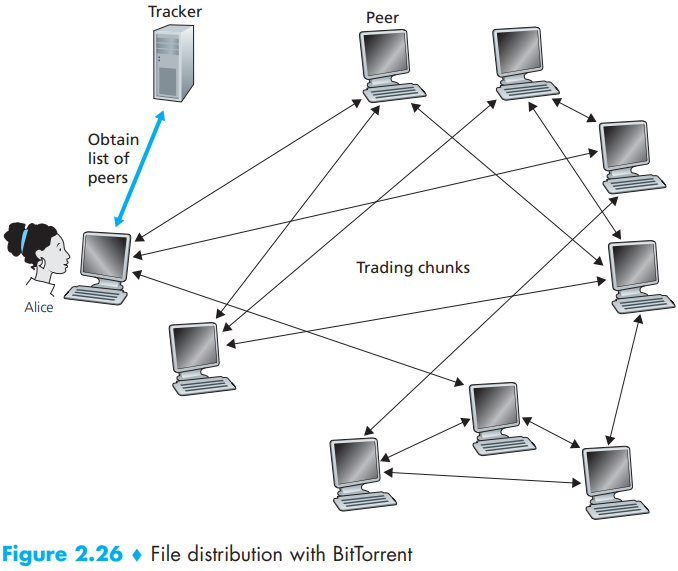
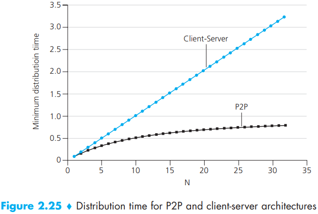

# P2P Protocol

[TOC]

## Performance

In the client-server architecture, none of the peers aids in distributing the file. We make the following observations:

- The server must transmit one copy of the file to each of the $N$ peers. Thus, the server must transmit $NF$ bits. Since the server's upload rate is $u_s$, the time to distribute the file must be at least $NF/u_s$.
- Let $d_{min}$ denote the download rate of the peer with the lowest download rate, that is, $d_{min} = min\{d_1, d_p, ..., d_N\}$. The peer with the lowest download rate cannot obtain all $F$ bits of the file in less than $F/d_{min}$ seconds. Thus, the minimum distribution time is at least $F/d_{min}$.

Putting these two observations together, we obtain
$$
D_{cs} \geq max \lbrace \frac{NF}{u_s}, \frac{F}{d_{min}} \rbrace
$$
This provides a lower bound on the minimum distribution time for the client-server architecture. So Let's take this lower bound provided above as the actual distribution time, that is
$$
D_{cs} = max\{\frac{NF}{u_s}, \frac{F}{d_{min}}\} \qquad (2.1)
$$
We see from Equation 2.1 that for $N$ large enough, the client-server distribution time is given by $NF/u_s$. Thus, the distribution time increase linearly with the number of peers $N$.

we obtain the minimum distribution time for P2P, denoted by $D_{p2p}$:
$$
D_{p2p} \geq max \{\frac{F}{u_s}, \frac{F}{d_{min}}, \frac{NF}{u_s + \sum_{i=1}^{N}u_i}\} \qquad (2.2)
$$
Thus, let's take the lower bound provided by Equation 2.2 as the actual minimum distribution time, that is:
$$
D_{P2P} = max\{ \frac{F}{u_s}, \frac{F}{d_{min}}, \frac{NF}{u_s + \sum_{i=1}^{N} u_i} \} \qquad (2.3)
$$
