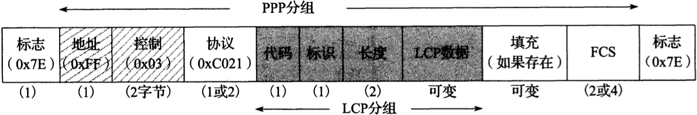
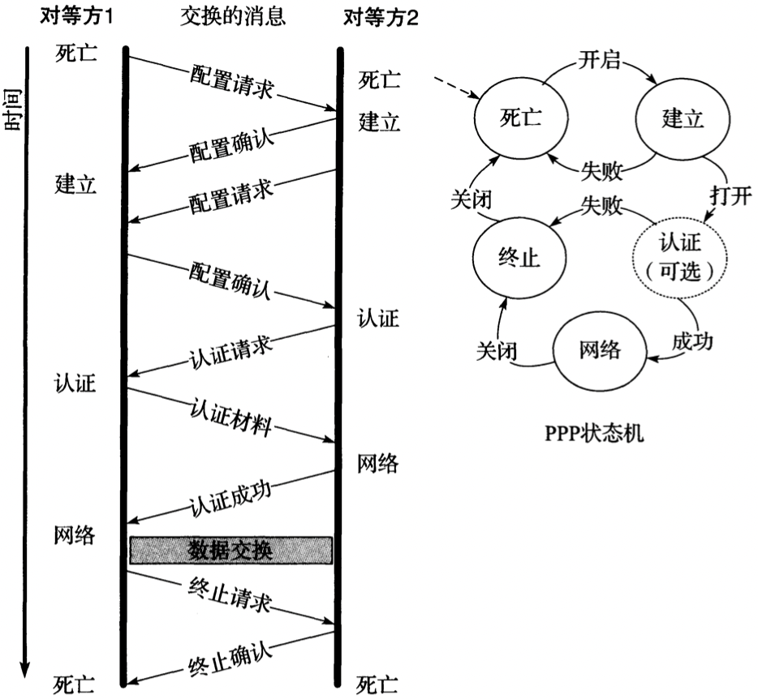
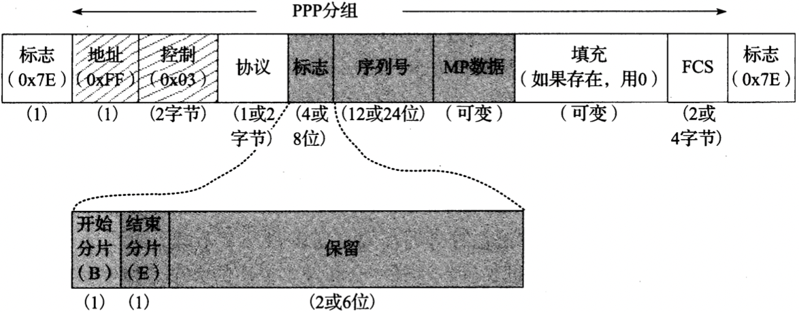
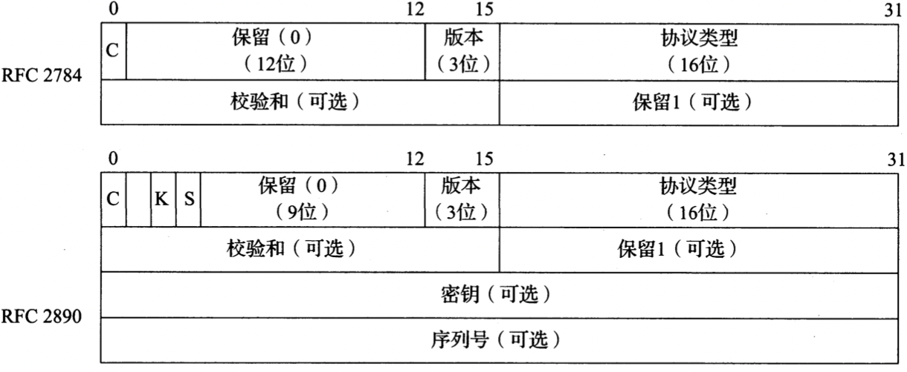
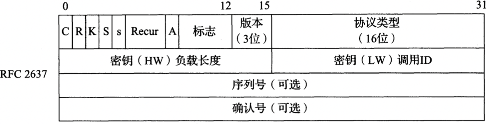

# P2P协议

[TOC]

`点到点协议[RFC1661][RFC1662][RFC2153]` 是一种在串行链路上传输IP数据报的流行方法，从低速的拨号调制解调器到高速的光链路[RFC2615]。

## 术语

`链路控制协议（Link Control Protocol，LCP）`

`回叫控制协议（CBCP）`

`PPPMux控制协议（PPPMuxCP）`

`多链路最大接收重构单元（MRRU，类型18）`

`带宽分配协议（BAP）`

`带宽分配控制协议（BACP）`

`按需带宽（BOD）`

`异步控制字符映射（asyncmap，ACCM）`

`Microsoft点对点压缩协议（MPPC）`

`密码认证协议（PAP）`

`查询-握手认证协议（CHAP）[RFC1994]`

`IP控制协议（IPCP）[RFC1332]`

`鲁棒性头部压缩（ROHC）[RFC5225]`

`路径MTU发现（PMTUD）`

`单向链路（UDL）`

`动态隧道配置协议（DTCP）`

## 链路控制协议

### LCP操作

*链路控制协议（Link Control Protocol，LCP）分组采用很普通的格式，能识别封装数据的类型和长度。LCP帧主要用于建立PPP链路，这种格式已成为很多网络控制协议的基础*

- `地址` 
- `控制`
- `协议` 始终为`0xC021`，不能用PFC删除，以免产生歧义；
- `代码` 给出请求或响应的操作类型：
  - 配置请求（0x01）
  - 配置ACK（0x02）
  - 配置NACK（0x03）
  - 配置REJECT（0x04）
  - 终止请求（0x05）
  - 终止ACK（0x06）
  - 代码REJECT（0x07）
  - 协议REJECT（0x08）
  - 回送请求（0x09）
  - 回送应答（0x0A）
  - 放弃请求（0x0B）
  - 标识（0x0C）
  - 剩余时间（0x0D）
- `标识` 由LCP请求帧的发送方提供的序列号，并伴随着每个后续消息递增；
- `长度` LCP分组的字节长度，不能超过`最大接收单元（MRU）`
- `LCP数据`
- `FCS`

LCP用于建立PPP链路和各方商定选项。典型的交换过程包括一对包含选项列表的配置请求和配置确认，一个认证交换，数据交换（未画出）和一个终止交换。因为PPP是一个包括很多部分的通用协议，所以在一条链路建立和终止之间可能发生很多其它类型的操作；例：

## 多链路PPP

*一个MP分片包含一个系列头部，允许在一个多链路捆绑的远端对分片重新排序。这个头部支持2中格式：短头部（2字节）和长头部（4字节）*

### 认证

TODO

## 压缩控制协议(CCP)

`压缩控制协议（CCP）[RFC1962]` 在链路进入网络状态时协商，它使用与LCP相同的分组交换过程和格式（除协议字段被设置为0x80FD之外），另外还有一些特殊选项，并对常见的代码字段值（1~7）定义了2个新的操作：复位请求（0x0e）和复位确认（0x0f）。如果在一个压缩帧中检测到一个错误，复位请求可用于要求对方复位压缩状态（例如字典，状态变量，状态机等）。在复位后，对方响应一个复位确认。

## 隧道

建立隧道的3个常见协议：

- `通用路由封装（GRE）[RFC2784]`
- `第二层隧道协议（L2TP）[RFC3931]`
- `Microsoft专用的点对点隧道协议（PPTP）[RFC2637]`

### GRE

- `C` 是否存在校验和
- `版本`
- `协议类型`
- `密钥`
- `序列号`

基本的`通用路由封装（GRE）`头部只有4字节，包括一个16位的检验和选项（很多Internet协议中的典型选项）。后来，这个头部被扩展为包括一个标识符（密钥字段），该标识符是同一个流中的多个分组共有的，还包括一个序列号（用于顺序混乱的分组重新排序）。

### PPTP

- `C`
- `R`
- `K` 密钥
- `S` 序列号
- `s`
- `Recur`
- `A` 确认号
- `序列号` 对方可看到的最大分组数

`Microsoft专用的点对点隧道协议（PPTP）`头部基于一个旧的，非标准的GRE头部。它包括一个序列号，一个累积的分组确认号和一些标识信息。多数字段在第一次使用时设置为0。
