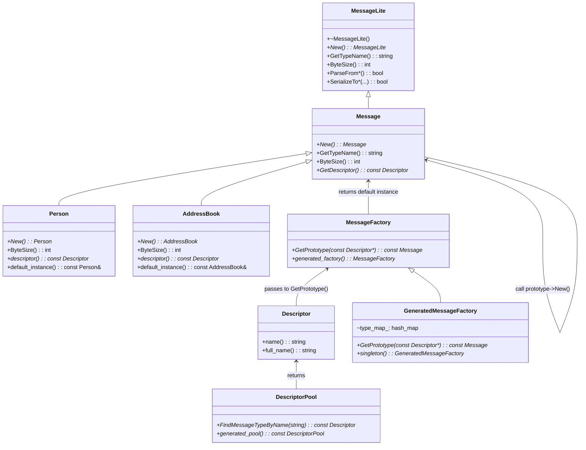
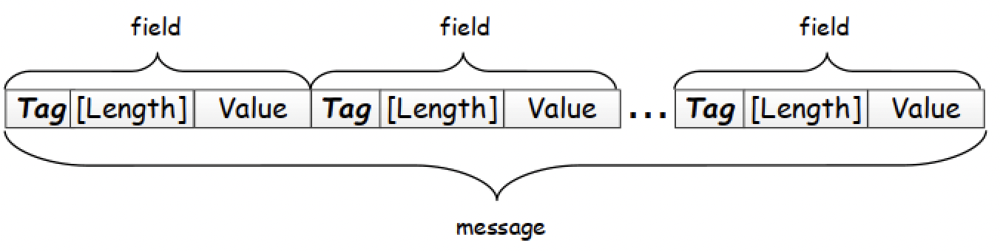
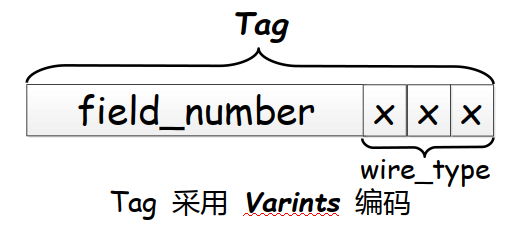
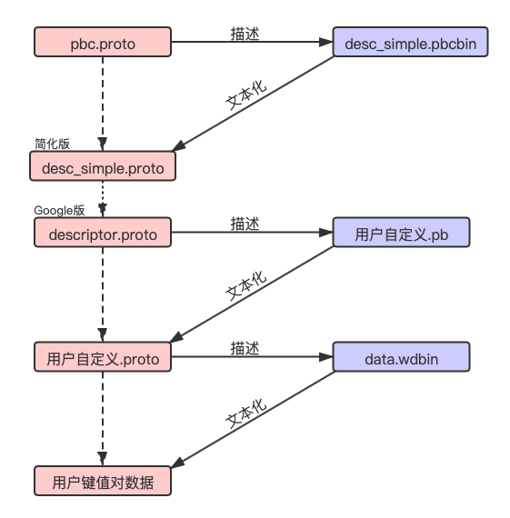

English | [中文版](protobuf_zh.md)

# Protobuf Encoding

[TOC]

Google Protocol Buffers (Protobuf) is an excellent library that defines a compact (compared to XML and JSON) and extensible binary message format, especially suitable for network data transmission.

Protobuf has two versions:

- `proto2`: Older, not recommended for new projects
- `proto3`: Recommended

## Class Diagram


```mermaid
classDiagram
		MessageLite <|-- Message
		Message <-- Message : call prototype->New()
		Message <|-- Person
		Message <|-- AddressBook
		Message <-- MessageFactory : returns default instance
		MessageFactory <-- Descriptor : passes to GetPrototype()
		Descriptor <-- DescriptorPool : returns
    
		class MessageLite{
		+~MessageLite()
		+New(): MessageLite*
		+GetTypeName(): string
		+ByteSize(): int
    
		+ParseFrom*(): bool
		+SerializeTo*(...): bool
		}
    
		class Message{
		+New(): Message*
		+GetTypeName(): string
		+ByteSize(): int
    
		+GetDescriptor(): const Descriptor*
		}
    
		class Person{
		+New(): Person*
		+ByteSize(): int
    
		+descriptor(): const Descriptor*
		+default_instance(): const Person&
		}
    
		class AddressBook{
		+New(): AddressBook*
		+ByteSize(): int
    
		+descriptor(): const Descriptor*
		+default_instance(): const AddressBook&
		}
    
		MessageFactory <|-- GeneratedMessageFactory
		class MessageFactory{
		+GetPrototype(const Descriptor*): const Message*
		+generated_factory(): MessageFactory*
		}
    
		class GeneratedMessageFactory{
		~type_map_: hash_map<const Descriptor*, const Message>
		+GetPrototype(const Descriptor*): const Message*
    
		+singleton(): GeneratedMessageFactory*
		}
    
		class Descriptor{
		+name(): string
		+full_name(): string
		}
    
		class DescriptorPool{
		+FindMessageTypeByName(string): const Descriptor*
		+generated_pool(): const DescriptorPool*
		}
```

## Syntax

### Elements

| .proto Type | C++    | Java       | Python   | Go         |
| ----------- | ------ | ---------- | -------- | ---------- |
| double      | double | double     | float    | `*float64` |
| float       | float  | float      | float    | `*float32` |
| int32       | int32  | int        | int      | `*int32`   |
| int64       | int64  | long       | int/long | `*int64`   |
| uint32      | uint32 | int        | int/long | `*uint32`  |
| uint64      | uint64 | long       | int/long | `*uint64`  |
| sint32      | int32  | int        | int      | `*int32`   |
| sint64      | int64  | long       | int/long | `*int64`   |
| fixed32     | uint32 | int        | int/long | `*uint64`  |
| fixed64     | uint64 | long       | int/long | `*uint64`  |
| sfixed32    | int32  | int        | int      | `*int32`   |
| sfixed64    | int64  | long       | bool     | `*bool`    |
| bool        | bool   | boolean    | bool     | `*bool`    |
| string      | string | String     | unicode  | `*string`  |
| bytes       | string | ByteString | bytes    | `[]byte`   |

### Keywords

#### ~~`required`~~

Required

#### optional

Optional

#### repeated

Repeated

#### enum

Enumeration

#### extensions

Reserve Tag Number for other modules, used for field extension;

Example:

TODO

#### extend


### Generation Command

`protoc -I [OPTION] PROTO_FILES`

- `-I` proto file path
- `OPTION` output format
	- `--cpp_out`
	- `--java_out`
	- `--python_out`

```sh
# Generate C++ code
protoc -I=xxx.proto --cpp_out=cpp_dir # xxx.proto: proto file path, cpp_dir: generated C++ path
```

### oneof

TODO

### map

TODO

### Missing and Default Values

In Protobuf 2, message fields can be marked as required or optional, and also support the default modifier to specify default values. By default, if an optional field is not set, or is explicitly set to the default value, this field will be omitted when serialized to binary format.

In Protobuf 3, required and optional modifiers are removed, all fields are optional, and for **primitive type** fields, there is no hasXxx() method at all.

So how do you know if a value is actually null, or just the default (`0/0.0/""`)? There are several methods:

1. Use special values to distinguish, avoid using null;
2. Explicitly define a boolean field;
	 ```protobuf
	 message Account {
			 string name = 1;
			 double profit_rate = 2;
			 bool has_profit_rate = 3;
	 };
	 ```
3. Use oneof trick (skynet-pbc does not support);
	 ```protobuf
	 message Account {
			 string name = 1;
			 oneof profit_rate {
					 double profit_rate = 2;
			 }
	 };
	 ```
4. Use wrapper types (recommended)
	 ```protobuf
	 import "google/protobuf/wrappers.proto"
	 message Account {
			 string name = 1;
			 google.protobuf.DoubleValue profit_rate = 2;
	 }
	 ```

## Encoding

### Varint

Each 8-bit byte uses the lower 7 bits to represent data, and the most significant bit (MSB) is used as a flag.

#### Encoding Process

- Step 1: Group bits in 7s in reverse order
- Step 2: Determine if another byte is needed; if so, set MSB to 1

#### Example 1

Number `1` in binary: `0000 0000 0000 0000 0000 0000 0000 0001`

Varint encoding:
1. Step 1: `000 0001 000 0000 000 0000 000 0000 0000`
2. Step 2: `0000 0001 0000 0000 0000 0000 0000 0000`

Number `1` after varint encoding: `0000 0001`, hex: `0x01`

#### Example 2

Number `251` in binary: `0000 0000 0000 0000 0000 0000 1111 1011`

Varint encoding:
1. Step 1: `111 1011 000 0001 0000 0000 0000 0000 00`
2. Step 2: `1111 1011 0000 0001 0000 0000 0000 0000 00`

Number `251` after varint encoding: `1111 1011 0000 0001`, hex: `0xFB01`

#### Example 3

Number `-1` in binary: `1111 1111 1111 1111 1111 1111 1111 1111`

1. Step 1: `111 1111 111 1111 111 1111 111 1111 1111`
2. Step 2: `1111 1111 1111 1111 1111 1111 1111 1111 0111 1000`

Number `-1` after varint encoding: `1111 1111 1111 1111 1111 1111 1111 1111 0111 1000`, hex: `0xFFFFFFFF78`

**For negative types, varint encoding is inefficient**

### ZigZag

ZigZag is mainly to solve the inefficiency of varint encoding for negative types. The main idea is:

- `Encoding` maps negative numbers to corresponding positive numbers, then uses Varint encoding;
- `Decoding` maps back to negative numbers after decoding the positive number;

ZigZag encoding mapping:

| Signed Original | Encoded As |
| --------------- | ---------- |
| 0               | 0          |
| -1              | 1          |
| 1               | 2          |
| -2              | 3          |
| 2147483647      | 4294967294 |
| -2147483648     | 4294967295 |

ZigZag mapping is implemented by shifting:

- sint32
	`Zigzag(n) = (n << 1) ^ (n >> 31)`
- sint64
	`Zigzag(n) = (n << 1) ^ (n >> 63)`

#### Example 1

Number `-1` in binary: `1111 1111 1111 1111 1111 1111 1111 1111`

Zigzag encoding:
1. n << 1: `1111 1111 1111 1111 1111 1111 1111 1110`
2. n >> 31: `1111 1111 1111 1111 1111 1111 1111 1111`
3. `(n << 1) ^ (n >> 31)`: `0000 0000 0000 0000 0000 0000 0000 0001`
4. Varint encoding: `0000 0001 0000 0000 0000 0000 0000 0000`

Number `-1` after Zigzag+varint encoding: `0000 0001`, hex: `0x01`

### How Protobuf Uses Varint and ZigZag Encoding

The message structure is as follows:



Field structure: `|Tag|Length|Value|` or `|Tag|Value|`

- `Tag` (varint encoding)

	Structure:

	

	wire_type is 3 bits, can represent 8 types

	| Type | Meaning          | Used For                                                 |
	| ---- | ---------------- | -------------------------------------------------------- |
	| 0    | Varint           | int32, int64, uint32, uint64, sint32, sint64, bool, enum |
	| 1    | 64-bit           | fixed64, sfixed64, double                                |
	| 2    | Length-delimited | string, bytes, embedded messages, packed repeated fields |
	| 3    | Start group      | groups(deprecated)                                       |
	| 4    | End group        | groups(deprecated)                                       |
	| 5    | 32-bit           | fixed32, sfixed32, float                                 |

	The field type is affected by the wire_type value:
	- 0
		`|Tag|Value|`, value uses varint encoding, no extra bits are needed to indicate the length of the value, because the MSB of varint indicates whether the next byte is valid, which serves as a length indicator.
	- 1, 5
		`|Tag|Value|`, length is fixed at 32 or 64 bits, no extra bits are needed to indicate the value length.
	- 2
		`|Tag|Length|Value|`, indicates a variable-length value, needs Length to indicate the length.
- `Length`
	Optional, determined by the last three bits (wire_type) of `Tag`.
- `Value` (varint encoding)

### Encoded Data Size

| Size (bytes)   | Type                                                         |
| -------------- | ------------------------------------------------------------ |
| 1              | + bool                                                       |
| 4              | + float<br>+ fixed32<br>+ sfixed32                           |
| 8              | + double<br>+ fixed64<br>+ sfixed64                          |
| variable       | + int64<br>+ uint64<br>+ int32<br>+ uint32<br>+ enum<br>+ sint32<br>+ sint64 |
| length+data    | + string<br>+ message<br>+ bytes                             |

- int type encoding length for positive numbers is proportional to the value size; for negative numbers, encoding length is fixed at the maximum (int32 and int64 are both 10 bytes)
- uint type encoding length is the same as int type for positive numbers, and supports a larger value range
- sint type encoding length is proportional to the absolute value size

## Implementation

### Protocol Bootstrapping

The Protobuf protocol supports bootstrapping itself, making implementation quite simple! The relationships among multiple protocols are as follows:



### Source Code Analysis

TODO

## Installation

1. Download protobuf source code and compile/install

```sh
git clone git@github.com:protocolbuffers/protobuf.git

cd protobuf && ./autogen.sh

./configure --prefix=/usr/local/protobuf

make && make check

make install && ldconfig
```

## Example

### Example 1

1. Define proto file `xxx.proto`
	 ```protobuf
	 message Example1 {
			 optional string stringVal = 1;
			 optional bytes bytesVal = 2;
			 message EmbeddedMessage {
					 int32 int32Val = 1;
					 string stringVal = 2;
			 }
			 optional EmbeddedMessage embeddedExample1 = 3;
			 repeated int32 repeatedInt32Val = 4;
			 repeated string repeatedStringVal = 5;
	 }
	 ```
2. Generate C++ file
	 ```sh
	 protoc -I=xxx.proto --cpp_out=./
	 ```
3. Call the generated C++ file
	 ```c++
	 #include <iostream>
	 #include <fstream>
	 #include <string>
	 #include "xxx.pb.h"
   
	 int main() {
		 Example example1;
		 example1.set_stringval("hello, world");
		 example1.set_bytesval("are you ok?");
     
		 Example1_EmbeddedMessage *embeddedExample2 = new Example1_EmbeddedMessage();
     
		 embeddedExample2->set_int32val(1);
		 embeddedExample2->set_stringval("embeddedInfo");
		 example1.set_allocated_embeddedexample1(embeddedExample2);
     
		 example1.add_repeatedint32val(2);
		 example1.add_repeatedint32val(3);
		 example1.add_repeatedstringval("repeated1");
		 example1.add_repeatedstringval("repeated2");
     
		 std::string filename = "single_length_delimited_all_example1_val_result";
		 std::fstream output(filename, std::ios::out | std::ios::trunc | std::ios::binary);
		 if (!example.SerializeToOstream(&output)) {
			 std::cerr << "Failed to write example1." << std::endl;
			 exit(-1);
		 }
     
		 return 0;
	 }
	 ```

## Best Practices

### 1 Protobuf Optimization Strategies

(To be confirmed)

For Protocol Buffer, fields with tag values 1 to 15 can be optimized during encoding, i.e., the tag value and type info only take up one byte. Tags in the range 16 to 2047 take up two bytes. Protocol Buffer supports up to $2^{29}-1$ fields. Therefore, when designing message structures, try to place repeated fields in tags 1 to 15 to save encoded bytes.

## References

### Literature

[1] Chen Shuo. Linux Multithreaded Server Programming - Using the muduo C++ Network Library.

### Links

- [Protocol Buffers](https://developers.google.com/protocol-buffers)
- [github protobuf](https://github.com/protocolbuffers/protobuf)
- [Protocol Buffers#extensions](https://developers.google.com/protocol-buffers/docs/proto#extensions)
- [Wikipedia - Protocol Buffers](https://zh.wikipedia.org/wiki/Protocol_Buffers)
- [Google Protocol Buffers Practical Techniques: Parsing .proto files and arbitrary data files](https://cxwangyi.blogspot.com/2010/06/google-protocol-buffers-proto.html)
- [In-depth ProtoBuf - Introduction](https://www.jianshu.com/p/a24c88c0526a)
- [Protobuf Encoding](https://www.cnblogs.com/jialin0x7c9/p/12418487.html)
- [Distinguishing missing and default values in Protobuf](https://zhuanlan.zhihu.com/p/46603988)
- [pbc implementation analysis](https://www.zhyingkun.com/markdown/pbcanalysis/)
