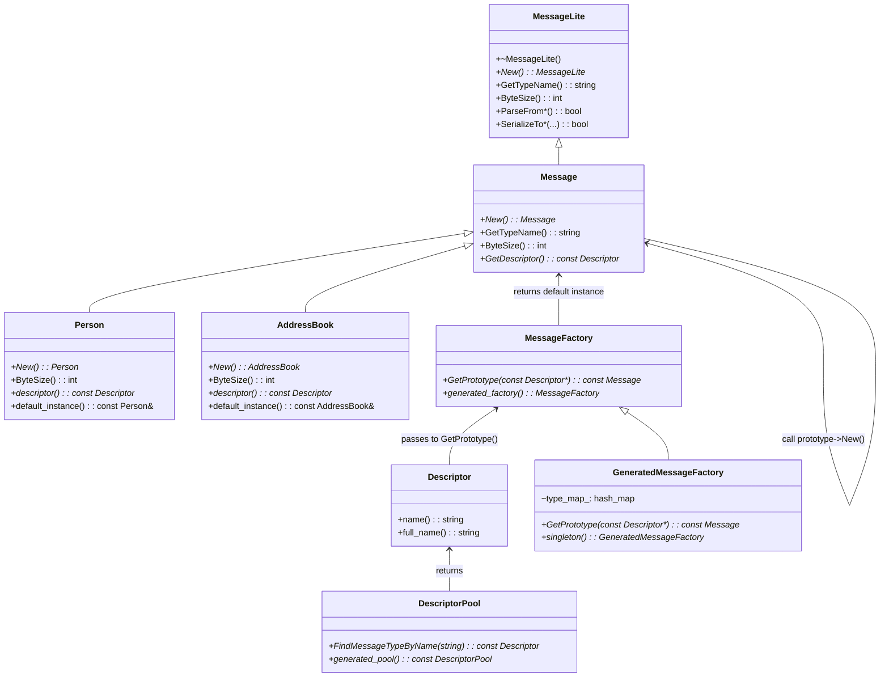
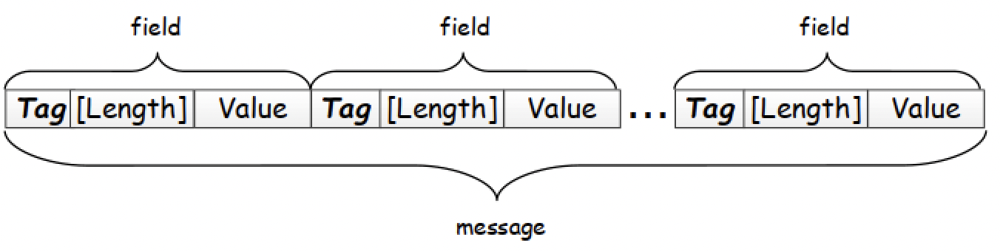
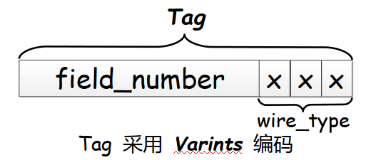
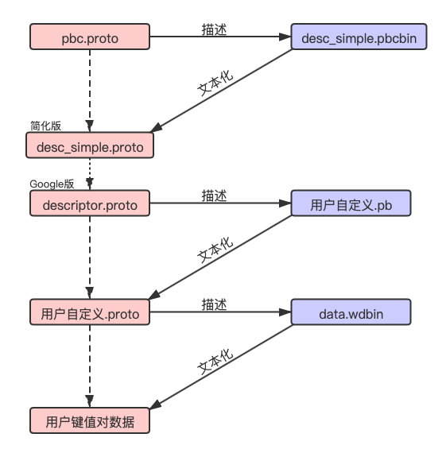

# Protobuf编码

<!-- vim-markdown-toc GFM -->

* [类图](#类图)
* [语法](#语法)
    - [元素](#元素)
    - [关键字](#关键字)
        + [~~`required`~~](#required)
        + [optional](#optional)
        + [repeated](#repeated)
        + [enum](#enum)
        + [extensions](#extensions)
        + [extend](#extend)
    - [生成命令](#生成命令)
    - [oneof](#oneof)
    - [map](#map)
    - [缺失值与默认值](#缺失值与默认值)
* [编码](#编码)
    - [Varint](#varint)
        + [编码过程](#编码过程)
        + [例1](#例1)
        + [例2](#例2)
        + [例3](#例3)
    - [ZigZag](#zigzag)
        + [例1](#例1-1)
    - [Protobuf是如何采用Variant和ZigZag编码的](#protobuf是如何采用variant和zigzag编码的)
    - [编码数据大小](#编码数据大小)
* [实现](#实现)
    - [协议自举](#协议自举)
    - [源码分析](#源码分析)
* [安装](#安装)
* [用例](#用例)
    - [用例1](#用例1)
* [最佳实践](#最佳实践)
    - [1 protobuf的优化策略](#1-protobuf的优化策略)
* [参考](#参考)
    - [文献](#文献)
    - [外链](#外链)

<!-- vim-markdown-toc -->


Google Protocol Buffers（简称Protobuf）是一款非常优秀的库，它定义了一种紧凑（compact，相对于XML和JSON而言）的可扩展二进制消息格式，特别适合网络数据传输。

protobuf分为两个版本：

- `proto2`: 比较老，新项目不推荐
- `proto3`: 推荐


## 类图



## 语法

### 元素

| .proto Type | C++    | Java       | Python   | Go       |
| ----------- | ------ | ---------- | -------- | -------- |
| double      | double | double     | float    | `*float64` |
| float       | float  | float      | float    | `*float32` |
| int32       | int32  | int        | int      | `*int32`   |
| int64       | int64  | long       | int/long | `*int64`   |
| uint32      | uint32 | int        | int/long | `*uint32`  |
| uint64      | uint64 | long       | int/long | `*uint64`  |
| sint32      | int32  | int        | int      | `*int32`   |
| sint64      | int64  | long       | int/long | `*int64`   |
| fixed32     | uint32 | int        | int/long | `*uint64`  |
| fixed64     | uint64 | long       | int/long | `*uint64`  |
| sfixed32    | int32  | int        | int      | `*int32`   |
| sfixed64    | int64  | long       | bool     | `*bool`    |
| bool        | bool   | boolean    | bool     | `*bool`    |
| string      | string | String     | unicode  | `*string`  |
| bytes       | string | ByteString | bytes    | `[]byte` |

### 关键字

#### ~~`required`~~

必选的

#### optional

可选的

#### repeated

重复的

#### enum

枚举

#### extensions

预留Tag Number给其它模块使用，用于解决字段扩展；

例：

TODO

#### extend 


### 生成命令

`protoc -I [OPTION] PROTO_FILES`

- `-I` proto文件路径
- `OPTION` 输出格式
  - `--cpp_out`
  - `--java_out`
  - `--python_out`

```sh
# 生成c++代码
protoc -I=xxx.proto --cpp_out=cpp_dir# xxx.proto:proto文件路径, cpp_dir:生成的c++路径
```

### oneof

TODO

### map

TODO

### 缺失值与默认值

在 Protobuf 2 中，消息的字段可以加 required 和 optional 修饰符，也支持 default 修饰符指定默认值；默认配置下，一个 optional 字段如果没有设置，或者显式设置成了默认值，在序列化成二进制格式时，这个字段会被去掉。

在 Protobuf 3 中，更进一步，直接去掉了 required 和 optional 修饰符，所有字段都是 optional 的， 而且对于**原始数据类型**字段，压根不提供 hasXxx() 方法。

那么怎么知道一个值到底是空值(NULL, nil)，还是默认值(`0/0.0/“”`)呢？，有以下方法：

1. 用特殊值区分，避免使用null；

2. 显式定义boolean字段；

   ```protobuf
   message Account {
   	string name = 1;
   	double profit_rate = 2;
   	bool has_profit_rate = 3;
   };
   ```

3. 使用oneof黑科技（skynet-pbc不支持）；

   ```protobuf
   message Account {
   	string name = 1;
   	oneof profit_rate {
   		double profit_rate = 2;
   	}
   };
   ```

4. 使用warpper类型（推荐）

   ```protobuf
   import "google/protobuf/wrappers.proto"
   
   message Account {
   	string name = 1;
   	google.protobuf.DoubleValue profit_rate = 2;
   }
   ```


## 编码

### Varint

每个8bit字节的前7个bit用来表示数据，最高位（MSB, Most Significant Bit）用作记号(flag)。

#### 编码过程

- 步骤一：以7位1组为单位逆序
- 步骤二：判断是否需要下一个字节，如果需要，设置MSB为1

#### 例1

数字`1`的二进制补码：`0000 0000 0000 0000 0000 0000 0000 0001`

使用varint编码：

1. 步骤一：`000 0001 000 0000 000 0000 000 0000 0000`
2. 步骤二：`0000 0001 0000 0000 0000 0000 0000 0000`

数字`1`经过variant编码后，二进制表示为：`0000 0001`，十六进制表示为：`0x01`

#### 例2

数字`251`的二进制补码：`0000 0000 0000 0000 0000 0000 1111 1011`

使用varint编码：

1. 步骤一：`111 1011 000 0001 0000 0000 0000 0000 00`
2. 步骤二：`1111 1011 0000 0001 0000 0000 0000 0000 00`

数字`251`经过variant编码后，二进制表示为：`1111 1011 0000 0001`，十六进制表示为：`0xFB01`

#### 例3

数字`-1`的二进制补码：`1111 1111 1111 1111 1111 1111 1111 1111`

1. 步骤一：`111 1111 111 1111 111 1111 111 1111 1111`
2. 步骤二：`1111 1111 1111 1111 1111 1111 1111 1111 0111 1000`

数字`-1`经过variant编码后，二进制表示为：`1111 1111 1111 1111 1111 1111 1111 1111 0111 1000`，十六进制表示为：`0xFFFFFFFF78`

**针对负数类型，使用variant编码效率不升反降**

### ZigZag

ZigZag主要是为了解决variant编码方式针对负数类型的低效问题，主要的思路是：

- `编码` 将负数映射为对应的正数，再采用Varints编码；
- `解码` 解出正数以后再根据映射关系映射回负数；

ZigZag编码的映射关系：

| Signed Original | Encoded As |
| --------------- | ---------- |
| 0               | 0          |
| -1              | 1          |
| 1               | 2          |
| -2              | 3          |
| 2147483647      | 4294967294 |
| -2147483648     | 4294967295 |

ZigZag的映射关系通过移位来实现：

- sint32

  `Zigzag(n) = (n << 1) ^ (n >> 31)`

- sint64

  `Zigzag(n) = (n << 1) ^ (n >> 63)`

#### 例1

数字`-1`的二进制编码：`1111 1111 1111 1111 1111 1111 1111 1111`

使用Zigzag编码：

1. n << 1：`1111 1111 1111 1111 1111 1111 1111 1110`
2. n >> 31：`1111 1111 1111 1111 1111 1111 1111 1111`
3. `(n << 1) ^ (n >> 31)`：`0000 0000 0000 0000 0000 0000 0000 0001`
4. 使用variant编码：`0000 0001 0000 0000 0000 0000 0000 0000`

数字`-1`经过Zigzag+variant编码后，二进制表示为：`0000 0001`，十六进制表示为：`0x01`

### Protobuf是如何采用Variant和ZigZag编码的

message结构如下：



field结构：`|Tag|Length|Value|`或`|Tag|Value|`

- `Tag`(varint编码)

  结构如下：

  


  wire_type由三位bit构成，能表示8种类型

  | Type | Meaning          | Used For                                                 |
  | ---- | ---------------- | -------------------------------------------------------- |
  | 0    | Varint           | int32, int64, uint32, uint64, sint32, sint64, bool, enum |
  | 1    | 64-bit           | fixed64, sfixed64, double                                |
  | 2    | Length-delimited | string, bytes, embedded messages, packed repeated fields |
  | 3    | Start group      | groups(deprecated)                                       |
  | 4    | End group        | groups(deprecated)                                       |
  | 5    | 32-bit           | fixed32, sfixed32, float                                 |

  field的类型受wire_type值的影响：

  - 0

    `|Tag|Value|`，value采用varint编码，不需要额外的位来表示整个value的长度，因为varint的MSB位标识下一个字节是否是有效的就起到了指示长度的作用。

  - 1，5

    `|Tag|Value|`，长度固定为32或64位，不需要额外的位来表示整个value长度。

  - 2

    `|Tag|Length|Value|`，表示可变长度的值，需要Length来指示长度。

- `Length`

  可选，需要根据`Tag`的最后三位wire_type来决定。

- `Value`(varint编码)

### 编码数据大小

| 大小(字节)       | 类型                                                         |
| ---------------- | ------------------------------------------------------------ |
| 1                | + bool                                                       |
| 4                | + float<br>+ fixed32<br>+ sfixed32                           |
| 8                | + double<br>+ fixed64<br>+ sfixed64                          |
| 可变长度         | + int64<br>+ uint64<br>+ int32<br>+ uint32<br>+ enum<br>+ sint32<br>+ sint64 |
| 带长度值和数据块 | + string<br>+ message<br>+ bytes                             |

- int类型针对正数的编码长度与数值大小成正比，针对负数的编码长度固定为最大值（int32和int64都是10字节）
- uint类型编码长度与int类型的正数部分完全一样，支持更大的数值范围
- sint类型编码长度与数值的绝对值大小成正比


## 实现

### 协议自举

Protobuf协议自身支持自举，使得实现起来比较简洁！其中涉及多个协议之间的关系如下：



### 源码分析

TODO


## 安装

1. 下载protobuf源码，编译安装

```sh
git clone git@github.com:protocolbuffers/protobuf.git

cd protobuf && ./autogen.sh

./configure --prefix=/usr/local/protobuf

make && make check

make install && ldconfig
```


## 用例

### 用例1

1. 定义proto文件`xxx.proto`

   ```protobuf
   message Example1 {
   	optional string stringVal = 1;
   	optional bytes bytesVal = 2;
   	message EmbeddedMessage {
   		int32 int32Val = 1;
   		string stringVal = 2;
   	}
   	optional EmbeddedMessage embeddedExample1 = 3;
   	repeated int32 repeatedInt32Val = 4;
   	repeated string repeatedStringVal = 5;
   }
   ```

2. 生成c++文件

   ```sh
   protoc -I=xxx.proto --cpp_out=./
   ```

3. 调用生成的c++文件

   ```c++
   #include <iostream>
   #include <fstream>
   #include <string>
   #include "xxx.pb.h"
   
   int main() {
     Example example1;
     example1.set_stringval("hello, world");
     example1.set_bytesval("are you ok?");
     
     Example1_EmbeddedMessage *embeddedExample2 = new Example1_EmbeddedMessage();
     
     embeddedExample2->set_int32val(1);
     embeddedExample2->set_stringval("embeddedInfo");
     example1.set_allocated_embeddedexample1(embeddedExample2);
     
     example1.add_repeatedint32val(2);
     example1.add_repeatedint32val(3);
     example1.add_repeatedstringval("repeated1");
     example1.add_repeatedstringval("repeated2");
     
     std::string filename = "single_length_delimited_all_example1_val_result";
     std::fstream output(filename, std::ios::out | std::ios::trunc | std::ios::binary);
     if (!example.SerializeToOstream(&output)) {
       std::cerr << "Failed to write example1." << std::endl;
       exit(-1);
     }
     
     return 0;
   }
   ```


## 最佳实践

### 1 protobuf的优化策略

（待确认）

对于Protocol Buffer而言，标签值为1到15的字段在编码时可以得到优化，即标签值和类型信息仅占有一个byte，标签范围是16到2047的将占有两个bytes；
而Protocol Buffer可以支持的字段数量则为2的29次方减一。有鉴于此，我们在设计消息结构时，可以尽可能考虑让repeated类型的字段标签位于1到15之间，这样便可以有效的节省编码后的字节数量；


## 参考

### 文献

[1] 陈硕.Linux多线程服务端编程-使用muduo c++网络库.

### 外链

- [Protocol Buffers](https://developers.google.com/protocol-buffers)
- [github protobuf](https://github.com/protocolbuffers/protobuf)
- [Protocol Buffers#extensions](https://developers.google.com/protocol-buffers/docs/proto#extensions)
- [维基百科-Protocol Buffers](https://zh.wikipedia.org/wiki/Protocol_Buffers)
- [Google Protocol Buffers 实用技术： 解析.proto文件和任意数据文件](https://cxwangyi.blogspot.com/2010/06/google-protocol-buffers-proto.html)
- [深入 ProtoBuf - 简介](https://www.jianshu.com/p/a24c88c0526a)
- [Protobuf编码](https://www.cnblogs.com/jialin0x7c9/p/12418487.html)
- [区分 Protobuf 中缺失值和默认值](https://zhuanlan.zhihu.com/p/46603988)
- [pbc实现分析](https://www.zhyingkun.com/markdown/pbcanalysis/)

