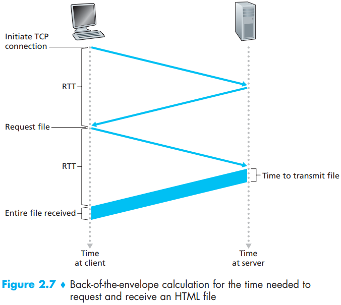

# QOS

[TOC]

## Delay

Sending one packet from the source to the destination over a path consisting of $N$ links each of the rates $R$(thus, there are $N - 1$ routers between the source and destination). Applying the same logic as above, we see that the end-to-end delay is:
$$
d_{end-to-end} = N \frac{L}{R} \qquad (1.1)
$$
As a packet travels from one node (host or router) to the subsequent node (host or router) along this path, the packet suffers from several types of delays at each node along the path. The most important of these delays are:

- `Processing Delay`.
- `Queuing Delay`.
- `Transmission Delay`.
- `Propagation Delay`.

, If we let $d_{proc}$, $d_{queue}$, $d_{trans}$, and $d_{prop}$ denote the processing, queuing, transmission, and propagation delays, then the total nodal delay is given by:
$$
d_{nodal} = d_{proc} + d_{queue} + d_{trans} + d_{prop}
$$
The nodal delays accumulate and give an end-to-end delay,
$$
d_{end-end} = N(d_{proc} + d_{trans} + d_{prop}) \qquad (1.2)
$$
where, once again, $d_{trans} = L/R$, where $L$ is the packet size.

### RTT

`round-trip time (RTT)`, which is the time it takes for a small packet to travel from client to server and then back to the client. The `RTT` includes packet-propagation delays, packet-queuing delays in intermediate routers and switches, and packet-processing delays.

## Reliable

Summary of reliable data transfer mechanisms and their use:

| Mechanism               | Use, Comments                                                |
| ----------------------- | ------------------------------------------------------------ |
| Checksum                | Used to detect bit errors in a transmitted packet.           |
| Timer                   | Used to timeout/retransmit a packet, possibly because the packet (or its ACK) was lost within the channel. Because timeouts can occur when a packet is delayed but not lost (premature timeout), or when a packet has been received by the receiver but the receiver-to-sender ACK has been lost, duplicate copies of a packet may be received by a receiver. |
| Sequence number         | Used for sequential numbering of packets of data flowing from the sender to the receiver. Gaps in the sequence numbers of received packets allow the receiver to detect a lost packet. Packets with duplicate sequence numbers allow the receiver to detect duplicate copies of a packet. |
| Acknowledgment          | Used by the receiver to tell the sender that a packet or set of packets has been received correctly. Acknowledgments will typically carry the sequence number of the packet or packets being acknowledged. Acknowledgments may be individual or cumulative, depending on the protocol. |
| Negative acknowledgment | Used by the receiver to tell the sender that a packet has not been received correctly. Negative acknowledgments will typically carry the sequence number of the packet that was not received correctly. |
| Window, pipelining      | The sender may be restricted to sending only packets with sequence numbers that fall within a given range. By allowing multiple packets to be transmitted but not yet acknowledged, sender utilization can be increased over a stop-and-wait mode of operation. We’ll see shortly that the window size may be set on the basis of the receiver’s ability to receive and buffer messages, or the level of congestion in the network, or both. |

