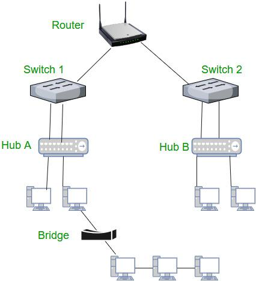
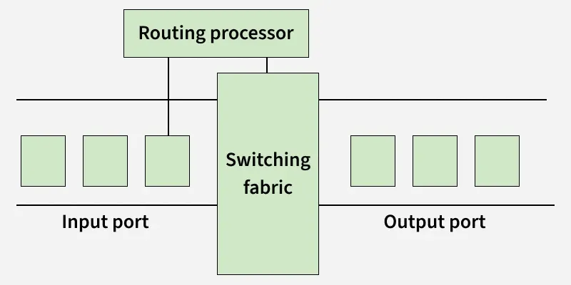

# Routing

[TOC]

Network routing is the process of selecting the best path for data to travel across one or more networks.

## Routing Types

### Static Routing

Static routing is a non-adaptive routing method where routes are configured manually by the network administrator. It provides complete control over routing decisions but is bet suited for small networks.

### Dynamic Routing

Dynamic routing is an automatic and adaptive routing method where routers choose paths using algorithms. It is widely used in modern networks due to its flexibility.

### Default Routing

Default routing sends packets to a predefined gateway when no specific route is available. It is commonly used in networks with a single exit point.

## Routing Metrics

### Distance Vector Routing

### Link State Routing

## Routing Protocols

### RIP (Routing Information Protocol)

### OSPF (Open Shortest Path First)

### EIGRP (Enhanced Interior Gateway Routing Protocol)

### BGP (Border Gateway Protocol)

### IS-IS ((Intermediate System to Intermediate System))

## Router

A router is a networking device that controls how data moves between different networks by checking destination IP addresses and choosing the best path.

### Functions of a Router

- Forwarding
- Routing
- Network Address Translation (NAT)
- Security
- VPN Connectivity
- Bandwidth Management
- Monitoring & Diagnostics

### Workflow

### Architecture

## Gateway

TODO

## Proxy

TODO

## Summary

### Router vs Gateway

| **Aspect**              | **Router**                         | **Gateway**                                 |
| :---------------------- | :--------------------------------- | :------------------------------------------ |
| **Primary function**    | Forward packets between networks   | Entry/exit point between different networks |
| **Layer (OSI model)**   | Layer 3 (Network) typically        | Any layer (2-7 depending on type)           |
| **Protocol conversion** | No (same protocol, e.g., IP to IP) | Yes (can translate between protocols)       |
| **Default route**       | One of its functions               | The "door" out of a network                 |
| **Examples**            | Home router, core router           | Default gateway, VoIP gateway, IoT gateway  |
| **Relationship**        | A router can be a gateway          | A gateway may or may not be a router        |

## Reference

[1] [Router in Computer Networks](https://www.geeksforgeeks.org/computer-networks/introduction-of-a-router/)

[2] [Routing](https://www.geeksforgeeks.org/computer-networks/what-is-routing/)