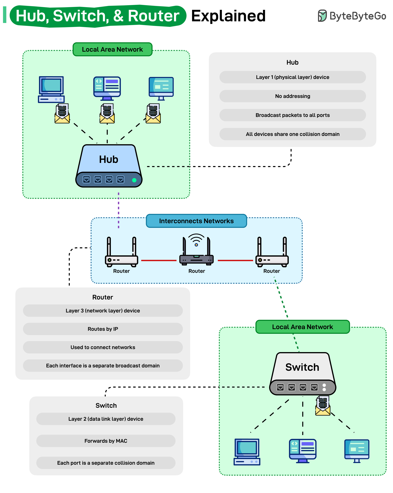
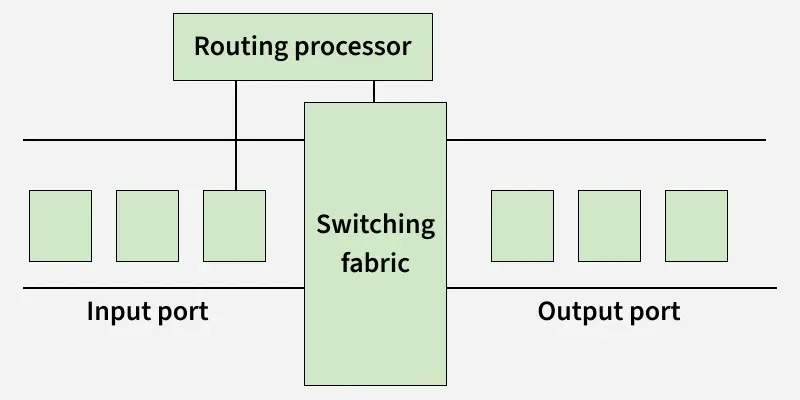
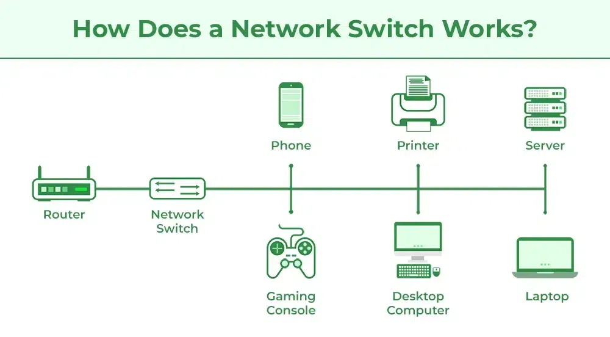
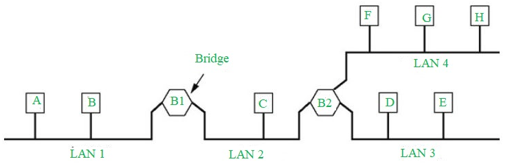

# Routing

[TOC]

Network routing is the process of selecting the best path for data to travel across one or more networks.

## Routing Types

### Static Routing

Static routing is a non-adaptive routing method where routes are configured manually by the network administrator. It provides complete control over routing decisions but is bet suited for small networks.

### Dynamic Routing

Dynamic routing is an automatic and adaptive routing method where routers choose paths using algorithms. It is widely used in modern networks due to its flexibility.

### Default Routing

Default routing sends packets to a predefined gateway when no specific route is available. It is commonly used in networks with a single exit point.

## Routing Metrics

### Distance Vector Routing

TODO

### Link State Routing

TODO

## Routing Protocols

### RIP (Routing Information Protocol)

TODO

### OSPF (Open Shortest Path First)

TODO

### EIGRP (Enhanced Interior Gateway Routing Protocol)

TODO

### BGP (Border Gateway Protocol)

TODO

### IS-IS (Intermediate System to Intermediate System)

TODO

## Router

A router is a networking device that controls how data moves between different networks by checking destination IP addresses and choosing the best path.

### Functions of a Router

- Forwarding
- Routing
- Network Address Translation (NAT)
- Security
- VPN Connectivity
- Bandwidth Management
- Monitoring & Diagnostics

### Workflow

### Architecture

## Switch

A switch is basically a hardware device that is responsible for channeling the data that is coming into the various input ports to a particular output port, which will further take the data to the desired destination.

### Workflow

## Bridge

A bridge is basically a device which is responsible for dividing a single network into various network segments. Thus the process of dividing a single network into various multiple network segments is called as network bridging.

### Workflow

## Gateway

TODO

## Proxy

TODO

## Summary

### Router vs Gateway

| **Aspect**              | **Router**                         | **Gateway**                                 |
| :---------------------- | :--------------------------------- | :------------------------------------------ |
| **Primary function**    | Forward packets between networks   | Entry/exit point between different networks |
| **Layer (OSI model)**   | Layer 3 (Network) typically        | Any layer (2-7 depending on type)           |
| **Protocol conversion** | No (same protocol, e.g., IP to IP) | Yes (can translate between protocols)       |
| **Default route**       | One of its functions               | The "door" out of a network                 |
| **Examples**            | Home router, core router           | Default gateway, VoIP gateway, IoT gateway  |
| **Relationship**        | A router can be a gateway          | A gateway may or may not be a router        |

### Switch vs Bridge

|                            Switch                            |                            Bridge                            |
| :----------------------------------------------------------: | :----------------------------------------------------------: |
| A device which is responsible for channeling the data that is coming into the various input ports to a particular output port which will further take the data to the desired destination. | A device which is responsible for dividing a single network into various network segments. |
|              A switch can have a lot of ports.               |             A bridge can have 2 or 4 ports only.             |
| The switch performs the packet forwarding by using hardwares such as ASICS hence, it is hardware based. | The bridge performs the packet forwarding by using softwares so it is software based. |
| The switching method in case of a switch can thus be store, forward, fragment free or cut through. | The switching method in case of a bridge is store and forward. |
|     The task of error checking is performed by a switch.     |         A bridge cannot perform the error checking.          |
|                    A switch has buffers.                     |               A bridge may not have a buffer.                |

## Reference

[1] [Router in Computer Networks](https://www.geeksforgeeks.org/computer-networks/introduction-of-a-router/)

[2] [Routing](https://www.geeksforgeeks.org/computer-networks/what-is-routing/)

[3] [Hub, Switch, & Router Explained](https://blog.bytebytego.com/p/ep194-evolution-of-http)