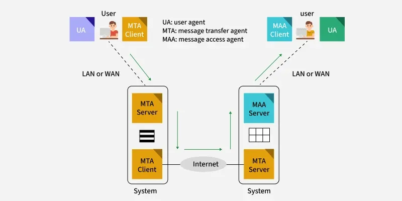
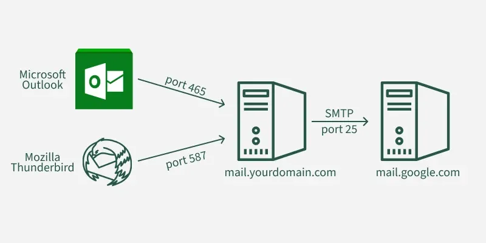
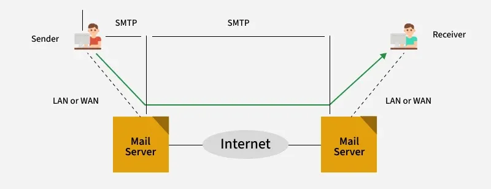
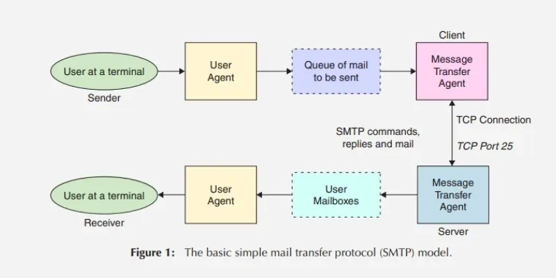

# SMTP Protocol

[TOC]

Simple Mail Transfer Protocol (SMTP) is an application-layer protocol used to send and transfer email between servers. It relies on a TCP connection to port 25 to reliably deliver messages from a client to an email server.

## Workflow

## SMTP Ports

## Types of SMTP Protocol

The SMTP model supports two types of email delivery methods:

- End-to-end

  This delivery method is used between organizations. In this method, the email is sent directly from the sender's SMTP client to the recipient's SMTP server without passing through intermediate servers.

- Store-and_forward

  This delivery method is used within organizations that have TCP/IP and SMTP-based networks. In this method, the email may pass through several intermediate servers before reaching the recipient.

## Model of SMTP System

## SMTP Commands

| **S.No.** | **Keyword** |          **Command form**           |                       **Description**                        |     **Usage**      |
| :-------: | :---------: | :---------------------------------: | :----------------------------------------------------------: | :----------------: |
|    1.     |    HELO     |       HELO<SP><domain><CRLF>        | It provides the identification of the sender i.e. the host name. |     Mandatory      |
|    2.     |    MAIL     | MAIL<SP>FROM : <reverse-path><CRLF> |           It specifies the originator of the mail.           |     Mandatory      |
|    3.     |    RCPT     |  RCPT<SP>TO : <forward-path><CRLF>  |             It specifies the recipient of mail.              |     Mandatory      |
|    4.     |    DATA     |             DATA<CRLF>              |           It specifies the beginning of the mail.            |     Mandatory      |
|    5.     |    QUIT     |             QUIT<CRLF>              |                It closes the TCP connection.                 |     Mandatory      |
|    6.     |    RSET     |             RSET<CRLF>              | It aborts the current mail transaction but the TCP connection remains open. | Highly recommended |
|    7.     |    VRFY     |       VRFY<SP><string><CRLF>        |        It is use to confirm or verify the user name.         | Highly recommended |
|    8.     |    NOOP     |             NOOP<CRLF>              |                         No operation                         | Highly recommended |
|    9.     |    TURN     |             TURN<CRLF>              |         It reverses the role of sender and receiver.         |    Seldom used     |
|    10.    |    EXPN     |       EXPN<SP><string><CRLF>        |        It specifies the mailing list to be expanded.         |    Seldom used     |
|    11.    |    HELP     |       HELP<SP><string><CRLF>        |      It send some specific documentation to the system.      |    Seldom used     |
|    12.    |    SEND     | SEND<SP>FROM : <reverse-path><CRLF> |                It send mail to the terminal.                 |    Seldom used     |
|    13.    |    SOML     | SOML<SP>FROM : <reverse-path><CRLF> | It send mail to the terminal if possible; otherwise to mailbox. |    Seldom used     |
|    14.    |    SAML     | SAML<SP>FROM : <reverse-path><CRLF> |          It send mail to the terminal and mailbox.           |    Seldom used     |

## ESMTP(Extended Simple Mail Transfer Protocol)

ESTMP is a set of protocols for sending and receiving electronic messages on the Internet.

## Summary

### SMTP vs Extended SMTP

|                             SMTP                             |                        Extended SMTP                         |
| :----------------------------------------------------------: | :----------------------------------------------------------: |
| Users were not verified in SMTP as a result of massive-scale scam emails being sent. |   In Extended SMTP, authentication of the sender is done.    |
| We cannot attach a Multimedia file in SMTP directly without the help of MMIE. |      We can directly attach a multimedia file in ESMTP.      |
|       We cannot reduce the size of the email in SMTP.        |    We can reduce the size of the email in Extended SMTP.     |
|    SMTP clients open transmission with the command HELO.     | The main identification feature for ESMTP clients is to open a transmission with the command EHLO (Extended HELLO). |

### SMTP vs IMAP

|                           **IMAP**                           |                           **SMTP**                           |
| :----------------------------------------------------------: | :----------------------------------------------------------: |
|      It is short for Internet Message Access Protocol.       |        It is short for Simple Mail Transfer Protocol.        |
|              Designed by Mark Crispin in 1986.               |                 Designed by RFC 821 in 1982.                 |
| It is used for retrieving or pulling emails for the recipient.. | It is for sending or pushing an email from an unknown mail server to another mail server. |
| It only functions between the client and server for communication. | It functions between servers for the transfer of information. |
| The Port number used for IMAP is 143 and 993 for secure connection (SSL/TLS connection). | The Port number used for SMTP is 25, 465, and 587 for secure connections (TLS-encrypted). |
| It works as a message transfer agent between the user and the server. |     It works as a message transfer agent between servers     |
|           Users can organize emails on the server.           |         Users can organize mails on client storage.          |
| It offers multiple change flexibility across all the devices | It offers the email to be changes after being sent successfully. |

### SMTP vs POP3

|                           **SMTP**                           |                           **POP3**                           |
| :----------------------------------------------------------: | :----------------------------------------------------------: |
|        SMTP stands for Simple Mail Transfer Protocol.        |       POP3 stands for Post Office Protocol version 3.        |
|               It is used for sending messages.               |              It is used for accessing messages.              |
| The port numbers of SMTP are 25, 465, and 587 for secure connections (TLS connections). | The port number of POP3 is 110 or port 995 for SSL/TLS connection. |
| It is an MTA (Message Transfer Agent) for sending the message to the receiver. | It is an MAA (Message Access Agent) for accessing the messages from the mailbox. |
| It has two MTAs, one is a client MTA (Message Transfer Agent) and the second one is a server MTA (Message Transfer Agent). | It also has two MAAs, one is a client MAA (Message Access Agent), and the other is a server MAA(Message Access Agent). |
|           SMTP is also known as the PUSH protocol.           |           POP3 is also known as the POP protocol.            |
| SMTP transfers the mail from the sender's computer to the mail box present on the receiver's mail server. | POP3 allows the retrieval and organization of mail from the mailbox on the receiver's mail server to the receiver's computer. |
| It is implied between the sender mail server and the receiver mail server. | It is implied between the receiver and the receiver's mail server. |

### SMTP vs HTTP

|                        ***\*SMTP\****                        |                        ***\*HTTP\****                        |
| :----------------------------------------------------------: | :----------------------------------------------------------: |
|               SMTP is used for mail services.                |       HTTP is mainly used for data and file transfer.        |
|                       It uses port 25.                       |                       It uses port 80.                       |
|               It is primarily a push protocol.               |               It is primarily a pull protocol.               |
| It imposes a 7-bit ASCII restriction on the content to be transferred. | It does not impose a 7-bit ASCII restriction. Can transfer multimedia, hyperlinks, etc. |
|           SMTP transfers emails via Mail Servers.            | HTTP transfers files between the Web server and the Web client. |
|         SMTP is a persistent type of TCP connection.         |        It can use both Persistent and Non-persistent.        |
|           Uses base64 encoding for authentication.           | Uses different methods of authentication such as basic, digest, and OAuth. |
|       Does not support session management or cookies.        |  Supports session management and cookies to maintain state.  |
|      Has a smaller message size limit compared to HTTP.      |      Has a larger message size limit compared to SMTP.       |
|         Requires authentication for sending emails.          |   Does not require authentication for browsing web pages.    |
| Supports both plain text and encrypted communication (SMTPS or STARTTLS). | Supports both plain text and encrypted communication (HTTPS). |

## Reference

[1] [Simple Mail Transfer Protocol (SMTP)](https://www.geeksforgeeks.org/computer-networks/simple-mail-transfer-protocol-smtp/)

[2] [What is ESMTP (Extended Simple Mail Transfer Protocol)?](https://www.geeksforgeeks.org/computer-networks/what-is-esmtp-extended-simple-mail-transfer-protocol/)

[3] [Difference between IMAP and SMTP](https://www.geeksforgeeks.org/computer-networks/difference-between-imap-and-smtp/)

[4] [Difference between SMTP and POP3](https://www.geeksforgeeks.org/computer-networks/difference-between-smtp-and-pop3/)

[5] [Difference Between SMTP and HTTP](https://www.geeksforgeeks.org/computer-networks/difference-between-smtp-and-http/)