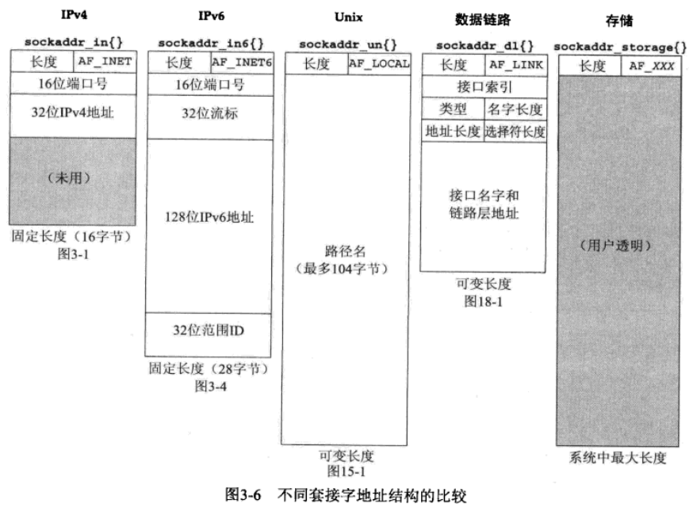

# 套接字

[TOC]


## 套接字地址

### 通用Unix套接字地址

```c++
#include <netinet/in.h>
struct sockaddr_storage {
    uint8_t     ss_len;
    sa_family_t ss_family;
};
```

### Unix IPv4套接字地址

```c++
#include <netinet/in.h>
struct in_addr {
    in_addr_t s_addr;           // 至少32位无符号整数类型
};
struct sockaddr_in {
    uint8_t         sin_len;    // 长度字段
    sa_family_t     sin_family; // 地址族; 任何无符号整数类型
    in_port_t       sin_port;   // TCP或UDP端口; 至少16位的无符号整数类型 
    struct in_addr  sin_addr;
    char		   sin_zero[8];
};
```

### Unix IPv6套接字地址

```c++
#include <netinet/in.h>
struct in6_addr {
    uint8_t s6_addr[16];
};
#defie SIN6_LEN
struct sockaddr_in6 {
    uint8_t          sin6_len;
    sa_family_t      sin6_family;
    in_port_t      	 sin6_port;
    uint32_t         sin6_flowinfo;
    struct in6_addr  sin6_addr;
    uint32_t         sin6_scope_id;
}
```

### 套接字地址传递

1. 从进程到内核传递套接字地址结构的函数
   - `bind`
   - `connect`
   - `sendto`
2. 从内核到进程传递套接字地址结构的函数
   - `accept`
   - `recvfrom`
   - `getsockname`
   - `getpeername`

### 不同套接字地址的比较




## 套接字选项

TODO


## 参考

TODO