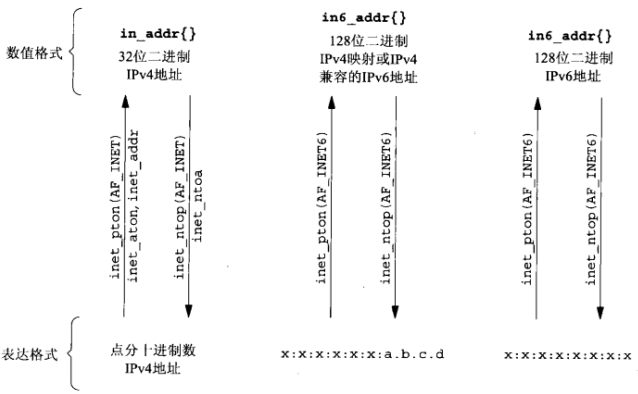
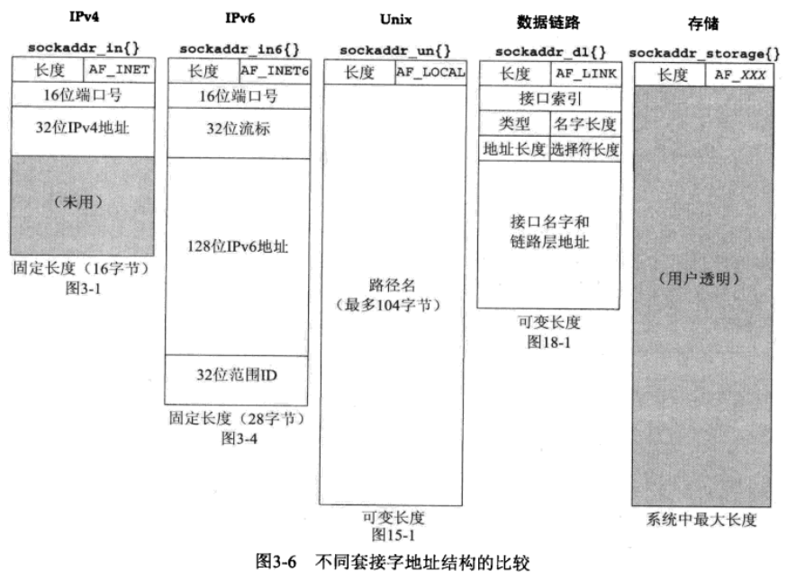
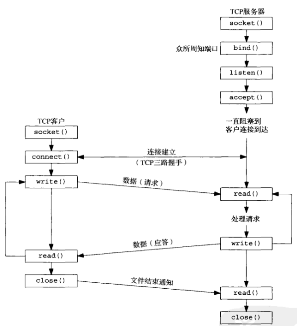
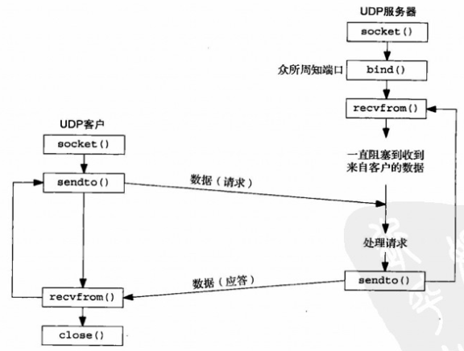
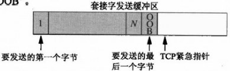
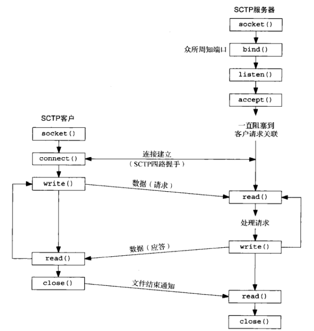
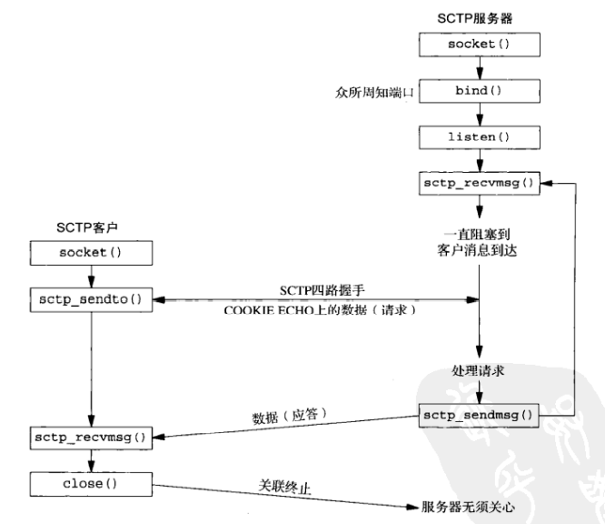
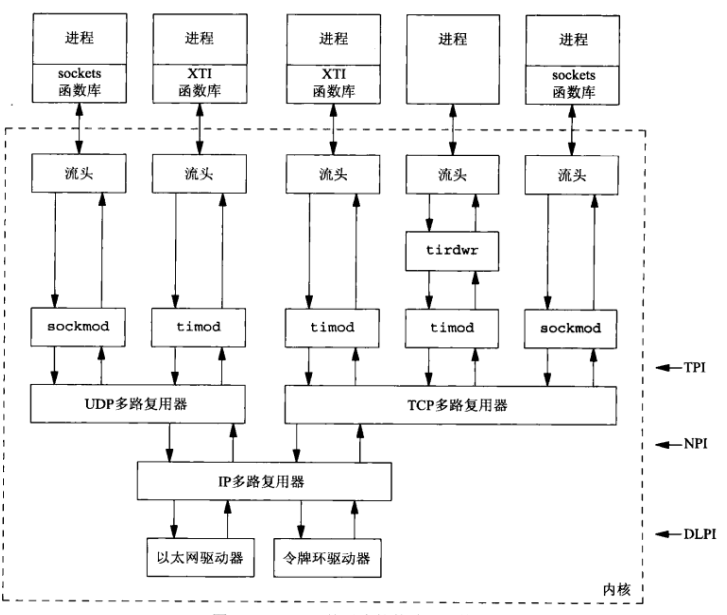

English | [中文版](socket_zh.md)

# Socket Programming

[TOC]


## Socket Addresses

### Generic Unix Socket Address
```c++
#include <netinet/in.h>
struct sockaddr_storage {
		uint8_t     ss_len;
		sa_family_t ss_family;
};
```

### Unix IPv4 Socket Address
```c++
#include <netinet/in.h>
struct in_addr {
		in_addr_t s_addr;           // At least 32-bit unsigned integer type
};
struct sockaddr_in {
		uint8_t         sin_len;    // Length field
		sa_family_t     sin_family; // Address family; any unsigned integer type
		in_port_t       sin_port;   // TCP or UDP port; at least 16-bit unsigned integer type
		struct in_addr  sin_addr;
		char            sin_zero[8];
};
```

### Unix IPv6 Socket Address
```c++
#include <netinet/in.h>
struct in6_addr {
		uint8_t s6_addr[16];
};
#define SIN6_LEN
struct sockaddr_in6 {
		uint8_t          sin6_len;
		sa_family_t      sin6_family;
		in_port_t        sin6_port;
		uint32_t         sin6_flowinfo;
		struct in6_addr  sin6_addr;
		uint32_t         sin6_scope_id;
}
```

### Address Conversion

#### Address Passing
1. Functions passing socket address structures from process to kernel:
	 - `bind`
	 - `connect`
	 - `sendto`
2. Functions passing socket address structures from kernel to process:
	 - `accept`
	 - `recvfrom`
	 - `getsockname`
	 - `getpeername`

#### Format Conversion


#### Name and Address Conversion
TODO

#### IPv4 and IPv6 Interoperability
TODO

### Comparison of Different Socket Addresses



## Socket Functions



### socket
```c++
#include <sys/socket.h>
int socket(int family, int type, int protocol)
```
- `family` protocol family
	| family   | Description    |
	| -------- | -------------- |
	| AF_INET  | IPv4 protocol  |
	| AF_INET6 | IPv6 protocol  |
	| AF_LOCAL | Unix domain    |
	| AF_ROUTE | Routing socket |
	| AF_KEY   | Key socket     |
- `type` socket type
	| type           | Description         |
	| -------------- | ------------------ |
	| SOCK_STREAM    | Byte stream socket |
	| SOCK_DGRAM     | Datagram socket    |
	| SOCK_SEQPACKET | Sequenced packet   |
	| SOCK_RAW       | Raw socket         |
- `protocol` protocol type
	| protocol     | Description         |
	| ------------ | ------------------ |
	| IPPROTO_TCP  | TCP protocol       |
	| IPPROTO_UDP  | UDP protocol       |
	| IPPROTO_SCTP | SCTP protocol      |
 - `return value`
	 Success: socket descriptor (non-negative)
	 Failure: -1
	 *Creates a socket and returns a socket descriptor*

|                | AF_INET    | AF_INET6   | AF_LOCAL | AF_ROUTE | AF_KEY |
| -------------- | ---------- | ---------- | -------- | -------- | ------ |
| SOCK_STREAM    | `TCP/SCTP` | `TCP/SCTP` | Yes      |          |        |
| SOCK_DGRAM     | UDP        | UDP        | Yes      |          |        |
| SOCK_SEQPACKET | SCTP       | SCTP       | Yes      |          |        |
| SOCK_RAW       | IPv4       | IPv6       |          | Yes      | Yes    |
*Possible combinations of socket `family` and `type`*

### connect
```c++
#include <sys/socket.h>
int connect(int sockfd, const struct sockaddr *servaddr, socklen_t addrlen)
```
- `sockfd` socket descriptor
- `servaddr` pointer to socket address
- `addrlen` socket address length
- `return value`
	Success: 0
	Failure: -1
	*Establish a connection to a TCP server*

### bind
```c++
#include <sys/socket.h>
int bind(int sockfd, const struct sockaddr *myaddr, socklen_t addrlen)
```
- `sockfd` socket
- `myaddr` pointer to protocol-specific address structure
- `addrlen` length of address structure
- `return value`
	Success: 0
	Failure: -1
	*Bind address (assign a local protocol address to a socket)*

### listen
```c++
#include <sys/socket.h>
int listen(int sockfd, int backlog);
```
- `sockfd` socket
- `backlog` max length of pending socket queue
- `return value`
	Success: 0
	Failure: -1
	*Listen on a socket (convert an unconnected socket to a passive socket, instructing the kernel to accept connection requests to the socket, and set the max length of the pending socket queue)*

### accept
```c++
#include <sys/socket.h>
int accept(int sockfd, struct sockaddr *cliaddr, socklen_t *addrlen);
```
- `sockfd` listening socket
- `cliaddr` returns connected protocol address
- `addrlen` returns length of connected protocol address
- `return value`
	Success: a new descriptor
	Failure: error code
	*Accept connection (returns the next completed connection from the head of the completed connection queue; if the queue is empty, the process sleeps)*

### close
```c++
#include <unistd.h>
int close(int sockfd);
```
- `sockfd` socket file descriptor
- `return value`
	Success: 0
	Failure: -1
	*Marks the socket as closed so it can no longer be used by read or write*

### getsockname
```c++
#include <sys/socket.h>
int getsockname(int sockfd, struct sockaddr *localaddr, socklen_t *addrlen);
```
- `sockfd` socket file descriptor
- `localaddr` local protocol address
- `addrlen` length of local protocol address
- `return value`
	Success: 0
	Failure: -1
	*Returns the local protocol address associated with the socket*

### getpeername
```c++
#include <sys/socket.h>
int getpeername(int sockfd, struct sockaddr *peeraddr, socklen_t *addrlen);
```
- `sockfd` socket file descriptor
- `peeraddr` remote protocol address
- `addrlen` length of remote protocol address
- `return value`
	Success: 0
	Failure: -1
	*Returns the remote protocol address associated with the socket (getpeername)*

### shutdown
```c++
#include <sys/socket.h>
int shutdown(int sockfd, int howto);
```
- `sockfd` socket file descriptor
- `howto` action
	| Action    | Description                                                    |
	| --------- | -------------------------------------------------------------- |
	| SHUT_RD   | Close read, discard data in receive buffer.                    |
	| SHUT_WR   | Close write, discard data in send buffer.                      |
	| SHUT_RDWR | Close read and write, like calling `SHUT_RD` and `SHUT_WR`.    |
- `return value`
	Success: 0
	Failure: -1
	*Close connection*

### fcntl
```c++
#include <fcntl.h>
int fcntl(int fd, int cmd, ...)
```
- `fd` file descriptor
- `cmd` command
- `return value`
	Success: depends on cmd
	Failure: -1
	*Performs various descriptor control operations.*

### ioctl
```c++
#include <unistd.h>
int ioctl(int fd, int request, ...);
```
- `fd` socket
- `request` request
- `return value`
	Success: 0
	Failure: -1
	*Affects an open file referenced by fd.*

| Operation                        | fcntl               | ioctl                | Routing Socket | POSIX      |
| -------------------------------- | ------------------- | -------------------- | ------------- | ---------- |
| Set socket to non-blocking I/O   | F_SETFL, O_NONBLOCK | FIONBIO              |               | fcntl      |
| Set socket to signal-driven I/O  | F_SETFL, O_ASYNC    | FIOASYNC             |               | fcntl      |
| Set socket owner                 | F_SETOWN            | SIOCSPGRP or FIOSETOWN |               | fcntl      |
| Get socket owner                 | F_GETOWN            | SIOCGPGRP or FIOGETOWN |               | fcntl      |
| Get bytes in receive buffer      |                     | FIONREAD             |               |            |
| Test if socket is at out-of-band mark |                | SIOCATMARK           |               | sockatmark |
| Get interface list               |                     | SIOCGIFCONF          | sysctl        |            |
| Interface operations             |                     | SIOC[GS]IFxxx        |               |            |
| ARP cache operations             |                     | SIOCxARP             | RTM_xxx       |            |
| Routing table operations         |                     | SIOCxxxRT            | RTM_xxx       |            |


## Socket Options

### getsockopt
```c++
#include <sys/socket.h>
int getsockopt(int sockfd, int level, int optname, void *optval, socklen_t *optlen);
```
- `sockfd`: socket
- `level`: level, specifies the code in the system that interprets the option, either general socket code or protocol-specific code
- `optname`: option name
- `optval`: pointer to a variable
- `optlen`: size of optval
- return value
	Success: 0
	Failure: -1
	*Get socket option*

### setsockopt
```c++
#include <sys/socket.h>
int setsockopt(int sockfd, int level, int optname, const void *optval, socklen_t optlen);
```
- `sockfd`: socket
- `level`: level, specifies the code in the system that interprets the option, either general socket code or protocol-specific code
- `optname`: option name
- `optval`: pointer to an option variable
- `optlen`: size of optval
- return value
	- Success: 0
	- Failure: -1
	*Set socket option*

### IP Options
TODO

### Socket/IP Layer Socket Options

| level                | optname                                                    | Data Type   | Description |
| -------------------- | --------------------------------------------------------- | ----------- | ----------- |
| SOL_SOCKET           | SO_BROADCAST<br>SO_DEBUG<br>SO_DONTROUTE<br>SO_ERROR<br>SO_KEEPALIVE<br>SO_LINGER<br>SO_OOBINLINE<br>SO_RCVBUF<br>SO_SNDBUF<br>SO_RCVLOWAT<br>SO_SNDLOWAT<br>SO_RCVTIMEO<br>SO_SNDTIMEO<br>SO_REUSEADDR<br>SO_REUSEPORT<br>SO_TYPE<br>SO_USELOOPBACK | int<br>int<br>int<br>int<br>int<br>linger<br>int<br>int<br>int<br>int<br>int<br>timeval<br>timeval<br>int<br>int<br>int<br>int | - Allow sending broadcast datagrams<br>- Enable debug tracing<br>- Bypass outbound routing table lookup<br>- Get and clear pending errors<br>- Periodically test if connection is alive<br>- Delay close if data is pending<br>- Keep received out-of-band data inline<br>- Receive buffer size<br>- Send buffer size<br>- Receive buffer low-water mark<br>- Send buffer low-water mark<br>- Receive timeout<br>- Send timeout<br>- Allow reuse of local address<br>- Allow reuse of local port<br>- Get socket type<br>- Routing socket gets a copy of sent data |
| IPPROTO_IP           | IP_HDRINCL<br>IP_OPTIONS<br>IP_RECVDSTANDDR<br>IP_RECVIF<br>IP_TOS<br>IP_TTL<br><br>IP_MULTICAST_IF<br>IP_MULTICAST_TTL<br>IP_MULTICAST_LOOP<br>IP_ADD_MEMBERSHIP<br>IP_DROP_MEMBERSHIP<br>IP_BLOCK_SOURCE<br>IP_UNBLOCK_SOURCE<br>IP_ADD_SOURCE_MEMBERSHIP<br>IP_DROP_SOURCE_MEMBERSHIP | int<br>(see text)<br>int<br>int<br>int<br>int<br><br>in_addr{}<br>u_char<br>u_char<br>ip_mreq{}<br>ip_mreq{}<br>ip_mreq_source{}<br>ip_mreq_source{}<br>ip_mreq_source{}<br>ip_mreq_source{} | - Include IP header with data<br>- IP header options<br>- Return destination IP address<br>- Return receiving interface index<br>- Service type and priority<br>- Time to live<br><br>- Specify outgoing interface<br>- Specify outgoing TTL<br>- Specify loopback<br>- Join multicast group<br>- Leave multicast group<br>- Block multicast group<br>- Unblock multicast group<br>- Join source-specific multicast group<br>- Leave source-specific multicast group |
| IPPROTO_ICMPV6       | ICMP6_FILTER                                               | ivmp6_filter{} | - Specify ICMPv6 message types to deliver |
| IPPROTO_IPV6         | IPV6_CHECKSUM<br>IPV6_DONTFRAG<br>IPV6_NEXTHOP<br>IPV6_PATHMTU<br>IPV6_RECVDSTOPTS<br>IPV6_RECVHOPLIMIT<br>IPV6_RECVHOPOPTS<br>IPV6_RECVPATHMTU<br>IPV6_RECVPKTINFO<br>IPV6_RECVRTHDR<br>IPV6_RECVTCLASS<br>IPV6_UNICAST_HOPS<br>IPV6_USE_MIN_MTU<br>IPV6_V60NLY<br>IPV6_XXX<br><br>IPV6_MULTICAST_IP<br>IPV6_MULTICAST_HOPS<br>IPV6_MULTICAST_LOOP<br>IPV6_JOIN_GROUP<br>IPV6_LEAVE_GROUP | int<br>int<br>sockaddr_in6{}<br>ip6_mtuinfo{}<br>int<br>int<br>int<br>int<br>int<br>int<br>int<br>int<br>int<br>int<br>(see text)<br><br>u_int<br>int<br>u_int<br>ipv6_mreq{}<br>ipv6_mreq{} | - Checksum offset for raw sockets<br>- Drop large packets instead of fragmenting<br>- Specify next hop address<br>- Get current path MTU<br>- Receive destination options<br>- Receive unicast hop limit<br>- Receive hop-by-hop options<br>- Receive path MTU<br>- Receive packet info<br>- Receive source route<br>- Receive traffic class<br>- Default unicast hop limit<br>- Use minimum MTU<br>- Disable v4 compatibility<br>- Sticky ancillary data<br><br>- Specify outgoing interface<br>- Specify outgoing hop limit<br>- Specify loopback<br>- Join multicast group<br>- Leave multicast group |
| IPPROTO_IP<br>IPPROTO_IPV6 | MCAST_JOIN_GROUP<br>MCAST_LEAVE_GROUP<br>MCAST_BLOCK_SOURCE<br>MCAST_UNBLOCK_SOURCE<br>MCAST_JOIN_SOURCE_GROUP<br>MCAST_LEAVE_SOURCE_GROUP | group_req{}<br>group_source_req{}<br>group_source_req{}<br>group_source_req{}<br>group_source_req{}<br>group_source_req{} | - Join multicast group<br>- Leave multicast group<br>- Block multicast source<br>- Unblock multicast source<br>- Join source-specific multicast group<br>- Leave source-specific multicast group |

### Transport Layer Socket Options Summary

| level         | optname                                            | Data Type   | Description |
| ------------- | -------------------------------------------------- | ----------- | ----------- |
| IPPROTO_TCP   | TCP_MAXSEG<br>TCP_NODELAY                         | int<br>int  | - TCP max segment size<br>- Disable Nagle algorithm |
| IPPROTO_SCTP  | SCTP_ADAPTION_LAYER<br>SCTP_ASSOCINFO<br>SCTP_AUTOCLOSE<br>SCTP_DEFAULT_SEND_PARAM<br>SCTP_DISABLE_FRAGMENTS<br>SCTP_EVENTS<br>SCTP_GET_PEER_ADDR_INFO<br>SCTP_I_WANT_MAPPED_V4_ADDR<br>SCTP_INITMSG<br>SCTP_MAXBURST<br>SCTP_MAXSEG<br>SCTP_NODELAY<br>SCTP_PEER_ADDR_PARAMS<br>SCTP_PRIMARY_ADDR<br>SCTP_RTOINFO<br>SCTP_SET_PEER_PRIMARY_ADDR<br>SCTP_STATUS | sctp_setadaption{}<br/>sctp_assocparams{}<br/>int<br/>sctp_sndrcvinfo{}<br/>int<br/>sctp_event_subscribe{}<br/>sctp_paddrinfo{}<br/>int<br/>sctp_initmsg{}<br/>int<br/>int<br/>int<br/>sctp_paddrparams{}<br/>sctp_setprim{}<br/>sctp_rtoinfo{}<br/>sctp_setpeerprim{}<br/>sctp_status{} | - Adaptation layer indication<br>- Check and set association info<br>- Auto close operation<br>- Default send params<br>- SCTP fragmentation<br>- Notification of interested events<br>- Get peer address status<br>- Mapped v4 address<br>- Default INIT params<br>- Max burst size<br>- Max segment size<br>- Disable Nagle algorithm<br>- Peer address params<br>- Primary destination address<br>- RTO info<br>- Peer primary destination address<br>- Get association status |


## Data Link Layer Access

### Data Link Socket Address Structure
```c++
struct sockaddr_dl {
		uint8_t     sdl_len;
		sa_family_t sdl_family;
		uint16_t    sdl_index;
		uint8_t     sdl_type;
		uint8_t     sdl_nlen;
		uint8_t     sdl_alen;
		uint8_t     sdl_slen;
		char        sdl_data[12];
};
```

### Routing Socket Programming
```c++
#include <sys/param.h>
#include <sys/sysctl.h>
int sysctl(int *name, u_int namelen, void *oldp, size_t *oldlenp,
					 void *newp, size_t newlen);
```
- `name` name (integer array)
	- AF_INET: get/set variables affecting the Internet protocol.
	- AF_LINK: get/set link layer info (e.g., number of PPP interfaces).
	- AF_ROUTE: returns info about routing table or interface list
		sysctl returns info in AF_ROUTE domain:
		| name[] | Returns IPv4 routing table | Returns IPv4 ARP cache | Returns IPv6 routing table | Returns interface list |
		| ------ | ------------------------- | ---------------------- | ------------------------- | --------------------- |
		| 0      | CTL_NET                   | CTL_NET                | CTL_NET                   | CTL_NET               |
		| 1      | AF_ROUTE                  | AF_ROUTE               | AF_ROUTE                  | AF_ROUTE              |
		| 2      | 0                         | 0                      | 0                         | 0                     |
		| 3      | AF_INET                   | AF_INET                | AF_INET6                  | 0                     |
		| 4      | NET_RT_DUMP               | NET_RT_FLAGS           | NET_RT_DUMP               | NET_RT_IFLIST         |
		| 5      | 0                         | RTF_LLINFO             | 0                         | 0                     |
	- AF_UNSPEC: get/set some socket layer variables (e.g., max send/recv buffer size).
- `namelen` array length
- `oldp` buffer for kernel to store name
	May contain:
	1. NET_RT_DUMP: returns routing table for address family specified by name[3]. If 0, returns all address families.
	2. NET_RT_FLAGS: returns routing table for address family specified by name[3], but only entries with flags matching name[5]. All ARP cache entries in routing table have RTF_LLINFO flag set.
	3. NET_RT_IFLIST: returns info for all configured interfaces.
- `oldlenp` buffer size for kernel to store name
- `newp` buffer
- `newlen` buffer size
- `return value`
	Success: 0
	Failure: -1
	*Check routing table and interface list, create routing socket.*


## UDP Socket Programming


```c++
#include <sys/socket.h>
size_t recvfrom(int sockfd, void *buff, size_t nbytes, int flags, struct sockaddr *from, socklen_t *addrlen)
```
- `sockfd` descriptor
- `buff` buffer pointer
- `nbytes` number of bytes to read
- `from` sender address
- `addrlen` address length
- `return value`
	Success: number of bytes read
	Failure: -1
	*Receive message* (recvfrom needs timeout option, otherwise it will block forever).
```c++
#include <sys/socket.h>
ssize_t sendto(int sockfd, const void *buff, size_t nbytes, int flags, const struct sockaddr *to, socklen_t *addrlen)
```
- `sockfd` descriptor
- `buff` buffer pointer
- `nbytes` number of bytes to read/write
- `flags` parameter
- `to` receiver address
- `addrlen` address length
- `return value`
	Success: number of bytes written
	Failure: -1
	*Send message*

### Broadcast
TODO

### Multicast
TODO


## TCP Socket Programming

TODO

### Out-of-band Data

*Socket send buffer after application writes 1 byte of out-of-band data*
```c++
#include <sys/socket.h>
int sockatmark(int sockfd);
```
- `sockfd` socket descriptor
- `return value`
	1: at out-of-band mark
	0: not at out-of-band mark
	-1: failure
	*Check if socket is at out-of-band mark*


## SCTP Socket Programming

### One-to-one Mode


### One-to-many Mode



## Raw Socket Programming

Raw sockets provide the following capabilities not available with regular TCP and UDP sockets:
- Processes can read and write ICMPv4, IGMPv4, and ICMPv6 packets.
- Processes can read and write IPv4 datagrams whose protocol fields are not handled by the kernel.
- Processes can use the IP_HDRINCL socket option to construct IPv4 headers themselves.

### Creation
1. Specify SOCK_RAW as the second argument to socket to create a raw socket; the third argument (protocol) is usually nonzero.
	 Example:
	 ```c++
	 int sockfd;
	 sockfd = socket(AF_INET, SOCK_RAW, protocol);
	 ```
2. You can enable the IP_HDRINCL socket option on a raw socket.
	 Example:
	 ```c++
	 const int on = 1;
	 if (setsockopt(sockfd, IPPROTO_IP, IP_HDRINCL, &on, sizeof(on)) < 0)
			 // error handling
	 ```
3. You can call bind on a raw socket to set the source IP address for all datagrams sent from this raw socket (only if IP_HDRINCL is not enabled).
4. You can call connect on this raw socket to set the remote address.

### Output
Raw socket output follows these rules:
- Normal output is done by calling sendto or sendmsg and specifying the destination IP address. If the socket is already connected, you can also call write, writev, or send.
- If IP_HDRINCL is not enabled, the data to be sent by the process starts at the first byte after the IP header, as the kernel will construct the IP header and prepend it to the data. The protocol field of the constructed IPv4 header is set to the third argument of the socket call.
- If IP_HDRINCL is enabled, the data to be sent by the process starts at the first byte of the IP header. The amount of data written by the output function must include the size of the IP header. The entire IP header is constructed by the process.
	Notes:
	1. The IPv4 identification field can be set to 0, telling the kernel to set this value;
	2. The IPv4 header checksum field is always calculated and stored by the kernel;
	3. The IPv4 options field is optional.
- The kernel will fragment raw packets that exceed the MTU of the outgoing interface.

Differences for IPv6 raw sockets compared to IPv4:
- All fields in protocol headers sent and received via IPv6 raw sockets are in network byte order;
- IPv6 does not have an option like IP_HDRINCL in IPv4. You cannot read or write a complete IPv6 packet (including the IPv6 header and any extension headers) via an IPv6 raw socket. Almost all fields of the IPv6 header and all extension headers can be specified or obtained by the application via socket options or ancillary data. If the application needs to read or write a complete IPv6 datagram, it must use data link access.
- Checksum handling for IPv6 raw sockets is different.

### Input
The kernel passes received IP datagrams to raw sockets according to these rules:
- Received UDP and TCP packets are never delivered to any raw socket.
- Most ICMP packets are delivered to raw sockets after the kernel processes the ICMP message.
- All IGMP packets are delivered to raw sockets after the kernel processes the IGMP message.
- All IP datagrams with unknown protocol fields are delivered to raw sockets.
- If a datagram arrives as fragments, no fragment is delivered to raw sockets until all fragments have arrived and the datagram is reassembled.

The kernel performs the following three tests for each raw socket; only if all three are true will the datagram be delivered to the socket:
- If a nonzero protocol parameter was specified when creating the raw socket (third argument to socket), the protocol field of the received datagram must match this value, otherwise the datagram is not delivered to this socket.
- If the raw socket was bound to a local IP address via bind, the destination IP address of the received datagram must match this bound address, otherwise the datagram is not delivered to this socket.
- If the raw socket was connected to a remote IP address via connect, the source IP address of the received datagram must match this connected address, otherwise the datagram is not delivered to this socket.

### POSIX API
```c++
#include <netinet/icmp6.h>
void ICMP6_FILTER_SETPASSALL(struct icmp6_filter *filt); // Pass all message types to the application
void ICMP6_FILTER_SETBLOCKALL(struct icmp6_filter *filt); // Block all message types
void ICMP6_FILTER_SETPASS(int msgtype, struct icmp6_filter *filt); // Pass a specific message type to the application
void ICMP6_FILTER_SETBLOCK(int msgtype, struct icmp6_filter *filt); // Block a specific message type
int ICMP6_FILTER_WILLPASS(int msgtype, const struct icmp6_filter *filt); // Check if message type is passed by the filter
int ICMP6_FILTER_WILLBLOCK(int msgtype, const struct icmp6_filter *filt);// Check if message type is blocked by the filter
```


## Stream Programming


*TCP/IP stream-based implementation*

### POSIX API
```c++
struct strbuf {
		int   maxlen;
		int   len;
		char *buf;
};
```
#### getmsg
```c++
#include <stropts.h>
int getmsg(int fd, struct strbuf *ctlptr, struct strbuf *dataptr, int *flagsp);
```
- `fd` file descriptor
- `ctlptr` control info
- `dataptr` data
- `flagsp` flag pointer
	| flagsp   | Description    |
	| -------- | ------------- |
	| 0        | Normal message|
	| RS_HIPRI | High priority |
	*Receive control info and data.*

#### putmsg
```c++
#include <stropts.h>
int putmsg(int fd, const struct strbuf *ctlptr, const struct strbuf *dataptr, int flags);
```
- `fd` file descriptor
- `ctlptr` control info
- `dataptr` data
- `flags` flag
*Send control info and data.*

#### getpmsg
```c++
#include <stropts.h>
int getpmsg(int fd, struct strbuf *ctlptr, struct strbuf *dataptr, int *bandp, int *flagsp);
```
- `fd` file descriptor
- `ctlptr` control info
- `dataptr` data
- `bandp` priority band
- `flagsp` flag
*Receive control info and data with priority.*

#### putpmsg
```c++
#include <stropts.h>
int putpmsg(int fd, const struct strbuf *ctlptr, const struct strbuf *dataptr, int band, int flags);
```
- `fd` file descriptor
- `ctlptr` control info
- `dataptr` data
- `bandp` priority band
- `flagsp` flag
*Send control info and data with priority.*


## Unix Domain Socket Programming

### Unix Domain Socket Address Structure
```c++
struct sockaddr_un {
		sa_family_t sun_family;
		char        sun_path[104];
};
```

### socketpair
```c++
#include <sys/socket.h>
int socketpair(int family, int type, int protocol, int sockfd[2]);
```
- `family` protocol family (must be AF_LOCAL)
- `type` type (one of SOCK_STREAM or SOCK_DGRAM)
- `protocol` protocol (must be 0)
- `sockfd` returns newly created socket descriptors
- `return value`
	Success: nonzero
	Failure: -1
	*Creates two sockets that are then connected to each other*


## Windows Socket Programming

### WSAStartup
TODO
*Load winsock DLL.*

### socket
TODO

### inet_pton
TODO

### connect
TODO

### bind
TODO

### listen
TODO

### accept
TODO

### closesocket
TODO

### Example

#### Client/Server Example

client.cpp:
```c++
#include <winsock2.h>
#include <WS2tcpip.h>
#include <iostream>
#include <stdlib.h>

// Link WS2_32
#pragma comment(lib, "ws2_32.lib")

#define BUFSIZE 4096 // Buffer size

int main(int argc, char *argv[])
{
		WSADATA wsd;
		SOCKET sock;
		char buf[BUFSIZE];
		int ret;
		struct sockaddr_in serv_addr;
		unsigned short port;
		struct hostent *host = NULL;

		// Load specified version of dll
		if (WSAStartup(MAKEWORD(2, 2), &wsd) != 0) {
				std::cout << "Initialization failed!!!" << std::endl;
				return 1;
		}

		// Create socket
		sock = socket(AF_INET, SOCK_STREAM, IPPROTO_TCP);
		if (sock == INVALID_SOCKET) {
				std::cout << "Socket creation failed" << std::endl;
				return 1;
		}

		// Specify server address
		serv_addr.sin_family = AF_INET;
		serv_addr.sin_port = htons(10086);
		inet_pton(AF_INET, "localhost", (void*)&serv_addr.sin_addr.S_un.S_addr);
		//serv_addr.sin_addr.s_addr = inet_addr("localhost"); // inet_addr is deprecated

		// Connect to server
		if (connect(sock, (struct sockaddr*)&serv_addr, sizeof(serv_addr)) == SOCKET_ERROR) {
				std::cout << "connect() failed" << std::endl;
				return 1;
		}

		// Send/receive messages
		for (;;) {
				gets_s(buf);
				// Send message to server
				ret = send(sock, buf, strlen(buf), 0);
				if (ret == 0)
						break;
				else if (ret == SOCKET_ERROR) {
						std::cout << "send() failed" << std::endl;
				}
				buf[ret] = '\0';
				std::cout << "recv :" << ret << " bytes:" << buf;
		}

		// Close socket, release resources
		closesocket(sock);
		WSACleanup();
		system("pause");

		return 0;
}
```

serv.cpp:
```c++
#include <winsock2.h>
#include <WS2tcpip.h>
#include <iostream>
#include <stdlib.h>

#pragma comment(lib, "ws2_32.lib")

#define DEFAULT_BUFFER 4096 // Buffer size

// Thread function for communicating with client
DWORD WINAPI ClientThread(LPVOID lpParam)
{
		SOCKET sock = (SOCKET)lpParam;
		char buf[DEFAULT_BUFFER];
		int ret, nleft, idx;
		while (true) {
				// Receive message
				ret = recv(sock, buf, DEFAULT_BUFFER, 0);
				if (ret == 0)
						break;
				else if (ret == SOCKET_ERROR) {
						std::cout << "recv() failed:" << WSAGetLastError();
						break;
				}
				buf[ret] = '\0';
				std::cout << "recv: " << buf; // Print message

				nleft = ret;
				idx = 0;
				while (nleft > 0) {
						// Send response message
						ret = send(sock, &buf[idx], nleft, 0);
						if (ret == 0)
								break;
						else if (ret == SOCKET_ERROR) {
								std::cout << "send() failed:" << WSAGetLastError();
								break;
						}
						nleft -= ret;
						idx += ret;
				}
		}
		return 0;
}

int main()
{
		WSADATA wsd;
		HANDLE hThread;
		DWORD dwThread;
		SOCKET sListen, sClient;
		int AddrSize;
		unsigned short port;
		struct sockaddr_in local, client;

		// Load winsock dll
		if (WSAStartup(MAKEWORD(2, 2), &wsd) != 0) {
				std::cout << "winsock initialization failed" << std::endl;
				return 1;
		}

		// Create socket
		sListen = socket(AF_INET, SOCK_STREAM, IPPROTO_IP);
		if (sListen == SOCKET_ERROR) {
				std::cout << "socket() failed:" << WSAGetLastError();
				return 1;
		}
		local.sin_family = AF_INET;
		local.sin_addr.s_addr = htonl(INADDR_ANY);
		port = 10086;
		local.sin_port = htons(port);

		// Bind socket
		if (bind(sListen,
				(struct sockaddr*)&local,
				sizeof(local)) == SOCKET_ERROR) {
				std::cout << "bind() failed:" << WSAGetLastError();
				return 1;
		}
		// Listen
		listen(sListen, 0);

		// Listen for connections, create threads
		while (true) {
				AddrSize = sizeof(client);
				// Listen for connection requests
				sClient = accept(sListen, (struct sockaddr*)&client, &AddrSize);
				if (sClient == INVALID_SOCKET) {
						std::cout << "accept() failed:" << WSAGetLastError();
						break;
				}
				// Create thread
				hThread = CreateThread(NULL, 0, ClientThread, (LPVOID)sClient, 0, &dwThread);
				if (hThread == NULL) {
						std::cout << "CreateThread() failed:" << GetLastError();
						break;
				}
				// Close after handling
				CloseHandle(hThread);
		}
		closesocket(sListen);
		WSACleanup();

		system("pause");

		return 0;
}
```


## Summary

### Socket Programming Paradigms
1. When system load is light, the traditional concurrent server model that forks a child process for each client request is sufficient.
2. Compared to the traditional fork-per-client design, pre-creating a pool of child processes or threads can reduce process control CPU time by 10x or more.
3. Some implementations allow multiple child processes or threads to block on the same accept call, while others require some type of lock around accept. File locking or pthread mutexes can be used.
4. Letting all child processes or threads call accept themselves is usually simpler and faster than having the parent or main thread call accept and pass the descriptor to the child or thread.
5. Having all child processes or threads block on the same accept call is preferable to blocking on the same select call.
6. Using threads is usually much faster than using processes.

### Socket Programming Error Summary
| Error                      | Description                                                                                                   |
| -------------------------- | ----------------------------------------------------------------------------------------------------------- |
| EADDRINUSE                 | Address already in use                                                                                       |
| ECONNREFUSED               | This is a **hard error**. If the response to the client's SYN is RST (reset), it means no process is listening on the specified port. The client returns ECONNREFUSED as soon as it receives RST. RST is a TCP segment sent when an error occurs. Three conditions for RST:<br>  1. SYN to a port with no listening server<br>  2. TCP wants to cancel an existing connection<br>  3. TCP receives a segment on a nonexistent connection |
| ETIMEDOUT                  | TCP client did not receive a response to the SYN segment.                                                    |
| `destination unreachable`  | This is a **soft error**. The client kernel saves this message and continues to send SYNs at intervals. If no response is received after a specified time (4.4BSD: 75s), the saved message (ICMP error) is returned as EHOSTUNREACH or ENETUNREACH. Two possible cases:<br>  1. No route to the remote system in the local routing table.<br>  2. connect returns immediately. |

### Timeout Handling
For TCP connection timeout:

- Use Asynchronous Methods;
- Implement Error Handling;
- Graceful Closure & Reconnection.


## References

[1] (US) W. Richard Stevens, (US) Bill Fenner, (US) Andrew M Rudoff. Unix Network Programming Volume 1: The Sockets Networking API. 3rd Edition

[2] (US) Anthony Jones, Jim Ohlund. Windows Network Programming. 2nd Edition

[3] [Socket Network Programming on Windows](https://www.cnblogs.com/oloroso/p/4613296.html)
