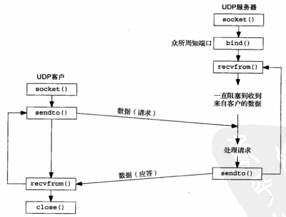
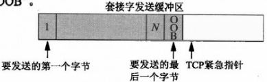
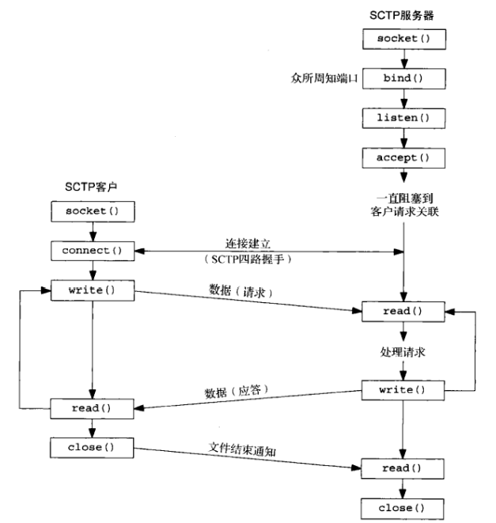
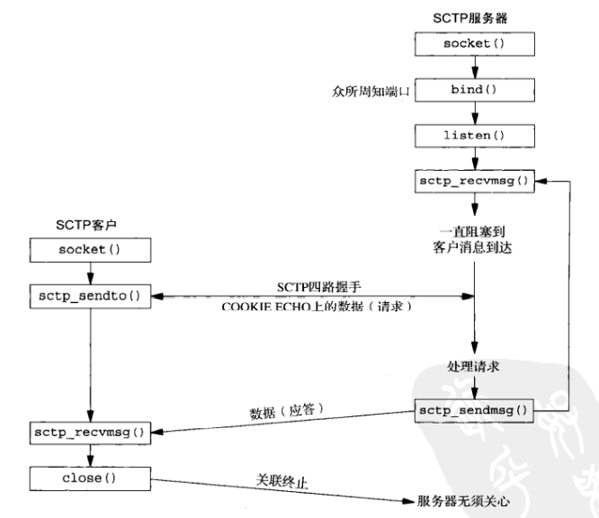

# 套接字编程

<!-- vim-markdown-toc GFM -->

* [套接字地址](#套接字地址)
    - [通用Unix套接字地址](#通用unix套接字地址)
    - [Unix IPv4套接字地址](#unix-ipv4套接字地址)
    - [Unix IPv6套接字地址](#unix-ipv6套接字地址)
    - [地址转换](#地址转换)
        + [地址传递](#地址传递)
        + [格式转换](#格式转换)
        + [名字与地址转换](#名字与地址转换)
        + [IPv4与IPv6互操作](#ipv4与ipv6互操作)
    - [不同套接字地址的比较](#不同套接字地址的比较)
* [套接字函数](#套接字函数)
    - [socket](#socket)
    - [connect](#connect)
    - [bind](#bind)
    - [listen](#listen)
    - [accept](#accept)
    - [close](#close)
    - [getsockname](#getsockname)
    - [getpeername](#getpeername)
    - [shutdown](#shutdown)
    - [fcntl](#fcntl)
    - [ioctl](#ioctl)
* [套接字选项](#套接字选项)
    - [getsockopt](#getsockopt)
    - [setsockopt](#setsockopt)
    - [IP选项](#ip选项)
    - [套接字/IP层套接字选项](#套接字ip层套接字选项)
    - [传输层的套接字选项汇总](#传输层的套接字选项汇总)
* [数据链路层访问](#数据链路层访问)
    - [数据链路套接字地址结构](#数据链路套接字地址结构)
    - [路由套接字编程](#路由套接字编程)
* [UDP套接字编程](#udp套接字编程)
    - [广播](#广播)
    - [多播](#多播)
* [TCP套接字编程](#tcp套接字编程)
    - [带外数据](#带外数据)
* [SCTP套接字编程](#sctp套接字编程)
    - [一对一模式](#一对一模式)
    - [一对多模式](#一对多模式)
* [原始套接字编程](#原始套接字编程)
    - [创建](#创建)
    - [输出](#输出)
    - [输入](#输入)
    - [POSIX API](#posix-api)
* [流编程](#流编程)
    - [POSIX API](#posix-api-1)
        + [getmsg](#getmsg)
        + [putmsg](#putmsg)
        + [getpmsg](#getpmsg)
        + [putpmsg](#putpmsg)
* [Unix域套接字编程](#unix域套接字编程)
    - [Unix域套接字地址结构](#unix域套接字地址结构)
    - [socketpair](#socketpair)
* [Windows套接字编程](#windows套接字编程)
    - [WSAStartup](#wsastartup)
    - [socket](#socket-1)
    - [inet_pton](#inet_pton)
    - [connect](#connect-1)
    - [bind](#bind-1)
    - [listen](#listen-1)
    - [accept](#accept-1)
    - [closesocket](#closesocket)
    - [示例](#示例)
        + [客户端/服务器示例](#客户端服务器示例)
* [总结](#总结)
    - [套接字编程范式](#套接字编程范式)
    - [套接字编程错误汇总](#套接字编程错误汇总)
    - [超时处理](#超时处理)
* [参考](#参考)

<!-- vim-markdown-toc -->


## 套接字地址

### 通用Unix套接字地址

```c++
#include <netinet/in.h>
struct sockaddr_storage {
    uint8_t     ss_len;
    sa_family_t ss_family;
};
```

### Unix IPv4套接字地址

```c++
#include <netinet/in.h>
struct in_addr {
    in_addr_t s_addr;           // 至少32位无符号整数类型
};
struct sockaddr_in {
    uint8_t         sin_len;    // 长度字段
    sa_family_t     sin_family; // 地址族; 任何无符号整数类型
    in_port_t       sin_port;   // TCP或UDP端口; 至少16位的无符号整数类型 
    struct in_addr  sin_addr;
    char		   sin_zero[8];
};
```

### Unix IPv6套接字地址

```c++
#include <netinet/in.h>
struct in6_addr {
    uint8_t s6_addr[16];
};
#defie SIN6_LEN
struct sockaddr_in6 {
    uint8_t          sin6_len;
    sa_family_t      sin6_family;
    in_port_t      	 sin6_port;
    uint32_t         sin6_flowinfo;
    struct in6_addr  sin6_addr;
    uint32_t         sin6_scope_id;
}
```

### 地址转换

#### 地址传递

1. 从进程到内核传递套接字地址结构的函数
   - `bind`
   - `connect`
   - `sendto`
2. 从内核到进程传递套接字地址结构的函数
   - `accept`
   - `recvfrom`
   - `getsockname`
   - `getpeername`

#### 格式转换


#### 名字与地址转换

TODO

#### IPv4与IPv6互操作

TODO

### 不同套接字地址的比较


## 套接字函数


### socket

```c++
#include <sys/socket.h>
int socket(int family, int type, int protocol)
```

- `family` 协议族

  | family   | 说明       |
  | -------- | ---------- |
  | AF_INET  | IPv4协议   |
  | AF_INET6 | IPv6协议   |
  | AF_LOCAL | Unix域协议 |
  | AF_ROUTE | 路由套接字 |
  | AF_KEY   | 密钥套接字 |

- `type` 套接字类型

  | type           | 说明           |
  | -------------- | -------------- |
  | SOCK_STREAM    | 字节流套接字   |
  | SOCK_DGRAM     | 数据报套接字   |
  | SOCK_SEQPACKET | 有序分组套接字 |
  | SOCK_RAW       | 原始套接字     |

- `protocol` 协议类型

  | protocol     | 说明         |
  | ------------ | ------------ |
  | IPPROTO_TCP  | TCP传输协议  |
  | IPPROTO_UDP  | UDP传输协议  |
  | IPPROTO_SCTP | SCTP传输协议 |

 - `返回值`

   成功：套接字描述符（非负）

   失败：-1

*创建套接字，返回套接字描述符*

|                | AF_INET    | AF_INET6   | AF_LOCAL | AF_ROUTE | AF_KEY |
| -------------- | ---------- | ---------- | -------- | -------- | ------ |
| SOCK_STREAM    | `TCP/SCTP` | `TCP/SCTP` | 是       |          |        |
| SOCK_DGRAM     | UDP        | UDP        | 是       |          |        |
| SOCK_SEQPACKET | SCTP       | SCTP       | 是       |          |        |
| SOCK_RAW       | IPv4       | IPv6       |          | 是       | 是     |

*套接字`family`与`type`可能的组合*

### connect

```c++
#include <sys/socket.h>
int connect(int sockfd, const struct sockaddr *servaddr, socklen_t addrlen)
```

- `sockfd` 套接字描述符

- `servaddr` 指向套接字的地址

- `addrlen` 套接字地址长度

- `返回值`

  成功：0

  失败：-1

*建立与TCP服务器的连接*

### bind

```c++
#include <sys/socket.h>
int bind(int sockfd, const struct sockaddr *myaddr, socklen_t addrlen)
```

- sockfd` 套接字

- `myaddr` 指向特定于协议的地址结构的指针

- `addrlen` 该地址结构的长度

- `返回值`

  成功：0

  失败：-1

*绑定地址（把一个本地协议地址赋予一个套接字）*

### listen

```c++
#include <sys/socket.h>
int listen(int sockfd, int backlog);
```

- `sockfd` 套接字

- `backlog` 待处理的套接字队列的最大长度

- `返回值`

  成功：0

  失败：-1

*监听套接字（把一个未连接的套接字转化为一个被动套接字，指示内核应接受指向该套接字的连接请求，同时设定排队的套接字队列的最大长度）*

### accept

```c++
#include <sys/socket.h>
int accept(int sockfd, struct sockaddr *cliaddr, socklen_t *addrlen);
```

- `sockfd` 监听套接字

- `cliaddr` 返回已连接的协议地址

- `addrlen` 返回已连接的协议地址长度

- `返回值`

  成功：一个全新的描述符

  失败：错误码

*接受连接（从已完成连接队列头返回下一个已完成连接，如果已完成连接队列为空，那么进程被投入睡眠）*

### close

```c++
#include <unistd.h>
int close(int sockfd);
```

- `sockfd` 套接字文件描述符

- `返回值`

  成功：0

  出错：-1

*将套接字标记为关闭，使它无法再被read或write调用*

### getsockname

```c++
#include <sys/socket.h>
int getsockname(int sockfd, struct sockaddr *localaddr, socklen_t *addrlen);
```

- `sockfd` 套接字文件描述符

- `localaddr` 本地协议地址

- `addrlen` 本地协议地址长度

- `返回值`

  成功：0

  失败：-1

*返回与套接字关联的本地协议地址*

### getpeername

```c++
#include <sys/socket.h>
int getpeername(int sockfd, struct sockaddr *peeraddr, socklen_t *addrlen);
```

- `sockfd` 套接字文件描述符

- `localaddr` 外地协议地址

- `addrlen` 外地协议地址长度

- `返回值`

  成功：0

  失败：-1

*返回与套接字关联的外地协议地址（getpeername）*

### shutdown

```c++
#include <sys/socket.h>
int shutdown(int sockfd, int howto);
```

- `sockfd`套接字文件描述符

- `howto`动作

  | 动作      | 说明                                                         |
  | --------- | ------------------------------------------------------------ |
  | SHUT_RD   | 关闭连接的读，丢弃接收缓冲区的数据。                         |
  | SHUT_WR   | 关闭连接的写，丢弃发送缓冲区的数据。                         |
  | SHUT_RDWR | 关闭连接的读和写，类似于调用1次`SHUT_RD`，又调用1次`SHUT_WR`。 |

- `返回值`

  成功：0

  失败：-1

*关闭连接*

### fcntl

```c++
#include <fcntl.h>
int fcntl(int fd, int cmd, ...)
```

- `fd` 文件描述符

- `cmd` 命令

- `返回值`

  成功：取决于cmd

  出错：-1

执行各种描述符控制操作。

### ioctl

```c++
#include <unistd.h>
int ioctl(int fd, int request, ...);
```

- `fd`套接字

- `request`请求

- `返回值`

  成功：0

  失败：-1

影响由fd引用的一个打开的文件。

| 操作                           | fcntl               | ioctl                | 路由套接字 | POSIX      |
| ------------------------------ | ------------------- | -------------------- | ---------- | ---------- |
| 设置套接字为非阻塞式`I/O`型    | F_SETFL, O_NONBLOCK | FIONBIO              |            | fcntl      |
| 设置套接字为信号驱动式`I/O`型  | F_SETFL, O_ASYNC    | FIOASYNC             |            | fcntl      |
| 设置套接字属主                 | F_SETOWN            | SIOCSPGRP或FIOSETOWN |            | fcntl      |
| 获取套接字属主                 | F_GETOWN            | SIOCGPGRP或FIOGETOWN |            | fcntl      |
| 获取套接字接收缓冲区中的字节数 |                     | FIONREAD             |            |            |
| 测试套接字是否处于带外标志     |                     | SIOCATMARK           |            | sockatmark |
| 获取接口列表                   |                     | SIOCGIFCONF          | sysctl     |            |
| 接口操作                       |                     | `SIOC[GS]IFxxx`      |            |            |
| ARP告诉缓存操作                |                     | SIOCxARP             | RTM_xxx    |            |
| 路由表操作                     |                     | SIOCxxxRT            | RTM_xxx    |            |


## 套接字选项

### getsockopt

```c++
#include <sys/socket.h>
int getsockopt(int sockfd, int level, int optname, void *optval, socklen_t *optlen);
```

- `sockfd`：套接字

- `level`：级别，指定系统中解释选项的代码或为通用套接字代码，或为某个特定于协议的代码

- `optname`：opt名字

- `optval`：指向一个变量

- `optlen`：指定optval的大小

- 返回值

  成功：0

  出错：-1

*获得套接字选项*

### setsockopt

```c++
#include <sys/socket.h>
int setsockopt(int sockfd, int level, int optname, const void *optval, socklen_t optlen);
```

- `sockfd`：套接字
- `level`：级别，指定系统中解释选项的代码或为通用套接字代码，或为某个特定于协议的代码
- `optname`：opt名字
- `optval`：指向一个opt变量
- `optlen`：指定optval的大小
- 返回值
  - 成功：0
  - 出错：-1

*设置套接字选项*

### IP选项

TODO

### 套接字/IP层套接字选项

| level（级别）              | optname（选项名）                                            | 数据类型                                                     | 说明                                                         |
| -------------------------- | ------------------------------------------------------------ | :----------------------------------------------------------- | ------------------------------------------------------------ |
| SOL_SOCKET                 | SO_BROADCAST<br>SO_DEBUG<br>SO_DONTROUTE<br>SO_ERROR<br>SO_KEEPALIVE<br>SO_LINGER<br>SO_OOBINLINE<br>SO_RCVBUF<br>SO_SNDBUF<br>SO_RCVLOWAT<br>SO_SNDLOWAT<br>SO_RCVTIMEO<br>SO_SNDTIMEO<br>SO_REUSEADDR<br>SO_REUSEPORT<br>SO_TYPE<br>SO_USELOOPBACK | int<br>int<br>int<br>int<br>int<br>linger<br>int<br>int<br>int<br>int<br>int<br>timeval<br>timeval<br>int<br>int<br>int<br>int | - 允许发送广播数据报<br>- 开启调试跟踪<br>- 绕过外出路由表查询<br>- 获取待处理错误并清除<br>- 周期性测试连接是否仍存活<br>- 若有数据待发送则延迟关闭<br>- 让接收到的带外数据继续在线留存<br>- 接收缓冲区大小<br>- 发送缓冲区大小<br>- 接收缓冲区低水位标记<br>- 发送缓冲区低水位标记<br>- 接收超时<br>- 发送超时<br>- 允许重用本地地址<br>- 允许重用本地端口<br>- 取得套接字类型<br>- 路由套接字取得所发送数据的副本 |
| IPPROTO_IP                 | IP_HDRINCL<br>IP_OPTIONS<br>IP_RECVDSTANDDR<br>IP_RECVIF<br>IP_TOS<br>IP_TTL<br><br>IP_MULTICAST_IF<br>IP_MULTICAST_TTL<br>IP_MULTICAST_LOOP<br>IP_ADD_MEMBERSHIP<br>IP_DROP_MEMBERSHIP<br>IP_BLOCK_SOURCE<br>IP_UNBLOCK_SOURCE<br>IP_ADD_SOURCE_MEMBERSHIP<br>IP_DROP_SOURCE_MEMBERSHIP | int<br>(见正文)<br>int<br>int<br>int<br>int<br><br>in_addr{}<br>u_char<br>u_char<br>ip_mreq{}<br>ip_mreq{}<br>ip_mreq_source{}<br>ip_mreq_source{}<br>ip_mreq_source{}<br>ip_mreq_source{} | - 随数据包含的IP首部<br>- IP首部选项<br>- 返回目的IP地址<br>- 返回接收接口索引<br>- 服务类型和优先权<br>- 存活时间<br><br>- 指定外出接口<br>- 指定外出TTL<br>- 指定是否环回<br>- 加入多播组<br>- 离开多播组<br>- 阻塞多播组<br>- 开通多播组<br>- 加入源特定多播组<br>- 离开源特定多播组 |
| IPPROTO_ICMPV6             | ICMP6_FILTER                                                 | ivmp6_filter{}                                               | - 指定待传递的ICMPv6消息类型                                 |
| IPPROTO_IPV6               | IPV6_CHECKSUM<br>IPV6_DONTFRAG<br>IPV6_NEXTHOP<br>IPV6_PATHMTU<br>IPV6_RECVDSTOPTS<br>IPV6_RECVHOPLIMIT<br>IPV6_RECVHOPOPTS<br>IPV6_RECVPATHMTU<br>IPV6_RECVPKTINFO<br>IPV6_RECVRTHDR<br>IPV6_RECVTCLASS<br>IPV6_UNICAST_HOPS<br>IPV6_USE_MIN_MTU<br>IPV6_V60NLY<br>IPV6_XXX<br><br>IPV6_MULTICAST_IP<br>IPV6_MULTICAST_HOPS<br>IPV6_MULTICAST_LOOP<br>IPV6_JOIN_GROUP<br>IPV6_LEAVE_GROUP | int<br>int<br>sockaddr_in6{}<br>ip6_mtuinfo{}<br>int<br>int<br>int<br>int<br>int<br>int<br>int<br>int<br>int<br>int<br>(见正文)<br><br>u_int<br>int<br>u_int<br>ipv6_mreq{}<br>ipv6_mreq{} | - 用于原始套接字的校验和字段偏移<br>- 丢弃大的分组而非将其分片<br>- 指定下一跳地址<br>- 获取当前路径MTU<br>接收目的地址选项<br>- 接收单播跳限<br>- 接收步跳选项<br>- 接收路径MTU<br>- 接收分组信息<br>- 接收源路径<br>- 接收流通类型<br>- 默认单播跳限<br>- 使用最小MTU<br>- 禁止v4兼容<br>- 粘附性辅助数据<br><br>- 指定外出接口<br>- 指定外出跳限<br>- 指定是否环回<br>- 加入多播组<br>- 离开多播组 |
| IPPROTO_IP<br>IPPROTO_IPV6 | MCAST_JOIN_GROUP<br>MCAST_LEAVE_GROUP<br>MCAST_BLOCK_SOURCE<br>MCAST_UNBLOCK_SOURCE<br>MCAST_JOIN_SOURCE_GROUP<br>MCAST_LEAVE_SOURCE_GROUP | group_req{}<br>group_source_req{}<br>group_source_req{}<br>group_source_req{}<br>group_source_req{}<br>group_source_req{} | - 加入多播组<br>- 离开多播组<br>- 阻塞多播源<br>- 开通多播源<br>- 加入源特定多播组<br>- 离开源特定多播组 |

### 传输层的套接字选项汇总

| level（级别） | optname（选项名）                                            | 数据类型                                                     | 说明                                                         |
| ------------- | ------------------------------------------------------------ | ------------------------------------------------------------ | ------------------------------------------------------------ |
| IPPROTO_TCP   | TCP_MAXSEG<br>TCP_NODELAY                                    | int<br>int                                                   | - TCP最大分节大小<br>- 禁止Nagle算法                         |
| IPPROTO_SCTP  | SCTP_ADAPTION_LAYER<br>SCTP_ASSOCINFO<br>SCTP_AUTOCLOSE<br>SCTP_DEFAULT_SEND_PARAM<br>SCTP_DISABLE_FRAGMENTS<br>SCTP_EVENTS<br>SCTP_GET_PEER_ADDR_INFO<br>SCTP_I_WANT_MAPPED_V4_ADDR<br>SCTP_INITMSG<br>SCTP_MAXBURST<br>SCTP_MAXSEG<br>SCTP_NODELAY<br>SCTP_PEER_ADDR_PARAMS<br>SCTP_PRIMARY_ADDR<br>SCTP_RTOINFO<br>SCTP_SET_PEER_PRIMARY_ADDR<br>SCTP_STATUS | sctp_setadaption{}<br/>sctp_assocparams{}<br/>int<br/>sctp_sndrcvinfo{}<br/>int<br/>sctp_event_subscribe{}<br/>sctp_paddrinfo{}<br/>int<br/>sctp_initmsg{}<br/>int<br/>int<br/>int<br/>sctp_paddrparams{}<br/>sctp_setprim{}<br/>sctp_rtoinfo{}<br/>sctp_setpeerprim{}<br/>sctp_status{} | - 适配层指示<br>- 检查并设置关联信息<br>- 自动关闭操作<br>- 默认发送参数<br>- SCTP分片<br>- 感兴趣事件的通知<br>- 获取对端地址状态<br>- 映射的v4地址<br>- 默认的INIT参数<br>- 最大猝发大小<br>- 最大分片大小<br>- 禁止Nagle算法<br>- 对端地址参数<br>- 主目的地址<br>- RTO信息<br>- 对端的主目的地址<br>- 获取关联状态 |


## 数据链路层访问

### 数据链路套接字地址结构

```c++
struct sockaddr_dl {
    uint8_t     sdl_len;
    sa_family_t sdl_family;
    uint16_t    sdl_index;
    uint8_t     sdl_type;
    uint8_t     sdl_nlen;
    uint8_t     sdl_alen;
    uint8_t     sdl_slen;
    char        sdl_data[12];
};
```

### 路由套接字编程

```c++
#include <sys/param.h>
#include <sys/sysctl.h>
int sysctl(int *name, u_int namelen, void *oldp, size_t *oldlenp,
           void *newp, size_t newlen);
```

- `name`名字（整数数组）

  - AF_INET：获取或设置影响网际网协议的变量。

  - AF_LINK：获取或设置链路层信息（如：PPP接口的数目）。

  - AF_ROUTE：返回路由表或接口列表的信息

    sysctl在AF_ROUTE域返回的信息：

    | name[] | 返回IPv4路由表 | 返回IPv4 ARP高速缓存 | 返回IPv6路由表 | 返回接口清单  |
    | ------ | -------------- | -------------------- | -------------- | ------------- |
    | 0      | CTL_NET        | CTL_NET              | CTL_NET        | CTL_NET       |
    | 1      | AF_ROUTE       | AF_ROUTE             | AF_ROUTE       | AF_ROUTE      |
    | 2      | 0              | 0                    | 0              | 0             |
    | 3      | AF_INET        | AF_INET              | AF_INET6       | 0             |
    | 4      | NET_RT_DUMP    | NET_RT_FLAGS         | NET_RT_DUMP    | NET_RT_IFLIST |
    | 5      | 0              | RTF_LLINFO           | 0              | 0             |

  - AF_UNSPEC：获取或设置一些套接字层变量（如：套接字发送或接收缓冲区的最大大小）。

- `namelen`数组长度

- `oldp`供内核存放名字的缓冲区

  可能包含以下信息：

  1. NET_RT_DUMP：返回由name[3]指定的地址族的路由表。如果所指定的地址族为0，那么返回所有地址族的路由表。
  2. NET_RT_FLAGS：返回由name[3]指定的地址族的路由表，但是仅限于带标示与由name[5]指定的标志相匹配的路由表项。路由表中所有ARP高速缓存表项均设置了RTF_LLINFO标志位。
  3. NET_RT_IFLIST：返回所有已配置接口的信息。

- `oldlenp`供内核存放名字的缓冲区大小

- `newp`缓冲区

- `newlen`缓冲区大小

- `返回值`

  成功：0

  失败：-1

检查路由表和接口列表，创建路由套接字。


## UDP套接字编程



```c++
#include <sys/socket.h>
size_t recvfrom(int sockfd, void *buff, size_t nbytes, int flags, struct sockaddr *from, socklen_t *addrlen)
```

- `sockfd` 描述符

- `buff` 缓冲区指针

- `nbytes` 读字节数

- `from` 发送者地址

- `addrlen` 地址长度

- `返回值`

  成功：读字节数

  失败：-1

*收消息*（recvfrom需要设置超时选项，否则会一直阻塞下去）。

```c++
#include <sys/socket.h>
ssize_t sendto(int sockfd, const void *buff, size_t nbytes, int flags, const struct sockaddr *to, socklen_t *addrlen)
```

- `sockfd` 描述符

- `buff` 缓冲区指针

- `nbytes` 读/写字节数

- `flags` 参数

- `to` 接收者地址

- `addrlen` 地址长度

- `返回值`

  成功：写字节数

  失败：-1

*发消息*

### 广播

TODO

### 多播

TODO


## TCP套接字编程

TODO

### 带外数据



*应用进程写入1字节带外数据后的套接字发送缓冲区*

```c++
#include <sys/socket.h>
int sockatmark(int sockfd);
```

- `sockfd`套接字描述符

- `返回值`

  1：处于带外标记

  0：不处于带外标记

  -1：失败

*确定套接字是否处于带外标记*


## SCTP套接字编程

### 一对一模式



### 一对多模式




## 原始套接字编程

原始套接字提供普通的TCP和UDP套接字所不提供的以下能力：

- 进程可以读与写ICMPv4，IGMPv4和ICMPv6等分组。
- 进程可以读写内核不处理其协议字段的IPv4数据报。
- 进程还可以使用IP_HDRINCL套接字选项自行构造IPv4首部。

### 创建

1. 把第二个参数指定为SOCK_RAW并调用socket函数，以创建一个原始套接字；第三个参数（协议）通常不为0。

   例：

   ```c++
   int sockfd;
   sockfd = socket(AF_INET, SOCK_RAW, protocol);
   ```

2. 可以在原始套接字上开启IP_HDRINCL套接字选项。

   例：

   ```c++
   const int on = 1;
   if (setsockopt(sockfd, IPPROTO_IP, IP_HDRINCL, &on, sizeof(on)) < 0)
       // 出错处理
   ```

3. 可以在原始套接字上调用bind函数，用于设置从这个原始套接字发送的所有数据报的源IP地址（只在IP_HDRINCL套接字选项未开启的前提下）。

4. 可以在这个原始套接字上调用connect函数，用于设置外地地址。

### 输出

原始套接字的输出遵循以下规则：

- 普通输出通过调用sendto或sendmsg并指定目的IP地址完成。如果套接字已经连接，那么也可以调用write，writev或send。

- 如果IP_HDRINCL套接字选项未开启，那么由进程让内核发送的数据的起始地址指的是IP首部之后的第一个字节，因为内核将构造IP首部并把它置于来自进程的数据之前。内核把所构造IPv4首部的协议字段设置成来自socket调用的第三个参数。

- 如果IP_HDRINCL套接字选项已开启，那么由进程让内核发送的数据的起始地址指的是IP首部的第一个字节。进程调用输出函数写出的数据量必须包括IP首部的大小。整个IP首部由进程构造。

  注意事项：

  1. IPv4标识字段可置为0，从而告知内核设置该值；
  2. IPv4首部校验和字段总是由内核计算并存储；
  3. IPv4选项字段是可选的。

- 内核会对超出外出接口MTU的原始分组执行分片。

IPv6原始套接字与IPv4相比存在如下差异：

- 通过IPv6原始套接字发送和接受的协议首部中的所有字段均采用网络字节序；
- IPv6不存在与IPv4的IP_HDRINCL套接字选项类似的东西。通过IPv6原始套接字无法读入或写出完整的IPv6分组（包括IPv6首部和任何扩展首部）。IPv6首部的几乎所有字段以及所有扩展首部都可以通过套接字选项或辅助数据由应用进程指定或获取。如果应用进程需要读入或写出完整的IPv6数据报，那就必须使用数据链路访问。
- IPv6原始套接字的校验和处理存在差异。

### 输入

内核把接收到的IP数据报传递到原始套接字规则：

- 接收到的UDP分组和TCP分组和TCP分组绝不传递到任何原始套接字。
- 大多数ICMP分组在内核处理完其中的ICMP消息后传递到原始套接字。
- 所有IGMP分组在内核完成处理其中的IGMP消息后传递到原始套接字。
- 内核不认识其协议字段的所有IP数据报传递到原始套接字。
- 如果某个数据报以片段形式到达，那么在它的所有片段均到达且重组出该数据报之前，不传递任何片段分组到原始套接字。

内核对每个原始套接字均执行以下3个测试，只有这3个测试结果为真，内核才把接收到的数据报地送到这个套接字：

- 如果创建这个原始套接字时制定了非0的协议参数（socket的第三个参数），那么接收到的数据报的协议字段必须匹配该值，否则该数据报不递送到这个套接字。
- 如果这个原始套接字已由bind调用绑定了某个本地IP地址，那么接收到的数据报的目的IP地址必须匹配这个绑定地址，否则该数据报不递送到这个套接字。
- 如果这个原始套接字已由connect调用指定了某个外地IP地址，那么接收到的数据报的源IP地址必须匹配这个已连接地址，否则该数据报不递送到这个套接字。

### POSIX API

```c++
#include <netinet/icmp6.h>
void ICMP6_FILTER_SETPASSALL(struct icmp6_filter *filt); // 指定所有消息类型都传递到应用进程
void ICMP6_FILTER_SETBLOCKALL(struct icmp6_filter *filt); // 指定不传递任何消息类型
void ICMP6_FILTER_SETPASS(int msgtype struct icmp6_filter *filt); // 放行某个指定消息类型到应用进程的传递
void ICMP6_FILTER_SETBLOCK(int msgtype, struct icmp6_filter *filt); // 阻止某个指定消息类型的传递
int ICMP6_FILTER_WILLPASS(int msgtype, const struct icmp6_filter *filt); // 判断消息类型是否被过滤器放行
int ICMP6_FILTER_WILLBLOCK(int msgtype, const struct icmp6_filter *filt);// 判断消息类型是否被过滤器阻止
```


## 流编程


*TCP/IP基于流的实现*

### POSIX API

```c++
struct strbuf {
    int   maxlen;
    int   len;
    char *buf;
};
```

#### getmsg

```c++
#include <stropts.h>
int getmsg(int fd, struct strbuf *ctlptr, struct strbuf *dataptr, int *flagsp);
```

- `fd`文件描述符

- `ctlptr`控制信息

- `dataptr`数据

- `flagsp`标志指针

  | flagsp   | 说明         |
  | -------- | ------------ |
  | 0        | 普通消息     |
  | RS_HIPRI | 高优先级消息 |

*接收控制信息和数据。*

#### putmsg

```c++
#include <stropts.h>
int putmsg(int fd, const struct strbuf *ctlptr, const struct strbuf *dataptr, int flags);
```

- `fd`文件描述符

- `ctlptr`控制信息

- `dataptr`数据

- `flags`标志

*发送控制信息和数据。*

#### getpmsg

```c++
#include <stropts.h>
int getpmsg(int fd, struct strbuf *ctlptr, struct strbuf *dataptr, int *bandp, int *flagsp);
```

- `fd`文件描述符
- `ctlptr`控制信息
- `dataptr`数据
- `bandp`优先级带
- `flagsp`标志

*接收带优先级的控制信息和数据。*

#### putpmsg

```c++
#include <stropts.h>
int putpmsg(int fd, const struct strbuf *ctlptr, const struct strbuf *dataptr, int band, int flags);
```

- `fd`文件描述符
- `ctlptr`控制信息
- `dataptr`数据
- `bandp`优先级带
- `flagsp`标志

*发送带优先级的控制信息和数据。*


## Unix域套接字编程

### Unix域套接字地址结构

```c++
struct sockaddr_un {
    sa_family_t sun_family;
    char        sun_path[104];
};
```

### socketpair

```c++
#include <sys/socket.h>
int socketpair(int family, int type, int protocol, int sockfd[2]);
```

- `family`协议族（必须为AF_LOCAL）

- `type`类型（为SOCK_STREAM或SOCK_DGRAM中的一个）

- `protocol`协议（必须为0）

- `sockfd`用于返回新创建的套接字描述符

- `返回值`

  成功：非0

  失败：-1

*创建两个随后连接起来的套接字*


## Windows套接字编程

### WSAStartup

TODO

加载winsock DLL。

### socket

TODO

### inet_pton

TODO

### connect

TODO

### bind

TODO

### listen

TODO

### accept

TODO

### closesocket

TODO

### 示例

#### 客户端/服务器示例

client.cpp：

```c++
#include <winsock2.h>
#include <WS2tcpip.h>
#include <iostream>
#include <stdlib.h>

// 链接WS2_32
#pragma comment(lib, "ws2_32.lib")

#define BUFSIZE 4096 // 缓冲区大小

int main(int argc, char *argv[])
{
	WSADATA wsd;
	SOCKET sock;
	char buf[BUFSIZE];
	int ret;
	struct sockaddr_in serv_addr;
	unsigned short port;
	struct hostent *host = NULL;

	// 加载指定版本的dll
	if (WSAStartup(MAKEWORD(2, 2), &wsd) != 0) {
		std::cout << "初始化失败!!!" << std::endl;
		return 1;
	}

	// 创建socket
	sock = socket(AF_INET, SOCK_STREAM, IPPROTO_TCP);
	if (sock == INVALID_SOCKET) {
		std::cout << "创建socket失败" << std::endl;
		return 1;
	}

	// 指定服务器地址
	serv_addr.sin_family = AF_INET;
	serv_addr.sin_port = htons(10086);
	inet_pton(AF_INET, "localhost", (void*)&serv_addr.sin_addr.S_un.S_addr);
	//serv_addr.sin_addr.s_addr = inet_addr("localhost"); // inet_addr已废弃

	// 与服务器建立连接
	if (connect(sock, (struct sockaddr*)&serv_addr, sizeof(serv_addr)) == SOCKET_ERROR) {
		std::cout << "connect()失败" << std::endl;
		return 1;
	}

	// 收发消息
	for (;;) {
		gets_s(buf);
		// 向服务器发送消息
		ret = send(sock, buf, strlen(buf), 0);
		if (ret == 0)
			break;
		else if (ret == SOCKET_ERROR) {
			std::cout << "send()失败" << std::endl;
		}
		buf[ret] = '\0';
		std::cout << "recv :" << ret << " bytes:" << buf;
	}

	// 关闭socket，释放资源
	closesocket(sock);
	WSACleanup();
	system("pause");

    return 0;
}
```

serv.cpp：

```c++
#include <winsock2.h>
#include <WS2tcpip.h>
#include <iostream>
#include <stdlib.h>

#pragma comment(lib, "ws2_32.lib")

#define DEFAULT_BUFFER 4096 // 缓冲区大小

// 与客户机通信的线程函数
DWORD WINAPI ClientThread(LPVOID lpParam)
{
	SOCKET sock = (SOCKET)lpParam;
	char buf[DEFAULT_BUFFER];
	int ret, nleft, idx;
	while (true) {
		// 接收消息
		ret = recv(sock, buf, DEFAULT_BUFFER, 0);
		if (ret == 0)
			break;
		else if (ret == SOCKET_ERROR) {
			std::cout << "recv() 失败：" << WSAGetLastError();
			break;
		}
		buf[ret] = '\0';
		std::cout << "recv: " << buf; // 打印消息

		nleft = ret;
		idx = 0;
		while (nleft > 0) {
			// 发送回应消息
			ret = send(sock, &buf[idx], nleft, 0);
			if (ret == 0)
				break;
			else if (ret == SOCKET_ERROR) {
				std::cout << "send() 失败：" << WSAGetLastError();
				break;
			}
			nleft -= ret;
			idx += ret;
		}
	}
	return 0;
}

int main()
{
	WSADATA wsd;
	HANDLE hThread;
	DWORD dwThread;
	SOCKET sListen, sClient;
	int AddrSize;
	unsigned short port;
	struct sockaddr_in local, client;

	// 加载winsock dll
	if (WSAStartup(MAKEWORD(2, 2), &wsd) != 0) {
		std::cout << "winsock 初始化失败" << std::endl;
		return 1;
	}

	// 创建socket
	sListen = socket(AF_INET, SOCK_STREAM, IPPROTO_IP);
	if (sListen == SOCKET_ERROR) {
		std::cout << "socket() 失败:" << WSAGetLastError();
		return 1;
	}
	local.sin_family = AF_INET;
	local.sin_addr.s_addr = htonl(INADDR_ANY);
	port = 10086;
	local.sin_port = htons(port);

	// 绑定socket
	if (bind(sListen,
		(struct sockaddr*)&local,
		sizeof(local)) == SOCKET_ERROR) {
		std::cout << "bind() 失败:" << WSAGetLastError();
		return 1;
	}
	// 打开监听
	listen(sListen, 0);

	// 监听端口，创建线程
	while (true) {
		AddrSize = sizeof(client);
		// 监听是否有连接请求
		sClient = accept(sListen, (struct sockaddr*)&client, &AddrSize);
		if (sClient == INVALID_SOCKET) {
			std::cout << "accept() 失败：" << WSAGetLastError();
			break;
		}
		// 创建线程
		hThread = CreateThread(NULL, 0, ClientThread, (LPVOID)sClient, 0, &dwThread);
		if (hThread == NULL) {
			std::cout << "CreateThread() 失败：" << GetLastError();
			break;
		}
		// 处理完后关闭
		CloseHandle(hThread);
	}
	closesocket(sListen);
	WSACleanup();

	system("pause");

    return 0;
}
```


## 总结

### 套接字编程范式

1. 当系统负载较轻时，没来一个客户请求现场派生一个子进程为之服务的传统并发服务器程序模型就足够了。
2. 相比传统的每个客户fork一次的设计范式，预先创建一个子进程池或一个线程池的设计范式能够把进程控制CPU时间降低10倍或以上。
3. 某些实现允许多个子进程或线程阻塞在同一个accept调用中，另一些实现却要求包绕accept调用安置某种类型的锁加以保护。文件上锁或Pthread互斥锁上锁都可以使用。
4. 让所有子进程或线程自行调用accept通常比让父进程或主线程独自调用accept并把描述符传递给子进程或线程来的简单而快速。
5. 让所有子进程或线程阻塞在同一个accept调用中币让它们阻塞在同一个select调用中更可取。
6. 使用线程通常远快于使用进程。

### 套接字编程错误汇总

| 错误                      | 说明                                                         |
| ------------------------- | ------------------------------------------------------------ |
| EADDRINUSE                | Address already in use，地址已使用                           |
| ECONNREFUSED              | 这是一种**硬错误（hard error）**。若对客户的SYN的响应是RST（表示复位），则表明该服务器主机在我们指定的端口上没有进程在等待与之连接。客户一接收到RST就马上返回ECONNREFUSED错误。RST是TCP在发生错误时发送的一种TCP分节。产生RST的三个条件：<br>  1.目的地为某端口的SYN到达，然而该端口上没有正在监听的服务器<br>  2.TCP想取消一个已有连接<br>  3.TCP接收到一个根本不存在的连接上的分节 |
| ETIMEDOUT                 | TCP客户没有收到SYN分节的响应。                               |
| `distination unreachable` | 这是一种**软错误（soft error）**。客户主机内核保存该消息，并按第一种情况中所述的时间间隔继续发送SYN。若在某个规定的时间（4.4BSD规定75s）后仍未收到响应，则把保存的消息（即ICMP错误）作为EHOSTUNREACH或ENETUNREACH错误返回给进程。以下两种情形也是有可能的：<br>  1.按照本地系统的转发表，根本没有到达远程系统的路径。<br>  2.connect调用根本不等待就返回。 |

### 超时处理

TODO


## 参考

[1] (美)W.Richard Stevens, (美)Bill Fenner, (美)Andrew M Rudoff . Unix网络编程 卷一:套接字联网api . 3th Edition

[2] (美)Anthony Jones, Jim Ohlund . windows网络编程 . 2ED

[3] [windows下的socket网络编程](https://www.cnblogs.com/oloroso/p/4613296.html)

