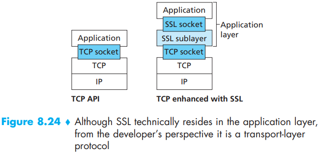

# SSL

[TOC]

SSL is often used to provide security to transactions that take place over HTTP. However, because SSL secures TCP, it can be employed by any application that runs over TCP. SSL provides a simple Application Programming Interface (API) with sockets, which is similar and analogous to TCP’s API. When an application wants to employ SSL, the application includes SSL classes/libraries.

## Reference

[1] James F. Kurose, Keith W. Ross . Computer Networking: A Top-Down Approach . 6ED