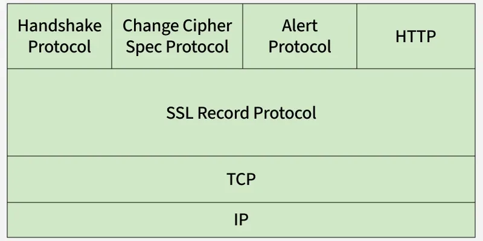
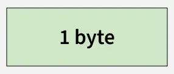
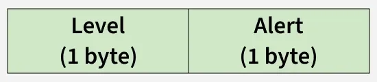

## SSL/TLS

[TOC]

## Secure Socket Layer (SSL)

Secure Sockets Layer (SSL) is an Internet security protocol that encrypts data to ensure secure communication between devices over a network. SSL provides privacy, authentication, and data integrity for online communications. SSL is the predecessor of TLS (Transport Layer Security), which is now the standard protocol for secure communications on the Internet.

SSL ensures secure communication through three main mechanisms:

1. Encryption: Data transmitted over the network is encrypted, preventing unauthorized parties from reading it. If intercepted, encrypted data appears as an unreadable jumble of characters.
2. Authentication: SSL uses a handshake process to authenticate both the client and server, ensuring each party is legitimate and not an imposter.
3. Data Integrity: SSL digitally signs transmitted data to detect any tampering, ensuring that the data received is exactly what was sent.

### Protocol

#### Handshake Protocol

Establishes SSL sessions and authenticates clients and servers by 4 phases:

1. Client and server exchange hello packets, protocol versions, and cipher suites.
2. The server sends its certificate and server key information.
3. Client responds with its certificate and key exchange.
4. Change Cipher Spec finalizes the handshake, activating secure communication.

#### Change-Cipher Spec Protocol

- Signals that pending cryptographic parameters from the handshake should now become active.
- Consists of a single 1-byte message.

#### Alert Protocol

- Communicates SSL-related warnings or errors.
- Warning alerts (level 1): Non-critical issues, such as expired or unsupported certificates.
- Fatal alerts (level 2): Critical errors, such as handshake failures, bad record MAC, or illegal parameters, which terminate the connection.

#### SSL Record Protocol

- Provides confidentiality and message integrity.
- Application data is divided into fragments, optionally compressed, and appended with a Message Authentication Code (MAC).
- The data is then encrypted and transmitted with an SSL header.

### Certificates

SSL certificates are digital certificates issued by trusted Certificate Authorities (CAs) to secure and verify websites.

Types of SSL certificates:

1. Single-Domain: Secures one domain.
2. Wildcard: Secures one domain and all its subdomains.
3. Multi-Domain: Secures multiple unrelated domains in one certificate.

Validation Levels:

- Domain Validation (DV): Confirms domain ownership.
- Organization Validation (OV): Confirms the organization's identity.
- Extended Validation (EV): Rigorous verification, highest trust level, often indicated by a green address bar.

## Transport Layer Security (TLS)

The `Transport Layer Security (TLS)` is the successor to SSL and is designed to provide improved security and efficiency. TLS was developed as an enhancement of SSL to address various vulnerabilities and to incorporate modern cryptographic techniques.

### SSL/TLS Handshake

## Summary

### SSL vs TLS

|                             SSL                              |                             TLS                              |
| :----------------------------------------------------------: | :----------------------------------------------------------: |
|             SSL stands for Secure Socket Layer.              |           TLS stands for Transport Layer Security.           |
|             It supports the Fortezza algorithm.              |         It does not support the Fortezza algorithm.          |
|                    It is the 3.0 version.                    |                    It is the 1.0 version.                    |
| In SSL( Secure Socket Layer), the Message Digest is used to create a master secret. | In TLS(Transport Layer Security), a Pseudo-random function is used to create a master secret. |
| In SSL( Secure Socket Layer), the Message Authentication Code protocol is used. | In TLS(Transport Layer Security), the Hashed Message Authentication Code protocol is used. |
|    It is more complex than TLS(Transport Layer Security).    |                   It is simpler than SSL.                    |
| It is less secured as compared to TLS(Transport Layer Security). |                  It provides high security.                  |
|               It is less reliable and slower.                | It is highly reliable and upgraded. It provides less latency. |
|                   It has been deprecated.                    |                   It is still widely used.                   |
|       It uses a port to set up an explicit connection.       |     It uses a protocol to set up an implicit connection.     |

## References

[1] James F. Kurose; Keith W. Ross. COMPUTER NETWORKING: A Top-Down Approach. 6ED

[2] [Secure Socket Layer (SSL)](https://www.geeksforgeeks.org/computer-networks/secure-socket-layer-ssl/)

[3] [Secure Socket Layer (SSL) vs. Transport Layer Security (TLS)](https://www.geeksforgeeks.org/computer-networks/difference-between-secure-socket-layer-ssl-and-transport-layer-security-tls/)

[4] [Transport Layer Security (TLS) Handshake](https://www.geeksforgeeks.org/computer-networks/transport-layer-security-tls-handshake/)

[5] [Transport Layer Security (TLS)](https://www.geeksforgeeks.org/computer-networks/transport-layer-security-tls/)