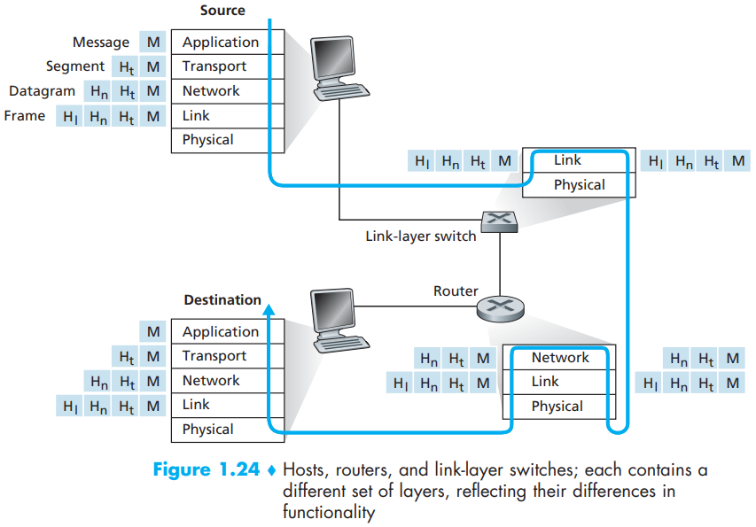
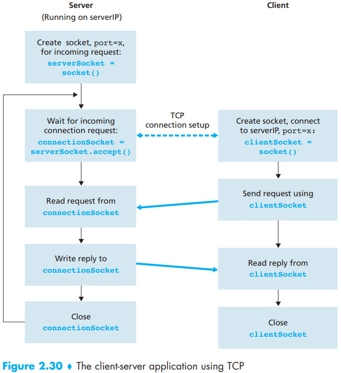
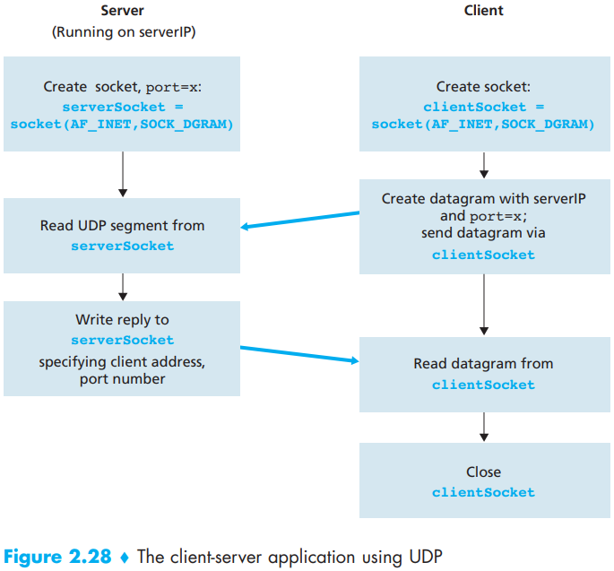

# Network Summary

[TOC]

## OSI Reference Model

### Layer

7-layer ISO OSI reference model:

| Number | Name         | Desc |
| ------ | ------------ | ---- |
| 7      | Application  |      |
| 6      | Presentation |      |
| 5      | Session      |      |
| 4      | Transport    |      |
| 3      | Network      |      |
| 2      | Link         |      |
| 1      | Physical     |      |

5-layer Internet protocol stack:

| Number | Name        | Desc |
| ------ | ----------- | ---- |
| 5      | Application |      |
| 4      | Transport   |      |
| 3      | Network     |      |
| 2      | Link        |      |
| 1      | Physical    |      |

## Socket Programming

### TCP

### UDP

