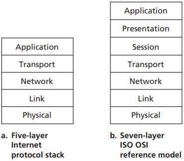
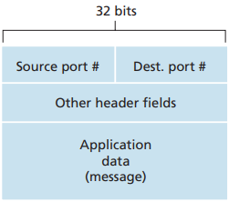
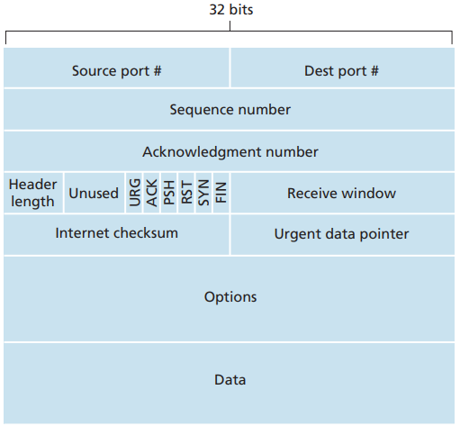
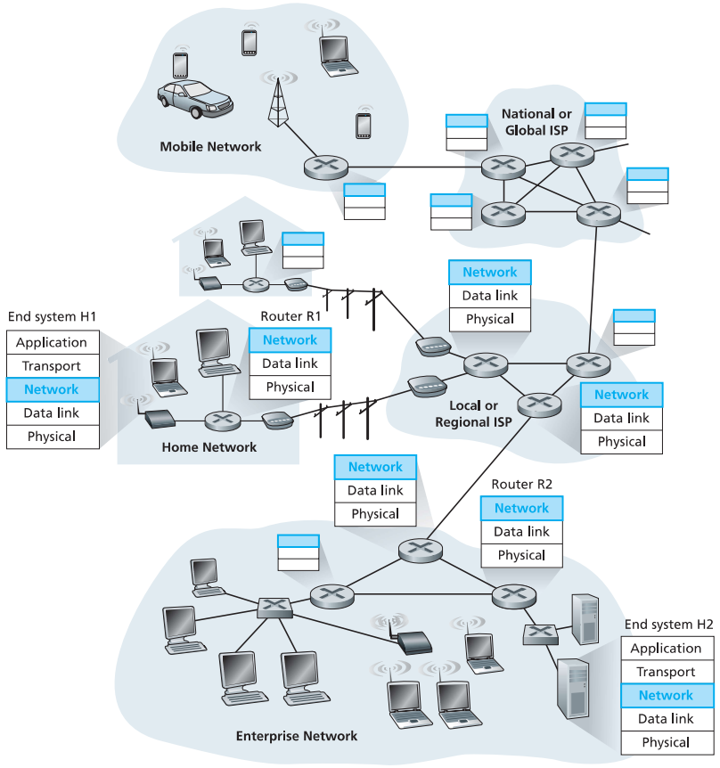
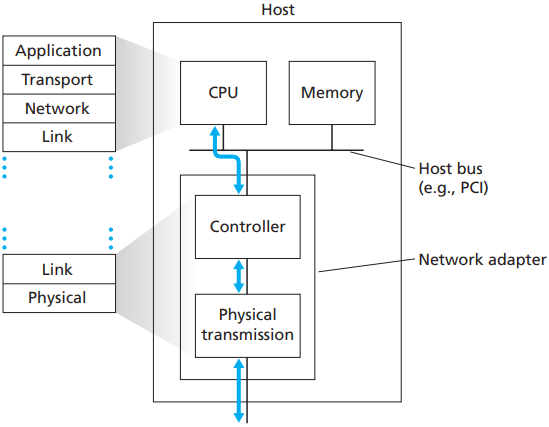

# Network Summary

[TOC]

## OSI Reference Model

7-layer OSI reference model:

| Number | Name         | Desc |
| ------ | ------------ | ---- |
| 7      | Application  |      |
| 6      | Presentation |      |
| 5      | Session      |      |
| 4      | Transport    |      |
| 3      | Network      |      |
| 2      | Link         |      |
| 1      | Physical     |      |

5-layer Internet protocol stack:

| Number | Name        | Desc |
| ------ | ----------- | ---- |
| 5      | Application |      |
| 4      | Transport   |      |
| 3      | Network     |      |
| 2      | Link        |      |
| 1      | Physical    |      |

### Application Layer

The application architecture, on the other hand, is designed by the application developer and dictates how the application is structured over the various end systems.

### Transport Layer

A transport-layer protocol provides for `logical communication` between application processes running on different hosts.

*Source and destination port-number fields in a transport-layer segment*

*TCP segment structure*

### Network Layer

*The network layer*

### Link Layer

The link layer is implemented in a `network adapter`, also sometimes known as a `network interface card (NIC)`.

*Network adapter: its relationship to other host components and to protocol stack functionality*

## Socket Programming

### TCP

### UDP

## Protocol

A protocol defines the format and the order of messages exchanged between two or more communicating entities, as well as the actions taken on the transmission and/or receipt of a message or other event.

## Reference

[1] James F. Kurose, Keith W. Ross . COMPUTER NETWORKING: A Top-Down Approach . 6ED
