English | [中文版](summary_zh.md)

# Network Summary

[TOC]

## Network Topology

### Mesh Topology

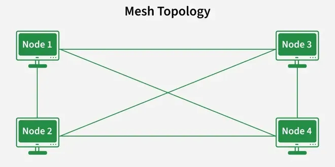

### Star Topology

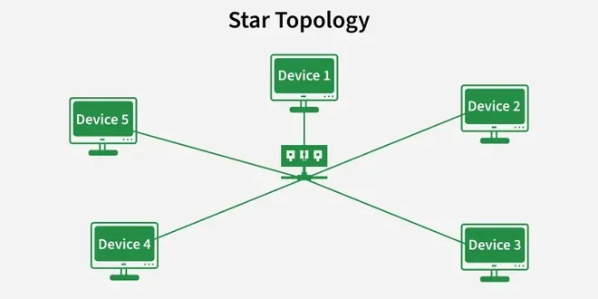

### Bus Topology

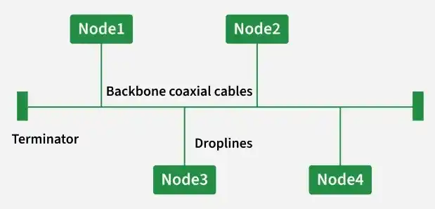

### Ring Topology

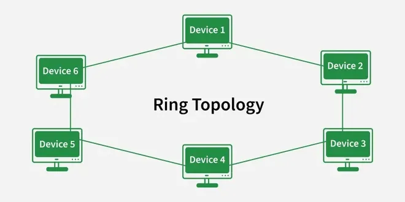

### Tree Topology

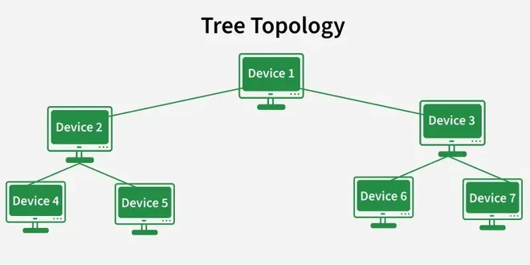

### Hybrid Topology

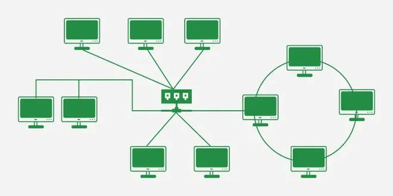

### Point to Point Topology

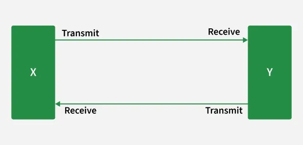

### Daisy Chain Topology

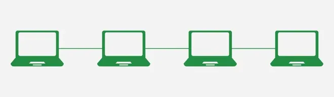

---

## OSI Reference Model

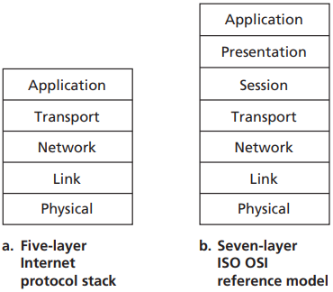

7-layer OSI reference model:

| Number | Name         | Desc |
| ------ | ------------ | ---- |
| 7      | Application  |      |
| 6      | Presentation |      |
| 5      | Session      |      |
| 4      | Transport    |      |
| 3      | Network      |      |
| 2      | Link         |      |
| 1      | Physical     |      |

5-layer Internet protocol stack:

| Number | Name        | Desc |
| ------ | ----------- | ---- |
| 5      | Application |      |
| 4      | Transport   |      |
| 3      | Network     |      |
| 2      | Link        |      |
| 1      | Physical    |      |

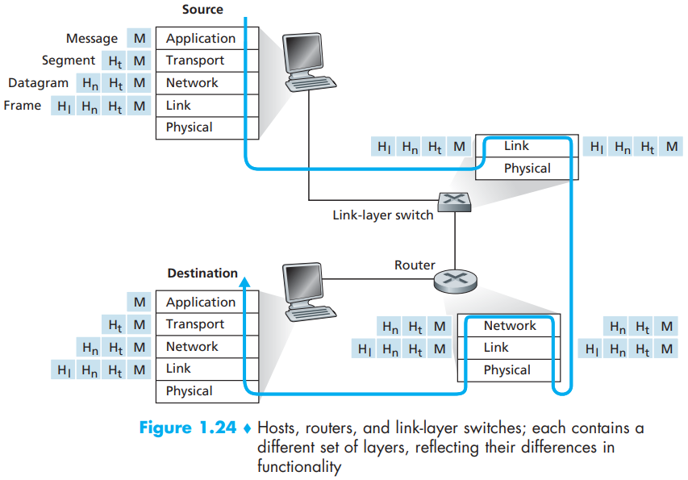

### Application Layer

The application architecture, on the other hand, is designed by the application developer and dictates how the application is structured over the various end systems.

### Transport Layer

A transport-layer protocol provides for `logical communication` between application processes running on different hosts.

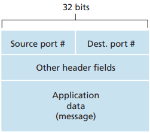

*Source and destination port-number fields in a transport-layer segment*

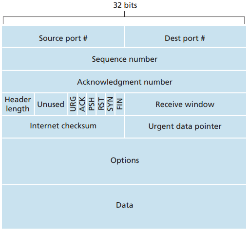

*TCP segment structure*

### Network Layer

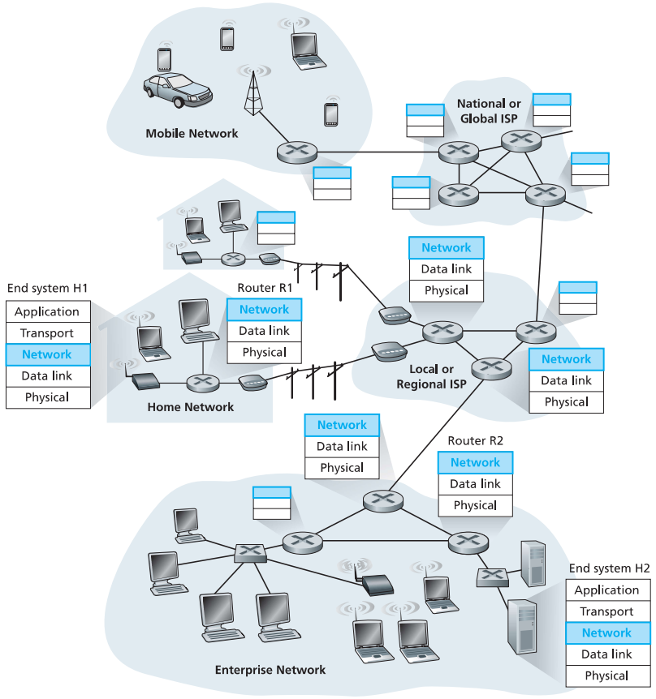

*The network layer*

### Link Layer

The link layer is implemented in a `network adapter`, also sometimes known as a `network interface card (NIC)`.

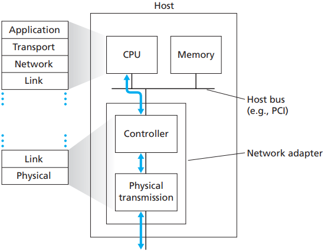

*Network adapter: its relationship to other host components and to protocol stack functionality*

---

## Socket Programming

### TCP

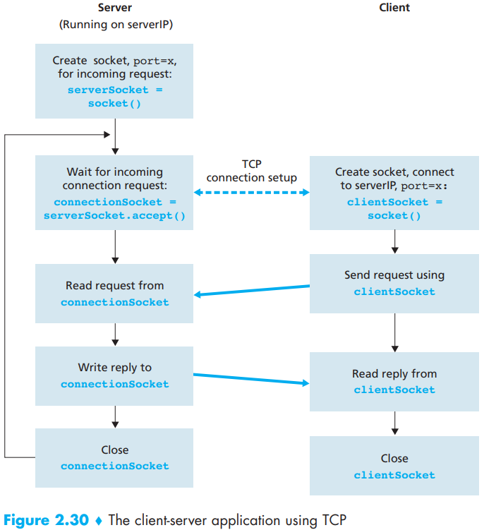

### UDP

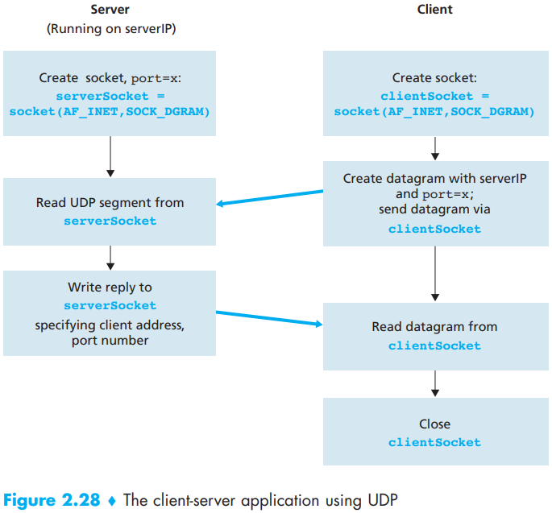

---

## SSL/TLS

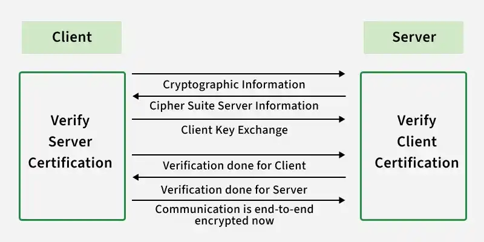

---

## Protocol

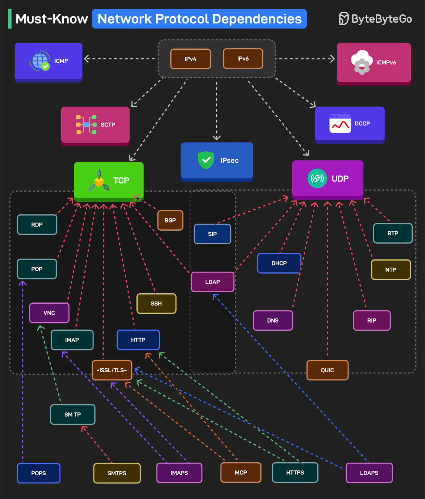

A protocol defines the format and the order of messages exchanged between two or more communicating entities, as well as the actions taken on the transmission and/or receipt of a message or other event.

## Summary

### TCP vs UDP

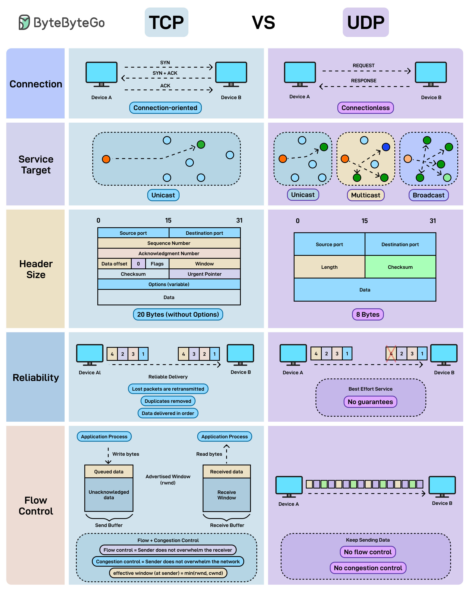

TCP: Connection-oriented and reliable. It ensures ordered, duplicate-free delivery with flow and congestion control, making it ideal for web browsing, email, and file transfers.

UDP: Connectionless and lightweight. It sends packets without guarantees of delivery or order, but with minimal overhead. It is perfect for gaming, streaming, and real-time communication.

## Reference

[1] James F. Kurose, Keith W. Ross . COMPUTER NETWORKING: A Top-Down Approach . 6ED

[2] [EP158: How to Learn API Development](https://blog.bytebytego.com/p/ep158-how-to-learn-api-development)

[3] [8 Popular Network Protocols](https://blog.bytebytego.com/p/ep195-common-network-protocols-every)

[4] [TCP vs UDP](https://blog.bytebytego.com/i/175237895/tcp-vs-udp)
