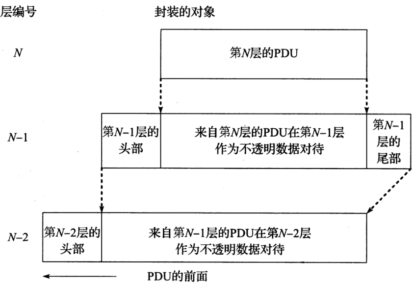
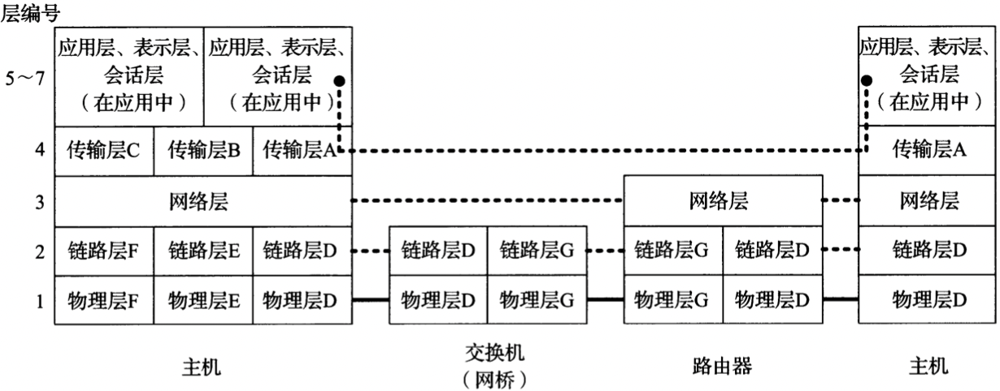
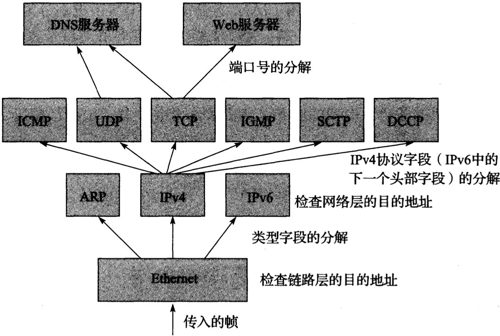
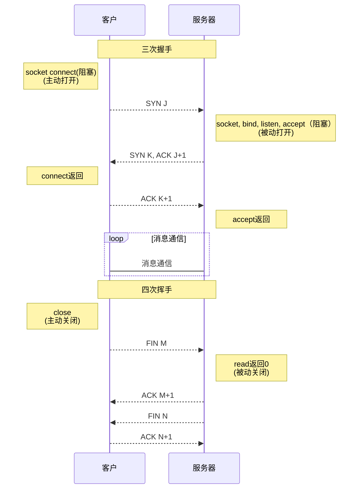
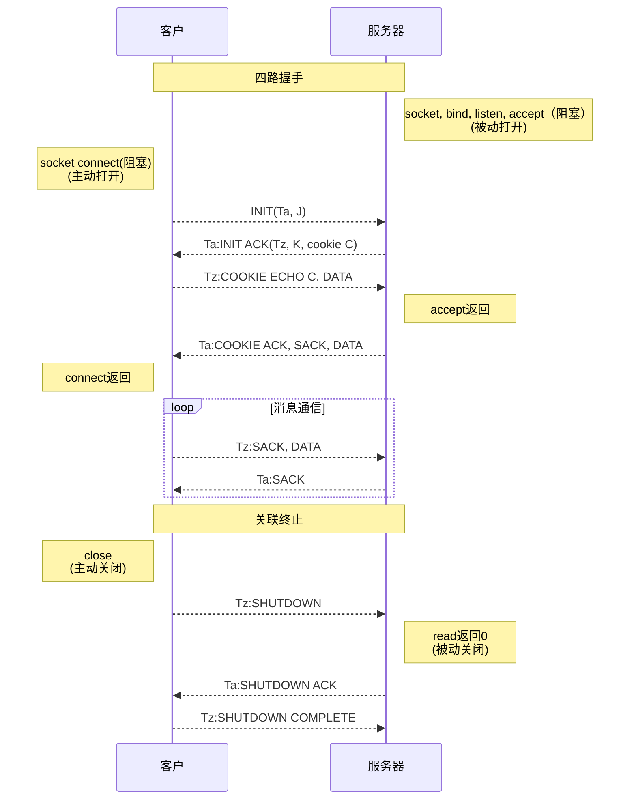
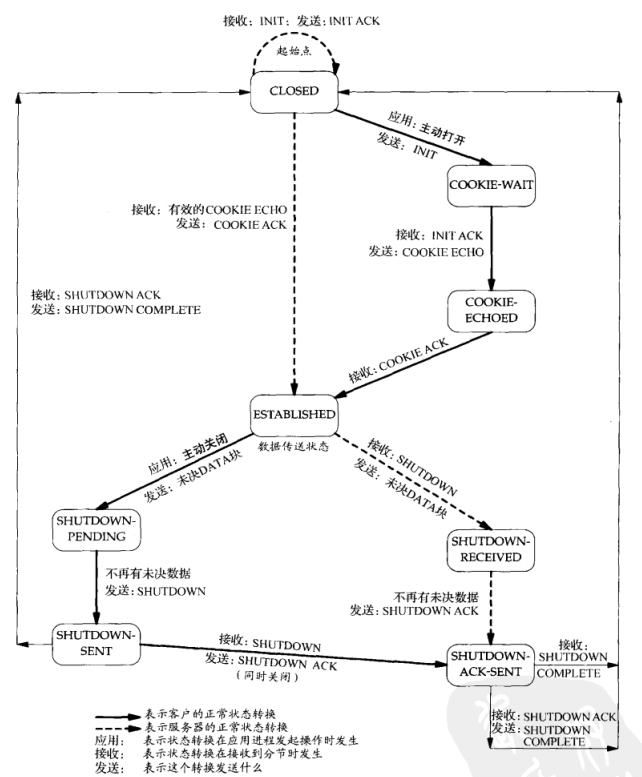

# 网络

[TOC]

## OSI模型

### 分层

| 编号 | 名称   | 描述/例子                                                    |
| ---- | ------ | ------------------------------------------------------------ |
| 7    | 应用层 | 指定完成某些用户初始化任务的方法。应用协议通常由应用开发者设计和实现。例子包括：FTP，Skype等 |
| 6    | 表示层 | 指定针对应用的数据表示格式和转换规则的方法。典型的例子如字符从EBCDIC转换为ASCII码（但现在很少关注）。加密有时与本层相关，但也可在其它层中 |
| 5    | 会话层 | 指定由多个连接组成一个通信会话的方法。它可能包括关闭连接，重启连接和检查点进程。`ISO X.225`是一个会话层协议 |
| 4    | 传输层 | 指定运行在相同计算机系统中的多个程序之间的连接或关联的方法。如果在其它地方没有实现，本层可能实现可靠的投递（例如TCP，ISO TP4） |
| 3    | 网络层 | 指定经过潜在不同类型链路层网络的多跳通信方法。对于分组网络，它描述了抽象的分组格式和标准的编址结构（例如IPv4，IPv6，X.25 PLP, ISO CLNP） |
| 2    | 链路层 | 指定经过单一链路通信的方法，包括多个系统共享同一介质时的“介质访问”控制协议。本层通常包括差错检测和链路层地址格式（例如以太网，Wi-Fi，ISO 13239/HDLC） |
| 1    | 物理层 | 指定连接器，数据速率和如何在某些介质上进行位编码。本层也描述低层的差错检测和纠正，频率分配。（例如V.92，以太网1000ASE-T，SONET/SDH） |

### 封装

*封装通常和分层一起使用。单纯的封装设计获得某层的PDU，并在低层将它作为不透明（无须解释）的数据来处理。封装发生在发送方，拆封（还原操作）发生在接收方。多数协议在封装过程中使用头部，少数协议也使用尾部*

### 传输

*不同的网络设备实现协议栈的不同子集。端主机通常实现所有层。路由器实现传输层之下的各层。这种理想化的结构经常被破坏，这是由于路由器和交换机通常包括类似于主机的功能（例如管理和建立），因为他们需要实现所有层，即使游戏层很少使用*

## TCP/IP协议族结构和协议

### ARPANET参考模型

| 编号 | 名称             | 描述/例子                                                    |
| ---- | ---------------- | ------------------------------------------------------------ |
| 7    | 应用层           | 实质上是Internet兼容的任何应用，包括网页（HTTP），DNS，DHCP  |
| 4    | 传输层           | 提供在抽象的，由应用管理的“端口”之间的数据交换。可能包括差错和流量控制。例子：TCP，UDP，SCTP，DCCP |
| 3.5  | 网络层 (辅助) | 协助完成网络层设置，管理和安全的非正式的“层”。例子：ICMP，IGMP，IPsec |
| 3    | 网络层           | 定义抽象的数据报和提供路由。例子包括IP（32位地址，最大64KB）和IPv6（128位地址，扩大到最大4GB） |
| 2.5  | 链路层 (辅助) | 用于网络层到基于多接入链路层网络的链路层的地址映射的非正式的“层”。例子：ARP |

*基于ARM或TCP/IP的协议分层被用于Internet。这里没有正式的会话或表示层。另外，这里有几个不适合归入标准层的“附属”或辅助协议，它们为其它协议的运行提供重要功能。其中有些协议没有被IPv6使用（例如IGMP和ARP）*

### TCP/IP中的复用，分解和封装

*TCP/IP协议栈将地址信息和协议分解标识符相结合，以决定一个数据报是否被正确接收，以及哪个实体将会处理该数据报。有几层还会检测数值（例如检验和），以保证内容在传输中没有损坏*

### IP

TODO

### 端口

`端口号` 16位的非负整数（0～65535），每个IP地址有65535个可用端口。

| 端口范围      | 说明                                                         |
| ------------- | ------------------------------------------------------------ |
| `0～1023`     | 熟知端口号；这些端口由IANA分配和控制。                       |
| `1024~49151`  | 注册端口号；这些端口不受IANA控制，不过由IANA登记并提供他们的使用情况清单，以方便整个群体。 |
| `49152~65535` | 动态/私有端口号；俗称临时端口。                              |

## TCP

### 消息分组交换

### 状态转换

## SCTP

### 消息分组交换

### 状态转移

