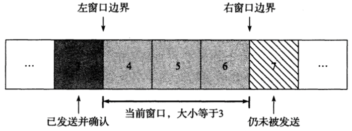

[TOC]

# TCP协议

ARQ(Automatic Repeat Request，自动重复请求)

ACK(acknowledgment， 确认)

RTT(round-trip-time estimation， 往返时间估计)

## 头部

- `源端口` (16bit)

  与IP头部中的源地址组合成一个端点(endpoint)，用于唯一标识发送方。

- `目的端口` (16bit)

  与IP头部中的目的地址组合成一个端点(endpoint)，用于唯一标识接收方。

- `序列号` (32bit)

  Sequence Number，标识TCP发送端到TCP接收端的数据流的一个字节，该字节代表着包含该序列号的报文段的数据中的第一个字节。

- `确认号` (32bit)

  Acknowledgment Number，发送方期待接收的下一个序列号。

- `头部长度` (4bit)

  定义了头部的长度，长度单位为字（32bit）；TCP头部被限制为60字节，不带选项的TCP头部大小为20字节。

- `保留字段`(4bit)

- `CWR`(1bit) 

  缩小拥塞窗口，发送方用来降低它的发送速率

- `ECE`(1bit)

  ECN回显，发送方收到了一个更早的拥塞通告

- `URG`(1bit) 

  紧急，让`紧急指针`生效，很少使用

- `ACK`(1bit)

  确认，让`确认号字段`生效，建立连接后启用

- `PSH`(1bit) 

  推送

- `RST`(1bit) 

  重置连接 

- `SYN`(1bit) 

  初始化同步序号

- `FIN`(1bit)

  发送数据结束

- `窗口大小`(16bit)

  用来通告窗口大小（单位：字节数，最大65535字节），实现流量控制

- `TCP校验和`(16bit)

  强制性的，由发送方进行计算和保存，由接收方验证。

- `紧急指针`(16bit)

  Urgent Pointer，只有当`URG`字段被设置时生效；

- `选项`(变长)

## 滑动窗口

## 连接的建立与终止

TODO

### 半关闭

TODO

### 同时打开与关闭

TODO

## 状态转移

### TIME_WAIT状态

TIME_WAIT状态有2个存在的理由:

- 可靠地实现TCP全双工连接的终止；
- 允许老的重复分节在网络中消逝；

TIME_WAIT过多怎么处理？

## 用例

