[中文版](tcp_zh.md) | English

# TCP Protocol

[TOC]

TCP provides a *connection-oriented*, reliable byte stream service.

## Terminology

- ARQ (Automatic Repeat Request)
- ACK (Acknowledgment)
- RTT (Round-trip-time estimation)

## Encapsulation

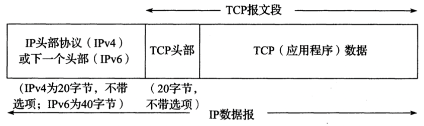

*The TCP header immediately follows the IP header or IPv6 extension header, usually 20 bytes long (without TCP options). With options, the TCP header can be up to 60 bytes. Common options include Maximum Segment Size, Timestamp, Window Scaling, and Selective ACK.*

## Header

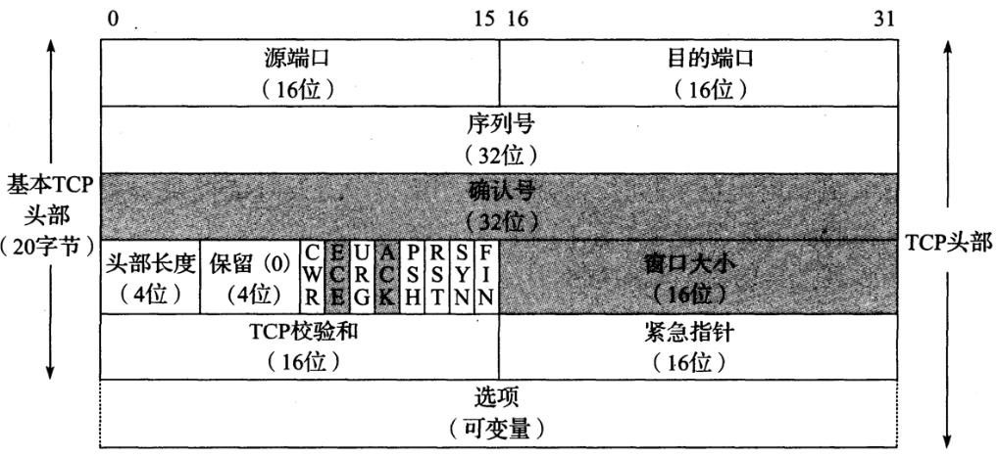

- `Source Port` Combined with the source address in the IP header to form an endpoint, uniquely identifying the sender.
- `Destination Port` Combined with the destination address in the IP header to form an endpoint, uniquely identifying the receiver.
- `Sequence Number` Identifies a byte in the data stream from the TCP sender to the TCP receiver; this byte represents the first byte of data in the segment containing this sequence number.
- `Acknowledgment Number` The next sequence number the sender expects to receive.
- `Header Length` Defines the length of the header in 32-bit words; the TCP header is limited to 60 bytes, and the size without options is 20 bytes.
- `Reserved`
- `CWR` Congestion Window Reduced, used by the sender to reduce its sending rate.
- `ECE` ECN Echo, indicates the sender has received an earlier congestion notification.
- `URG` Urgent, makes the `Urgent Pointer` field valid, rarely used.
- `ACK` Acknowledgment, makes the `Acknowledgment Number` field valid, enabled after connection establishment.
- `PSH` Push
- `RST` Reset connection
- `SYN` Initialize sequence number
- `FIN` End of data transmission
- `Window Size` Used to advertise the window size (in bytes, max 65535), implements flow control.
- `TCP Checksum` Mandatory, calculated and stored by the sender, verified by the receiver.
- `Urgent Pointer` Only valid when the `URG` field is set.
- `Options` (variable length)

  | Kind | Length | Name           | Description & Purpose                |
  | ---- | ------ | -------------- | ------------------------------------ |
  | 0    | 1      | EOL            | End of option list                   |
  | 1    | 1      | NOP            | No operation (used for padding)      |
  | 2    | 4      | MSS            | Maximum Segment Size                 |
  | 3    | 3      | WSOPT          | Window scaling factor (left shift)   |
  | 4    | 2      | SACK-Permitted | Sender supports SACK option          |
  | 5    | var    | SACK           | SACK block (received out-of-order)   |
  | 8    | 10     | TSOPT          | Timestamp option                     |
  | 28   | 4      | UTO            | User timeout (terminate after idle)  |
  | 29   | var    | TCP-AO         | Authentication option (various algos)|
  | 253  | var    | Experimental   | Reserved for experimental use        |
  | 254  | var    | Experimental   | Reserved for experimental use        |

### 4-tuple Demultiplexing

TCP uses 4-tuple demultiplexing to obtain segments, including:

- Destination IP address
- Destination port
- Source IP address
- Source port

These four together form the local and remote node information.

## Connection Establishment and Termination

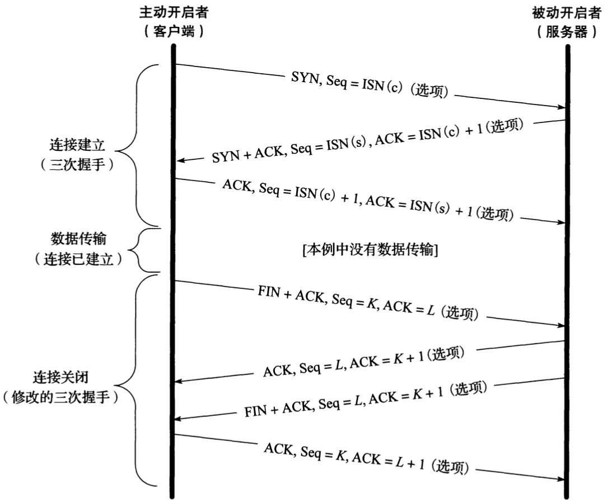

*A typical TCP connection establishment and termination. Usually, the client initiates a three-way handshake. During this process, the client and server exchange their initial sequence numbers using SYN segments (including the client's and server's initial sequence numbers). After both sides send a FIN packet and receive the corresponding ACK from the other, the connection is terminated.*

### Establishing a Connection

1. The client sends a SYN segment (sets the SYN flag), specifying the port and initial sequence number ISN(c).
2. The server sends a SYN segment, including initial sequence number ISN(s), ACK = ISN(c)+1.
3. Sends ACK = ISN(s)+1 segment.

### Closing a Connection

1. The client sends a FIN segment, including: sequence number (K), and an ACK segment to acknowledge the last data (L) sent by the peer.
2. The server sets ACK to K+1, indicating it has received the client's FIN segment.
3. The server sends its own FIN, sequence number L, indicating it has finished sending data.
4. The client sends an ACK to acknowledge the previous FIN.

### Half-Close Operation

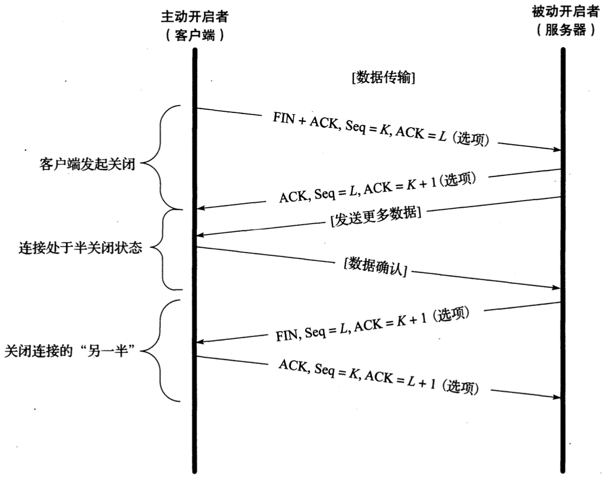

*In a TCP half-close operation, one direction of the connection is closed, while the other direction continues to transmit data until it is also closed; (rarely used by applications)*

### Simultaneous Open and Close

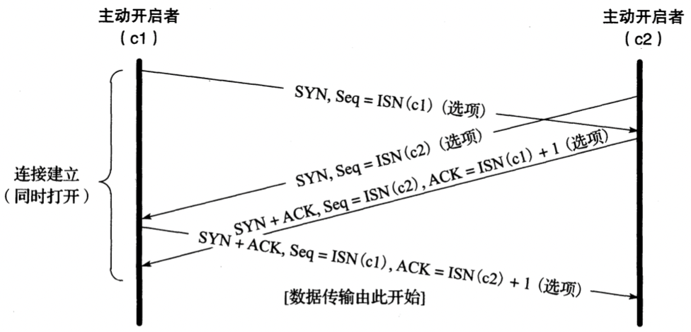

*Segments exchanged during simultaneous open. Compared to normal connection establishment, one more segment is needed. The SYN bit remains set until an ACK is received.*

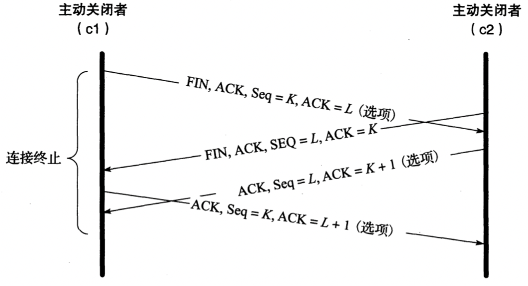

*Segments exchanged during simultaneous close. Similar to normal close, but the order of segments is interleaved.*

## State Transitions

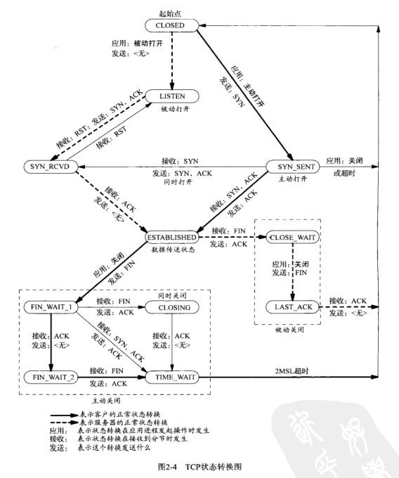

### Half-Open State

If one side closes or terminates the connection without notifying the other, the TCP connection is considered to be in a `half-open state`.

### TIME_WAIT State

The `TIME_WAIT` state, also known as `2MSL wait state` or `double wait`, means TCP will wait for twice the Maximum Segment Lifetime (MSL).

There are two reasons for the TIME_WAIT state:

- To reliably implement full-duplex connection termination.
- To allow old duplicate segments to disappear from the network.

Factors affecting the 2MSL wait state:

1. When TCP performs an active close and sends the final ACK, the connection must remain in TIME_WAIT for twice the MSL. This allows TCP to retransmit the final ACK if needed. Retransmitting the final ACK is not because TCP retransmits ACKs (they do not consume sequence numbers and are not retransmitted by TCP), but because the peer may retransmit its FIN (which does consume a sequence number).
2. While in the wait state, both sides define the connection (client IP, client port, server IP, server port) as unusable.
   Only after the 2MSL wait ends, or a new connection uses an initial sequence number greater than the previous instance, or timestamps are used to distinguish segments from previous connections, can the connection be reused.

There are mechanisms to bypass the 2MSL limit, such as the `SO_REUSEADDR` socket option...

**Quiet Time**: [RFC0793] states that after a crash or restart, TCP should wait for one MSL before creating a new connection; this period is called *quiet time*.

How to handle too many TIME_WAIT states?

### FIN_WAIT_2 State

In the FIN_WAIT_2 state, one TCP endpoint has sent a FIN and received an ACK. Unless a half-close occurs, this endpoint will wait for the peer application to recognize the end-of-file notification and close its end, causing a FIN to be sent. Only after this close (and the FIN is received) does the closing TCP move from FIN_WAIT_2 to TIME_WAIT. This means one side can remain in this state indefinitely. The other side may also remain in CLOSE_WAIT indefinitely until the application decides to close.

## Window Management

### Sliding Window

Each active TCP connection maintains the following windows:

- Send window structure
- Receive window structure

#### Send Window

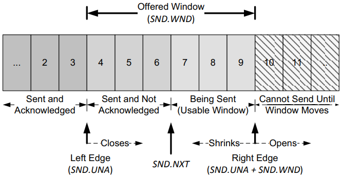

- `Advertised window` The window advertised by the receiver
- `Usable window` The amount of data that can be sent immediately, value = $SND.UNA + SND.WND - SND.NXT$

The TCP sender's sliding window structure records acknowledged, in-flight, and unsent data sequence numbers. The size of the advertised window is controlled by the window size field in the ACK from the receiver.

Window boundaries move:

- `Close` Left boundary moves right as sent data is acknowledged, reducing the window.
- `Open` Right boundary moves right as acknowledged data is processed and the receiver's buffer increases, enlarging the window.
- `Shrink` Right boundary moves left.

#### Receive Window

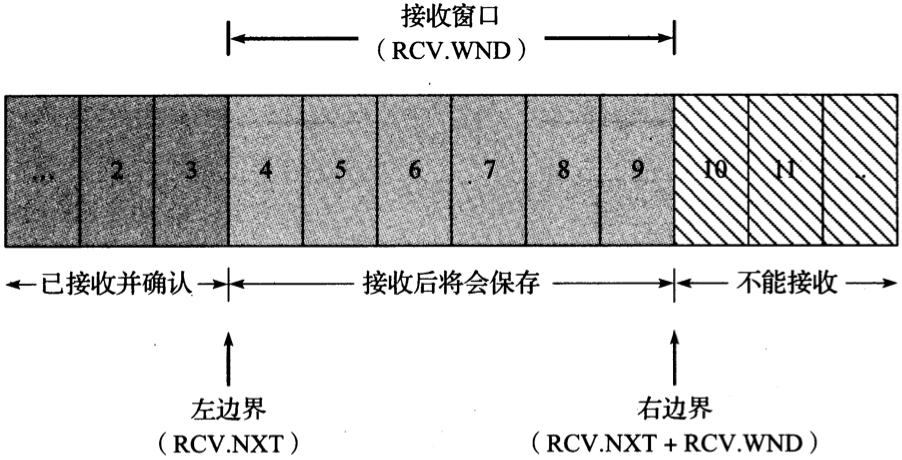

The TCP receiver's sliding window structure helps track the next expected data sequence number. If received data is within the window, it is stored; otherwise, it is discarded.

### Segmented Window

TODO

### Congestion Window

`Congestion window (cwnd)` reflects the network's transmission capacity.

`Flight size` is the amount of data sent but not yet acknowledged.

`Optimal window size` is the amount of data that can be stored in the network, close to the bandwidth-delay product (BDP), calculated as RTT times the minimum path rate (the bottleneck between sender and receiver).

The sender's actual usable window $w$ is calculated as: $W = min(cwnd, awnd)$

- $awnd$ Receiver's advertised window
- $cwnd$ Congestion window

### Flow Control

Flow control: forces the sender to slow down when the receiver can't keep up. There are two methods:

- Rate-based flow control: Specifies a rate for the sender, ensuring data never exceeds this rate; suitable for streaming applications.
- Window-based flow control: Uses a sliding window, with a variable window size; the sender uses **window advertisement** or **window update** to adjust the window size.

## Congestion Control

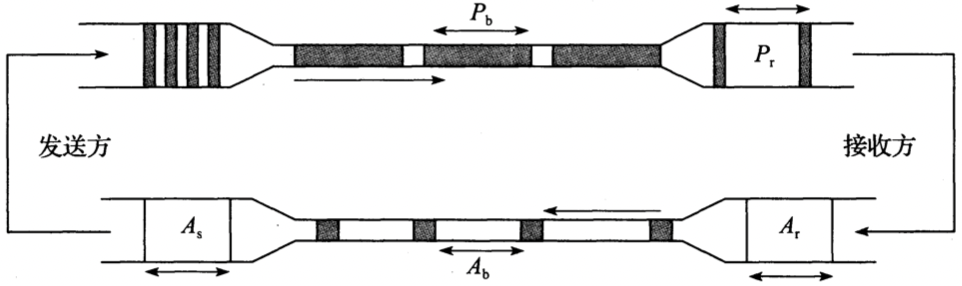

TCP congestion control operates based on the principle of packet conservation. Due to limited transmission capacity, packets ($P_b$) are "stretched" as needed. The receiver generates ACKs at intervals ($A_r$) after receiving packets at intervals ($P_r$), and returns them at intervals ($A_b$). When ACKs arrive at the sender at intervals ($A_s$), they signal the sender to continue sending data. In steady state, the system can be "self-synchronizing".

### Congestion Detection

- Packet loss analysis
- Delay measurement
- Explicit Congestion Notification (ECN)

### Nagle Algorithm

`Nagle Algorithm`: When a TCP connection has data in flight (sent but unacknowledged), small segments (less than SMSS) cannot be sent until all in-flight data is acknowledged. After receiving an ACK, TCP collects small data and sends them in one segment. This forces TCP to follow a stop-and-wait protocol—only after all in-flight data is acknowledged can it send more. The algorithm achieves self-clocking: the faster ACKs return, the faster data is sent. In high-latency WANs, reducing small packets is more important, and this algorithm reduces the number of segments sent per unit time. RTT controls the sending rate.

Example:

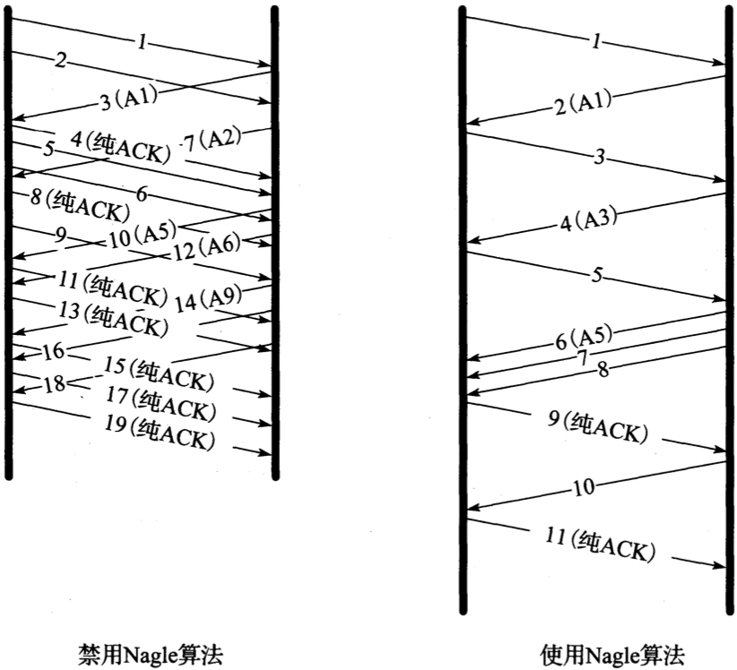

*With Nagle enabled, at most one packet is in flight at any time, reducing small packets but increasing latency;*

#### Delayed ACK and Nagle Deadlock

Combining delayed ACK and Nagle can cause a kind of `deadlock` (both sides wait for the other), leaving the connection idle and degrading performance. This deadlock is not permanent; it is resolved when the delayed ACK timer expires. Example:

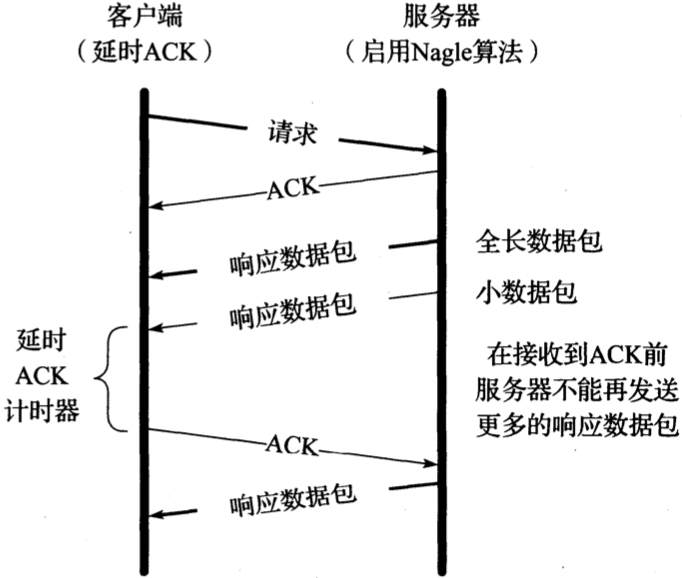

#### Disabling Nagle

For latency-sensitive applications, Nagle should be disabled:

1. `Berkeley sockets`: Set the TCP_NODELAY option.
2. `Windows`: Set the registry value `HKLM\SOFTWARE\Microsoft\MsMQ\parameters\TCPNoDelay` to 1.

### Classic Slow Start Algorithm

When a new TCP connection is established or a retransmission timeout (RTO) occurs, slow start is performed. This allows TCP to reach a suitable $cwnd$ before congestion avoidance and helps establish the ACK clock. Usually, TCP performs slow start on new connections until loss occurs, then switches to congestion avoidance.

`Initial Window (IW)`: TCP starts slow start by sending a certain number of segments (after SYN exchange). The formula is:

$IW = 2 * (SMSS)$ and at most 2 segments (if SMSS > 2190 bytes)
$IW = 3 * (SMSS)$ and at most 3 segments (if 2190 >= SMSS > 1095 bytes)
$IW = 4 * (SMSS)$ and at most 4 segments (otherwise)

Example:

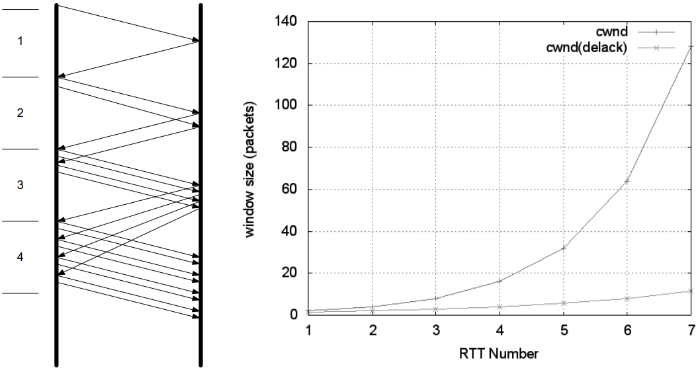

**Classic slow start operation**: Without delayed ACK, each good ACK allows the sender to send two new packets (left). The sender window grows exponentially over time (right, upper curve). With delayed ACK (one ACK per two packets), $cwnd$ still grows exponentially but more slowly (right, lower curve).

### Congestion Avoidance Algorithm

`Congestion avoidance algorithm`: To obtain more transmission resources without affecting other connections, once the slow start threshold is set, TCP enters congestion avoidance, and $cwnd$ increases by about one segment per RTT. This linear growth is much slower than slow start's exponential growth. More precisely, for each new ACK, $cwnd$ is updated as: $cwnd_{t+1} = cwnd_t + SMSS * SMSS / cwnd_t$

Analyzing the formula, suppose $cwnd_0 = k * SMSS$ bytes sent in k segments. After the first ACK, $cwnd$ increases by $1/k$:

$cwnd_1 = cwnd_0 + SMSS * SMSS / cwnd_0 = k * SMSS + SMSS * (SMSS/(k * SMSS)) = k * SMSS + (1/k) * SMSS = (k + 1/k) * SMSS = cwnd_0 + (1/k) * SMSS$

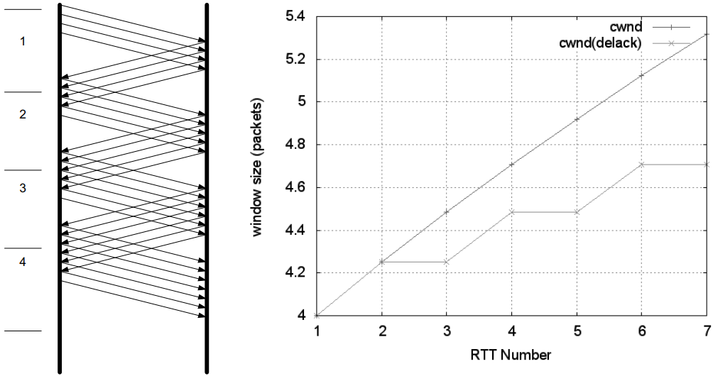

**Congestion avoidance operation**: Without delayed ACK, each good ACK allows the sender to send $1/W$ new packets. The send window grows linearly over time (right, upper curve). With delayed ACK, $cwnd$ still grows linearly but more slowly (right, lower curve).

### TCP Westwood Algorithm

TODO

### Westwood+ Algorithm

TODO

### Algorithm Selection

- `cwnd < ssthresh`: Use slow start
- `cwnd > ssthresh`: Use congestion avoidance
- `cwnd = ssthresh`: Either algorithm

Regardless of algorithm, the slow start threshold (ssthresh) is updated as:

$ssthresh = max(flight size / 2, 2 * SMSS)$

#### Standard TCP

At the start of a TCP connection, slow start is used ($cwnd = IW$), and ssthresh is usually set to a large value (at least AWND). When a good ACK is received (indicating successful data transfer), $cwnd$ is updated:

$cwnd += SMSS$ (if $cwnd < ssthresh$) slow start
$cwnd += SMSS * SMSS / cwnd$ (if $cwnd > ssthresh$) congestion avoidance

When three duplicate ACKs (or other fast retransmit signals) are received:

1. ssthresh is updated to $ssthresh = max(flight size / 2, 2*SMSS)$
2. Fast retransmit is triggered, $cwnd$ is set to $(ssthresh + 3 * SMSS)$
3. For each duplicate ACK, $cwnd$ temporarily increases by $1SMSS$
4. When a good ACK is received, $cwnd$ is reset to ssthresh

Slow start is always performed in the following cases:

- New connection establishment or retransmission timeout
- When the sender is idle for a long time, or if $cwnd$ may not accurately reflect current congestion

## Retransmission

### Fast Retransmit

`Fast retransmit`: The TCP sender retransmits a possibly lost segment after observing at least `dupthresh` duplicate ACKs, without waiting for the retransmission timer to expire. New data may also be sent. Duplicate ACKs indicate loss and trigger congestion control. Without SACK, at most one segment can be retransmitted per RTT before a valid ACK is received. With SACK, ACKs can carry extra info, allowing multiple holes to be filled per RTT.

### Timer-based Retransmission

If no ACK is received for a timed segment within the RTO, TCP triggers a timeout retransmission.

### SACK-based Retransmission

`SACK`: Describes received data using the cumulative ACK field in the TCP header.

`Hole`: The gap between the ACK number and other data in the receiver's buffer.

`Out-of-order data`: Data with a sequence number higher than the hole, not contiguous with previous data.

#### SACK Receiver Behavior

The receiver can generate SACKs after receiving the SACK-permitted option during connection setup. Whenever out-of-order data exists in the buffer, the receiver generates SACKs. Out-of-order data may be caused by loss or by new data arriving before old data.

#### SACK Sender Behavior

`Selective retransmission/repeat`: The sender uses received SACK blocks to retransmit lost data efficiently.

When the sender receives SACK or duplicate ACKs, it can send new or retransmit old data. SACK info provides the receiver's data ranges, so the sender can infer which data to retransmit. The simplest method is to fill the receiver's holes first, then send new data [RFC3517].

### Spurious Timeout and Retransmission

`Spurious retransmission`: Retransmission may occur even without data loss, mainly due to spurious timeout, packet reordering, duplication, ACK loss, etc.

Solutions:

- `Detection algorithms` to determine if a timeout is spurious
- `Response algorithms` to undo or mitigate the effects of a spurious timeout

### Example

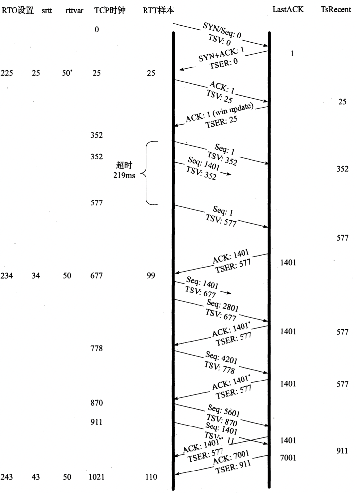

Segment 1401 is deliberately dropped twice, causing the sender to trigger a timeout retransmission. Only when an ACK advances the send window are srtt, rttvar, and RTO updated. ACKs with a star `(*)` contain SACK info.

## Packet Reordering and Duplication

### Reordering

Packet reordering in IP networks occurs because IP does not guarantee in-order delivery. This is sometimes beneficial (at least for IP), as IP can choose a different path (e.g., a faster one) without worrying about new packets arriving before old ones. This causes the receive order to differ from the send order (other causes exist as well).

### Example

1. Mild reordering
   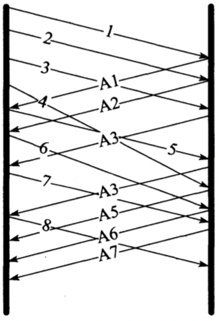
2. Severe reordering
   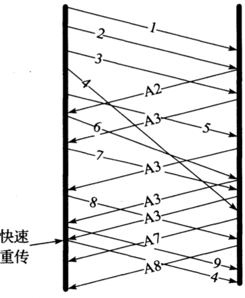

## Keepalive Mechanism

The keepalive mechanism probes the peer without affecting the data stream. It is implemented by a `keepalive timer`. When triggered, one side sends a `keepalive probe` segment, and the other side responds with an ACK.

### Keepalive States

1. The peer is still working and reachable.
2. The peer has crashed, shut down, or restarted.
3. The client has crashed and restarted.
4. The peer is working but unreachable for some reason.

## Security

### Initial Sequence Number Attack

1. TCP segment forgery: By choosing the right sequence number, IP address, and port, anyone can forge a TCP segment to disrupt a normal connection [RFC5961].

### TIME_WAIT Assassination

`TIME_WAIT Assassination (TWA)`: If segments, especially reset segments, are received during TIME_WAIT, the connection can be disrupted.

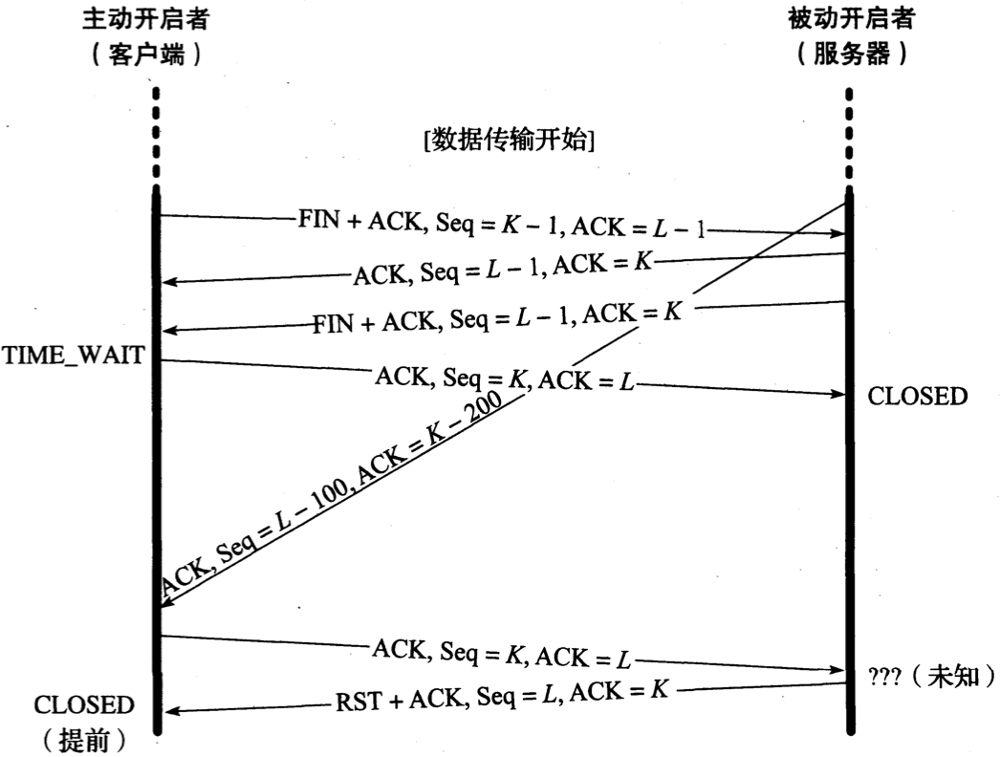

### Retransmission Attacks

1. Low-rate DoS attack: The attacker sends large amounts of data to keep the victim in retransmission timeout. The attacker can predict when the victim will retransmit and send more data at each retransmission. The victim always senses congestion and, per Karn's algorithm, reduces its rate and backs off, making normal bandwidth use impossible. The solution is to randomize RTO so the attacker cannot predict retransmission times.
2. Slowing/speeding up TCP: The attacker can make RTT estimates too large, so the victim delays retransmission after loss. Conversely, the attacker can forge ACKs before data arrives, making the victim believe RTT is much smaller, causing excessive sending and wasted bandwidth.

### Connection Management Attacks

1. SYN flood - TCP denial attack: Malicious clients generate many SYNs (with spoofed source IPs) to a server. The server allocates resources for each half-open connection, and after exhausting memory, refuses new legitimate connections.
2. Forged ICMP PTB attack: A forged ICMP PTB message with a very small MTU forces the victim to use tiny packets, greatly reducing performance.
3. Sequence number attack: Disrupts or hijacks existing TCP connections, usually by desynchronizing the endpoints so they use incorrect sequence numbers.
4. Spoofing attack: The attacker crafts a reset segment to disrupt or alter a TCP connection. If the 4-tuple and checksum are correct and the sequence number is in range, either endpoint can be forced to fail.
5. SYN cookies: To solve SYN flood, most connection info is encoded in the SYN+ACK sequence number. The host does not allocate resources for incoming connections until the SYN+ACK is acknowledged and the initial sequence number is returned. All important parameters can be recovered, and the connection is set to ESTABLISHED.

### Window Management Attacks

1. Client multi-"SYN cookies" technique: Exploits known timer flaws so all necessary connection state can be offloaded to the victim, exhausting its resources with minimal attacker effort.

### TCP Congestion Control Attacks

1. ACK splitting attack: Splits the original ACK range into multiple ACKs. Since TCP congestion control is based on ACK arrival (not the ACK field), the sender's $cwnd$ grows faster than normal.
2. Duplicate ACK spoofing: In fast recovery, each duplicate ACK increases $cwnd$. This attack generates extra duplicate ACKs, causing $cwnd$ to grow faster than normal.
3. Optimistic ACK attack: ACKs are generated for segments that have **not yet arrived**. Since TCP congestion control is based on end-to-end RTT, early ACKs make the sender believe RTT is smaller, causing it to send faster than normal.

### Keepalive Attacks

1. SSH has an application-layer keepalive mechanism (server/client keepalive messages), which differs from TCP keepalive in that it is sent over an encrypted channel and contains data. TCP keepalive contains no user data and is only minimally encrypted.

## BBR

TODO

## References

[1] Kevin R. Fall, W. Richard Stevens. TCP/IP Illustrated, 3rd Edition
[2] https://github.com/google/bbr/tree/v2alpha
