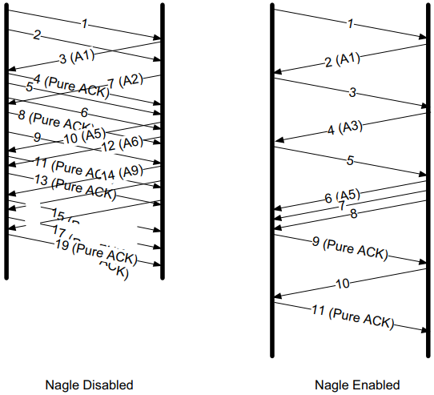

# TCP协议

<!-- vim-markdown-toc GFM -->

* [术语](#术语)
* [封装](#封装)
* [头部](#头部)
    - [4元组多路分解](#4元组多路分解)
* [连接的建立与终止](#连接的建立与终止)
    - [建立连接](#建立连接)
    - [关闭连接](#关闭连接)
    - [半关闭操作](#半关闭操作)
    - [同时打开与关闭](#同时打开与关闭)
* [状态转移](#状态转移)
    - [半开状态](#半开状态)
    - [TIME_WAIT状态](#time_wait状态)
    - [FIN_WAIT_2状态](#fin_wait_2状态)
* [窗口管理](#窗口管理)
    - [滑动窗口](#滑动窗口)
        + [发送窗口](#发送窗口)
        + [接收窗口](#接收窗口)
    - [分组窗口](#分组窗口)
    - [拥塞窗口](#拥塞窗口)
    - [流量控制](#流量控制)
* [拥塞控制](#拥塞控制)
    - [拥塞探测](#拥塞探测)
    - [Nagle算法](#nagle算法)
        + [延时ACK与Nagle算法结合导致死锁](#延时ack与nagle算法结合导致死锁)
        + [禁用Nagle算法](#禁用nagle算法)
    - [经典慢启动算法](#经典慢启动算法)
    - [拥塞避免算法](#拥塞避免算法)
    - [TCP Westwood算法](#tcp-westwood算法)
    - [Westwood+算法](#westwood算法)
    - [算法选择](#算法选择)
        + [标准TCP](#标准tcp)
* [重传](#重传)
    - [快速重传](#快速重传)
    - [基于计时器的重传](#基于计时器的重传)
    - [带选择确认的重传](#带选择确认的重传)
        + [SACK接收端行为](#sack接收端行为)
        + [SACK发送端行为](#sack发送端行为)
    - [伪超时与重传](#伪超时与重传)
    - [示例](#示例)
* [包失序与包重复](#包失序与包重复)
    - [失序](#失序)
    - [示例](#示例-1)
* [保活机制](#保活机制)
    - [保活状态](#保活状态)
* [安全](#安全)
    - [初始序列号攻击](#初始序列号攻击)
    - [时间等待错误](#时间等待错误)
    - [重传攻击](#重传攻击)
    - [连接管理攻击](#连接管理攻击)
    - [窗口管理类攻击](#窗口管理类攻击)
    - [TCP拥塞控制攻击](#tcp拥塞控制攻击)
    - [保活攻击](#保活攻击)
* [参考](#参考)

<!-- vim-markdown-toc -->

TCP提供了一种*面向连接的(connection-oriented)，可靠的*字节流服务

## 术语

- ARQ(Automatic Repeat Request，自动重复请求)

- ACK(acknowledgment， 确认)

- RTT(round-trip-time estimation， 往返时间估计)

## 封装

*TCP头部紧跟着IP头部或IPv6扩展头部，经常是20字节长（不带TCP选项）。带选项的话，TCP头部可达60字节。常见选项包括最大段大小，时间戳，窗口缩放和选择性ACK*

## 头部

- `源端口` 与IP头部中的源地址组合成一个端点(endpoint)，用于唯一标识发送方。

- `目的端口` 与IP头部中的目的地址组合成一个端点(endpoint)，用于唯一标识接收方。

- `序列号` Sequence Number，标识TCP发送端到TCP接收端的数据流的一个字节，该字节代表着包含该序列号的报文段的数据中的第一个字节。

- `确认号` Acknowledgment Number，发送方期待接收的下一个序列号。

- `头部长度` 定义了头部的长度，长度单位为字（32bit）；TCP头部被限制为60字节，不带选项的TCP头部大小为20字节。

- `保留字段`

- `CWR` 缩小拥塞窗口，发送方用来降低它的发送速率

- `ECE` ECN回显，发送方收到了一个更早的拥塞通告

- `URG` 紧急，让`紧急指针`生效，很少使用

- `ACK` 确认，让`确认号字段`生效，建立连接后启用

- `PSH` 推送

- `RST` 重置连接 

- `SYN` 初始化同步序号

- `FIN` 发送数据结束

- `窗口大小` 用来通告窗口大小（单位：字节数，最大65535字节），实现流量控制

- `TCP校验和` 强制性的，由发送方进行计算和保存，由接收方验证。

- `紧急指针` Urgent Pointer，只有当`URG`字段被设置时生效；

- `选项`(变长)

  | 种类 | 长度 | 名称           | 描述与目的                       |
  | ---- | ---- | -------------- | -------------------------------- |
  | 0    | 1    | EOL            | 选项列表结束                     |
  | 1    | 1    | NOP            | 无操作（用于填充）               |
  | 2    | 4    | MSS            | 最大段大小                       |
  | 3    | 3    | WSOPT          | 窗口缩放因子（窗口左移量）       |
  | 4    | 2    | SACK-Permitted | 发送者支持SACK选项               |
  | 5    | 可变 | SACK           | SACK阻塞（接收到乱序数据）       |
  | 8    | 10   | TSOPT          | 时间戳选项                       |
  | 28   | 4    | UTO            | 用户超时（一段空闲时间后的终止） |
  | 29   | 可变 | TCP-AO         | 认证选项（使用多种算法）         |
  | 253  | 可变 | Experimental   | 保留供实验所用                   |
  | 254  | 可变 | Experimental   | 保留供实验所用                   |

### 4元组多路分解

TCP依靠4元组多路分解（demultiplex）获得报文段，包括以下：

- 目的IP地址
- 目的端口号
- 源IP地址
- 源端口号

这4元组共同构成了本地与外地节点的信息。

## 连接的建立与终止

*一个普通TCP连接的建立与终止。通常，由客户端负责发起一个三次握手过程。在该过程中，客户端与服务器利用SYN报文段交换彼此的初始序列号（包括客户端的初始序列号和服务器的初始序列号）。在通信双方都发送了一个FIN数据包并收到来自对方的相应的确认数据包后，该连接终止*

### 建立连接

1. 客户端发送一个SYN报文段（设置SYN字段），并指明想要连接的端口号和初始序列号ISN(c)；
2. 服务端发送SYN报文段，包含初始序列号ISN(s)，ACK = ISN(c)+1；
3. 发送ACK = ISN(s)+1 报文；

### 关闭连接

1. 客户端发送一个FIN报文段，包括：序列号（K），一个ACK段；用于确认对方最近一次发来的的数据（L）。
2. 服务端将ACK设置为K+1，以表明它已经成功接收到客户端发送的FIN报文段。
3. 服务端发送自己的FIN，序列号为L，以表明它以成功发送完数据。
4. 客户端发送一个ACK用于确认上一个FIN。

### 半关闭操作

*在TCP半关闭操作中，连接的一个方向被关闭，而另一个方向仍在传输数据直到它被关闭为止；（很少有应用程序使用这一特性）*

### 同时打开与关闭

*在同时打开中交换的报文段。与正常的连接建立过程相比，需要增加一个报文段。数据报的SYN位将置位直到接收到一个ACK数据包为止*

*在同时关闭中交换的报文段。与正常关闭相似，指示报文段的顺序是交叉的*

## 状态转移

### 半开状态

如果在未告知另一端的情况下通信的一端关闭或终止连接，那么就认为该条TCP连接处于`半开状态`。

### TIME_WAIT状态

`TIME_WAIT`状态也称为`2MSL等待状态`或`加倍等待`，TCP将会等待两倍于最大段生存期（Maximum Segment Lifetime, MSL）的时间；

`TIME_WAIT`状态有2个存在的理由:

- 可靠地实现TCP全双工连接的终止；
- 允许老的重复分节在网络中消逝；

影响2MSL等待状态的因素：

1. 当TCP执行一个主动关闭并发送最终的ACK时，连接必须处于TIME_WAIT状态并持续两倍于最大生存期的时间。这样就能让TCP重新发送最终的ACK以避免出现丢失的情况。重新发送最终的ACK并不是因为TCP重传了ACK（他们并不消耗序列号，也不会被TCP重传），而是因为通信另一方重传了它的FIN（它消耗一个序列号）。

2. 当TCP处于等待状态时，通信双方将该连接（客户端IP地址，客户端端口号，服务器IP地址，服务器端口号）定义为不可重新使用。

   只有当2MSL等待结束时，或一条新链接使用的初始序列号超过了连接之前的实例所使用的最高序列号时，或者允许使用时间戳选项来区分之前连接实例的报文段以避免混淆时，这条连接才能被再次使用。

有许多机制可以绕开2MSL限制，如：`SO_REUSEADDR`套接字选项...

**静默时间**，[RFC0793]指出，在崩溃或者重启后TCP协议应当在创建新的连接之前等待相当于一个MSL的时间，该段时间被称为*静默时间*。

TIME_WAIT过多怎么处理？

### FIN_WAIT_2状态

在FIN_WAIT_2状态，某TCP通信端已发送一个FIN并已得到另一端的确认，除非出现半关闭的情况，否则该TCP端将会等待另一端的应用程序识别出自己已接收到一个文件末尾的通知并关闭这一端引起发送FIN的连接。只有当应用程序完成了这一关闭操作（它的FIN已经被接收），正在关闭的TCP连接才会从FIN_WAIT_2状态转移至TIME_WAIT状态。这意味着连接的一端能够依然永远保持这种状态。另一端也会依然处于CLOSE_WAIT状态，并且能永远维持这一状态直到应用程序决定宣布他的关闭。

## 窗口管理

### 滑动窗口

每个TCP活动连接维护以下窗口：

- 发送窗口结构（send window structure）
- 接收窗口结构（receive window structure）

#### 发送窗口

- `提供窗口` 由接收端通告的窗口
- `可用窗口` 它可以立即发送的数据量，其值=$SND.UNA + SND.WND - SND.NXT$

TCP发送端滑动窗口结构记录了已确认，在传以及还未传的数据的序列号，提供窗口的大小由接收端返回的ACK中的窗口大小字段控制。

窗口的左右边界运动：

- `关闭（close）` 窗口左边界右移，当已发送数据得到ACK确认时，窗口会减少。
- `打开（open）` 窗口右边界右移，使得可发送数据量增大，当已确认数据得到处理，接收端可用缓存变大，窗口也随之变大。
- `收缩（shrink）` 窗口右边界左移。

#### 接收窗口

TCP接收端滑动窗口结构帮助了解其下次应接收的数据序列号，若接收到的数据序列号在窗口内，则可以存储，否则丢弃；

### 分组窗口

TODO

### 拥塞窗口

`拥塞窗口（congestion window）` 反映网络传输能力的变量；

`外数据值（flight size）` 已经发出但还未经确认的数据量大小；

`最佳窗口大小（optional window size）` 网络中可存储的待发送数据量接近于带宽延迟积(Bandwidth-Delay Product, BDP)，计算方式为RTT与链路中最小通行速率（即发送端与接收端传输路径中的“瓶颈”）的乘积；

发送端实际可用窗口$w$的计算公式：$W = min(cwnd, awnd)$

- $awnd$ 接收端通知窗口
- $cwnd$ 拥塞窗口

### 流量控制

流量控制（flow control）：在接收方跟不上时会强迫发送方慢下来，一共有2种方法：

- 基于速率（rate-based）流量控制

  给发送方指定某个速率，同时确保数据永远不能超过这个速率发送，适用于流应用程序。

- 基于窗口（windows-based）流量控制

  使用滑动窗口，窗口大小不是固定的，而是允许随时间而变动的；发送方使用**窗口通告(window advertisement)或窗口更新(window update)**调整窗口大小。

  

## 拥塞控制

TCP拥塞控制操作是基于数据包守恒原理运行的。由于传输能力有限，数据包（$P_b$）会适时地“伸展”。接收方以一定间隔（$P_r$）接收到数据包后，会陆续（以$A_r$为间隔）生成相应的ACK，以一定的发送间隔（$A_b$）返回给发送方。当ACK陆续（以$A_s$为间隔）到达发送端时，其到达提供了一个信号或者说“ACK时钟”，表明发送端可以继续发送数据。在稳定传输状态下，整个系统可“自同步”控制。

### 拥塞探测

- 丢包分析
- 时延测量
- 显式拥塞通知(ECN)

### Nagle算法

`Nagle算法` 当一个TCP连接中有在传数据（即那些已发送但还未经确认的数据），小的报文段（长度小于SMSS）就不能被发送，直到所有的在传数据都收到ACK。并且，在收到ACK后，TCP需要收集这些小数据，将其整合到一个报文段中发送。此算法迫使TCP遵循停等（stop-and-wait）规程--只有等接收到所有在传数据的ACK后才能继续发送。此算法的精妙之处在于它实现了自时钟（self-clocking）控制：ACK返回越快，数据传输也越快。在相对高延迟的广域网中，更需要减少微型报的数目，该算法使得单位时间内发送的报文段数目更少。也就是说，RTT控制着发包速率。

示例：

*在启用Nagle算法的情况下，在任一时刻最多只有一个包在传，这样可以减少小包数目，但同时也增大了传输时延；*

#### 延时ACK与Nagle算法结合导致死锁

ACK与Nagle算法的结合导致了某种程度的`死锁`（两端互相等待对方做出行动），在死锁期间整个传输连接处于空闲状态，使性能变差；这种死锁并不是永久的，在延时ACK计时器超时后死锁会解除；示例：

#### 禁用Nagle算法

对于一些延时敏感的应用，需要禁用Nagle算法，禁用方法如下：

1. `Berkeley套接字`

   设置TCP_NODELAY选项；

2. `Windows系统`

   设置注册表`HKLM\so盯WARE\Micr ゚S ゚ft\MsMQ\parameters \TCPNoDelay`的值为1；

### 经典慢启动算法

当一个新的TCP连接建立或检测到由重传超时（RTO）导致的丢包时，需要执行慢启动。使TCP在用拥塞避免探寻更多可用带宽之前得到$cwnd$值，以及帮助TCP建立ACK时钟。通常，TCP在建立新连接时执行慢启动，直至有丢包时，执行拥塞避免算法进入稳定状态。

`初始窗口（Initial Window, IW）` TCP以发送一定数目的数据段开始慢启动（在SYN交换之后），$IW$的计算公式如下：

$IW = 2 * (SMSS)且小于等于2个数据段(当SMSS > 2190字节)$

$IW = 3 * (SMSS)且小于等于3个数据段(当2190 >= SMSS > 1095字节)$

$IW = 4 * (SMSS)且小于等于4个数据段(其它)$

示例：

**经典慢启动算法操作**。在没有ACK延时情况下，每接收到一个好的ACK就意味着发送方可以发送两个新的数据包（左）。这会使得发送方窗口随着时间呈指数增长（右，上方曲线）。当发生ACK延时，如每隔一个数据包生成一个ACK，cwnd仍以指数增长，但增幅较小（右，下方曲线）。

### 拥塞避免算法

`拥塞避免算法` 为了得到更多的传输资源而不致影响其它连接传输，一旦确立慢启动阈值，TCP会进入拥塞避免阶段，cwnd每次的增长值近似于成功传输的数据段大小。这种随时间线形增长方式与慢启动的指数增长相比缓慢许多。更准确地说，每接收一个新的ACK，cwnd会做以下更新：$cwnd_{t+1} = cwnd_t + SMSS * SMSS/cwnd_t$

分析上式，假设$cwnd_0 = k * SMSS$字节分k段发送，在接收到第一个ACK后，cwnd的值增长了$1/k$倍：

$cwnd_1$ = $cwnd_0 + SMSS * SMSS / cwnd_0 = k * SMSS + SMSS * (SMSS/(k * SMSS))$

​             = $k * SMSS + (1/k) * SMSS = (k + (1/k) * SMSS = cwnd_0 + (1/k) * SMSS)$

**拥塞避免算法操作**。若没有ACK延时发生，每接收一个好的ACK，就意味着发送方可继续发送$1/W$个新的数据包。发送窗口随时间近似呈线性增长（右，上方曲线）。当有ACK延时，如每隔一个数据包生成一个ACK，cwnd仍近似呈线性增长，只是增幅较小（右，下方曲线）。

### TCP Westwood算法

TODO

### Westwood+算法

TODO

### 算法选择

- `cwnd < ssthresh` 使用慢启动算法
- `cwnd > ssthresh` 使用拥塞避免
- `cwnd = ssthresh` 任一算法

不论是慢启动还是拥塞避免，慢启动阈值(ssthresh)按以下方式改变：

$ssthresh = max(在外数据值/2, 2 * SMSS)$

#### 标准TCP

在TCP连接建立之初首先是慢启动阶段（cwnd = IW），ssthresh通常取一较大值（至少为AWND）。当接收到一个好的ACK（表明新的数据传输成功），cwnd会相应更新：

$cwnd += SMSS （若cwnd < ssthresh）慢启动$

$cwnd += SMSS * SMSS / cwnd （若cwnd > ssthresh）拥塞避免$

当收到三次重复ACK（或其它表明需要快速重传的信号）时，会执行以下行为：

1. ssthresh更新为大于等于$ssthresh = max(在外数据值/2, 2*SMSS)$中的值。
2. 启用快速重传算法，将cwnd设为$(ssthresh + 3 * SMSS)$。
3. 每接收一个重复ACK，cwnd值暂时增加$1SMSS$。
4. 当接收到一个好的ACK，将cwnd重设为ssthresh。

以下情况下总会执行慢启动：

- 新连接的建立以及出现重传超时。
- 当发送方长时间处于空闲状态，或者有理由怀疑cwnd不能精确反映网络当前拥塞状态时。

## 重传

### 快速重传

`快速重传算法`：TCP发送端在观测到至少`dupthresh`个重复ACK后，即重传可能丢失的数据分组，而不必等到重传计时器超时；当然也可以同时发送新的数据，根据重复ACK推断的丢包与网络拥塞有关，因此伴随快速重传应出发拥塞控制机制；不采用SACK时，在接收到有效ACk前至多只能重传一个报文段；采用SACK，ACK可包含额外信息，使得发送端在每个RTT时间内可以填补多个空缺；

### 基于计时器的重传

若在连接设定的RTO内，TCP没有收到被计时报文段的ACK，将会触发超时重传。

### 带选择确认的重传

`SACK功能`：通过TCP头部累积ACK号字段来描述其接收到的数据；

`空缺`：ACK号与接收端缓存中的其它数据之间的间隔；

`失序数据`：序列号高于空缺的数据，这些数据和之前接收的序列号不连续；

#### SACK接收端行为

接收端在TCP连接建立期间收到SACK许可选项即可生成SACK，每当缓存中存在失序数据时，接收端就可生成SACK，导致数据失序的原因可能是由于传输过程中丢失，也可能是新数据先于旧数据到达；

#### SACK发送端行为

`选择性重传（selective retransmission）/选择性重发（selective repeat）`：在发送端提供SACK功能，合理利用接收到的SACK块来进行丢失重传；

当发送端收到了SACK或重复ACK时，可以选择发送新数据或重传旧数据；SACK信息提供接收端数据的序列号范围，因此发送端可以据此推断需要重传的空缺数据；最简单的方法是发送端首先填补接收端的空缺，然后在继续发送新数据[RFC3517]；

### 伪超时与重传

`伪重传（spurious retransmission）`：即使没有出现数据丢失也可能引发重传，造成的主要原因是：伪超时（spurious timeout），包失序，包重复，ACK丢失，...；

伪重传的解决办法：

- `检测（detection）算法` 用于判定某个超；
- `响应（response）算法` 用于撤销或减轻超时带来的影响；

### 示例

报文段1401被人为地丢弃2次，导致发送端引发了超时重传；仅在接收到使得发送窗口前移的ACK时，srtt, rttvar和RTO值才会做出更新；带星号`（*）`的ACK包含了SACK信息；

## 包失序与包重复

### 失序

在IP网络中出现包失序的原因在于IP层不能保证包传输是有序进行的，这一方面是有利的（至少对IP层来说），因为IP可以选择另一条传输链路（例如传输速度更快的路径），而不用担心新发送的分组会先于旧数据到达，这就导致数据的接收顺序与发送顺序不一致（还有其它的原因也会导致包失序）；

### 示例

1. 轻微失序

   

2. 严重失序

   

## 保活机制

保活机制是一种在不影响数据流内容的情况下探测对方的方式。它是由一个`保活计时器`实现的。当计时器被激发，连接一段将发送一个`保活探测`（简称保活）报文，另一端接收报文的同时会发送一个ACK作为响应。

### 保活状态

1. 对方主机仍在工作，并且可以到达。
2. 对方主机已经崩溃，包括已经关闭或者正在重新启动。
3. 客户主机崩溃并且已重启。
4. 对方主机仍在工作，但是由于某些原因不能到达请求端。

## 安全

### 初始序列号攻击

1. TCP报文段伪造；

   选择合适的序列号，IP地址以及端口号，那么任何人都能伪造出一个TCP报文段，从而打断TCP的正常连接`[RFC5961]`。

### 时间等待错误

`时间等待错误（TIME-WAIT Assassination, TWA）` 如果在`TIME_WAIT`状态下接收到来自于这条连接的一些报文段，或是更加特殊的重置报文段，它将会被破坏；

### 重传攻击

1. 低速率DoS攻击

   攻击者向网关或主机发送大量数据，使得受害系统持续处于重传超时状态。由于攻击者可预知受害TCP合适启动重传，并在每次重传时生成并发送大量数据。因此，受害TCP总能感知到拥塞的存在，根据Karn算法不断减小发送速率并退避发送，导致无法正常使用网络带宽。针对此类攻击的预防方法是随机选择RTO，使得攻击者无法预知确切的重传时间。

2. 减慢/加速TCP的发送

   使RTT估值过大，这样受害者在丢包后不会立即重传。相反的攻击也是有可能的：攻击者在数据发送完成但还未到达接收端伪造ACK。这样攻击者就能使受害TCP认为连接的RTT远小于实际值，导致过分发送，造成大量的无效传输。

### 连接管理攻击

1. SYN泛洪-TCP拒绝攻击

   恶意客户端产生一系列TCP连接尝试（SYN报文段），并将它们发送给一台服务器，他们通常采用“伪造”的源IP地址；服务器会为每一条连接分配一定数量的连接资源，由于连接尚未完全建立，服务器为了维护大量的半打开连接会在耗尽自身内存后拒绝为后续的合法连接请求服务；

2. 伪造ICMP PTB攻击

	伪造一个ICMP PTB消息，该消息包含了一个非常小的MTU值，这样就迫使受害的TCP尝试采用非常小的数据包来填充数据，从而大大降低了它的性能；

3. 序列号攻击

	破坏现有的TCP连接，甚至将其劫持（hijacking）；这一类攻击通常包含的第一步是使两个之前正在通信的TCP节点“失去同步”，这样它们将使用不正确的序列号；

4. 欺骗攻击

   TCP报文段由攻击者精心定制，目的在于破坏或改变现有的TCP连接的行为；攻击者生成一个伪造的重置报文段并将其发送给一个TCP通信节点，假定与连接相关的4元组以及校验和都是正确的，序列号也处于正确的范围，这样就会造成连接的任意一端失败；

5. SYN cookies

	用于解决`SYN泛红问题`，当一个SYN到达时，这条连接存储的大部分信息都会被编码并保存在`SYN+ACK`报文段的序列号字段；采用`SYN cookies`的目标主机不需要为进入的连接请求分配任何存储资源--只有当`SYN+ACK`报文段本身被确认后（并且已返回初始序列号）才会分配真正的内存；在这种情况下，所有重要的连接参数都能够重新获得，同时连接也能够被设置为`ESTABLISHED`状态；
   

### 窗口管理类攻击

1. 客户端多“SYN cookies”技术

   基于已知的持续计时器的缺陷，所有必要的连接状态都可以下载到受害主机进行，从而使得攻击方主机消耗最少的资源，使得受害者资源耗尽；

### TCP拥塞控制攻击

1. ACK分割攻击

   将原有的确认字节范围拆分成多个ACK信号并返回给发送端。由于TCP拥塞控制是基于ACK数据包的到达进行操作的（而不是依据ACK信号中的ACK字段）。这样发送端的$cwnd$会比正常情况更快速地增长。

2. 重复ACK欺骗攻击 

   可以使发送端在快速恢复阶段增长它的拥塞窗口。在标准快速恢复模式中，每次接收到重复ACK cwnd都会增长。这种攻击会比正常情况更快地生成多余的重复ACK。` 

3. 乐观响应攻击

   对那些**还没有到达**的报文段产生ACK。因为TCP的拥塞控制计算是基于端到端的RTT的。对那些还没有到达的数据提前进行确认就会导致发送端计算出的RTT比实际值要小，所以发送端将会比正常情况下更快地做出反应。

### 保活攻击

1. ssh中含有一种应用层的保活机制，称为`服务器保活报文和客户端保活报文`。与TCP保活报文的区别在于，它们是在应用层通过一条加密的链路传输的，而且这些报文中包含数据。TCP保活报文中不包含任何用户数据，所以它最多只进行有限的加密。

## 参考

[1] [美] Kevin R. Fall, [美] W. Richard Stevens.Tcp/ip详解.3ED

