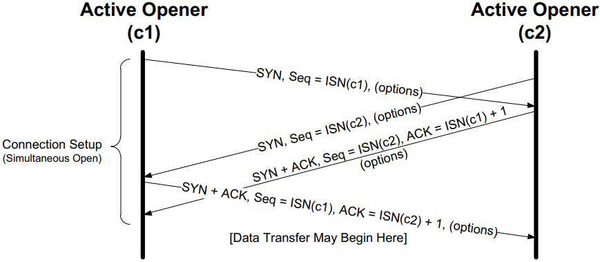
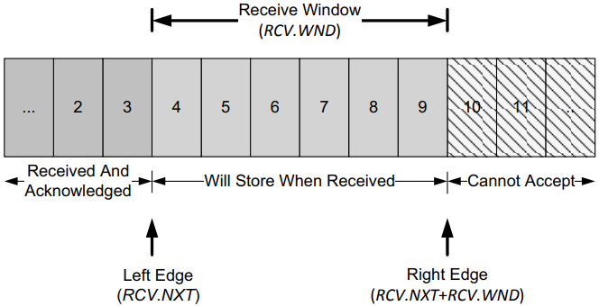

# Transmission Control Protocol

[TOC]

The transmission Control Protocol (TCP) is one of the main protocols of the Internet protocol suite. It includes a connection-oriented service and a reliable data transfer service.

## Glossary

- ARQ(Automatic Repeat Request)

- ACK(acknowledgment)

- RTT(round-trip-time) , which is the time it takes for a small packet to travel from client to server and then back to the client. The RTT includes packet-propagation delays, packet-queuing delays in intermediate routers and switches, and packet-processing delays.

## TCP Header and Encapsulation

*The TCP header appears immediately following the IP header or last IPv6 extension header and is often 20 bytes long (with no TCP options). With options, the TCP header can be as large as 60 bytes. Common options include Maximum Segment Size, Time stamps, Window Scaling, and Selective ACKs.*

## TCP Header

- `Source Port`

- `Destination Port`

- `Sequence Number` identifies the byte in the stream of data from the sending TCP to the receiving TCP that the first byte of data in the containing segment represents.

- `Acknowledgment Number` (also called the ACK Number or ACK field for short) contains the next sequence number that the sender of the acknowledgment expects to receive.

- `Header Length` gives the size of the header in 32-bit words (minimum value is 5).

- `Resv`

- `CWR` Congestion Window Reduced (the sender reduced its sending rate).

- `ECE` ECN Echo (the sender received an earlier congestion notification).

- `URG` Urgent (the Urgent Pointer field is valid--rarely used).

- `ACK` Acknowledgment (the Acknowledgment Number field is valid always on after a connection is established).

- `PSH` Push (the receiver should pass this data to the application as soon as possible--not reliably implemented or used).

- `RST` Reset the connection (connection abort, usually because of an error).

- `SYN` Synchronize sequence numbers to initiate a connection.

- `FIN` The sender of the segment is finished sending data to its peer.

- `Window Size` This is the number of bytes, starting with the one specified by the ACK number, that the receiver is willing to accept. This is a 16-bit field, limiting the window to 65,535 bytes, and thereby limiting TCP's throughput performance.

- `TCP Checksum` it is mandatory for this field to be calculated and stored by the sender, and then verified by the receiver.

- `Urgent Pointer` is a way for the sender to provide specially marked data to the other end (is valid only if the URG bit field is set).

- `Options` (variable)

  | Kind | Length | Name           | Description and Purpose                             |
  | ---- | ------ | -------------- | --------------------------------------------------- |
  | 0    | 1      | EOL            | End of Option List                                  |
  | 1    | 1      | NOP            | No Operation (used for padding)                     |
  | 2    | 4      | MSS            | Maximum Segment Size                                |
  | 3    | 3      | WSOPT          | Window Scaling Factor (left-shift amount on window) |
  | 4    | 2      | SACK-Permitted | Sender supports SACK options                        |
  | 5    | Var.   | SACK           | SACK block (out-of-order data received)             |
  | 8    | 10     | TSOPT          | Timestamps option                                   |
  | 28   | 4      | UTO            | User Timeout (abort after idle time)                |
  | 29   | Var.   | TCP-AO         | Authentication option (using various algorithms)    |
  | 253  | Var.   | Experimental   | Reserved for experimental use                       |
  | 254  | Var.   | Experimental   | Reserved for experimental use                       |

### 4-tuple demultiplex

It is a pair of sockets or endpoints (the 4-tuple demultiplex) consisting of:

- client IP address;
- client port number;
- server IP address;
- server port number.

that uniquely identifies each TCP connection.

## TCP Connection Establishment and Termination

*A normal TCP connection establishment and termination. Usually, the client initiates a three-way handshake to exchange initial sequence numbers carried on SYN segments for the client and server (ISN(c) and ISN(s), respectively). The connection terminates after each side has sent a FIN and received an acknowledgment for it.*

### Connection Establishment

1. The `active opener (normally called the client)` sends a SYN segment (i.e., a TCP/IP packet with the SYN bit field turned on in the TCP header) specifying the port number of the peer to which it wants to connect and the client's initial sequence number or ISN(c). It typically sends one or more options at this point.
2. The server responds with its own SYN segment containing its initial sequence number (ISN(s)). The server also acknowledges the client's SYN by ACKing ISN(c) plus 1. A SYN consumes one sequence number and is retransmitted if lost.
3. The client must acknowledge this SYN from the server by ACKing ISN(s) plus 1.

### Connection Termination

1. The active closer sends a FIN segment specifying the current sequence number the receiver expects to see ($K$). The FIN also includes an ACK for the last data sent in the other direction (labeled $L$).
2. The passive closer responds by ACKing value $K + 1$ to indicate its successful receipt of the active closer's FIN.
3. The passive closer then effectively becomes another closer and sends its own FIN. The sequence number is equal to $L$.
4. To complete the close, the final segment contains an ACK for the last FIN. 

### TCP Half-Close

*With the TCP half-close operation, one direction of the connection can terminate while the other continues until it is closed. Few applications use this feature.*

### Simultaneous Open and Close

*Segments exchanged during simultaneous open. One additional segment is required compared to the ordinary connection establishment procedure. The SYN bit field is on in each segment until an ACK for it is received.*

*Segments exchanged during simultaneous close work like a conventional close, but the segment ordering is interleaved.*

## TCP State Transitions

*The TCP state transition diagram (also called finite state machine). Arrows represent transitions between states due to segment transmission, segment reception, or timers expiring. The bold arrows indicate typical client behavior, and the dashed arrows indicate typical server behavior. The boldface directives (e.g., open, close) are actions performed by applications.*

### TIME_WAIT (2MSL Wait) State

The TIME_WAIT state is also called the 2MSL wait state. It is a state in which TCP waits for a time equal to twice the `Maximum Segment Lifetime (MSL)`, sometimes called `timed wait`.

Given the MSL value for an implementation, the rule is:

1. When TCP performs an active close and sends the final ACK, that connection must stay in the TIME_WAIT state for twice the MSL. This lets TCP resend the final ACK in case it is lost.The final ACK is resent not because the TCP retransmits ACKs (they do not consume sequence numbers and are not retransmitted by TCP), but because the other side will retransmit its FIN (which does consume a sequence number). Indeed, TCP will always retransmit FINs until it receives a final ACK.
2. While the TCP implementation waits, the endpoints defining that connection (client IP address, client port number, server IP address, and server port number) cannot be reused. That connection can be reused only when the 2MSL wait is over, or when a new connection uses an ISN that exceeds the highest sequence number used on the previous instantiation of the connection [RFC1122], or if the use of the Timestamps option allows the disambiguation of segments from a previous connection instantiation to not otherwise be confused [RFC6191]. Unfortunately, some implementations impose a more stringent constraint. In these systems, a local port number cannot be reused while that port number is the local port number of any endpoint that is in the 2MSL wait state on the system.

Most implementations and APIs provide a way to bypass this restriction. With the Berkeley sockets API, the SO_REUSEADDR socket option enables the bypass operation.

To protect against this scenario, [RFC0793] states that TCP should wait an amount of time equal to the MSL before creating any new connections after a reboot or crash. This is called the `quiet time`.

### FIN_WAIT_2 State

In the FIN_WAIT_2 state, TCP has sent a FIN and the other end has acknowledged it. Unless a half-close is being performed, the TCP must wait for the application on the other end to recognize that it has received an end-of-file notification and close its end of the connection, which causes a FIN to be sent. Only when the application performs this close (and its FIN is received) does the active closing TCP move from the FIN_WAIT_2 to the TIME_WAIT state. This means that one end of the connection can remain in this state forever. The other end is still in the CLOSE_WAIT state and can remain there forever, until the application decides to issue its close.

## Flow Control and Window Management

### Sliding Windows

Each TCP endpoint maintains:

- a `send window structure`;
- a `receive window structure`.

#### Send Window Structure

*The TCP sender-side sliding window structure keeps track of which sequence numbers have already been acknowledged, which are in flight, and which are yet to be sent. The size of the offered window is controlled by the Window Size field sent by the receiver in each ACK.*

- `offered window` advertised by the receiver.
- `usable window` how much data it can send immediately. equal to $SND.UNA + SND.WND - SND.NXT$

Three terms are used to describe the movement of the right and left edges of the window:

1. The window `closes` as the left edge advances to the right. This happens when data that has been sent is acknowledged and the window size gets smaller.
2. The window `opens` when the right edge moves to the right, allowing more data to be sent. This happens when the receiving process on the other end reads acknowledged data, freeing up space in its TCP receive buffer.
3. The window `shrinks` when the right edge moves to the left. The Host Requirements RFC [RFC1122] strongly discourages this, but TCP must be able to cope with it.

#### Receive Window Structure

*The TCP receiver-side sliding window structure helps the receiver know which sequence numbers to expect next. Sequence numbers in the receive window are stored when received. Those outside the window are discarded.*

The new value used to hold the estimate of the network's available capacity is called the `congestion window`.

The Sender's actual (usable) window $W$ equal to:
$$
W = min(cwnd, awnd)
$$

- $cwnd$ the congestion window
- $awnd$ the receiver's advertised window

### Flow Control

To handle the problem that arises when a receiver is too slow relative to a sender, we introduce a way to force the sender to slow down when the receiver cannot keep up. This is called `flow control` and is usually handled in two ways:

- `rate-based` flow control

  gives the sender a certain data rate allocation and ensures that data is never allowed to be sent at a rate that exceeds the allocation. This type of flow control is most appropriate for streaming applications and can be used with broadcast and multicast delivery.

- `window-based` flow control

  In this approach, the window size is not fixed but is instead allowed to vary over time. To achieve flow control using this technique, there must be a method for the receiver to signal the sender how large a window to use. This is typically called a `window advertisement`, or simply a `window update`.

## TCP Congestion Control

*TCP congestion control operates on a principle of conservation of packets. $Packets(P_b)$ are "stretched out" in time as they are sent from sender to receiver over links with constrained capacity. As they are received at the receiver spaced $apart(P_r)$, ACKs are $generated(A_r)$, which return to the sender. ACKs traveling from receiver to sender become spaced out $(A_b)$ in relation to the inter-packet spacing of the packets. When ACKs reach the $sender(A_s)$, their arrivals provide a signal or "ACK clock," used to tell the sender it is time to send more. In steady state, the overall system is said to be "self-clocked." The figure is adapted from [J88] and copied from S.Seshan's CMU Lecture Notes dated March 22, 2005.*

### Detection of Congestion in TCP

- TODO
- TODO
- Explicit Congestion Notification  (ECN)

### Nagle Algorithm

The Nagle algorithm says that when a TCP connection has outstanding data that has not yet been acknowledged, small segments (those smaller than the SMSS) cannot be sent until all outstanding data is acknowledged. Instead, small amounts of data are collected by TCP and sent in a single segment when an acknowledgment arrives. This procedure effectively forces TCP into `stop-and-wait` behavior--it stops sending until an ACK is received for any outstanding data. The beauty of this algorithm is that  it is `self-clocking`: the faster the ACKs come back, the faster the data is sent. On a comparatively high-delay WAN, where reducing the number of tinygrams is desirable, fewer segments are sent per unit time. Said another way, the RTT controls the packet sending rate.

*Comparing the use of the Nagle algorithm for TCP connections with a similar operating environment. With Nagle enabled, at most one packet is allowed to be outstanding at any given time. This reduces the number of small packets but increases delay.*

#### Delayed ACK and Nagle Algorithm Interaction

The combination of delayed ACKs and the Nagle algorithm leads to a form of `deadlock` (each side waiting for the other). Fortunately, this deadlock is not permanent and is broken when the delayed ACK timer fires, which forces the client to provide an ACK even if the client has no additional data to send.

*The interaction between the Nagle algorithm and delayed ACKs. A temporary form of deadlock can occur until the delayed ACK timer fires.*

#### Disabling the Nagle Algorithm

The Nagle algorithm can be disabled in a number of ways:

1. An application can specify the TCP_NODELAY option when using the Berkeley sockets API.
2. In Windows, this can be accomplished using the following registry key:`HKLM\SOFTWARE\Microsoft\MSMQ\Parameters\TCPNoDelay`.

### Slow Start

The slow start algorithm is executed when a new TCP connection is created or when a loss has been detected due to a retransmission timeout (RTO). It may also be invoked after a sending TCP has gone idle for some time. The purpose of slow start is to help TCP find a value for $cwnd$ before probing for more available bandwidth using congestion avoidance and to establish the ACK clock. Typically, a TCP begins a new connection in slow start, eventually drops a packet, and then settles into steady-state operation using the congestion avoidance algorithm.

A TCP begins in slow start by sending a certain number of segments (after the SYN exchange), called the `initial window` (IW). The value of IW was originally on SMSS, although with [RFC5681] it is allowed to be larger. The formula works as follows:
$$
\begin{equation}\begin{split}
IW &= 2*(SMSS) \text{and not more than 2 segments} (if\ SMSS > 2190 bytes) \\
IW &= 3*(SMSS) \text{and not more than 3 segments} (if\ 2190 \leq SMSS > 1095 bytes) \\
IW &= 4*(SMSS) \text{and not more than 4 segments} (otherwise)
\end{split}\end{equation}
$$
For Example:

*Operation of the classic slow start algorithm. In the simple case where ACKs are not delayed, every arriving good ACK allows the sender to inject two new packets (left). This leads to an exponential growth in the size of the sender's window as a function of time (right, upper line). When ACKs are delayed, such as when an ACK is produced for every other packet, the growth is still exponential but slower (right, lower line).*

### Congestion Avoidance

TCP implements the contestion avoidance algorithm. Once ssthresh is established and $cwnd$ is at least at this level, a TCP runs the congestion avoidance algorithm, which seeks additional capacity by increasing $cwnd$ by approximately one segment for each window's worth of data that is moved from sender to receiver successfully. This provides a much slower growth rate than slow start: approximately linear in terms of time, as opposed to slow start's exponential growth. More precisely, $cwnd$ is usually updated as follows for each received nonduplicate ACK:
$$
cwnd_{t+1} = cwnd_t + SMSS * SMSS/cwnd_t
$$
Looking at this relationship briefly, assume $cwnd_0 = k * SMSS$ bytes were sent into the network in $k$ segments. After the first ACK arrives, $cwnd$ is updated to be larger by a factor of $(1/k)$:
$$
cwnd_1 = cwnd_0 + SMSS * SMSS/cwnd_0 = k * SMSS + SMSS * (SMSS/(k*SMSS)) = k*SMSS + (1/k)*SMSS = (k + (1/k))*SMSS = cwnd_0 + (1/k)*SMSS
$$

*Operation of the congestion avoidance algorithm. In the simple case where ACKs are not delayed, every arriving good ACK allows the sender to inject approximately 1/W fraction of  a new packet. This leads to approximately linear growth in the size of the sender's window as a function of time (right, upper line). When ACKs are delayed, such as when an ACK is produced for every other packet, the growth is still approximately linear but somewhat slower (right, lower line).*

## TCP Retransmission

### Fast Retransmit

A TCP sender observing at least `dupthresh` duplicate ACKs retransmits one or more packets that appear to be missing without waiting for a retransmission timer to expire. It may also send additional data that has not yet been sent. This is the essence of the fast retransmit algorithm. Packet loss inferred by the presence of duplicate ACKs is assumed to be related to network congestion, and congestion control procedures are invoked along with fast retransmit. Without SACK, no more than one segment is typically retransmitted until an acceptable ACK is received. With SACK, ACKs contain additional information allowing the sender to fill more than on hole in the receiver per RTT.

### Timer-Based Retransmission

TODO

### Retransmission with Selective Acknowledgments

A SACK-capable TCP receiver is able to describe data it has received with sequence numbers beyond the cumulative ACK Number field it sends in the primary portion of the TCP header.

Gaps between the ACK number and other in-window data cached at the receiver are called holes.

Data with sequence numbers beyond the holes are called out-of-sequence data because that data is not contiguous, in terms of its sequence numbers, with the other data the receiver has already received.

#### SACK Receiver Behavior

A SACK-capable receiver is allowed to generate SACKs if it has received the SACK-Permitted option during the TCP connection establishment. Generally speaking, a receiver generates SACKs whenever there is any out-of-order data in its buffer. This can happen either because data was lost in transit, or because it has been reordered and newer data has arrived at the receiver before older data.

#### SACK Sender Behavior

A SACK-capable sender must be used that treats the SACK blocks appropriately and performs `selective retransmission` by sending only those segments missing at the receiver, a process also called `selective repeat`. The SACK sender keeps track of any cumulative ACK information it receives (like any TCP sender), plus any SACK information it receives.

### Spurious Timeouts and Retransmissions

Such undesirable retransmissions are called `spurious retransmissions` and are caused by `spurious timeouts` (timeouts firing too early) and other reasons such as packet reordering, packet duplication, or lost ACKs.

A number of approaches have been suggested to deal with spurious timeouts:

- `detection` algorithm
- `response` algorithm

## TCP Keepalive

TCP `keepalive` provides a capability useful for both cases. Keepalive is a method for TCP to probe its peer without affecting the content of the data stream. It is driven by a `keepalive timer`. When the timer fires, a `keepalive probe` (keepalive for short) is sent, and the peer receiving the probe responds with an ACK.

Anytime it is operating, a TCP using keepalives may find its peer in one of four states:

1. The peer host is still up and running and reachable.
2. The peer's host has crashed and is either down or in the process of rebooting.
3. The client's host has crashed and rebooted.
4. The peer's host is up and running but is unreachable from the requestor for some reason.

