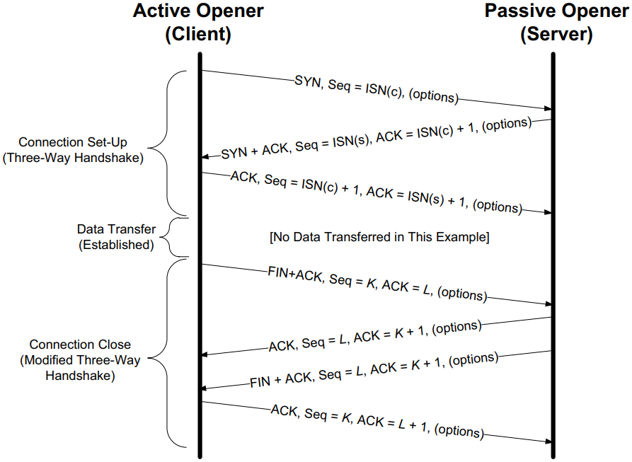

# Transmission Control Protocol (TCP)

[TOC]

The Transmission Control Protocol (TCP) provides a reliable, ordered, byte-stream service between two endpoints. It is connection-oriented, implements flow and congestion control, and uses acknowledgments and retransmissions to recover from packet loss. This note summarizes TCP header fields and options, connection setup/teardown, state transitions, flow/congestion control algorithms, retransmission mechanisms, and practical considerations.

## Quick glossary

- ARQ — Automatic Repeat reQuest (error recovery via retransmission).
- ACK — Acknowledgment.
- RTT — Round‑trip time: time for a small packet to travel to the peer and for the ACK to return.

## Encapsulation and header overview

The TCP header follows the IP header (or the last IPv6 extension header). The base header is 20 bytes; options increase the header up to 60 bytes. Common TCP options include MSS, Timestamps, Window Scaling, and SACK.

### Key header fields

- Source Port / Destination Port — identify application endpoints.
- Sequence Number — byte offset of the first byte in this segment's data within the sender's byte stream.
- Acknowledgment Number — next expected sequence number from the other side (valid when ACK bit is set).
- Data Offset (Header Length) — header size in 32‑bit words.
- Flags — control bits: URG, ACK, PSH, RST, SYN, FIN, plus ECN flags (CWR, ECE).
- Window Size — receiver's advertised window (flow-control credit), 16 bits (scaled via option when used).
- Checksum — covers header and payload (mandatory).
- Urgent Pointer — valid when URG set (rarely used).

Options (common):

| Kind | Name | Purpose |
|---:|---|---|
| 0 | EOL | End of option list |
| 1 | NOP | Padding |
| 2 | MSS | Maximum Segment Size |
| 3 | Window Scale | Window scaling factor (RFC 7323) |
| 4 | SACK Permitted | Indicates SACK support |
| 5 | SACK | Selective ACK blocks |
| 8 | Timestamps | Round‑trip measurement and PAWS |

### 4‑tuple demultiplexing

A TCP connection is uniquely identified by the 4‑tuple: (source IP, source port, destination IP, destination port).

## Connection setup and teardown

### Three‑way handshake (establish)

1. Client → Server: SYN, Seq = x (ClientHello).
2. Server → Client: SYN, ACK, Seq = y, Ack = x+1 (ServerHello + server ISN).
3. Client → Server: ACK, Ack = y+1 (handshake complete).

SYN and FIN consume one sequence number each; lost SYNs are retransmitted.

### Connection termination

Typical close is a four‑segment exchange: FIN from active closer, ACK from peer, FIN from peer, ACK to finish. TCP supports half‑close (one direction closed while the other remains open).

### TIME_WAIT and FIN_WAIT_2

- TIME_WAIT (2·MSL): after active close, TCP remains in TIME_WAIT to allow delayed packets/FIN retransmissions to be handled and to avoid confusion with later connections. The duration is 2×MSL.
- FIN_WAIT_2: the side that sent FIN and received ACK waits for the peer's FIN; poor application behavior may leave sockets in FIN_WAIT_2 indefinitely.

## TCP state diagram

The full state machine governs transitions driven by API calls, incoming segments, and timers. Implementations must handle edge cases (simultaneous open/close, retransmissions).

## Flow control (receiver-driven)

TCP uses window‑based flow control: the receiver advertises how many bytes it can accept (advertised window, awnd). The sender must ensure the bytes in flight do not exceed the usable window.

Usable window W = min(cwnd, awnd), where cwnd is the congestion window (sender's estimate of network capacity) and awnd is the receiver's advertised window.

Sender bookkeeping tracks SND.UNA (oldest unacknowledged), SND.NXT (next sequence number to send), and SND.WND (advertised window).

The receiver maintains a receive buffer and keeps track of the receive window to allow in‑order delivery and buffering of out‑of‑order segments.

## Congestion control (sender‑driven)

TCP congestion control protects the network from overload and adapts the sending rate to observed loss/delay signals. Classic algorithms include:

- Slow Start: exponentially increase cwnd (grow quickly from a small initial window) until loss or ssthresh.
- Congestion Avoidance: increase cwnd approximately linearly (additive increase) to probe for bandwidth.
- Fast Retransmit / Fast Recovery: on duplicate ACKs, retransmit presumed-lost segment and reduce cwnd (avoid full timeout).
- AIMD: additive increase, multiplicative decrease — the core control behavior.

Practical notes:

- Initial Window (IW) recommendations (RFC 5681/RFC 6928) set IW to a few MSS to speed startup safely.
- ECN (Explicit Congestion Notification) allows routers to mark packets instead of dropping and TCP to react to ECN marks.

### Nagle and delayed ACK interaction

The Nagle algorithm reduces small packet overhead by coalescing small writes when unacknowledged data exists. Delayed ACKs reduce ACK traffic by delaying ACK transmission for a short interval. The combination can cause latency (application-level stalls) for certain interactive patterns. Applications that require low latency may disable Nagle (TCP_NODELAY) or structure writes to avoid the interaction.

## Retransmission and loss recovery

### Retransmission timeout (RTO)

RTO is computed from smoothed RTT estimates (SRTT) and RTT variance (RTTVAR) following Jacobson/Karels. Correct timeout tuning reduces spurious retransmissions.

### Fast Retransmit and SACK

Fast retransmit triggers after several duplicate ACKs (dupthresh) and allows rapid recovery for single-packet losses. SACK (Selective Acknowledgment) lets the receiver inform the sender about noncontiguous blocks received so the sender retransmits only missing segments.

### Spurious retransmissions

Packet reordering and variable delays can cause spurious timeouts. Techniques like RTO backoff, adaptive timers, and reordering-aware detection help reduce unnecessary retransmits.

## Timers and keepalives

- RTO timer: drives retransmissions.
- Persist timer: probes a zero-window receiver to detect window updates.
- Keepalive: optional; probes idle connections to detect dead peers (implementation/configurable intervals).

## Practical considerations

- Tuning: MSS, window scaling, SACK, and timestamps improve throughput and robustness on high‑BDP links.
- Security: TCP is susceptible to SYN floods (use SYN cookies) and sequence prediction attacks; modern stacks implement mitigations.
- Measurement: monitor retransmission rates, RTT, cwnd, and socket states to diagnose performance issues.

## References

- W. Richard Stevens, Stephen A. Rago. Unix Network Programming (UNP), 3rd/6th editions and related RFCs.
- RFC 793 (TCP), RFC 1122 (Host Requirements), RFC 5681 (Congestion Control), RFC 7323 (Window Scaling), RFC 2018 (SACK), RFC 6298 (RTO calculation).

