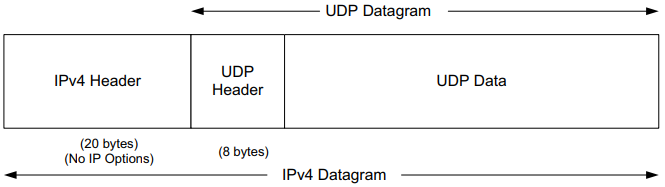
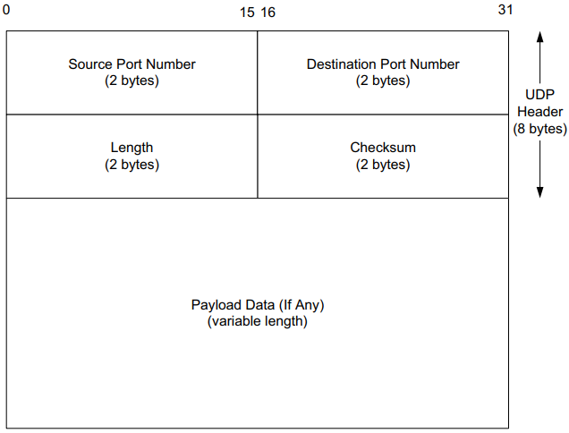
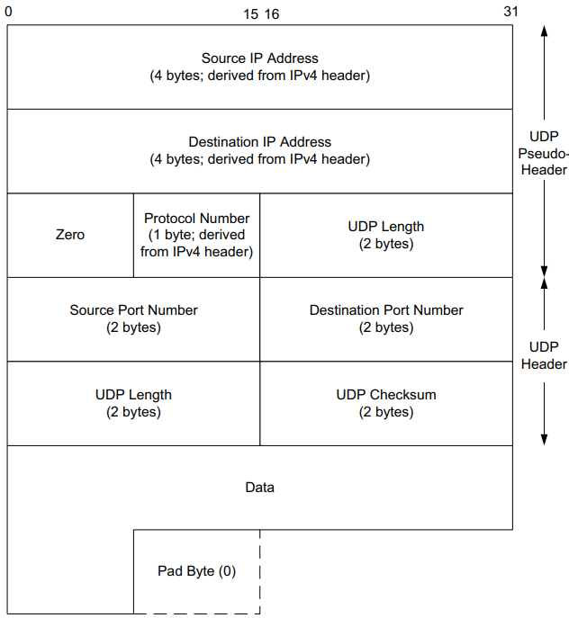
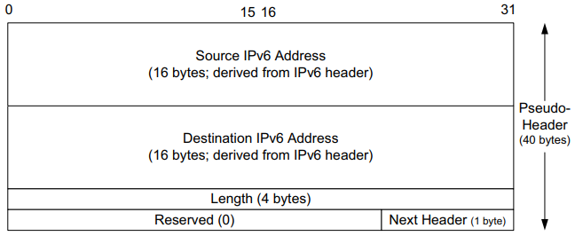
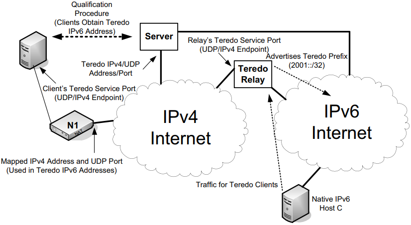
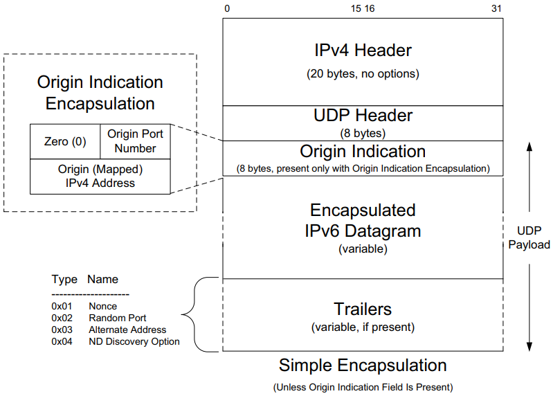
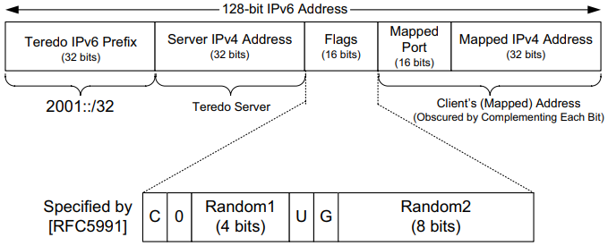
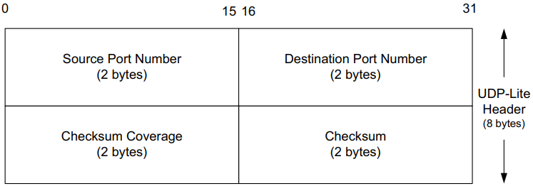
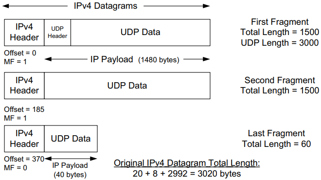

# User Datagram Protocol 

UDP is a simple, datagram-oriented, transport-layer protocol that preserves message boundaries. This protocol provides minimal functionality itself, so applications using it have a great deal of control over how packets are sent and processed.

## IPv4 Datagram

*Encapsulation of a UDP datagram in a single IPv4 datagram (they typical case with no IPv4 options). The IPv6 encapsulation is similar; the UDP header follows the header chain.*

## UDP Header

### IPv4

- `Source Port Number`

- `Destination Port Number`

- `Length`, the length of the UDP header and the UDP data in bytes. (The minimum value for this field is 8 except when UDP is used with IPv6 jumbograms. The IPv4 header contains the datagram's total length, and the IPv6 header contains the payload length.)

  **Notice1: Sending a UDP datagram with 0 bytes of data is acceptable, although rare.**

- `Checksum` the first end-to-end transport-layer checksum we have encountered.

  

  Fields used in computing the checksum for UDP/IPv4 datagrams, including the pseudo-header, the UDP header, and data. If the data is not an even number of bytes, it is padded with one 0 byte for purposes of computing the checksum. The pseudo-header and any pad bytes are not transmitted with the datagram.

- `Payload Data`

### IPv6

- `Source IPv6 Address`
- `Destination IPv6 Address`
- `Length`, this field had expanded from its IPv4 counterpart to 32 bits. 32bits are available to hold the payload length. (This implies that a single UDP/IPv6 datagram could be very large indeed.)
- `Reserved`
- `Next Header`

**Notice1: In IPv6, the minimum MTU size is 1280 bytes(as opposed to the 576 bytes required by IPv4 as the minimum size required to be supported by all hosts).**

**Notice2: Ipv6 supports jumbograms (packets alrger than 65,535 bytes).**

## Teredo

Teredo (also called `Teredo tunneling`) transports IPv6 datagrams in the payload area of UDP/IPv4 datagrams for systems that have no other IPv6 connectivity options.

*Teredo, an IPv6 transition mechanism, encapsulates IPv6 datagrams and optional trailers within the payload area of UDP/IPv4 datagrams to carry IPv6 traffic accross IPv4 only infrastructures. The server helps clients obtain an IPv6 address and determine their mapped addresses and port numbers. Relays, if required, can forward traffic between Teredo, 6to4, and native IPv6 clients.*

### IPv4 Encapsulation Format

*The Simple Encapsulation and Origin Indication Encapsulation formats used by Teredo. The origin Indication Encapsulation carries UDP address and port number information between the UDP header and encapsulated IPv6 datagram. This information is used to inform Teredo clients about their mapped addresses and port numbers when creating a Teredo address. Addresses and port numbers are "obfuscated" by inverting each bit present to fend off NATs that attempt to rewrite this information. Zero or more trailers may be present, encoded as TLV triples. They are used to implement a number of Teredo extensions (e.g., support for symmetric NATs).*

### IPv6 Encapsulation Format

*Teredo clients use IPv6 addresses from the 2001::/32 Teredo prefix. The subsequent bits contain the Teredo server's IPv4 address, 16 flag bits that identify the type of NAT encountered and random bits to help thwart address-guessing attacks, and 16 bits containing the client's mapped port number and the client's mapped 32-bit IPv4 address. The last two values are "obfuscated."*

## UDP-Lite

- `Source Port Number`

- `Destination Port Number`

- `Checksum Coverage`, the number of bytes (starting from the first byte of the UDP-Lite header) covered by the checksum.

  Except for the special value 0, the minimum value is 8, because the UDP-Lite header itself is always required to be covered by the checksum. The value 0 indicates that the entire payload is covered by the checksum, as with conventional UDP. There is a slight issue with IPv6 jumbograms because of the limited space used to hold the `Checksum Coverage` field.

- `Checksum`

## IP Fragmentation

Example: UDP/IPv4 Fragmentation:

*A single UDP datagram with 2992 UDP payload bytes is fragmented into three UDP/IPv4 packets (no options). The UDP header that contains the source and destination port numbers appears only in the first fragment (a complicating factor for firewalls and NATs). Fragmentation is controlled by the `Identification, Fragment Offset, and More Fragments(MF)` fields in the IPv4 header.*

### Maximum UDP Datagram Size

**Theoretically**, the maximum size of an IPv4 datagram is 65,535 bytes, imposed by the 16-bit `Total Length` field in the IPv4 header. With an optionless IPv4 header of 20 bytes and a UDP header of 8 bytes, this leaves a maximum of 65,507 bytes of user data in a UDP datagram. For Ipv6, the 16-bit `Payload Length` field permits an effective UDP payload of 65,527 bytes (8 of the 65,535 IPv6 payload bytes are used for the UDP header), assuming jumborams are not being used. There are two main reasons why a full-size datagram of these sizes may not be delivered end-to-end, however. First, the system's local protocol implementation may have some limitation. Second, the receiving application may not be prepared to handle such large datagrams.

The sockets API [UNP3] provides a set of functions that an application can call to set or query the size of the receive and send buffers. For a UDP socket, this size if directly related to the maximum size of UDP datagram the application can read or write. Typical default values are 8192 bytes or 65,535 bytes, but these can generally be made larger by invoking the `setsockopt()` API call.

UDP programming interfaces allow the application to specify the maximum number of bytes to return each time a network read operation completes. The API `truncates` the datagram, discarding any excess data in the datagram beyond the number of bytes specified by the receiving application.

### Attacks Involving UDP

`Dos attacks`, the successful attacker is able to cause services to be made unavailable to legitimate users.

`Magnification attack`, this type of attack generally involves an attacker sending a small amount of traffic that induces other systems to generate much more.

`Fraggle attack`, a malicious UDP sender forges the IP source address to be that of a victim and sets the destination address to a form of broadcast (e.g., the directed broadcast address).

`teardrop attack`, which involves carefully constructing a series of fragments with overlapping `Fragment Offset` fields that crash or otherwise badly affect some systems.

## Reference

[1] Kevin R. Fall, W. Richard Stevens . TCP/IP Illustrated-Volume1
