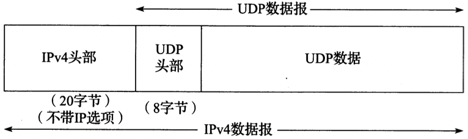
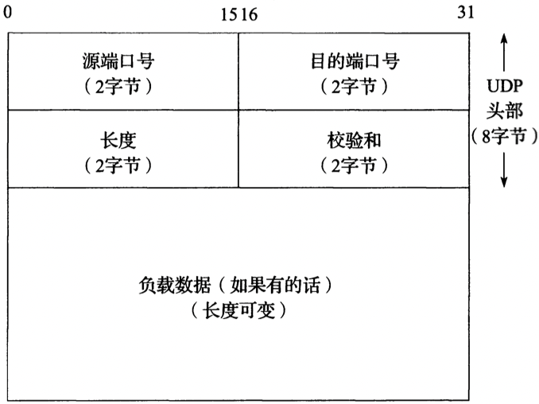
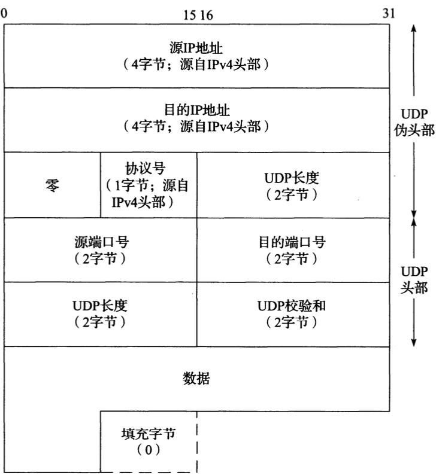
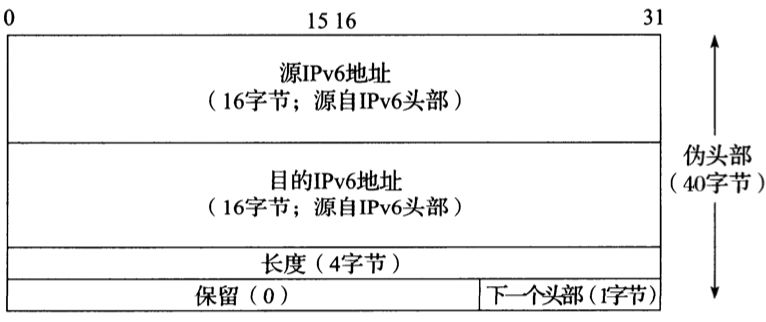
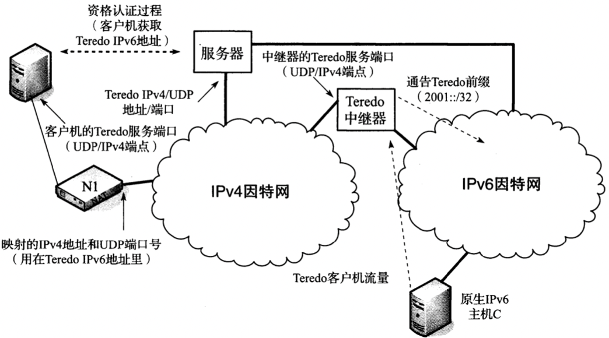
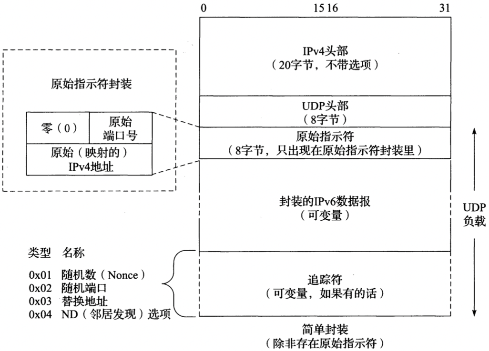
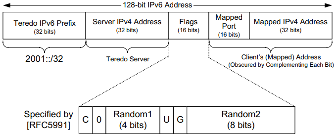
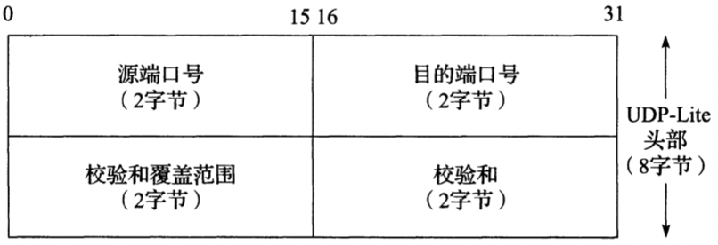
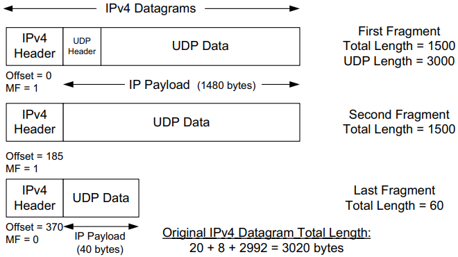

[中文版](udp_zh.md) | English

# UDP Protocol

[TOC]

## Datagram

### IPv4

IPv6 is similar.

## Header

### IPv4

- `Source Port Number`
- `Destination Port Number`
- `Length`
  
  Theoretically, the maximum length of a datagram is 65535 bytes (8 bytes for the UDP header);
  
  The UDP programming interface allows applications to specify the maximum number of bytes returned for each network read operation. If the received datagram exceeds this specified size, the API will `truncate` the datagram.
- `Checksum`
  
  
  
  **Note: When a UDP/IPv4 datagram passes through a NAT, not only must the IP layer header checksum be modified, but the UDP pseudo-header checksum must also be correctly updated, since the IP address and/or UDP port may change.**
- `Payload Data`

### IPv6

- `Source IPv6 Address`
- `Destination IPv6 Address`
- `Length`
- `Reserved`
- `Next Header`

**Notes:**

1. In IPv6, the minimum MTU is 1280 bytes (unlike IPv4, which requires all hosts to support a minimum of 576 bytes);
2. IPv6 supports jumbo datagrams (packets >65535 bytes).

## Teredo

*Teredo is an IPv6 transition mechanism that encapsulates IPv6 datagrams and optional tracers in the payload of UDP/IPv4 datagrams, allowing IPv6 traffic to traverse IPv4-only infrastructure. Servers help clients obtain an IPv6 address and determine their mapped address and port. If needed, relays forward traffic between Teredo, 6to4, and native IPv6 clients.*

### IPv4 Encapsulation

- `Tracer`

  The Teredo tracer is carried after the IPv6 payload encapsulated in the UDP/IPv4 datagram. Each tracer has a type value, name, and interpretation. In some cases, the length is a constant:

  | Type | Length  | Name                | Usage                | Notes                                                  |
  | ---- | ------- | ------------------- | -------------------- | ------------------------------------------------------ |
  | 0x00 | Reserved| Unassigned          | Unassigned           | Unassigned                                             |
  | 0x01 | 0x04    | Nonce               | SNS, UP, PP, SP, HP  | 32-bit random number, used to prevent replay attacks    |
  | 0x02 | Reserved| Unassigned          | Unassigned           | Unassigned                                             |
  | 0x03 | [8, 26] | Alternate Address   | HP                   | Extra address/port for Teredo clients behind same NAT   |
  | 0x04 | 0x04    | ND (Neighbor Disc.) | SLR                  | Allows NAT to update using direct bubble (with NS msg)  |
  | 0x05 | 0x02    | Random Port         | PP                   | Sender's predicted mapped port                         |

### IPv6 Encapsulation

## UDP-Lite

- `Source Port Number`
- `Destination Port Number`
- `Checksum Coverage`
  
  This field gives the number of bytes covered by the checksum (starting from the first byte of the UDP-Lite header). The minimum value is 0, meaning the entire datagram is covered. Values 1~7 are invalid, as the header must always be covered. UDP-Lite uses a different IPv4 protocol number (136) than UDP (17). IPv6 uses the same value in the next header field.
- `Checksum`

## IP Fragmentation

### Maximum Datagram Length

**Theoretically**, the maximum length of an IPv4 datagram is 65535 bytes, determined by the 16-bit `Total Length` field in the IPv4 header. For IPv6, without using jumbo datagrams, the 16-bit `Payload Length` field allows up to 65527 bytes of valid UDP payload. In practice, there are further limitations.

UDP implementations provide a socket API function `setsocketopt()` to set the maximum UDP datagram size.

The UDP programming interface allows applications to specify the maximum number of bytes returned for each network read operation. If the received datagram exceeds this specified size, the API will `truncate` the datagram.

### Reassembly Timeout

When any fragment of a datagram arrives, the IP layer must start a timer. Otherwise, undeliverable fragments could eventually exhaust the receiver's buffer, creating an attack opportunity.

### Example

*A UDP datagram with a 2992-byte payload is fragmented into three UDP/IPv4 packets (no options). The UDP header containing the source and destination port numbers appears only in the first fragment (which complicates things for firewalls and NATs). Fragmentation is controlled by the Identification, Fragment Offset, and More Fragments (MF) fields in the IPv4 header.*

## Security

### IP Fragmentation Attacks

1. `DoS attack`: UDP-based DoS attacks can generate large amounts of traffic instantly, since UDP does not manage its sending rate, negatively impacting other applications.
2. `Amplification attack`: The attacker sends a small amount of traffic, causing other systems to generate much more traffic.
3. `IP fragmentation attack`: Exploits vulnerabilities in IPv4 reassembly code by sending fragments with no data, causing system crashes.
4. `Teardrop attack`: Uses overlapping fragment offsets to craft a series of fragments that can crash or severely affect some systems.

## References

[1] Kevin R. Fall, W. Richard Stevens. TCP/IP Illustrated, 3rd Edition
