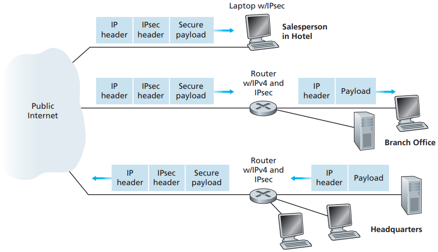

# VPN

[TOC]

The IP security protocol, more commonly known as IPsec, provides security at the network layer. IPsec secures IP datagrams between any two network-layer entities, including hosts and routers. As we will soon describe, many institutions (corporations, government branches, non-profit organizations, and so on) use IPsec to create virtual private networks (VPNs) that run over the public Internet.

*VPN*

## Reference

[1] James F. Kurose, Keith W. Ross . Computer Networking: A Top-Down Approach . 6ED
