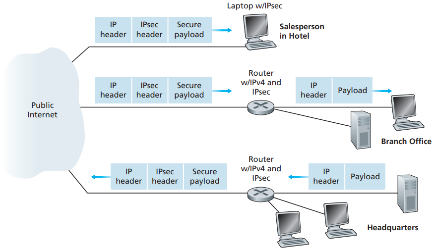
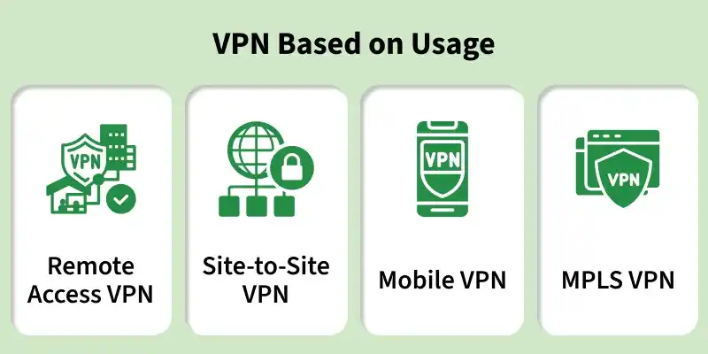
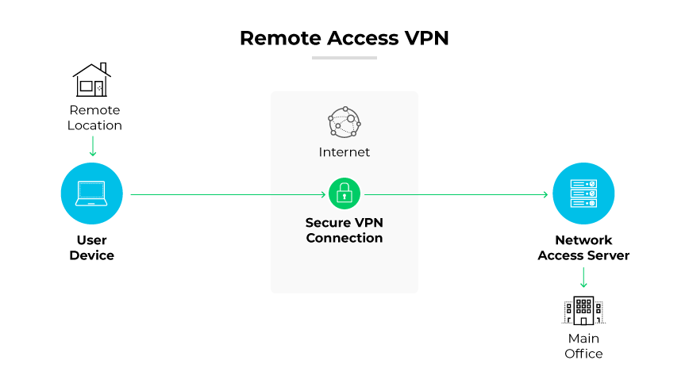
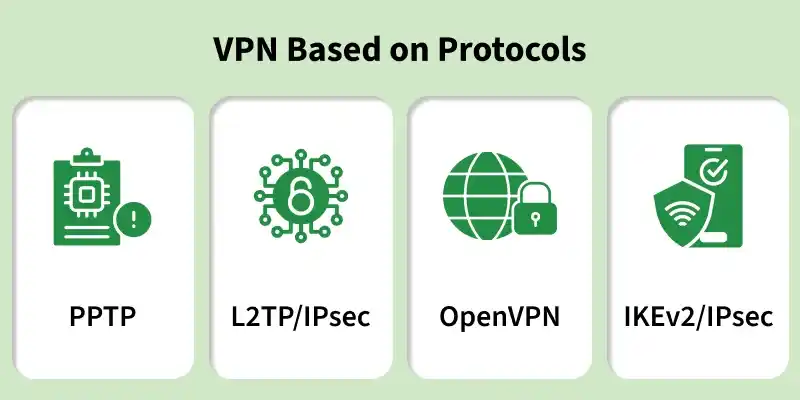

# Virtual Private Networks (VPNs)

[TOC]

VPNs (Virtual Private Networks) provide private, secure connectivity over shared/public networks. Organizations use VPNs to connect remote users to corporate resources (remote‑access VPNs) or to interconnect branch offices and data centers (site‑to‑site VPNs). This note summarizes common VPN technologies, how they secure traffic, and operational considerations.

## Types of VPN

| **Type**                  | **Connection**    | **Typical Users**        | **Use Case**                                  |
| :------------------------ | :---------------- | :----------------------- | :-------------------------------------------- |
| **Remote Access VPN**     | User → Network    | Employees, contractors   | Secure access from home, travel               |
| **Site-to-Site VPN**      | Network → Network | Branch offices, partners | Connecting entire LANs across locations       |
| **Personal/Consumer VPN** | User → Internet   | Individual consumers     | Privacy, geo-spoofing, public Wi-Fi           |
| **Mobile VPN**            | Device → Network  | Mobile workers           | Persistent connection despite network changes |
| **Cloud VPN**             | Cloud resources   | Cloud-native teams       | Secure cloud access without on-prem hardware  |

### Types based on usage(deployment)

#### Remote Access VPN

It allows an individual user to securely connect to a private network over the internet, and it is widely used by employees working remotely.

#### Site-to-Site VPN

It securely connects two or more separate networks, such as a head office and branch offices, so internal communication remains protected across locations.

#### Mobile VPN

It is designed for mobile users and keeps the VPN session stable even when the device switches between Wi-Fi and cellular networks.

#### MPLS VPN

It is a provider-managed enterprise WAN solution that offers scalable connectivity and traffic prioritization, but it typically does not provide end-to-end encryption by default.

### Types based on protocols(tunnelling technology)

#### PPTP

It is an older protocol that can be fast, but it provides weak security, so it is mainly used only for legacy systems.

#### L2TP/IPsec

It combines L2TP tunneling with IPsec encryption, which improves security, but it can add performance overhead.

#### OpenVPN

It is an open-source protocol that uses SSL/TLS for encryption, and it is widely adopted because it provides strong security and flexibility.

#### IKEv2/IPsec

It is a secure and fast protocol that works very well on mobile devices because it reconnects quickly when network conditions change.

---

## VPN Protocols

| **Protocol**      | **Speed** | **Security**    | **Best For**          | **Platform Support**          |
| :---------------- | :-------- | :-------------- | :-------------------- | :---------------------------- |
| **WireGuard**     | Very Fast | Excellent       | Modern general use    | Most platforms (3rd party)    |
| **OpenVPN**       | Moderate  | Excellent       | Enterprise, firewalls | All platforms (3rd party)     |
| **IKEv2/IPsec**   | Fast      | Excellent       | Mobile users          | Native on iOS/Android/Windows |
| **IPsec (IKEv1)** | Moderate  | Good            | Site-to-site          | Universal                     |
| **SSL/TLS**       | Moderate  | Good            | Web-based access      | Browser only (no client)      |
| **L2TP/IPsec**    | Moderate  | Good            | Legacy compatibility  | Native on most OS             |
| **PPTP**          | Fast      | Poor/DEPRECATED | Avoid completely      | Being removed from OS         |

### OpenVPN

OpenVPN is an open-source VPN protocol that uses SSL/TLS to provide secure authentication and encryption.

### WireGuard

WireGuard is a modern VPN protocol designed to be lightweight, fast, and easier to secure due to a small codebase.

### IKEv2/IPsec

IKEv2/IPsec uses IKEv2 to set up secure tunnels and IPsec to provide encryption and integrity.

### L2TP/IPsec

L2TP/IPsec combines L2TP tunnelling with IPsec encryption to secure traffic.

### PPTP

PPTP is an older VPN protocol that is fast but not secure by modern standards.

### SSTP

SSTP is a Microsoft VPN protocol that tunnels traffic over SSL/TLS using TCP port 443.

---

## References

[1] RFC 4301: Security Architecture for the Internet Protocol

[2] RFC 5996 / RFC 7296: IKEv2

[3] RFC 2401–2412: IPsec (historical foundational RFCs)

[4] WireGuard documentation and modern deployment guides

[5] Kurose & Ross. Computer Networking: A Top‑Down Approach (VPN and IPsec sections)

[6] [Types of Virtual Private Network (VPN) and its Protocols](https://www.geeksforgeeks.org/computer-networks/types-of-virtual-private-network-vpn-and-its-protocols/)

