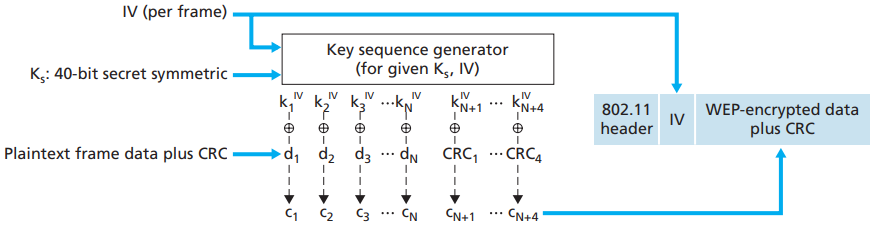

# WEP

[TOC]

WEP does not specify a key management algorithm, so it is assumed that the host and wireless access point have somehow agreed on the key via an out-of-band method. Authentication is carried out as follows:

1. WEP does not specify a key management algorithm, so it is assumed that the host and wireless access point have somehow agreed on the key via an out-of-band method. Authentication is carried out as follows.
2. The access point responds to the authentication request with a 128-byte nonce value.
3. The wireless host encrypts the nonce using the symmetric key that it shares with the access point.
4. The access point decrypts the host-encrypted nonce.

If the decrypted nonce matches the nonce value originally sent to the host, then the host is authenticated by the access point.

*802.11 WEP Protocol*

## Reference

[1] James F. Kurose, Keith W. Ross . Computer Networking: A Top-Down Approach . 6ED