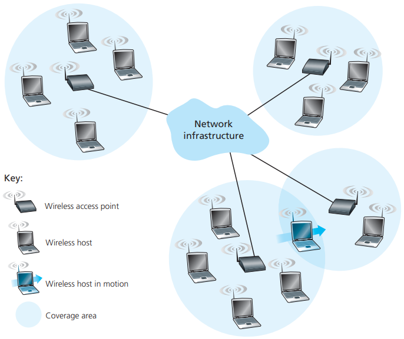
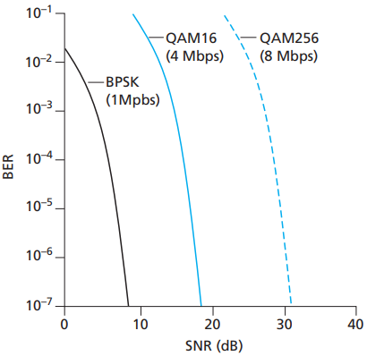

# WIFI

[TOC]

## Wireless Network

*Elements of a wireless network*

- `Wireless links`.
- `Base station`.
- `Network infrastructure`.

A number of important differences between a wired link and a wireless link:

- `Decreasing signal strength`.
- `Interference from other sources`.
- `Multipath propagation`.

## Signal Strength

`The signal-to-noise ratio (SNR)` is a relative measure of the strength of the received signal (i.e., the information being transmitted) and this noise.

There are several physical-layer characteristics:

*Bit error rate, transmission rate, and SNR*

- `For a given modulation scheme, the higher the SNR, the lower the BER`.
- `For a given SNR, a modulation technique with a higher bit transmission rate (whether in error or not) will have a higher BER`.
- `Dynamic selection of the physical-layer modulation technique can be used to adapt the modulation technique to channel conditions`.

## Reference

[1] James F. Kurose, Keith W. Ross . Computer Networking: A Top-Down Approach . 6ED