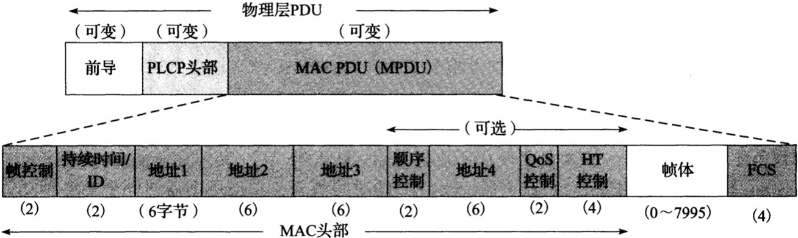
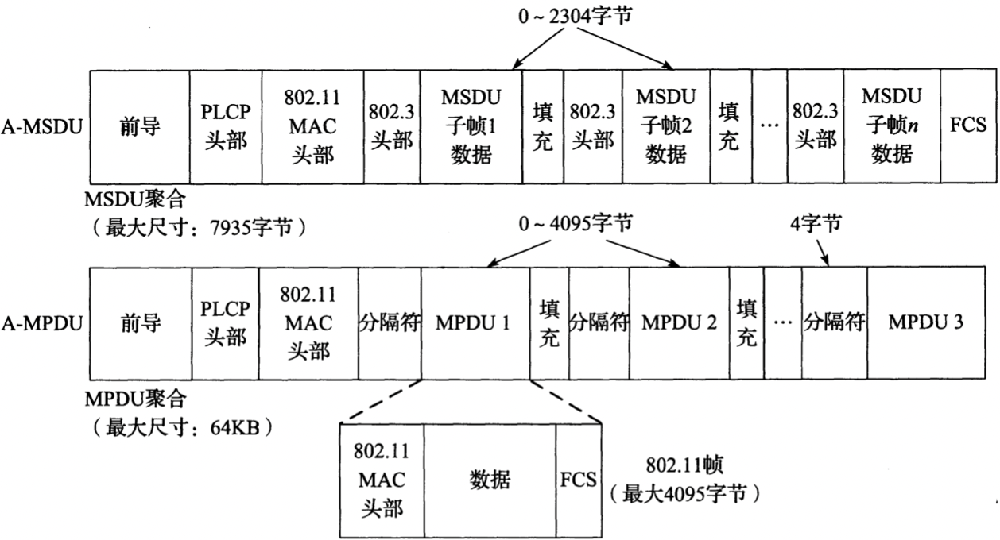
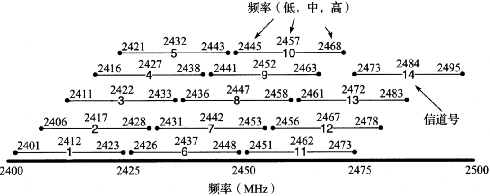
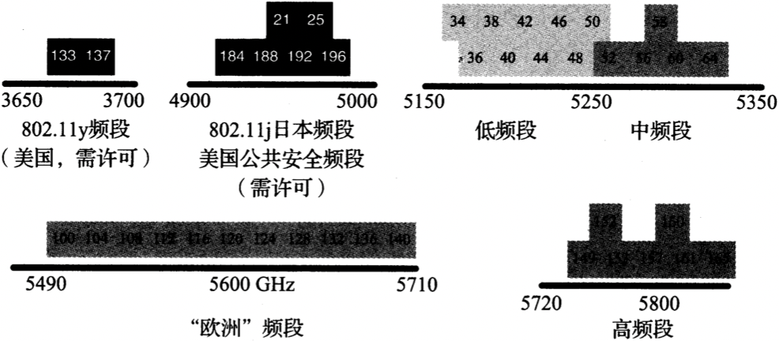

# WIFI

<!-- vim-markdown-toc GFM -->

* [术语](#术语)
* [帧](#帧)
    - [数据帧，分片和聚合](#数据帧分片和聚合)
    - [省电模式](#省电模式)
    - [时间同步功能](#时间同步功能)
* [物理层](#物理层)
    - [信道和频率](#信道和频率)
* [网状网](#网状网)
* [安全](#安全)

<!-- vim-markdown-toc -->


`无线保真（Wi-Fi）` 是一种常用的无线以太网标准（802.11）。


## 术语

`网状网（Mesh）`

`混合无线路由协议（HWRP）`

`hoc按需距离向量（AODV）`

`优化链路状态路由（OLSR）`

`有线等效保密（WEP）`

`临时密钥完整性协议（TKIP）`

`预设置共享密钥（PSK）`

`计数器模式（CCM）`

`密码块链接消息认证码（CBC-MAC）`

`强健安全网络（RSN）`

`强健安全网络访问（RSNA）`


## 帧



*802.11基本数据帧格式（见[802.11n-2009]）。MPDU格式类似于以太网，但取决于接入点之间使用的DS类型：帧是发送到DS还是来自它，以及帧是否被聚合。QoS控制字段用于特殊功能，HT控制字段用于控制802.11n的“高吞吐量”功能*

- `前导码` 用于同步

- `PLCP头部` 以独立于物理层的方式提供特定的物理层信息

- `MPDU` 

  - `帧控制` 2位类型字段，用于识别帧的类型：

    - `管理帧` 用于创建，维持，终止站，接入点之间的连接，是否采用加密，传输网络名称（SSID和ESSID），支持哪种传输速率，以及采用的时间数据库等。

    - `控制帧` 用于流量控制；

      1. 支持可选的`请求发送/明确发送（RTS/CTS）`，通过放缓传输来进行流量控制；

         `RTS/CTS`阈值可以通过以下命令设置：

         ```sh
         iwconfig wlan0 rts 250
         ```

      2. 采用`重传/确认（ACK）`方法来扩展802.3重传机制，对预期在一定时间内接受一个单播帧（802.11a/b/g）或一组帧（802.11n或带“块确认”的802.11e）的响应，以避免组播/广播时的"ACK爆炸"问题；

    - `数据帧`

  - `持续时间/ID` 

### 数据帧，分片和聚合

802.11支持`帧分片`，可以将一个帧分为多个分片；根据802.11n的规定，它也支持`帧聚合`，可将多个帧合并发送以减少开销。

`分片`有用的原因在于其出错的概率。如果误码率（Bit Error Rate，BER）为$P$，1位数据成功交付的概率为$(1-P)$，$N$位成功交付的概率为$(1-P)^N$。随着N的增长，这个值逐渐减小；因此如果我们减少一个帧的大小，理论上可改善错误交付的概率。

`聚合的MAC服务数据单元（A-MSDU）` 可将多个完整的802.3（以太网）帧聚合在一个802.11帧中。

`聚合的MAC协议数据单元（A-MPDU）` 可将多个具有相同源，目的和QoS的MPDU聚合为短帧。



*802.11n中的帧聚合包括A-MSDU和A-MPDU。A-MSDU使用一个FCS聚合多个帧。A-MPDU在集合的每个802.11帧之间使用一个4字节的分隔符。每个A-MPDU拥有自己的FCS，并可以分别使用ACK确认，以及在必要时重传*

### 省电模式

`省电模式（PSM）` 为了节省电源，在使用PSM时，STA的输出帧在帧控制字段中设置1位。当AP发现某些帧的该位置被设置时，它会缓冲该帧直到需要时为止。

`自动省电交付模式（APSD）` 使用QoS控制字中的一些子字段。

### 时间同步功能

Wifi采用`时间同步功能（TSF）`。每个站保持一个64位计数器的参考时间（微秒），这个时间与网络中的其它站保持同步（延迟在4微秒+PHY之内）。


## 物理层

802.11标准中描述的物理层部分：

| 标准（条款）      | 速率（Mb/s）                                            | 频率范围；调制                               | 信道设置                                               |
| ----------------- | ------------------------------------------------------- | -------------------------------------------- | ------------------------------------------------------ |
| 802.11a（第17条） | 6, 9, 12, 18, 24, 36, 48,  54                           | 5.16GHz～5.35GHz和5.725~5.825GHz; OFDM       | 37~164（根据国家不同），20MHz/10MHz/5MHz信道宽度选项   |
| 802.11b（第18条） | 1, 2, 5.5, 11                                           | 2.401GHz~2.495GHz; DSSS                      | 1~14（根据国家不同）                                   |
| 802.11g（第19条） | 1, 2, 5.5, 6, 9, 11, 12, 18, 24, 36, 48, 54（加22, 23） | 2.401GHz~2.495GHz; OFDM                      | 1~14（根据国家不同）                                   |
| 802.11n           | 6.5~600，很多选项（最多4个MIMO流）                      | 2.4GHz和5GHz模式，信道宽度20MHz或40MHz; OFDM | 1~13（2.4GHz频段）；36~196（5GHz频段）（根据国家不同） |
| 802.11y           | （与802.11-2007相同）                                   | 3.650GHz~3.7GHz（需要许可）；OFDM            | 1~25，36~64，100~161（根据国家不同）                   |

### 信道和频率



*802.11b和802.11g标准使用2.4GHz和2.5GHz之间的频段。这个频段被划分为14个22MHz宽的重叠信道，其中一些子集是否可合法使用取决于所在国家。在同一个地址运行多个基站，分配非重叠的信道是可取的做法，例如美国的1，6和11。只有一个40MHz的802.11n信道可用于此频段而不会发生重叠*



*20MHz信道中的一些可用的802.11信道号和中心频率。最常见的无须许可使用的频率范围包括U-NII频段，它们均在5GHz之上。较低频段被批准可用于大多数国家。“欧洲”频段被批准用于大多数欧洲国家，高频段被批准用于美国和中国。802.11a/y信道的典型宽度为20MHz，但802.11n的信道宽度可能为40MHz。另外，在日本也可使用窄信道和某些信道（未显示）*


## 网状网

TODO


## 安全

Wi-Fi安全已从不安全的WEP演变到WPA，再到当前标准的WPA2方案：

| 名称/标准        | 密码 | 密钥流管理     | 认证                |
| ---------------- | ---- | -------------- | ------------------- |
| WEP（预RSNA）    | RC4  | （WEP）        | PSK，（802.1X/EAP） |
| WPA              | RC4  | TKIP           | PSK，802.1X/EAP     |
| WPA2/802.11（i） | CCMP | CCMP，（TKIP） | PSK，802.1 X/EAP    |
