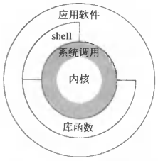
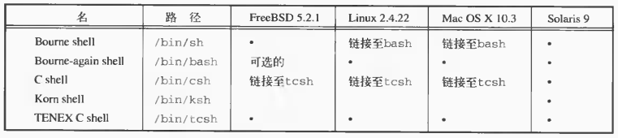
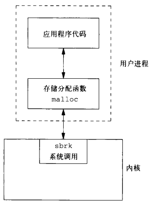
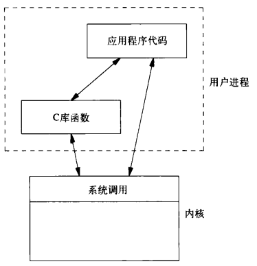

# 第一张 UNIX基础知识

[TOC]


## 1.1 引言


## 1.2 UNIX体系结构



*UNIX操作系统的体系结构*


## 1.3 登录



*UNIX系统常见shell*


## 1.4 文件和目录

例：

```c++
#include "apue.h"
#include <dirent.h>

int 
main(int argc, char *argv[])
{
    DIR *dp;
    struct dirent *dirp;
    if (argc != 2)
        err_quit("usage: ls directory_name");
    if ((dp = opendir(argv[1])) == NULL)
        err_sys("can't open %s", argv[1]);
    while ((dirp = readdir(dp)) != NULL)
        printf("%s\n", dirp->d_name);
    closedir(dp);
    exit(0);
}
```

*列出一个目录中的所有文件*


## 1.5 输入和输出

例：

```c++
#include "apue.h"

#define BUFFSIZE 4096

int 
main(void)
{
    int n;
    char buf[BUFFSIZE];
    while ((n = read(STDIN_FILENO, buf, BUFFSIZE)) > 0)
        if (write(STDOUT_FILENO, buf, n) != n)
            err_sys("write error");
    if (n < 0)
        err_sys("read error");
    exit(0);
}
```

*将标准输入复制到标准输出*

例：

```c++
#include "apue.h"

int 
main(void)
{
    int c;
    while ((c = getc(stdin)) != EOF)
        if (putc(c, stdout) == EOF)
            err_sys("output error");
    if (ferror(stdin))
        err_sys("input error");
    exit(0);
}
```

*用标准I/O将标准输入复制到标准输出*


## 1.6 程序和进程

例：

```c++
#include "apue.h"
int 
main(void)
{
    printf("hello world from process ID%d\n", getpid());
    exit(0);
}
```

*打印进程ID*

例：

```c++
#include "apue.h"
#include <sys/wait.h>

int 
main(void)
{
    char buf[MAXLINE];
    pid_t pid;
    int status;
    
    printf("%% ");
    while (fgets(buf, MAXLINE, stdin) != NULL) {
        if (buf[strlen(buf) - 1] == '\n')
            buf[strlen(buf) - 1] = 0;
        if ((pid = fork()) < 0) {
            err_sys("fork error");
        } else if (pid == 0) {
            execlp(buf, buf, (char *)0);
            err_ret("couldn't execute: %s", buf);
            exit(127);
        }
        
        if ((pid = waitpid(pid, &status, 0)) < 0)
            err_sys("waitpid error");
        printf("%% ");
    }
    exit(0);
}
```

*从标准输入读命令并执行*


## 1.7 出错处理

```c++
#include <string.h>
char *strerror(int errnum);
```

- `errnum` 错误码
- `返回值` 指向消息字符串的指针

*将错误码映射为错误信息字符串*

```c++
#include <stdio.h>
void perror(const char *msg);
```

- `msg` 返回的错误信息

*根据当前错误码输出错误信息*

例：

```c++
#include "apue.h"
#include <errno.h>

int 
main(int argc, char *argv[])
{
    fprintf(stderr, "EACCES: %s\n", strerror(EACCES));
    errno = ENOENT;
    perror(argv[0]);
    exit(0);
}
```

*strerror和perror*


## 1.8 用户标识

例：

```c++
#include "apue.h"
int 
main(void)
{
    printf("uid = %d, gid = %d\n", getuid(), getgid());
    exit(0);
}
```

*打印用户ID和组ID*


## 1.9 信号

信号的处理方式：

- 忽略信号；
- 默认处理；
- 捕捉信号。

例：

```c++
#include "apue.h"
#include <sys/wait.h>

static void sig_int(int);

int 
main(void)
{
    char buf[MAXLINE];
    pid_t pid;
    int status;
    
    if (signal(SIGINT, sig_int) == SIG_ERR)
        err_sys("signal error");
    printf("%% ");
    while (fgets(buf, MAXLINE, stdin) != NULL) {
        if (buf[strlen(buf) - 1] == '\n')
            buf[strlen(buf) - 1] = 0;
        if ((pid = fork()) < 0) {
            err_sys("fork error");
        } else if (pid == 0) {
            execlp(buf, buf, (char *)0);
            err_ret("couldn't execute: %s", buf);
            exit(127);
        }
        if ((pid = waitpid(pid, &status, 0)) < 0)
            err_sys("waitpid error");
        printf("%% ");
    }
    exit(0);
}

void 
sig_int(int signo)
{
    printf("interrupt\n%% ");
}
```

*从标准输入读命令并执行*


## 1.10 时间值

当度量一个进程的执行时间时，UNIX系统使用三个进程时间值：

- 时钟时间
- 用户CPU时间
- 系统CPU时间


## 1.11 系统调用和库函数



*malloc函数和sbrk系统调用*



*C库函数和系统调用之间的差别*


## 1.12 小结

