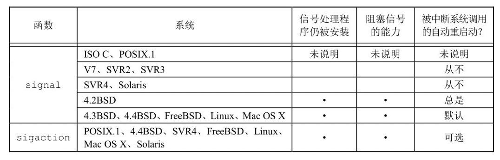
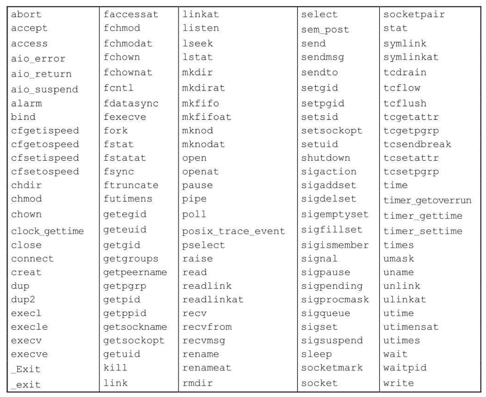

# 第十章 信号

[TOC]


## 10.1 引言


## 10.2 信号概念

每个信号名字都以`SIG`开头，定义在内核头文件`<signal.h>`中，用户级头文件若要使用这些信号，需要包含以下头文件：

| 系统                         | 头文件                   |
| ---------------------------- | ------------------------ |
| FreeBSD 8.0，Mac OS X 10.6.8 | `<sys/signal.h>`         |
| Linux 3.2.0                  | `<bit/signum.h>`         |
| Solaris 10                   | `<sys/iso/signal_iso.h>` |

### 产生信号的方式

- 用户按某些终端键
- 硬件异常
- 进程调用kill(2)函数
- 进程调用kill(1)函数
- 当检测到某种软件条件

### 处理信号的方式

- 忽略信号
- 捕捉信号
- 执行系统默认动作

### UNIX系统信号

| 名字       | 说明                          | 默认动作        |
| ---------- | ----------------------------- | --------------- |
| SIGABRT    | 异常终止（abort）             | 终止+core       |
| SIGALRM    | 定时器超时（alarm）           | 终止            |
| SIGBUS     | 硬件故障                      | 终止+core       |
| SIGCANCEL  | 线程库内部使用                | 忽略            |
| SIGCHLD    | 子进程状态改变                | 忽略            |
| SIGCONT    | 使暂停进程继续                | 继续/忽略       |
| SIGEMT     | 硬件故障                      | 终止+core       |
| SIGFPE     | 算术异常                      | 终止+core       |
| SIGFREEZE  | 检查点冻结                    | 忽略            |
| SIGHUP     | 连接断开                      | 终止            |
| SIGILL     | 非法硬件指令                  | 终止+core       |
| SIGINFO    | 键盘状态请求                  | 忽略            |
| SIGINT     | 终端中断符                    | 终止            |
| SIGIO      | 异步I/O                       | 终止/忽略       |
| SIGIOT     | 硬件故障                      | 终止+core       |
| SIGJVM1    | java虚拟机内部使用            | 忽略            |
| SIGJVM2    | java虚拟机内部使用            | 忽略            |
| SIGKILL    | 终止                          | 终止            |
| SIGLOST    | 资源丢失                      | 终止            |
| SIGLWP     | 线程库内部使用                | 终止/忽略       |
| SIGPIPE    | 写至无读进程的管道            | 终止            |
| SIGPOLL    | 可轮询时间（poll）            | 终止            |
| SIGPROF    | 梗概时间超时（setitimer）     | 终止            |
| SIGPWR     | 电源失效/重启动               | 终止/忽略       |
| SIGQUIT    | 终端退出符                    | 终止+core       |
| SIGSEGV    | 无效内存引用                  | 终止+core       |
| SIGSTKFLT  | 协处理器栈故障                | 终止            |
| SIGSTOP    | 停止                          | 停止进程        |
| SIGSYS     | 无效系统调用                  | 终止+core       |
| SIGTERM    | 终止                          | 终止            |
| SIGTHAW    | 检查点解冻                    | 忽略            |
| SIGTHR     | 线程库内部使用                | 忽略            |
| SIGTRAP    | 硬件故障                      | 终止+core       |
| SIGTSTP    | 终端停止符                    | 停止进程        |
| SIGTTIN    | 后台读控制tty                 | 停止进程        |
| SIGTTOU    | 后台写向控制tty               | 停止进程        |
| SIGURG     | 紧急情况（套接字）            | 忽略            |
| SIGUSR1    | 用户定义信号                  | 终止            |
| SIGUSR2    | 用户定义信号                  | 终止            |
| SIGVTALRM  | 虚拟时间闹钟（setitimer）     | 终止            |
| SIGWAITING | 线程库内部使用                | 忽略            |
| SIGWINCH   | 终端窗口大小改变              | 忽略            |
| SIGXCPU    | 超过CPU限制（setrlimit）      | 终止或终止+core |
| SIGXFSZ    | 超过文件长度限制（setrlimit） | 终止或终止+core |
| SIGXRES    | 超过资源控制                  | 忽略            |

- `SIGABRT` 调用abort函数时产生此信号，进程异常终止。
- `SIGALRM` 当用alarm函数设置的定时器超时时，产生此信号；若由setitimer(2)函数设置的间隔时间已经超时时，也产生此信号。
- `SIGBUS` 指示一个实现定义的硬件故障；当出现某些类型的内存故障时，实现常常产生此种信号。
- `SIGCANCEL` 这是Solaris线程库内部使用的信号，不适用于一般应用。
- `SIGCHLD` 在一个进程终止或停止时，SIGCHLD信号被送给其父进程；按系统默认，将忽略此信号。
- `SIGCONT` 此作业控制信号发送给需要继续运行，但当前处于停止状态的进程；如果接收到此信号的进程处于停止状态，则系统默认动作是使该进程继续运行，否则默认动作是忽略此信号。
- `SIGEMT` 指示一个实现定义的硬件故障。
- `SIGFPE` 此信号表示一个算术运算异常，如除以0，浮点溢出等。
- `SIGFREEZE` 此信号仅由Solaris定义，它用于通知进程在冻结系统状态之前需要采取特定动作。
- `SIGHUP` 如果终端接口检测到一个连接断开，则将此信号送给与该终端相关的控制进程（会话首进程）；此信号被送给session结构中s_leader字段所指向的进程；仅当终端的CLOCAL标志**没有**设置时，在上述条件下才产生此信号。
- `SIGILL` 此信号表示进程已执行一条非法硬件指令。
- `SIGINFO` 这是一种BSD信号，当用户按状态键（一般采用Ctrl+T）时，终端驱动程序产生此信号并发送至前台进程组中的每一个进程；此信号通常造成在终端上显示前台进程组中各进程的状态信息。
- `SIGINT` 当用户按中断键（一般采用Delete或Ctrl+C）时，终端驱动程序产生此信号并发送至前台进程组中的每一个进程；当一个进程在运行时失控，特别是它正在屏幕上产生大量不需要的输出时，常用此信号终止它。
- `SIGIO` 此信号指示一个异步I/O事件。
- `SIGIOT` 这指示一个实现定义的硬件故障。
- `SIGJVM1` Solaris上为Java虚拟机预留的一个信号。
- `SIGJVM2` Solaris上为Java虚拟机预留的另一个信号。
- `SIGKILL` 这是两个不能被捕捉或忽略信号中的一个；它向系统管理员提供了一种可以杀死任一进程的可靠方法。
- `SIGLOST` 运行在Solaris NFSv4客户端系统中的进程，恢复阶段不能重新获得锁，此时将由这个信号通知该进程。
- `SIGLWP` 此信号由Solaris线程库内部使用，并不做一半使用。
- `SIGPIPE` 如果在管道的读进程已终止时写管道，则产生此信号。
- `SIGPOLL` 这个信号在SUSv4中已被标记为弃用，将来的标准可能会将此信号移除。
- `SIGPROF` 这个信号在SUSv4中已被标记为弃用，将来的标准可能会将此信号移除。
- `SIGPWR` 这是一种依赖于系统的信号；它主要用于具有不间断电源（UPS）的系统，如果电源失效，则UPS起作用，而且通常软件会接到通知。
- `SIGQUIT` 当用户在终端上按退出键（一般采用Ctrl+\）时，中断驱动程序产生此信号，并发送给前台进程组中的所有进程；此信号不仅终止前台进程组（如SIGINT所做的那样），同时产生一个core文件。
- `SIGSEGV` 指示进程进行了一次无效的内存引用，SEGV(segmentation violation, 段违例)。
- `SIGSTKFLT` 此信号仅由Linux定义。
- `SIGSTOP` 这是一个作业控制信号，它停止一个进程。它类似于交互停止信号（SIGTSTP），但是SIGSTOP不能被捕捉或忽略。
- `SIGSYS` 该信号指示一个无效的系统调用。由于某种未知原因，进程执行了一条机器指令，内核认为这是一条系统调用，但该指令指示系统调用类型的参数却是无效的。
- `SIGTERM` 这是由kill(1)命令发送的系统默认终止信号。由于该信号是由应用程序捕获的，使用SIGTERM也让程序有机会在退出之前做好清理工作，从而优雅地终止（相对于SIGKILL而言。SIGKILL不能被捕捉或忽略）。
- `SIGTHAW` 此信号仅由Solaris定义。在被挂起的系统恢复时，该信号用于通知相关进程，他们需要采取特定动作。
- `SIGTHR` FreeBSD线程库预留的信号，它的值定义或与SIGLWP相同。
- `SIGTRAP` 指示一个实现定义的硬件故障。
- `SIGTSTP` 交互停止信号，当用户在终端上按挂起键（一般采用Ctrl+Z）时，终端驱动程序产生此信号。该信号发送至前台进程组中的所有进程。
- `SIGTTIN` 当一个后台进程组进程试图读其控制终端时，终端驱动程序产生此信号。下列例外情况不产生此信号：
  - 读进程忽略或阻塞此信号
  - 读取进程所属的进程组是孤儿进程组，此时读操作返回出错，errno设置为EIO
- `SIGTTOU` 当一个后台进程组进程试图写其控制终端时，终端驱动程序产生此信号。与`SIGTTIN`信号不同，一个进程可以选择允许后台进程写控制终端。如果不允许后台进程写，则也有两种情况不产生信号：
  - 写进程忽略或阻塞此信号
  - 写进程所属进程组是孤儿进程组
- `SIGURG`  此信号通知进程已经发生一个紧急情况。在网络连接上接到带外的数据时，可选择地产生此信号。
- `SIGUSR1` 这是一个用户定义的信号，可用于应用程序。
- `SIGUSR2` 这是另一个用户定义的信号，与SIGUSR1相似，可用于应用程序。
- `SIGVTALRM` 当一个由setitimer(2)函数设置的虚拟间隔时间已经超时时，产生此信号。
- `SIGWAITING` 此信号由Solaris线程库内部使用，不做他用。
- `SIGWINCH` 内核维持与每个终端或伪终端相关良窗口的大小。进程可以用ioctl函数得到或设置窗口的大小。如果进程用ioctl的设置窗口大小命令更改了窗口大小，则内核将SIGWINCH信号发送至前台进程组。
- `SIGXCPU` Single UNIX Specification的XSI扩展支持资源限制的概念；如果进程超过了其软CPU时间限制，则产生此信号。
- `SIGXFSZ` 如果进程超过了其软文件长度限制，则产生此信号。
- `SIGXRES` 此信号仅由Solaris定义。可选择地使用此信号以通知进程超过了预配置的资源值。Solaris资源限制机制是一种通用设施，用于控制在独立应用集之间共享资源的使用。

### 不产生core文件的情况

- 进程是设置用户ID的，而且当前用户并非程序文件的所有者。
- 进程是设置组ID的，而且当前用户并非该程序文件的组所有者。
- 用户没有写当前工作目录的权限。
- 文件已存在且用户对该文件设有写权限。
- 文件太大超过了`RLIMIT_CORE`限制。


## 10.3 函数signal

```c
#include <signal.h>
void(*signal(int signo, void(*func)(int)))(int);
```

- `signo` 信号量
- `func` 信号处理动作，默认SIG_IGN
- 返回值
  - 成功：返回以前的信号处理配置
  - 出错：返回SIG_ERR

例，捕捉SIGUSR1和SIGUSR2的简单程序：

```c
#include "apue.h"

static void sig_usr(int);

int 
main(void)
{
  if (signal(SIGUSR1, sig_usr) == SIG_ERR)
    err_sys("can't catch SIGUSR1");
  if (signal(SIGUSR2, sig_usr) == SIG_ERR)
    err_sys("can't catch SIGUSR2");
  for (;;)
    pause();
}

static void
sig_usr(int signo)
{
  if (signo == SIGUSR1)
    printf("received SIGUSR1\n");
  else if (signo == SIGUSR2)
    printf("received SIGUSR2\n");
  else
    err_dump("received signal %d\n", signo);
}
```


## 10.4 不可靠的信号

4.2BSD对信号机制进行了更改，提供了被称为可靠信号的机制。然后，SVR3也修改了信号机制，提供了System V可靠信号机制。POSIX.1选择了BSD模型作为其标准化的基础。


## 10.5 中断的系统调用

如果进程在执行一个低速系统调用而阻塞期间捕捉到一个信号，则该系统调用就被中断不再继续执行。

低速系统调用是可能会使进程永远阻塞的一类系统调用，包括：

- 如果某些类型文件（如读管道，终端设备和网络设备）的数据不存在，则读操作可能会使调用者永远阻塞；
- 如果这些数据不能被相同的类型文件立即接受，则写操作可能会使调用者永远阻塞；
- 在某种条件发生之前打开某些类型文件，可能会发生阻塞（例如要打开一个终端设备，需要先等待与之连接的调制解调器应答）；
- pause函数（按照定义，它使调用进程休眠直至捕捉到一个信号）和wait函数；
- 某些ioctl操作；
- 某些进程间通信函数。

几种信号实现所提供的功能：




## 10.6 可重入函数

信号处理程序可以调用的可重入函数：



例，在信号处理程序中调用不可再入函数：

```c
#include "apue.h"
#include <pwd.h>

static void
my_alarm(int signo)
{
  struct passwd *rootptr;
  
  printf("in signal handler\n");
  if ((rootptr = getpwnam("root")) == NULL)
    err_sys("getpwnam(root) error");
  alarm(1);
}

int
main(void)
{
  struct passwd *ptr;
  
  signal(SIGALRM, my_alarm);
  alarm(1);
  for (;;) {
    if ((ptr = getpwnam("sar")) == NULL)
      err_sys("getpwnam error");
    if (strcmp(ptr->pw_name, "sar") != 0)
      printf("return value corrupted!, pw_name = %s\n", ptr->pw_name);
  }
}
```


## 10.7 SIGCLD语义

例，不能正常工作的System V SIGCLD处理程序：

```c
#include "apue.h"
#include <sys/wait.h>

static void sig_cld(int);

int main()
{
  pid_t pid;
  if (signal(SIGCLD, sig_cld) == SIG_ERR)
    perror("signal error");
  if ((pid = fork()) < 0) {
    perror("fork error");
  } else if (pid == 0) {
    sleep(2);
    _exit(0);
  }
  
  pause();
  exit(0);
}

static void
sig_cld(int signo)
{
  pid_t pid;
  int status;
  
  printf("SIGCLD received\n");
  
  if (signal(SIGCLD, sig_cld) == SIG_ERR)
    perror("signal error");
  
  if ((pid = wait(&status)) < 0)
    perror("wait error");
  
  printf("pid = %d\n", pid);
}
```


## 10.8 可靠信号术语和语义

信号排队：多次递送该信号。

信号屏蔽字（signal mask）：规定了当前要阻塞递送到该进程的信号集，对于每种可能的信号，该屏蔽字中都有一位与之对应；若某种信号的对应位已设置，则它当前是阻塞的。


## 10.9 函数kill和raise

```c
#include <signal.h>
int kill(pid_t pid, int signo);
int raise(int signo);
```

- `pid` 进程ID
- `signo` 信号
- 返回值
  - 成功：0
  - 失败：-1

`kill`将信号发送给进程或进程组

`raise`允许进程向自身发送信号

`raise(signo)`等价于`kill(getpid(), signo)`

`kill`的pid有4种情况：

- `pid>0` 将该信号发送给进程ID为pid的进程
- `pid==0` 将该信号发送给与发送进程属于同一进程组的所有进程（这些进程的进程组ID等于发送进程的进程组ID），而且发送进程具有权限向这些进程发送信号。
- `pid<0` 将该信号发送给其他进程组ID等于pid绝对值，而且发送进程具有权限向其发送信号的所有进程。
- `pid==-1` 将该信号发送给发送进程有权向向他们发送信号的所有进程。

如果signo参数是0，则kill仍执行正常的错误检查，但不发送信号，这常被用来确定一个特定进程是否仍然存在。


## 10.10 函数alarm和pause

```c
#include <unistd.h>
unsigned int alarm(unsigned int seconds);
```

- `seconds` 时长（秒）
- 返回值：0或以前设置的闹钟时间的余留秒数

设置一个定时器，当定时器超时时，产生SIGALRM信号

```c
#include <unistd.h>
int pause(void);
```

- 返回值：-1，errno设置为EINTR

*使进程挂起直至捕捉到一个信号（阻塞）*

例，sleep函数的实现：

```c
#include <setjmp.h>
#include <signal.h>
#include <unistd.h>

static jmp_buf env_alrm;

static void
sig_alrm(int signo)
{
  longjmp(env_alrm, 1);
}

unsigned int
sleep2(unsigned int seconds)
{
  if (signal(SIGSLRM, sig_alrm) == SIG_ERR)
		return(seconds);
  if (setjmp(env_alrm) == 0) {
    alarm(seconds);
    pause();
  }
  return(alarm(0));
}
```


## 信号集

```c
#include <signal.h>
int sigemptyset(sigset_t *set);
int sigfillset(sigset_t *set);
int sigaddset(sigset_t *set, int signo);
int sigdelset(sigset_t *set, int signo);
```

- `set` 信号集

- `signo` 信号

- `返回值`

  成功：0

  失败：-1

*sigemptyset：初始化信号集，清除其中所有信号*

*sigfillset：初始化由set指向的信号集，使其包括所有信号*

*sigaddset：添加信号*

*sigdelset：删除信号*

```c++
#include <signal.h>
int sigismember(const sigset_t *set, int signo);
```

- `set` 信号集

- `signo` 信号

- `返回值`

  真：0

  假：-1

*判断信号是否是信号集中的成员*


## 函数sigprocmask

```c
#include <signal.h>
int sigprocmask(int how, const sigset_t *restrict set, sigset_t *restrict oset);
```

- `how` 操作
- `set` 如果非空，则指示需要修改修改的当前信号屏蔽字
- `oset` 如果非空，用来返回进程的当前信号屏蔽字
- 返回值：
  - 成功：0
  - 失败：-1

检测/更改进程的信号屏蔽字

sigprocmask更改当前信号屏蔽字的方法：

| how         | 说明                                                         |
| ----------- | ------------------------------------------------------------ |
| SIG_BLOCK   | 该进程新的信号屏蔽字是其当前信号屏蔽字和set指向信号集的并集。set包含了希望阻塞的附加信号 |
| SIG_UNBLOCK | 该进程新的信号屏蔽字是其当前信号屏蔽字和set所指向信号集补集的交集。set包含了希望解除阻塞的信号 |
| SIG_SETMASK | 该进程新的信号屏蔽是set指向的值                              |

**注意：sigprocmask是仅为单线程进程定义的，处理多线程进程中信号的屏蔽使用另一个函数xx**

例，打印信号屏蔽字：

```c
#include "apue.h"
#include <errno.h>

void
pr_mask(const char *str)
{
  sigset_t sigset;
  int errno_save;
  
  errno_save = errno;
  if (sigprocmask(0, NULL, &sigset) < 0) {
    err_ret("sigprocmask error");
  } else {
    printf("%s", str);
    if (sigismember(&sigset, SIGINT))
      printf(" SIGINT");
    if (sigismember(&sigset, SIGQUIT))
      printf(" SIGQUIT");
    if (sigismember(&siset, SIGUSR1))
      printf(" SIGUSR1");
    if (sigismember(&sigset, SIGALRM))
      printf(" SIGALRM");
    
    printf("\n");
  }
  
  errno = errno_save;
}
```


## 函数sigpending

```c
#include <signal.h>
int sigpending(sigset_t *set);
```

- `set` 返回的信号集
- 返回值
  - 成功：0
  - 失败：-1

*返回当前进程的阻塞且不可递送的信号集合*

例，信号设置和sigprocmask实例：

```c
#include "apue.h"

static void sig_quit(int);

int
main(void)
{
  sigset_t newmask, oldmask, pendmask;
  
  if (signal(SIGQUIT, sig_quit) == SIG_ERR)
		err_sys("can't catch SIGQUIT");
  sigemptyset(&newmask);
  sigaddset(&newmask, SIGQUIT);
  if (sigprocmask(SIG_BLOCK, &newmask, &oldmask) < 0)
    err_sys("SIG_BLOCK error");
  sleep(5);
  
  if (sigpending(&pendmask) < 0)
    err_sys("sigpending error");
  if (sigismember(&pendmask, SIGQUIT))
    printf("\nSIGQUIT pending\n");
  
  if (sigprocmask(SIG_SETMASK, &oldmask, NULL) < 0)
    err_sys("SIG_SETMASK error");
  printf("SIGQUIT unblocked\n");
  
  sleep(5);
  exit(0);
}

static void
sig_quit(int signo)
{
  printf("caught SIGQUIT\n");
  if (signal(SIGQUIT, SIG_DFL) == SIG_ERR)
    err_sys("can't reset SIGQUIT");
}
```


## 函数sigaction

```c
#include <signal.h>
struct sigaction {
  void (*sa_handler)(int);
  sigset_t sa_mask;
  int sa_flags;
  void (*sa_sigaction)(int, siginfo_t *, void *);
};

int sigaction(int signo, const struct sigaction *restrict act, struct sigaction *restrict oact);
```

- `signo` 要检查/修改的信号编号
- `act` 非空，则修改其动作
- `oact` 非空，则返回该信号的上一个动作
- 返回值
  - 成功：0
  - 失败：-1

*检查/修改指定信号相关联的处理动作。*

**注意：一旦对给定的信号设置了一个动作，那么在调用sigaction显式地改变它之前，该设置就一直有效。**

处理每个信号的可选标志：

| 选项         | SUS  | FreeBSD 8.0 | Linux 3.2.0 | Mac OS X 10.6.8 | Solaris 10 | 说明                                                         |
| ------------ | ---- | ----------- | ----------- | --------------- | ---------- | ------------------------------------------------------------ |
| SA_INTERRUPT |      |             | *           |                 |            | 由此信号中断的系统调用不自动重启动（XSI对于sigaction的默认处理方式） |
| SA_NOCLDSTOP | *    | *           | *           | *               | *          | 若signo是SIGCHLD，当子进程停止（作业控制），不产生此信号。当子进程终止时，仍旧产生此信号（但请参阅下面说明的SA_NOCLDWAIT选项）。若已设置此标志，则当停止的进程继续运行时，作为XSI扩展，不产生SIGCHLD信号 |
| SA_NOCLDWAIT | *    | *           | *           | *               | *          | 若signo是SIGCHLD，则当调用进程的子进程终止时，不创建僵死进程。若调用进程所后调用wait，则阻塞到它所有子进程都终止，此时返回-1，errno设置为ECHILD。 |
| SA_NODEFER   | *    | *           | *           | *               | *          | 当捕捉到此信号时，在执行其信号捕捉函数时，系统不自动阻塞此信号（除非sa_mask包括了此信号）。注意，此种类型的操作对应于早期的不可靠信号。 |
| SA_ONSTACK   | XSI  | *           | *           | *               | *          | 若用sigaltstack(2)已声明了一个替换栈，则此信号地送给替换栈上的进程 |
| SA_RESETHAND | *    | *           | *           | *               | *          | 在此信号捕捉函数的入口处，将此信号的处理方式重置为SIG_DFL，并清除SA_SIGINFO标志。注意，此种类型的信号对应于早期的不可靠信号。但是，不能自动重置SIGILL和SIGTRAP这两个信号的配置。设置此标志使sigaction的行为如同设置了SA_NODEFER标志 |
| SA_RESTART   | *    | *           | *           | *               | *          | 由此信号中断的系统调用自动重启动                             |
| SA_SIGINFO   | *    | *           | *           | *               | *          | 此选项对信号处理程序提供了附加信息：一个指向siginfo结构的指针以及一个指向进程上下文标识符的指针 |

