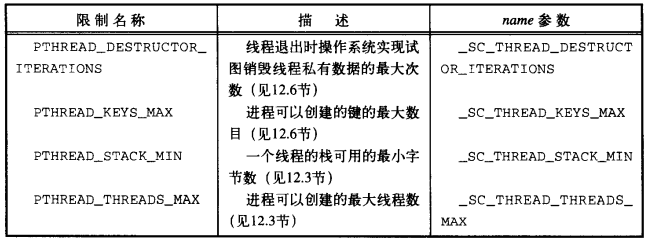
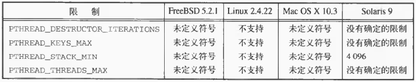
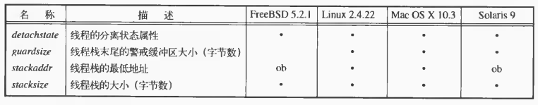
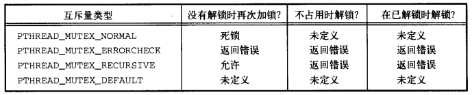
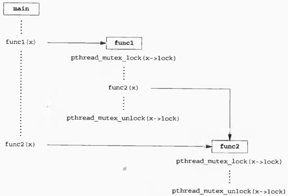
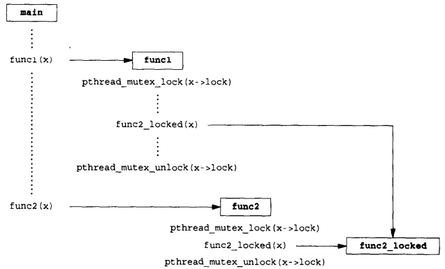
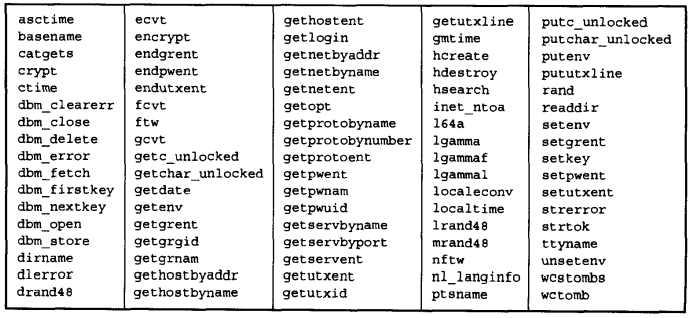
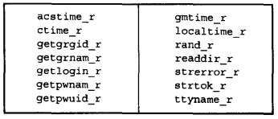
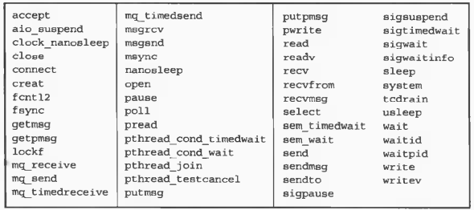
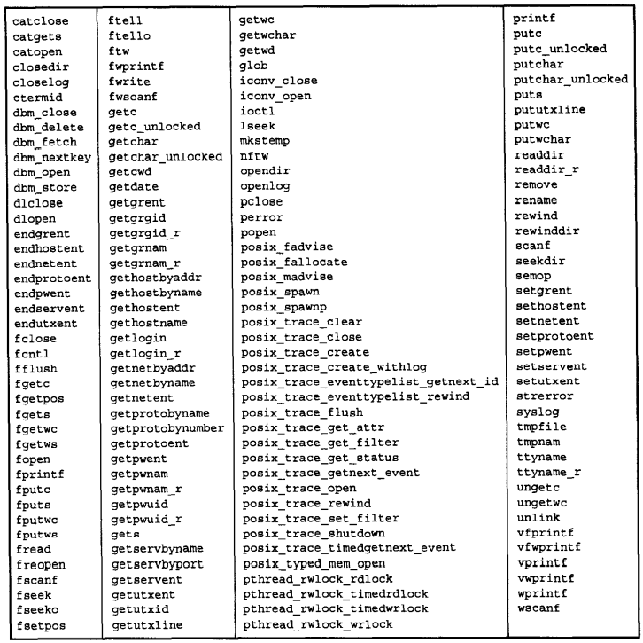

# 第十二章

[TOC]


## 12.1 引言


## 12.2 线程限制



*线程限制和sysconf的name参数*



*线程配置限制的例子*


## 12.3 线程属性

```c++
#include <pthread.h>
int pthread_attr_init(pthread_attr_t *attr);
int pthread_attr_destroy(pthread_attr_t *attr);
```

- `attr` 线程属性

  

- `返回值`

  成功：0

  失败：错误码

*初始化/反初始化线程*

```c++
#include <pthread.h>
int pthread_attr_getdetachstate(const pthread_attr_t *restrict attr, int *detachstate);
int pthread_attr_setdetachstate(pthread_attr_t *attr, int detachstate);
```

- `attr` 属性

- `detachstate` 分离状态

- `返回值`

  成功：0

  失败：错误码

*获取/设置线程分离状态*

例：

```c++
TODO
```

*以分离状态创建的线程*

```c++
#include <pthread.h>
int pthread_attr_getstack(const pthread_attr_t *restrict attr, void **restrict stackaddr, size_t *restrict stacksize);
int pthread_attr_setstack(const pthread_attr_t *attr, void *stackaddr, size_t *stacksize);
```

- `attr` 属性

- `stackaddr` 值

- `stacksize` 值

- `返回值`

  成功：0

  失败：错误码

*获取/设置线程属性stackaddr（栈地址）和stacksize（栈默认大小）*

```c++
#include <pthread.h>
int pthread_attr_getstacksize(const pthread_attr_t *restrict attr, size_t *restrict stacksize);
int pthread_attr_setstackszie(pthread_attr_t *attr, size_t stacksize);
```

- `attr` 属性

- `stacksize` 值

- `返回值`

  成功：0

  失败：错误码

*获取/设置线程属性stacksize（栈默认大小）*

```c++
#include <pthread.h>
int pthread_attr_getguardsize(const pthread_attr_t *restrict attr, size_t *restrict guardsize);
int pthread_attr_setguardsize(pthread_attr_t *attr, size_t guardsize);
```

- `attr` 属性

- `guardsize` 值

- `返回值`

  成功：0

  失败：错误码

*获取/设置线程属性guardsize（栈指针警戒线，栈溢出时可以通过信号接受到出错信息）*

```c++
#include <pthread.h>
int pthread_getconcurrency(void);
int pthread_setconcurrency(int level);
```

- `level` 并发度

- `返回值`

  成功：0

  失败：错误码

*获取/设置线程并发度（影响性能）*


## 12.4 同步属性

```c++
#include <pthread.h>
int pthread_mutexattr_init(pthread_mutexattr_t *attr);
int pthread_mutexattr_destroy(pthread_mutexattr_t *attr);
```

- `attr` 属性

- `返回值`

  成功：0

  失败：错误码

*初始化/回收互斥量属性*

```c++
#include <pthread.h>
int pthread_mutexattr_getpshared(const pthread_mutexattr_t *restrict attr, int *restrict pshared);
int pthread_mutexattr_setpshared(pthread_mutexattr_t *attr, int pshared);
```

- `attr` 互斥量属性

- `pshared` 进程共享属性值

- `返回值`

  成功：0

  失败：错误码

*获取/设置进程共享属性*

```c++
#include <pthread.h>
int pthread_mutexattr_gettype(const pthread_mutexattr_t *restrict attr, int *restrict type);
int pthread_mutexattr_settype(pthread_mutexattr_t *attr, int type);
```

- `attr` 互斥量属性

- `type` 互斥量类型

  

- `返回值`

  成功：0

  失败：错误码

*获取/设置互斥量类型*



*使用递归锁的情况*



*避免使用递归锁的情况*

例：

```c++
TODO
```

*使用递归互斥量*

```c++
#include <pthread.h>
int pthread_rwlockattr_init(pthread_rwlockattr_t *attr);
int pthread_rwlockattr_destroy(pthread_rwlockattr_t *attr);
```

- `attr` 读写锁属性

- `返回值`

  成功：0

  失败：错误码

*初始化/回收读写锁属性*

```c++
#include <pthread.h>
int pthread_rwlockattr_getpshared(const pthread_rwlockattr_t *restrict attr, int *rstrict pshared);
int pthread_rwlockattr_setpshared(pthread_rwlockattr_t *attr, int pshared);
```

- `attr`读写锁属性

- `pshared` 进程共享属性值

- `返回值`

  成功：0

  失败：错误码

*获取/设置读写锁进程共享属性*

```c++
#include <pthread.h>
int pthread_condattr_init(pthread_condattr_t *attr);
int pthread_condattr_destroy(pthread_condattr_t *attr);
```

- `attr` 条件变量属性

- `返回值`

  成功：0

  失败：错误码

*初始化/回收条件变量属性*

```c++
#include <pthread.h>
int pthread_condattr_getpshared(const pthread_condattr_t *restrict attr, int *restrict pshared);
int pthread_condattr_setpshared(pthread_condattr_t *attr, int pshared);
```

- `attr`

- `pshared`

- `返回值`

  成功：0

  失败：错误码

*获取/设置进程共享属性*


## 12.5 重入



*POSIX.1中不能保证线程安全的函数*



*替代的线程安全函数*

```c++
#include <stdio.h>
int ftrylockfile(FILE *fp);
void flockfile(FILE *fp);
void funlockfile(FILE *fp);
```

- `fp` 文件描述符

- `返回值`

  成功：0

  失败：非0

*加/解锁文件对象（线程安全）*

```c++
#include <stdio.h>
int getchar_unlocked(void);
int getc_unlocked(FILE *fp);
```

- `fp` 文件描述符

- `返回值`

  成功：下一个字符

  已到达稳健尾或出错：EOF

*读一个字符*

```c++
#include <stdio.h>
int putchar_unlocked(int c);
int putc_unlocked(int c, FILE *fp);
```

- `c` 字符
- `fp` 文件描述符

*写一个字符*

例：

```c++
TODO
```

*getenv的非可重入版本*

例：

```c++
TODO
```

*getenv的可重入（线程安全）版本*


## 12.6 线程私有数据

```c++
#include <pthread.h>
int pthread_key_create(pthread_key_t *keyp, void (*destructor)(void *));
```

- `keyp` 键

- `destructor` 析构函数

- `返回值`

  成功：0

  失败：错误码

*创建与线程数据关联的键（用于获取对线程私有数据的访问权）*

```c++
#include <pthread.h>
int pthread_key_delete(pthread_key_t *key);
```

- `key` 键

- `返回值`

  成功：0

  失败：错误码

*取消键与线程数据的关联*

```c++
#include <pthread.h>
pthread_once_t initflag = PTHREAD_ONCE_INIT;
int pthread_once(pthread_once_t *initflag, void (*initfn)(void));
```

- `initflag` 标志（全局变量或静态变量）

- `initfn` 只执行一次的函数

- `返回值`

  成功：0

  失败：错误码

*让函数只执行一次*

例：

```c++
void destructor(void *);
pthread_key_t key;
pthread_once_t init_done = PTHREAD_ONCE_INIT;
void 
thread_init(void)
{
    err = pthread_key_create(&key, destructor);
}
int 
threadfunc(void *arg)
{
    pthread_once(&init_done, thread_init);
    ...
}
```

```c++
#include <pthread.h>
void *pthread_getspecific(pthread_key_t key);
```

- `key` 键

- `返回值`

  成功：线程私有数据

  失败：NULL

*返回与键关联的线程私有数据*、

```c++
#include <pthread.h>
int pthread_setspecific(pthread_key_t key, const void *value);
```

- `key` 键

- `value` 值

- `返回值`

- `返回值`

  成功：0

  失败：错误码

*设置键与关联的线程私有数据*、

例：

```c++
TODO
```

*线程安全的getenv的兼容版本*


## 12.7 取消选项

```c++
#include <pthread.h>
int pthread_setcancelstate(int state, int *oldstate);
```

- `state` 可取消状态

- `oldstate` 旧状态

- `返回值`

  成功：0

  失败：错误码

*设置可取消状态（线程启动时默认为PTHREAD_CANCEL_ENABLE）*



*POSIX.1定义的取消点*

```c++
#include <pthread.h>
void pthread_testcancel(void);
```

*添加取消点*

```c++
#include <pthread.h>
int pthread_setcanceltype(int type, int *oldtype);
```

- `type` 新取消类型

- `oldtype` 旧取消类型

- `返回值`

  成功：0

  失败：错误码

*修改取消类型*



*POSIX.1 定义的可选取消点*


## 12.8 线程和信号

```c++
#include <signal.h>
int pthread_sigmask(int how, const sigset_t *restrict set, sigset_t *restrict oset);
```

- `how` 

- `set` 新信号集

- `oset` 旧信号集

- `返回值`

  成功：0

  失败：错误码

*阻止信号发送*

```c++
#include <signal.h>
int sigwait(const sigset_t *restrict set, int *restrict signop);
```

- `set` 信号集

- `signop` 返回发送信号的数量

- `返回值`

  成功：0

  失败：错误码

*等待一个或多个信号发生*

```c++
#include <signal.h>
int pthread_kill(pthread_t thread, int signo);
```

- `thread` 线程

- `signo` 信号

- `返回值`

  成功：0

  失败：错误码

*把信号发送到线程*

例：

```c++
TODO
```

*同步信号处理*

## 12.9 线程和fork

```c++
#include <pthread.h>
int pthread_atfork(void (*prepare)(void), void (*parernt)(void), void (*child)(void));
```

- `prepare` 获取父进程定义的所有锁（在创建子进程前调用）

- `parent` 对prepare获得的所有锁进行解锁（在创建子进程后，fork返回之前的父进程调用）

- `child` 释放prepare获得的所有锁（在fork返回之前调用，fork返回之前的子进程调用）

- `返回值`

  成功：0

  失败：错误码

*清除锁状态*

例：

```c++
TODO
```

*pthread_atfork实例*


## 12.10 线程和I/O

使用`pread`可以使偏移量的设定和数据的读取成为一个原子操作。


## 12.11 小结

