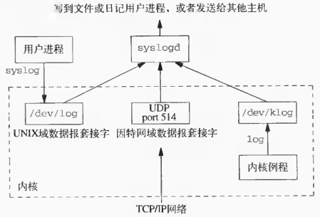
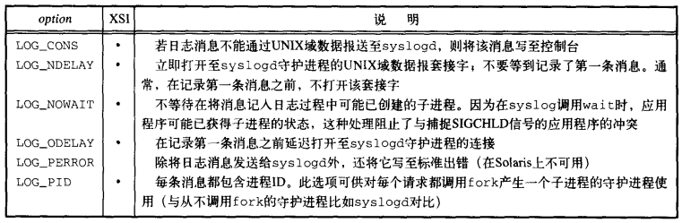
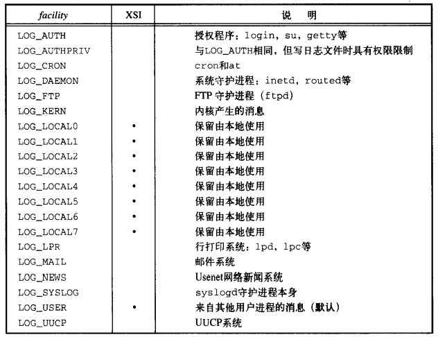
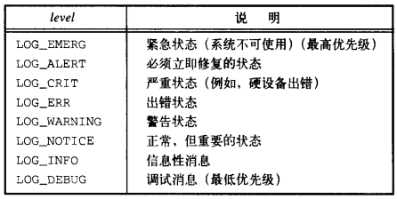

# 第十三章 守护进程

[TOC]


## 13.1 引言


## 13.2 守护进程的特征


## 13.3 编程规则

1. 调用`umask`将文件模式创建屏蔽字设置为0，由继承得来的文件模式创建屏蔽字可能会拒绝设置某些权限；
2. 调用`fork`并且使父进程退出（`exit`）；
3. 调用`setsid`以创建一个新会话；
4. 将当前工作目录更改为根目录；
5. 关闭不再需要的文件描述符；
6. 打开`/dev/null`使其具有文件描述符0,1和2，从而屏蔽读标准输入，写标准输出或标准出错等操作。

例：

```c++
#include "apue.h"
#include <syslog.h>
#include <fcntl.h>
#include <sys/resource.h>

void 
daemonize(const char *cmd)
{
    int i, fd0, fd1, fd2;
    pid_t pid;
    struct rlimit r1;
    struct sigaction sa;
    
    umask(0);
    
    if (getrlimit(RLIMIT_NOFILE, &r1) < 0)
        err_quit("%s: can't get file limit", cmd);
    
    if ((pid = fork()) < 0)
        err_quit("%s: can't fork", cmd);
    else if (pid != 0)
        exit(0);
    setsid();
    
    sa.sa_handler = SIG_IGN;
    sigemptyset(&sa.sa_mask);
    sa.sa_flags = 0;
    if (sigaction(SIGHUP, &sa, NULL) < 0)
        err_quit("%s: can't ignore SIGHUP");
    if ((pid = fork()) < 0)
        err_quit("%s: can't fork", cmd);
    else if(pid != 0)
        exit(0);
    
    if (chdir("/") < 0)
        err_quit("%s: can't change directory to /");
    
    if (rl.rlim_max == RLIM_INFINITY)
        rl.rlim_max = 1024;
    for (i = 0; i < rl.rlim_max; i++)
        close(i);
    
    fd0 = open("/dev/null", O_RDWR);
    fd1 = dup(0);
    fd2 = dup(0);
    
    openlog(cmd, LOG_CONS, LOG_DAEMON);
    if (fd0 != 0 || fd1 != 1 || fd2 != 2) {
        syslog(LOG_ERR, "unexpected file descriptors %d %d %d", fd0, fd1, fd2);
        exit(1);
    }
}
```

*初始化一个守护进程*


## 13.4 出错记录



*BSD syslog设施*

产生日志信息的三种方法：

1. 内核例程调用`log`函数；
2. 调用`syslog(3)`函数以产生日志消息；
3. 通过TCP/IP网络连接到此主机的其它主机上的一个用户进程可将日志消息发向UDP端口514。

```c++
#include <syslog.h>
void openlog(const char *ident, int option, int facility);
```

- `ident` 认证信息，一般为程序名

- `option` 选项

  

- `facility` 设施

  

- `返回值`

  前日志记录优先级屏蔽值

*打开日志（可选）*

```c++
#include <syslog.h>
void syslog(int priority, const char *format, ...);
```

- `priority` 优先级，由`facility`和`level`组合而成；

  

- `format` 格式化字符串

- `返回值`

  前日志记录优先级屏蔽值

*写日志*

```c++
#include <syslog.h>
void closelog(void);
```

- `返回值`

  前日志记录优先级屏蔽值

*关闭日志*

```c++
#include <syslog.h>
int setlogmask(int maskpri);
```

- `maskpri` 屏蔽字

- `返回值`

  前日志记录优先级屏蔽值

*设置进程的记录优先级屏蔽字*

例1：

```c++
openlog("lpd", LOG_PID, LOG_LPR);
syslog(LOG_ERR, "open error for %s: %m", filename);
```

例2：

```c++
syslog(LOG_ERR | LOG_LPR, "open error for %s: %m", filename); // 不使用openlog
```


## 13.5 单实例守护进程

例：

```c++
#include <unistd.h>
#include <stdlib.h>
#include <fcntl.h>
#include <syslog.h>
#include <string.h>
#include <errno.h>
#include <stdio.h>
#include <sys/stat.h>

#define LOCKFILE "/var/run/daemon.pid"
#define LOCKMODE (S_IRUSR|S_IWUSR|S_IRGRP|S_IROTH)

extern int lockfile(int);

int 
already_running(void)
{
    int fd;
    char buf[16];
    
    fd = open(LOCKFILE, O_RDWR|O_CREAT, LOCKMODE);
    if (fd < 0) {
        syslog(LOG_ERR, "can't open %s: %s", LOCKFILE, strerror(errno));
        exit(1);
    }
    if (lockfile(fd) < 0) {
        if (errno == EACCES || errno == EAGAIN) {
            close(fd);
            return(1);
        }
        syslog(LOG_ERR, "can't lock %s: %s", LOCKFILE, strerror(errno));
        exit(1);
    }
    ftruncate(fd, 0);
    sprintf(buf, "%1d", (long)gtepid());
    write(fd, buf, strlen(buf)+1);
    return(0);
}
```

*保证只运行某个守护进程的一个副本*


## 13.6 守护进程的惯例

在UNIX系统中，守护进程遵循以下公共惯例：

1. 若守护进程使用锁文件，那么该文件通常存放在`/var/run`目录中；
2. 若守护进程支持配置选项，那么配置文件通常存放在`/etc`目录中；
3. 守护进程可用命令行启动，但通常它们是由系统初始化脚本之一（`/etc/rc*`或`/etc/init.d/*`）启动的；
4. 若一守护进程有一配置文件，那么当该守护进程启动时，它读文件，但在此之后一般就不会再查看它；若一管理员更改了配置文件，那么该守护进程可能需要被停止，然后再启动，以便使配置文件的更改生效。

例：

```c++
#include "apue.h"
#include <pthread.h>
#include <syslog.h>

sigset_t mask;

extern int already_running(void);

void 
reread(void)
{
    ...
}

void *
thr_fn(void *arg)
{
    int err, signo;
    for (;;) {
        err = sigwait(&mask, &signo);
        if (err != 0) {
            syslog(LOG_ERR, "sigwait failed");
            exit(1);
        }
        switch(signo) {
            case SIGHUP:
                syslog(LOG_INFO, "Re-reading configuration file");
                reread();
                break;
                
            case SIGTERM:
                syslog(LOG_INFO, "got SIGTERM; exiting");
                exit();
                break;
                
            default:
                syslog(LOG_INFO, "unexpected signal %d\n", signo);
        }
    }
    return(0);
}

int 
main(int argc, char *argv[])
{
    int err;
    pthread_t tid;
    char *cmd;
    struct sigaction sa;
    
    if ((cmd = strrchr(argv[0], '/')) == NULL)
        cmd = argv[0];
    else
        cmd++;
    
    daemonize(cmd);
    
    if (already_running()) {
        syslog(LOG_ERR, "daemon already running");
        exit(1);
    }
    
    sa.sa_handler = SIG_DFL;
    sigemptyset(&sa.sa_mask);
    sa.sa_flags = 0;
    if (sigaction(SIGHUP, &sa, NULL) < 0)
        err_quit("%s: can't restore SIGHUP default");
    sigfillset(&mask);
    if ((err = pthread_sigmask(SIG_BLOCK, &mask, NULL)) != 0)
        err_exit(err, "SIG_BLOCK error");
    
    err = pthread_create(&tid, NULL, thr_fn, 0);
    if (err != 0)
        err_exit(err, "can't create thread");
    
    exit(0);
}
```

*守护进程重读配置文件*

例：

```c++
#include "apue.h"
#include <syslog.h>
#include <errno.h>

extern int lockfile(int);
extern int already_running(void);

void 
reread(void)
{
    ...
}

void 
sigterm(int signo)
{
    syslog(LOG_INFO, "got SIGTERM; exiting");
    exit(0);
}

void 
sighup(int signo)
{
    syslog(LOG_INFO, "Re-reading configuration file");
    reread();
}

int 
main(int argc, char *argv[])
{
    char *cmd;
    struct sigaction sa;
    
    if ((cmd = strrchr(argv[0], '/')) == NULL)
        cmd = argv[0];
    else
        cmd++;
    
    daemonize(cmd);
    
    if (already_running()) {
        syslog(LOG_ERR, "daemon already running");
        exit(1);
    }
    
    sa.sa_handler = sigterm;
    sigemptyset(&sa.sa_mask);
    sigaddset(&sa.sa_mask, SIGHUP);
    sa.sa_flags = 0;
    if (sigaction(SIGTERM, &sa, NULL) < 0) {
        syslog(LOG_ERR, "can't catch SIGTERM: %s", strerror(errno));
        exit(1);
    }
    sa.sa_handler = sighup;
    sigemptyset(&sa.sa_mask);
    sigaddset(&sa.sa_mask, SIGTERM);
    sa.sa_flags = 0;
    if (sigaction(SIGHUP, &sa, NULL) < 0) {
        syslog(LOG_ERR, "can't catch SIGHUP: %s", strerror(errno));
        exit(1);
    }
    
    exit(0);
}
```

*守护进程重读配置文件的另一种实现*


## 13.7 客户进程-服务器进程模型


## 13.8 小结

