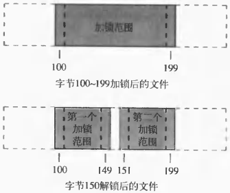

# 第十四章 高级I/O

[TOC]


## 14.1 引言


## 14.2 非阻塞I/O

对于一个给定的描述符有两种方法对其指定非阻塞I/O：

1. 如果调用open获得描述符，则可指定`O_NONBLOCK`标志。
2. 对于已经打开的一个描述符，则可调用`fcntl`，由该函数打开`O_NONBLOCK`文件状态标志。

例：

```c++
#include "apue.h"
#include <errno.h>
#include <fcntl.h>

char buf[500000];

int 
main(void)
{
    int ntowrite, nwrite;
    char *ptr;
    ntowrite = read(STDIN_FILENO, buf, sizeof(buf));
    fprintf(stderr, "read %d bytes\n", ntowrite);
    set_fl(STDOUT_FILENO, O_NONBLOCK);
    ptr = buf;
    while (ntowrite > 0) {
        errno = 0;
        nwrite = write(STDOUT_FILENO, ptr, ntowrite);
        fprintf(stderr, "nwrite = %d, errno = %d\n", nwrite, errno);
        if (nwrite > 0) {
            ptr += nwrite;
            ntowrite -= nwrite;
        }
    }
    clr_fl(STDOUT_FILENO, O_NONBLOCK);
    exit(0);
}
```

*长的非阻塞write*


## 14.3 记录锁

`记录锁（record locking）`当一个进程正在读或修改文件的某个部分时，它可以阻止其它进程修改同一文件区。


*各种UNIX系统支持的记录锁*

```c++
struct flock {
    short l_type;
    off_t l_start;
    short l_whence;
    off_t l_len;
    pid_t l_pid;
};
```

- `l_type` 锁类型
  - `F_RDLCK` 共享读锁
  - `F_WRLCK` 独占性写锁
  - `F_UNLCK` 解锁一个区域
- `l_start` 相对偏移量
- `l_whence` 相对偏移量起点
- `l_len` 字节长度
- `l_pid` 进程ID

```c++
#include <fcntl.h>
int fcntl(int filedes, int cmd, ... /* struct flock *flockptr */ );
```

- `filedes` 

- `cmd` 命令参数

  - `F_GETLK` 判断由`flockptr`所描述的锁是否会被另外一把锁排斥（阻塞）。如果存在一把锁，它阻止创建由`flockptr`所描述的锁，则把该现存锁的信息写到`flockptr`指向的结构中。如果不存在这种情况，则除了将`l_type`设置为`F_UNLCK`之外，`flockptr`所指向结构中的其它信息保持不变。
  - `F_SETLK` 设置由`flockptr`所描述的锁。如果试图建立一把读锁（`l_type`设为`F_RDLCK`或写锁（`l_type`设为`F_WRLCK`），而按上述兼容性规则不能允许，则`fcntl`立即出错返回，此时errno设置为`EACCES`或`EAGAIN`）。此命令也用来清除由`flockptr`说明的锁（`l_type`为`F_UNLCK`）。
  - `F_SETLKW` 这是`F_SETLK`的阻塞版本。如果因为当前在所请求区间的某个部分另一个进程已经有一把锁，因而按兼容性规则由`flockptr`所请求的锁不能被创建，则使调用进程休眠。如果请求创建的锁已经可用，或者休眠由信号中断，则该进程被唤醒。

- `返回值`

  成功：依赖于cmd

  失败：-1

*添加记录锁（多个进程在一个给定的字节上可以有一把共享的读锁，但是在一个给定字节上只有一个进程独用的一把写锁）*


*不同类型锁之间的兼容性*



*文件字节范围锁*

例：

```c++
#include "apue.h"
#include <fcntl.h>
int 
lock_reg(int fd, int cmd, int type, off_t offset, int whence, off_t len)
{
    struct flock lock;
    lock.l_type = type;
    lock.l_start = offset;
    lock.l_whence = whence;
    lock.l_len = len;
    
    return(fcntl(fd, cmd, &lock));
}
```

*加锁和解锁一个文件区域的函数*

例：

```c++
#include "apue.h"
#include <fcntl.h>

pid_t 
lock_test(int fd, int type, off_t offset, int whence, off_t len)
{
    struct flock lock;
    
    lock.l_type = type;
    lock.l_start = offset;
    lock.l_whence = whence;
    lock.l_len = len;
    
    if (fcntl(fd, F_GETLK, &lock) < 0)
        err_sys("fcntl error");
    
    if (lock.l_type == F_UNLCK)
        return(0);
    
    return(lock.l_pid);
}
```

*测试一个锁状态的函数*

例：

```c++
#include "apue.h"
#include <fcntl.h>

static void 
lockabyte(const char *name, int fd, off_t offset)
{
    if (writew_lock(fd, offset, SEEK_SET, 1) < 0)
        err_sys("%s: writew_lock error", name);
    printf("%s: got the lock, byte %11d\n", name, (long long)offset);
}

int 
main(void)
{
    int fd;
    pid_t pid;
    if ((fd = creat("templock", FILE_MODE)) < 0)
        err_sys("creat error");
    if (write(fd, "ab", 2) != 2)
        err_sys("write error");
    
    TELL_WAIT();
    if ((pid = fork()) < 0) {
        err_sys("fork error");
    } else if (pid == 0) {
        lockabyte("child", fd, 0);
        TELL_PARENT(getppid());
        WAIT_PARENT();
        lockabyte("child", fd, 1);
    } else {
        lockabyte("parent", fd, 1);
        TELL_CHILD(pid);
        WAIT_CHILD();
        lockabyte("parent", fd, 0);
    }
    exit(0);
}
```

*死锁检测实例*

锁的自动继承和释放遵守以下规则：

1. 锁与进程和文件两方面相关；
2. 由`fork`产生的子进程不继承父进程所设置的锁；
3. 在执行`exec`后，新程序可以继承原执行程序的锁；但是注意：如果对一个文件描述符设置了`close-on-exec`标志，那么当作为`exec`对一部分关闭该文件描述符时，对相应文件的所有锁都被释放。


*关于记录锁的FreeBSD数据结构*

例：

```c++
#include <unistd.h>
#include <fcntl.h>
int 
lockfile(int fd)
{
    struct flock f1;
    f1.l_type = F_WRLCK;
    f1.l_start = 0;
    f1.l_whence = SEEK_SET;
    f1.l_len = 0;
    return (fcntl(fd, F_SETLK, &f1));
}
```

*在文件整体上加锁*


*文件范围锁*


*强制性锁对其它进程读，写的影响*

例：

```c++
#include "apue.h"
#include <errno.h>
#include <fcntl.h>
#include <sys/wait.h>

int 
main(int argc, char *argv[])
{
    int fd;
    pid_t pid;
    char buf[5];
    struct stat statbuf;
    
    if (argc != 2) {
        fprintf(stderr, "usage: %s filename\n", argv[0]);
        exit(1);
    }
    if ((fd = open(argv[1], O_RDWR | O_CREAT | O_TRUNC, FILE_MODE)) < 0)
        err_sys("open error");
    if (write(fd, "abcdef", 6) != 6)
        err_sys("write error");
    
    if (fstat(fd, &statbuf) < 0)
        err_sys("fstat error");
    if (fchmod(fd, (statbuf.st_mode & ~S_IXGRP) | S_ISGID) < 0)
        err_sys("fchmod error");
    
    TELL_WAIT();
    
    if ((pid = fork()) < 0) {
        err_sys("fork error");
    } else if (pid > 0) {
        if (write_lock(fd, 0, SEEK_SET, 0) < 0)
            err_sys("write_lock error");
        TELL_CHILD(pid);
        if (waitpid(pid, NULL, 0) < 0)
            err_sys("waitpid error");
    } else {
        WAIT_PARENT();
        set_fl(fd, O_NONBLOCK);
        if (read_lock(fd, 0, SEEK_SET, 0) != -1)
            err_sys("child: read_lock succeeded");
        printf("read_lock of already-locked region returns %d\n", errno);
        
        if (lseek(fd, 0, SEEK_SET) == -1)
            err_sys("lseek error");
        if (read(fd, buf, 2) < 0)
            err_ret("read failed (mandatory locking works)");
        else
            printf("read OK (no mandatory locking), buf = %2.2s\n", buf);
    }
    exit(0);
}
```

*确定是否支持强制性锁*


## 14.4 STREAMS


*一个简单流*


*具有处理模块的流*


*write，putmsg和putpmsg产生的STREAMS消息类型*

```c++
#include <stropts.h>
int putmsg(int fields, const struct strbuf *ctlptr, 
           const struct strbuf *dataptr, int flag);
int putpmsg(int fields, const struct strbuf *ctlptr,
            const struct strbuf *dataptr, int band, int flag);
```

- `filedes` 描述符

- `ctlptr`

- `dataptr`

- `band` 优先级波段

- `flag` 标志

- `返回值`

  成功：0

  失败：-1

*将STREAMS消息写入到流中*

```c++
#include <stropts.h>
int isastream(int filedes);
```

- `filedes` 描述符

- `返回值`

  STREAMS设备：1

  失败：0

*判断一个描述符是否引用一个流*

例：

```c++
#include <stropts.h>
#include <unistd.h>
int 
isastream(int fd)
{
    return (ioctl(fd, I_CANPUT, 0) != -1);
}

int 
main(int argc, cahr *argv[])
{
    int i, fd;
    for (i = 1; i < argc; i++) {
        if ((if = open(argv[i], O_RDONLY)) < 0) {
            err_ret("%s: can't open", argv[i]);
            continue;
        }
        if (isastream(fd) == 0)
            err_ret("%s: not a stream", argv[i]);
        else
            err_msg("%s: streams device", argv[i]);
    }
    exit(0);
}
```

*检查描述符是否引用STREAMS设备*

例：

```c++
TODO
```

*列表流中的模块名*

写模式值：

- `SNDZERO` 对管道和FIFO的0长度write会造成顺流传送要给0长度消息。按系统默认，0长度写不发送消息。
- `SNDPIPE` 在流上已出错后，若调用`write`或`putmsg`，则向调用进程发送`SIGPIPE`信号。

```c++
#include <stropts.h>
int getmsg(int filedes, struct strbuf *restrict ctlptr,
           struct strbuf *restrict dataptr, int *restrict flagptr);
int getpmsg(int filedes, struct strbuf *restrict ctlptr,
            struct strbuf *restrict dataptr, int *restrict bandptr,
            int *restrict flagptr);
```

- `filedes` 
- `ctlptr`
- `dataptr`
- `flagptr` 
- `bandptr`

*从流首读STREAMS消息*

例：

```c++
TODO
```

*用getmsg将标准输入复制到标准输出*


## 14.5 I/O多路转换


*telnet程序概观*


*使用两个进程实现telnet程序*


*多种UNIX系统支持的I/O多路转接*

### 14.5.1 select和pselect函数

```c++
#include <sys/select.h>
int select(int maxfdp1, fd_set *restrict readfds,
           fd_set *restrict writefds, fd_set *restrict exceptfds,
           struct timeval *restrict tvptr);
int pselect(int maxfdp1, fd_set *restrict readfds,
            fd_set *restrict writefds, fd_set *restrict exceptfds,
            const struct timespec *restrict tsptr,
            cosnt sigset_t *restrict sigmask);
```

- `maxfdp1 ` 最大描述符数 + 1

- `readfds` 可读描述符

- `writefds` 可写描述符

- `exceptfds` 异常描述符

- `tvptr` 超时时间

  ```c++
  struct timeval {
      long tv_sec;
      long tv_usec;
  };
  ```

  - `tvptr == NULL` 永远等待；
  - `tvptr->tv_sec == 0 && tvptr->tv_usec == 0` 完全不等待；
  - `tvptr->tv_sec != 0 || tvptr->tv_usec != 0` 等待指定的秒数和微秒数；

- `tsptr` 超时时间（更精确的时间，参考`tvptr`）

- `sigmask` 信号屏蔽字

- `返回值`

  超时：0

  出错：-1

  成功：准备就绪的描述符数

*多路转接*


*对select指定读，写和异常条件描述符*

```c++
#include <sys/select.h>
int FD_ISSET(int fd, fd_set *fdset);
```

- `fd` 文件描述符
- `fdset` 文件描述符集
- `返回值` fd在描述符集里：非0；否则：0

*文件描述符是否在文件描述符集里*

```c++
#include <sys/select.h>
void FD_CLR(int fd, fd_set *fdset);
```

- `fd` 文件描述符
- `fdset` 文件描述符集

*将fdset变量的所有位设置为0*

```c++
#include <sys/select.h>
void FD_SET(int fd, fd_set *fdset);
```

- `fd` 文件描述符
- `fdset` 文件描述符集

*设置fdset变量的指定位*

```c++
#include <sys/select.h>
void FD_ZERO(fd_set *fdset);
```

- `fdset` 文件描述符集

*清除fdset的所有位*

例：

```c++
fd_set readset, writeset;
FD_ZERO(&readset);
FD_ZERO(&writeset);
FD_SET(0, &readset);
FD_SET(3, &readset);
FD_SET(1, &writeset);
FD_SET(2, &writeset);
FD_SET(4, &readset, &writeset, NULL, NULL);
```


*select的示例描述符集*

### 14.5.2 poll函数

```c++
#include <poll.h>
int poll(struct pollfd fdarray[], nfds_t nfds, int timeout);
```

- `fdarray` 描述符信息数组

  ```c++
  struct pollfd {
      int fd;
      short events;
      short revents;
  };
  ```

  

  *poll的events和revents标志*

- `nfds` 数组长度

- `timeout` 超时时间

  - `-1` 永远等待；
  - `0` 不等待；
  - `> 0` 等待timeout毫秒；

- `返回值`

  超时：0

  出错：-1

  成功：准备就绪的描述符数

*多路转接*


## 14.6 异步I/O

### 14.6.1 系统V异步I/O


*产生SIGPOLL信号的条件*

### 14.6.2 BSD异步I/O

为了接收SIGIO信号，需执行以下步骤：

1. 调用`signal`或`sigaction`为SIGIO信号家里信号处理程序；
2. 以命令`F_SETOWN`调用fcntl来设置进程ID和进程组ID，他们将接受对于该描述符的信号；
3. 以命令`F_SETFL`调用fcntl设置`O_ASYNC`文件状态标志，使在该描述符上可以进行异步I/O。


## 14.7 readv和writev函数

```c++
#include <sys/uio.h>
ssize_t readv(int filedes, const struct iovec *iov, int iovcnt);
ssize_t writev(int filedes, const struct iovec *iov, int iovcnt);
```

- `filedes` 描述符

- `iov` iovec数组（最大长度为`IOV_MAX`）

  ```c++
  struct iovec {
      void *iov_base;
      size_t iov_len;
  };
  ```

- `iovcnt` iovec数组长度

- `返回值`

*散布读/聚集写*


*readv和writev的iovec结构*

例：


*比较writev和其它技术所得的时间结果*


## 14.8 readn和writen函数

```c++
#include "apue.h"
ssize_t readn(int filedes, void *buf, size_t nbytes);
ssize_t writen(int filedes, void *buf, size_t nbytes);
```

- `filedes` 描述符

- `buf` 缓冲区

- `nbytes` 字节数

- `返回值`

  成功：已读/写字节数

  失败：-1

*读/写指定的N个字节*

例：

```c++
TODO
```

*readn和writen函数*


## 14.9 存储映射I/O

`存储映射（Memory-mapped I/O）`是一个磁盘文件与存储空间中的一个缓冲区相映射（对应），读写缓冲区中的数据相当于读写磁盘数据。

```c++
#include <sys/mman.h>
void *mmap(void *addr, size_t len, int prot, int flag, int fields, off_t off);
```

- `addr` 映射存储区的起始地址

- `len` 映射的字节数

- `prot` 对映射存储区的保护要求

  

  *映射存储区的保护要求*

- `flag` 映射存储区的属性

  - `MAP_FIXED` 返回值必须等于addr（不利于可移植性，不推荐使用此标志）；
  - `MAP_SHARED` 指定存储操作修改映射文件；
  - `MAP_PRIVATE` 对映射区的存储操作导致创建该映射文件的一个私有副本；

- `fields` 被映射文件的描述符

- `off` 要映射字节在文件中的起始偏移量

- `返回值`

  成功：映射区的起始地址

  失败：MAP_FAILED

*告诉内核将一个文件映射到指定存储区域*


*存储映射文件的例子*

```c++
#include <sys/mman.h>
int mprotect(void *addr, size_t len, int prot);
```

- `addr` 映射存储区的起始地址

- `len` 映射的字节数

- `prot` 对映射存储区的保护要求

  

  *映射存储区的保护要求*

- `返回值`

  成功：0

  失败：-1

*更改一个现存映射存储区的权限*

```c++
#include <sys/mman.h>
int msync(void *addr, size_t len, int flags);
```

- `addr` 映射存储区的起始地址
- `len` 映射的字节数
- `flags` 控制冲洗存储区

*存储映射区*

```c++
#include <sys/mman.h>
int munmap(caddr_t addr, size_t len);
```

- `addr` 映射存储区的起始地址

- `len` 映射的字节数

- `返回值`

  成功：0

  失败：-1

*解除存储映射*

例：

```c++
TODO
```

*用存储映射I/O复制文件*


*read/write与mmap/memcpy比较的时间结果*


## 14.10 小结

