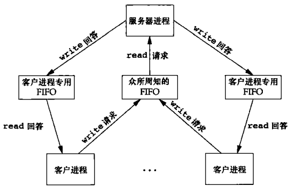
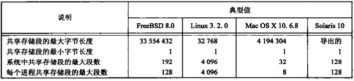
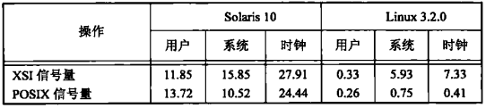

# 第十五章 进程间通信

[TOC]


## 15.1 引言


*UNIX系统IPC摘要*


## 15.2 管道

管道局限性：

- 它们是半双工的（有些系统提供全双工）；
- 管道只能在具有公共祖先的两个进程之间使用。

```c++
#include <unistd.h>
int pipe(int fd[2]);
```

- `fd` 用于返回两个文件描述符，fd[0]为读而打开，fd[1]为写而打开；fd[1]输出的是fd[0]的输入；
- `返回值`
  - 成功：0
  - 失败：-1

*创建管道*


*描绘半双工管道的两种方法*


*fork之后的半双工管道*


*从父进程到子进程的管道*

当管道的一端被关闭后，下列规则起作用：

1. 当读（read）一个写端已被关闭的管道时，在所有数据都被读取后，read返回0，标识文件结束。
2. 如果写（write）一个读端已被关闭的管道，则产生信号SIGPIPE。如果忽略该信号或者捕捉该信号并从其处理程序返回，则write返回-1，errno设置为EPIPE。

例1：

```c++
#include "apue.h"

int 
main(void)
{
    int n;
    int fd[2];
    pid_t pid;
    char line[MAXLINE];
    
    if (pipe(fd) < 0)
        err_sys("pipe error");
    if ((pid = fork()) < 0) {
        err_sys("fork error");
    } else if (pid > 0) {
        close(fd[0]);
        write(fd[1], "hello world\n", 12);
    } else {
        close(fd[1]);
        n = read(fd[0], line, MAXLINE);
        write(STDOUT_FILENO, line, n);
    }
    exit(0);
}
```

*经由管道从父进程向子进程传送数据*

例2：

```c++
#include "apue.h"
#include <sys/wait.h>

#define DEF_PAGER "/bin/more"

int 
main(int argc, char *argv[])
{
    int n;
    int fd[2];
    pid_t pid;
    char *paper, *argv0;
    char line[MAXLINE];
    FILE *fp;
    
    if (argc != 2)
        err_quit("usage: a.out <pathname>");
    if ((fp = fopen(argv[1], "r")) == NULL)
        err_sys("can't open %s", argv[1]);
    if (pipe(fd) < 0)
        err_sys("pipe error");
    
    if ((pid = fork()) < 0) {
        err_sys("fork error");
    } else if (pid > 0) {
        close(fd[0]);
        while (fgets(line, MAXLINE, fp) != NULL) {
            n = strlen(line);
            if (write(fd[1], line, n) != n)
                err_sys("write error to pipe");
        }
        if (ferror(fp))
            err_sys("fgets error");
        close(fd[1]);
        if (waitpid(pid, NULL, 0) < 0)
            err_sys("waitpid error");
        exit(0);
    } else {
        close(fd[1]);
        if (fd[0] != STDIN_FILENO) {
            if (dup2(fd[0], STDIN_FILENO) != STDIN_FILENO)
                err_sys("dup2 error to stdin");
            close(fd[0]);
        }
        if ((pager = getenv("PAGER")) == NULL)
            pager = DEF_PAGER;
        if ((argv = strrchr(pager, '/')) != NULL)
            argv0++;
        else
            argv0 = pager;
        if (execl(pager, argv0, (char *)0) < 0)
            err_sys("execl error for %s", pager);
    }
    exit(0);
}
```

*将文件复制到分页程序*

例3：

```c++
#include "apue.h"

static int pfd1[2], pfd2[2];

void 
TELL_WAIT(void)
{
    if (pipe(pfd1) < 0 || pipe(pfd2) < 0) // 使用管道
        err_sys("pipe error");
}

void 
TELL_PARENT(pid_t pid)
{
    if (write(pfd2[1], "c", 1) != 1)
        err_sys("write error");
}

void 
WAIT_PARENT(void)
{
    char c;
    if (read(pfd1[0], &c, 1) != 1)
        err_sys("read error");
    if (c != 'p')
        err_quit("WAIT_PARENT: incorrect data");
}

void 
TELL_CHILD(pid_t pid)
{
    if (write(pfd1[1], "p", 1) != 1)
        err_sys("write error");
}

void 
WAIT_CHILD(void)
{
    char c;
    if (read(pfd2[0], &c, 1) != 1)
        err_sys("read error");
    if (c != 'c')
        err_quit("WAIT_CHILD: incorrect data");
}
```

*让父进程和子进程同步的例程*


*用两个管道实现父进程和子进程同步*


## 15.3 函数popen和pclose

```c++
#include <stdio.h>
FILE *popen(const char *cmdstring, const char *type); // 创建管道；成功：返回标准I/O文件指针，失败：NULL
int pclose(FILE *fp); // 关闭标准I/O流；成功：返回cmdstring的终止状态，失败：-1
```

- `cmdstring` 命令行
- `type` 创建模式
- `fp` 文件描述符


*执行`fp = popen(cmdstring, "r")`的结果*


*执行`fp = popen(cmdstring, "w")`的结果*


*用popen对输入进行变换处理*

例1：

```c++
#include "apue.h"
#include <sys/wait.h>

#define PAGER "${PAGER:-more}"

int 
main(int argc, char *argv[])
{
    char line[MAXLINE];
    FILE *fpin, *fpout;
    if (argc != 2)
        err_quit("usage: a.out <pathname>");
    if ((fpin = fopen(argv[1], "r")) == NULL)
        err_sys("can't open %s", argv[1]);
    if ((fpout = popen(PAGER, "w")) == NULL)
        err_sys("popen error");
    while (fgets(line, MAXLINE, fpin) != NULL) {
        if (fputs(line, fpout) == EOF)
            err_sys("fputs error to pipe");
    }
    if (ferror(fpin))
        err_sys("fgets error");
    if (pclose(fpout) == -1)
        err_sys("pclose error");
    exit(0);
}
```

*用popen向分页程序传递文件*

例2：

```c++
#include "apue.h"
#include <errno.h>
#include <fcntl.h>
#include <sys/wait.h>

static pid_t *childpid = NULL;

static int maxfd;

FILE *
popen(const char *cmdstring, const char *type)
{
    int i;
    int pfd[2];
    pid_t pid;
    FILE *fp;
    if ((type[0] != 'r' && type[0] != 'w') || type[1] != 0) {
        errno = EINVAL;
        return(NULL);
    }
    if (childpid == NULL) {
        maxfd = open_max();
        if ((childpid = calloc(maxfd, sizeof(pid_t))) == NULL)
            return(NULL);
    }
    if (pipe(pfd) < 0)
        return(NULL);
    if (pfd[0] >= maxfd || pfd[1] >= maxfd) {
        close(pfd[0]);
        close(pfd[1]);
        errno = EMFILE;
        return(NULL);
    }
    
    if ((pid = fork()) < 0) {
        return(NULL);
    } else if (pid == 0) {
        if (*type == 'r') {
            close(pfd[0]);
            if (pfd[1] != STDOUT_FILENO) {
                dup2(pfd[1], STDOUT_FILENO);
                close(pfd[1]);
            }
        } else {
            close(pfd[1]);
            if (pfd[0] != STDIN_FILENO) {
                dup2(pfd[0], STDIN_FILENO);
                close(pfd[0]);
            }
        }
        for (i = 0; i < maxfd; i++)
            if (childpid[i] > 0)
                close(i);
        execl("/bin/sh", "sh", "-c", cmdstring, (char *)0);
        _exit(127);
    }
    
    if (*type == 'r') {
        close(pfd[1]);
        if ((fp = fdopen(pfd[0], type)) == NULL)
            return(NULL);
    } else {
        close(pfd[0]);
        if ((fp = fdopen(pfd[1], type)) == NULL)
            return(NULL);
    }
    childpid[fileno(fp)] = pid;
    return(fp);
}

int 
pclose(FILE *fp)
{
    int fd, stat;
    pid_t pid;
    if (childpid == NULL) {
        errno = EINVAL;
        return(-1);
    }
    
    fd = fileno(fp);
    if (fd >= maxfd) {
        errno = EINVAL;
        return(-1);
    }
    if ((pid = childpid[fd]) == 0) {
        errno = EINVAL;
        return(-1);
    }
    
    childpid[fd] = 0;
    if (fclose(fp) == EOF)
        return(-1);
    
    while(waitpid(pid, &stat, 0) < 0)
        if (errno != EINTR)
            return(-1);
    
    return(stat);
}
```

*popen函数和pclose函数*

例3：

```c++
#include "apue.h"
#include <ctype.h>

int 
main(void)
{
    int c;
    while((c = getchar()) != EOF) {
        if (isupper(c))
            c = tolower(c);
        if (putchar(c) == EOF)
            err_sys("output error");
        if (c == '\n')
            fflush(stdout);
    }
    exit(0);
}
```

*将大写字符变换成小写字符的过滤程序*

```c++
#include "apue.h"
#include <sys/wait.h>

int 
main(void)
{
    char line[MAXLINE];
    FILE *fpin;
    if ((fpin = popen("myuclc", "r")) == NULL)
        err_sys("popen error");
    for(;;) {
        fputs("prompt> ", stdout);
        fflush(stdout);
        if (fgets(line, MAXLINE, fpin) == NULL)
            break;
        if (fputs(line, stdout) == EOF)
            err_sys("fputs error to pipe");
    }
    if (pclose(fpin) == -1)
        err_sys("pclose error");
    putchar('\n');
    exit(0);
}
```

*调用大写/小写过滤程序读取命令*


## 15.4 协同进程


*通过写协同进程的标准输入和读取它的标准输出来驱动协同进程*

例1：

```c++
#include "apue.h"

int 
main(void)
{
    int n, int1, int2;
    char line[MAXLINE];
    while ((n = read(STDIN_FILENO, line, MAXLINE)) > 0) {
        line[n] = 0;
        if (sscanf(line, "%d%d", &int1, &int2) == 2) {
            sprintf(line, "%d\n", int1 + int2);
            n = strlen(line);
            if (write(STDOUT_FILENO, line, n) != n)
                err_sys("write error");
        } else {
            if (write(STDOUT_FILENO, "invalid args\n", 13) != 13)
                err_sys("write error");
        }
    }
    exit(0);
}
```

*将两个数相加的简单过滤程序*

```c++
#include "apue.h"

static void sig_pipe(int);

int 
main(void)
{
    int n, fd1[2], fd2[2];
    pid_t pid;
    char line[MAXLINE];
    if (signal(SIGPIPE, sig_pipe) == SIG_ERR)
        err_sys("signal error");
    if (pipe(fd1) < 0 || pipe(fd2) < 0)
        err_sys("pipe error");
    if ((pid = fork()) < 0) {
        err_sys("fork error");
    } else if (pid > 0) {
        close(fd1[0]);
        close(fd2[1]);
        while (fgets(line, MAXLINE, stdin) != NULL) {
            n = strlen(line);
            if (write(fd1[1], line, n) != n)
                err_sys("write error to pipe");
            if ((n = read(fd2[0], line, MAXLINE)) < 0)
                err_sys("read error from pipe");
            if (n == 0) {
                err_msg("child closed pipe");
                break;
            }
            line[n] = 0;
            if (fputs(line, stdout) == EOF)
                err_sys("fputs error");
        }
        if (ferror(stdin))
            err_sys("fgets error on stdin");
        exit(0);
    } else {
        close(fd1[1]);
        close(fd2[0]);
        if (fd1[0] != STDIN_FILENO) {
            if (dup2(fd1[0], STDIN_FILENO) != STDIN_FILENO)
                err_sys("dup2 error to stdin");
            close(fd1[0]);
        }
        if (fd2[1] != STDOUT_FILENO) {
            if (dup2(fd2[1], STDOUT_FILENO) != STDOUT_FILENO)
                err_sys("dup2 error to stdout");
            close(fd2[1]);
        }
        if (execl("./add2", "add2", (char *)0), 0)
            err_sys("execl error");
    }
    exit(0);
}

static void 
sig_pipe(int signo)
{
    printf("SIGPIPE caught\n");
    exit(1);
}
```

*驱动add2过滤程序的程序*

例2：

```c++
#include "apue.h"

int 
main(void)
{
    int int1, int2;
    char line[MAXLINE];
    while (fgets(line, MAXLINE, stdin) != NULL) {
        if (sscanf(line, "%d%d", &int1, &int2) == 2) {
            if (printf("%d\n", int1 + int2) == EOF)
                err_sys("printf error");
        } else {
            if (printf("invalid args\n") == EOF)
                err_sys("printf error");
        }
    }
    exit(0);
}
```

*将两个数相加的过滤程序，使用标准I/O*


## 15.5 FIFO

FIFO有时被称为命名管道，未命名的管道只能在两个相关的进程之间使用；通过FIFO，不相关的进程也能交换数据。

```c++
#include <sys/stat.h>
int mkfifo(const char *path, mode_t mode);
int mkfifoat(int fd, const char *path, mode_t mode);
```

- `path` 绝对/相对路径

- `mode` 操作模式

- `fd` 文件套接字

- `返回值`

  成功：0

  失败：-1

*创建FIFO*

FIFO有以下用途：

1. shell命令使用FIFO将数据从一条管道传送到另一条时，无需创建中间临时文件；
2. 客户进程-服务器进程应用程序中，FIFO用作汇聚点，在客户进程和服务器进程二者之间传递数据。

例，使用FIFO进行客户进程-服务器进程通信：


*对一个经过过滤的输入流进行两次处理的过程*


*使用FIFO和tee将一个流发送到两个不同的进程*

例，使用FIFO进行客户进程-服务器进程通信：


*客户进程用FIFO向服务器进程发送请求*



*用FIFO进行客户进程-服务器进程通信*


## 15.6 XSI IPC

### 15.6.1 标识符和键

有多种方法使客户进程和服务器进程在同一IPC结构上汇聚：

1. 服务器进程可以指定键IPC_PRIVATE创建一个新IPC结构，将返回的标识符存放在某处以便客户进程取用；键IPC_PRIVATE表征服务器进程创建一个新IPC结构。
2. 可以在一个公用头文件中定义一个客户进程和服务器进程都认可的键，然后服务器进程指定此键创建一个新的IPC结构。
3. 客户进程和服务器进程认同一个路径名和项目ID，然后调用函数ftok将这两个值变换为一个键。

```c++
#include <sys/ipc.h>
key_t ftok(const char *path, int id);
```

- `path` 现有文件的路径
- `id` 项目ID
- `返回值`
  - 成功：返回键
  - 失败：返回(key_t) - 1

*将路径名和项目ID变换为一个键。*

### 15.6.2 权限结构

```c++
struct ipc_perm {
    uid_t  uid;
    gid_t  gid;
    uid_t  cuid;
    gid_t  cgid;
    mode_t mode;
    ...
};
```


*XSI IPC权限*

### 15.6.3 结构限制

### 15.6.4 优点和缺点


*不同形式IPC之间的特征比较*

优点：

- 它们是可靠的，流控制的以及面向记录的；
- 它们可以用非先进先出次序处理。

缺点：

- IPC结构是在系统范围内起作用的，没有引用计数。
- 这些IPC结构在文件系统中没有名字。


## 15.7 消息队列

```c++
struct msqid_ds {
    struct ipc_perm msg_perm;
    msgqnum_t msg_qnum;
    msglen_t  msg_qbytes;
    pid_t     msg_lspid;
    pid_t     msg_lrpid;
    time_t    msg_stime;
    time_t    msg_rtime;
    time_t    msg_ctime;
    ...
};
```


*影响消息队列的系统限制*

```c++
#include <sys/msg.h>
int msgget(key_t key, int flag);
```

- `key` 键
- `flag` 标志
- `返回值`
  - 成功：消息队列ID（非负）
  - 失败：-1

*打开/创建一个队列*

```c++
#include <sys/msg.h>
int msgctl(int msqid, int cmd, struct msqid_ds *buf);
```

- `msqid` 消息队列id

- `cmd` 指定对msqid指定的队列要执行的命令

  | cmd      | 说明                                                         |
  | -------- | ------------------------------------------------------------ |
  | IPC_STAT | 取此队列的msqid_ds结构，并将他存放在buf指向的结构中。        |
  | IPC_SET  | 将字段msg_perm.uid, msg_perm.gid, msg_perm.mod和msg_qbytes从buf指向的结构复制到与这个队列相关的msqid_ds结构中。 |
  | IPC_RMID | 从系统中删除该消息队列以及仍在该队列中的所有数据，并立即生效。 |

- `buf` 缓冲区

- `返回值`

  成功：0

  失败：-1

*对队列执行操作*

```c++
#include <sys/msg.h>
int msgsnd(int msqid, const void *ptr, size_t nbytes, int flag);
```

- `msqid` 消息队列ID

- `ptr` 指向数据的指针

  例：

  ```c++
  struct mymesg {
      long mtype;
      char mtext[512];
  };
  ```

- `nbytes` 数据大小

- `flag` 标志

  | flag值     | 说明   |
  | ---------- | ------ |
  | IPC_NOWAIT | 非阻塞 |

- `返回值`

  - 成功：0
  - 失败：-1

*将数据放到消息队列中*

```C++
#include <sys/msg.h>
ssize_t msgrcv(int msqid, void *ptr, size_t bytes, long type, int flag);
```

- `msqid` 消息队列ID

- `ptr` 数据指针

- `bytes` 数据大小

- `type` 消息类型

  | type值 | 说明                                                         |
  | ------ | ------------------------------------------------------------ |
  | 0      | 返回队列中的第一个消息。                                     |
  | >0     | 返回队列中消息类型为type的第一个消息。                       |
  | <0     | 返回队列中消息类型小于等于type绝对值的消息，如果这种消息有多个，则取类型值最小的消息。 |

- `flag` 标志

  | flag值      | 说明     |
  | ----------- | -------- |
  | MSG_NOERROR | 截断消息 |
  | IPC_NOWAIT  | 非阻塞   |

- `返回值`

  - 成功：消息数据长度
  - 失败：-1

*从队列中取用消息*


*在Solaris上3种IPC的时间比较*


## 15.8 信号量

信号量是一个计数器，用于为多个进程提供对共享数据对象的访问。


*影响信号量的系统限制*

```c++
#include <sys/sem.h>
int semget(key_t key, int nsems, int flag);
```

- `key` 键
- `nsems` 集合中的信号量数（如果是创建新集合，必须指定nsems；如果是引用现有集合，指定nsems为0）
- `flag` 标志
- `返回值`
  - 成功：信号量ID
  - 失败：-1

*获得一个信号量ID*

```c++
#include <sys/sem.h>
int semctl(int semid, int semnum, int cmd, ...);
```

- `semid` 信号量ID

- `semnum` 指定该信号量集合中的一个成员

- `cmd` 命令

  | cmd值    | 说明                                                         |
  | -------- | ------------------------------------------------------------ |
  | IPC_STAT | 对此集合取semid_ds结构，并存储在由arg.buf指向的结构中        |
  | IPC_SET  | 按arg.buf指向的结构中的值，设置与此集合相关的结构中的sem_perm.uid, sem_perm.gid和sem_perm.mode字段。 |
  | IPC_RMID | 从系统中删除该信号量集合，并立即生效。                       |
  | GETVAL   | 返回成员semnum的semval值。                                   |
  | SETVAL   | 设置成员semnum的semval值，该值由arg.val指定。                |
  | GETPID   | 返回成员semnum的sempid值。                                   |
  | GETNCNT  | 返回成员semnum的semncnt值。                                  |
  | GETTZCNT | 返回成员semnum的semzcnt值。                                  |
  | GETALL   | 取该集合中所有的信号量值。                                   |
  | SETALL   | 将该集合中所有的信号量值设置成arg.array指向的数组中的值。    |

- `...` （变参）多个命令特定参数的union，是否使用取决于cmd的值

  ```c++
  union semun {
      int              val;
      struct semid_ds *buf;
      unsigned short  *array;
  };
  ```

- `返回值`

  - 成功：0
  - 失败：-1

*对信号量操作*

```c++
#include <sys/sem.h>
int semop(int semid, struct sembuf semoparray[], size_t nops);
```

- `semid` 信号量ID

- `semoparray` 信号量操作数组

  ```c++
  struct sembuf {
      unsigned short sem_num;
      short          sem_op;
      short          sem_flag;
  };
  ```

- `nops` 信号量操作数组中元素数量

- `返回值`

  - 成功：0
  - 失败：-1

*自动执行信号量集合上的操作数组*


*Linux上锁替代计数的时间比较*


## 15.9 共享存储

共享存储允许两个或多个进程共享一个给定的存储区，因为数据不需要在客户进程和服务器进程之间复制，所以这是最快的一种IPC。

内核为每个共享存储段维护者一个结构，该结构至少要为每个共享存储段包含以下成员：

```c++
struct shmid_ds {
    struct ipc_perm shm_perm;
    size_t          shm_segsz;
    pid_t           shm_lpid;
    pid_t           shm_cpid;
    shmatt_t        shm_nattch;
    time_t          shm_atime;
    time_t          shm_dtime;
    time_t          shm_ctime;
    ...
}
```



*影响共享存储的系统限制*

```c++
#include <sys/shm.h>
int shmget(key_t key, size_t size, int flag);
```

- `key` 键
- `size` 共享存储段长度（单位：字节）
- `flag` 标志
- `返回值`
  
  成功：共享存储ID
  
  失败：-1

*获得一个共享存储标识符*

```c++
#include <sys/shm.h>
int shmctl(int shmid, int cmd, struct shmid_ds *buf);
```

- `shmid` 共享存储段ID

- `cmd` 命令行

  | cmd值    | 说明                                                         |
  | -------- | ------------------------------------------------------------ |
  | IPC_STAT | 取此段的shmid_ds结构，并将它存储在由buf指向的结构中。        |
  | IPC_SET  | 按buf指向的结构中的值设置与此共享存储段相关的shmid_ds结构中的下列3个字段：<br>- shm_perm.uid<br>- shm_perm.gid<br>- shm_perm.mode |
  | IPC_RMID | 从系统中删除该共享存储段。                                   |

  Linux和Solaris额外提供了2种cmd命令：

  | cmd值      | 说明                                       |
  | ---------- | ------------------------------------------ |
  | SHM_LOCK   | 在内存中对共享存储段加锁（仅限超级用户）。 |
  | SHM_UNLOCK | 解锁共享存储段（仅限超级用户）。           |

- `buf` 缓冲区

- `返回值`

  - 成功：0
  - 失败：-1

*对共享存储段执行多种操作*

```c++
#include <sys/shm.h>
void *shmat(int shmid, const void *addr, int flag);
```

- `shmid`  共享存储段ID
- `addr` 地址空间
  - addr == 0：此段连接到由内核选择的第一个可用的地址上（推荐）；
  - addr != 0 && flag == SHM_RND：此段连接到addr所指的地址上；
  - addr != 0 && flag == SHM_RND：此段连接到`(addr - (addr mod SHMLBA))`所表示的地址上。
- `flag` 标志
  - SHM_RND 配合addr使用；
  - SHM_RDONLY 以只读方式连接此段（默认读写方式）。

*将共享存储段连接到它的地址空间中*

```c++
#include <sys/shm.h>
int shmdt(const void *addr);
```

- `addr` 地址空间
- `返回值`
  
  成功：0
  
  失败：-1

*分离地址空间上的共享存储段*

例：

```c++
#include "apue.h"
#include <sys/shm.h>

#define ARRAY_SIZE  40000
#define MALLOC_SIZE 100000
#define SHM_SIZE    100000
#define SHM_MODE    0600

char array[ARRAY_SIZE];

int 
main(void)
{
    int shmid;
    char *ptr, *shmptr;
    
    printf("array[] from %p to %p\n", (void *)&array[0],
           (void *)&array[ARRAY_SIZE]);
    printf("stack around %p\n", (void *)&shmid);
    
    if ((ptr = malloc(MALLOC_SIZE)) == NULL)
        err_sys("malloc error");
    printf("malloced from %p to %p\n", (void *)ptr,
           (void *)ptr + MALLOC_SIZE);
    
    if ((shmid = shmget(IPC_PRIVATE, SHM_SIZE, SHM_MODE)) < 0)
        err_sys("shmget error");
    if ((shmptr = shmat(shmid, 0, 0)) == (void *)-1)
        err_sys("shmat error");
    printf("shared memory attached from %p to %p\n", (void *)shmptr,
           (void *)shmptr + SHM_SIZE);
    
    if (shmctl(shmid, IPC_RMID, 0) < 0)
        err_sys("shmctl error");
    
    exit(0);
}
```

*打印各种类型的数据存放的位置*


*在基于Intel的Linux系统上的存储区布局*

**注意：用mmap映射的存储段是与文件相关联的，而XSI共享存储段则并无这种关联。**

例：

```c++
#include "apue.h"
#include <fcntl.h>
#include <sys/mman.h>

#define NLOOPS 1000
#define SIZE   sizeof(long)

static int 
update(long *ptr)
{
    return((*ptr)++);
}

int 
main(void)
{
    int fd, i, counter;
    pid_t pid;
    void *area;
    
    if ((fd = open("/dev/zero", O_RDWR)) < 0)
        err_sys("open error");
    if ((area = mmap(0, SIZE, PROT_READ | PROT_WRITE, MAP_SHARED, fd, 0)) == MAP_FAILED)
        err_sys("mmap error");
    close(fd);
    
    TELL_WAIT();
    
    if ((pid = fork()) < 0) {
        err_sys("fork error");
    } else if (pid > 0) {
        for (i = 0; i < NLOOPS; i+= 2) {
            if ((counter = update((long *)area)) != i)
                err_quit("parent: expected %d, got %d", i, counter);
            TELL_CHILD(pid);
            WAIT_CHILD();
        }
    } else {
        for (i = 1; i < NLOOPS + 1; i += 2) {
            WAIT_PARENT();
            if ((counter = update((long *)area)) != i)
                err_quit("child: expected %d, got %d", i, counter);
            TELL_PARENT(getppid());
        }
    }
    exit(0);
}
```

*在父进程，子进程之间使用/dev/zero的存储映射I/O的IPC*


## 15.10 POSIX信号量

POSIX信号量优点：

- 相比于XSI接口，POSIX信号量接口考虑到了更高性能的实现；
- POSIX信号量接口使用更简单；
- POSIX信号量在删除时表现更完美。

```c++
#include <semaphore.h>
sem_t *sem_open(const char *name, int oflag, ...);
```

- `name` 信号量名字

  为了增加可移植性，在选择信号量命名时须遵守以下规则：

  1. 名字的第一个字符应该为`/`；
  2. 名字不应包含其它斜杠以此避免实现定义的行为；
  3. 信号量名字的最大长度是由实现定义的，但不应长于`_POSIX_NAME_MAX`，因为这是文件系统的实现能允许的最大名字长度的限制。

- `oflag` 标志

  | oflag值 | 说明                                                         |
  | ------- | ------------------------------------------------------------ |
  | O_CREAT | 如果信号量不存在，创建一个新的；如果已存在，直接使用而不做初始化。<br>当使用此标志时，需要提供两个额外的参数：<br>- mode：权限位（与文件权限位规则相同）；<br>- value：信号量的初始值（取值范围：[0, SEM_VALUE_MAX]）。 |
  | O_EXCL  | 如果信号量已存在，将导致`sem_open`失败。                     |

- `...` 变参，取决于oflag的值

*创建一个新的命名信号量或使用一个现有信号量*

```c++
#include <semaphore.h>
int sem_close(sem_t *sem);
```

- `sem` 信号量
- `返回值`
  
  成功：0
  
  失败：-1

*释放信号量的资源*

```c++
#include <semaphore.h>
int sem_unlink(const char *name);
```

- `name` 信号量名字
- `返回值`
  
  成功：0
  
  失败：-1

*销毁一个命名信号量*

```c++
#include <semaphore.h>
int sem_wait(sem_t *sem);    // 阻塞式
int sem_trywait(sem_t *sem); // 非阻塞式
```

- `sem` 信号量
- `返回值` 
  
  成功：0
  
  失败：-1

*对信号量进行 -1 操作*

```c++
#include <semaphore.h>
#include <time.h>
int sem_timedwait(sem_t *restrict sem,
                  const struct timespec *restrict tsptr);
```

- `sem` 信号量
- `tsptr` 绝对时间
- `返回值`
  
  成功：0
  
  失败：-1

*以超时方式对信号量进行 -1 操作*

```c++
#include <semaphore.h>
int sem_post(sem_t *sem);
```

- `sem` 信号量
- `返回值`
  
  成功：0
  
  失败：-1

*对信号量进行 +1 操作（如果进程在sem_wait时被阻塞，将唤醒进程，并先执行 +1 ，后执行 -1 操作）*

```c++
#include <semaphore.h>
int sem_init(sem_t *sem, int pshared, unsigned int value);
```

- `sem` 信号量
- `pshared` 是否在多个进程中使用信号量（是：非0）
- `value` 信号量的初始值
- `返回值`
  
  成功：0
  
  失败：-1

*创建一个未命名的信号量并初始化*

```c++
#include <semaphore.h>
int sem_destroy(sem_t *sem);
```

- `sem` 信号量
- `返回值`
  
  成功：0
  
  失败：-1

*丢弃未命名信号量*

```c++
#include <semaphore.h>
int sem_getvalue(sem_t *restrict sem, int *restrict valp);
```

- `sem` 信号量
- `valp` 信号量值指针
- `返回值`
  
  成功：0
  
  失败：-1

*检索信号量值*



*信号量实现的时间比较*

例：

```c++
#include "slock.h"
#include <stdlib.h>
#include <stdio.h>
#include <unistd.h>
#include <errno.h>

struct slock *
s_alloc()
{
    struct slock *sp;
    static int cnt;
    
    if ((sp = malloc(sizeof(struct slock))) == NULL)
        return(NULL);
    do {
        snprintf(sp->name, sizeof(sp->name), "/%1d.%d", 
                 (long)getpid(), cnt++);
        sp->semp = sem_open(sp->name, O_CREAT|O_EXCL, S_IRWXU, 1);
    } while((sp->semp == SEM_FAILED) && (errno == EEXIST));
    if (sp->semp == SEM_FAILED) {
        free(sp);
        return(NULL);
    }
    sem_unlink(sp->name);
    return(sp);
}

void 
s_free(struct slock *sp)
{
    sem_close(sp->semp);
    free(sp);
}

int 
s_lock(struct slock *sp)
{
    return (sem_wait(sp->semp));
}

int 
s_trylock(struct slock *sp)
{
    return(sem_trywait(sp->semp));
}

int 
s_unlock(struct slock *sp)
{
    return(sem_post(sp->semp));
}
```

*使用POSIX信号量的互斥*


## 15.11 客户进程-服务器进程属性


## 15.12 小结


