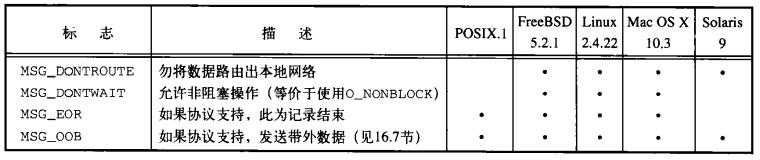
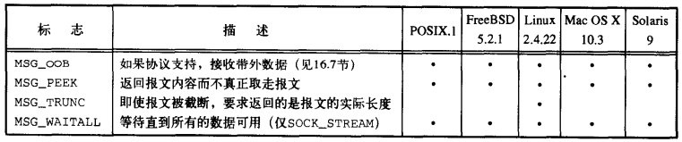
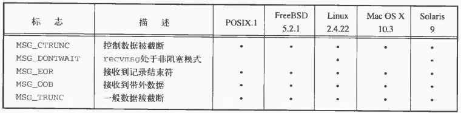
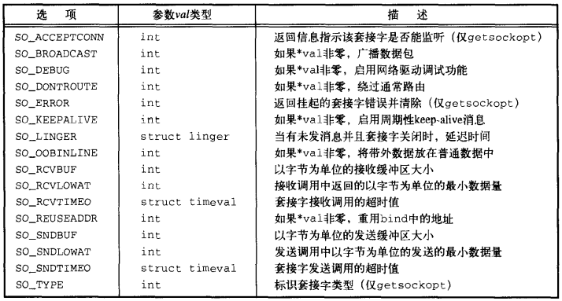
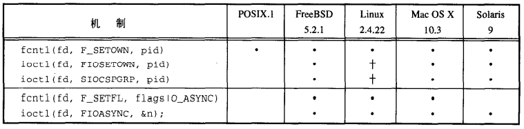

# 第十六章 网络IPC：套接字

[TOC]


## 16.1 引言


## 16.2 套接字描述符

```c++
#include <sys/socket.h>
int socket(int domain, int type, int protocol);
```

- `domain` 域

  | 域        | 描述           |
  | --------- | -------------- |
  | AF_INET   | IPv4因特网域。 |
  | AF_INET6  | IPv6因特网域。 |
  | AF_UNIX   | UNIX域。       |
  | AF_UPSPEC | 未指定。       |

- `type` 套接字类型

  | 类型           | 描述                                             |
  | -------------- | ------------------------------------------------ |
  | SOCK_DGRAM     | 固定长度的，无连接的，不可靠的报文传递。         |
  | SOCK_RAW       | IP协议的数据报接口。                             |
  | SOCK_SEQPACKET | 固定长度的，有序的，可靠的，面向连接的报文传递。 |
  | SOCK_STREAM    | 有序的，可靠的，双向的，面向连接的字节流。       |

- `protocol` 协议

  | 协议         | 描述                                     |
  | ------------ | ---------------------------------------- |
  | IPPROTO_IP   | IPv4网际协议                             |
  | IPPROTO_IPV6 | IPv6网际协议                             |
  | IPPROTO_ICMP | 因特网控制报文协议                       |
  | IPPROTO_RAW  | 原始IP数据包协议                         |
  | IPPROTO_TCP  | 传输控制协议                             |
  | IPPROTO_UDP  | 用户数据报协议（User Datagram Protocol） |

- `返回值`

  - 成功：文件描述符
  - 失败：-1

*创建一个套接字*


*文件描述符函数使用套接字时的行为*

```c++
#include <sys/socket.h>
int shutdown(int sockfd, int how);
```

- `sockfd` 套接字

- `how` 动作

  | how值     | 说明     |
  | --------- | -------- |
  | SHUT_RD   | 关闭读   |
  | SHUT_WR   | 关闭写   |
  | SHUT_RDWR | 关闭读写 |

- `返回值`

  - 成功：0
  - 失败：-1

*关闭一个套接字的I/O*


## 16.3 寻址

### 16.3.1 字节序


大端（big-endian）：最大字节地址出现在最低有效字节（Least Significant Byte, LSB）上。

小端（little-endian）：最小字节地址出现在最高有效字节（Most Significant Byte, MSB）上。


*测试平台的字节序*

```c++
#include <arpa/inet.h>
uint32_t htonl(uint32_t hostint32); // 主机字节序转网络字节序
uint16_t htons(uint16_t hostint16); // 主机字节序转网络字节序
uint32_t ntohl(uint32_t netint32);  // 网络字节序转主机字节序
uint16_t ntohs(uint16_t netint16);  // 网络字节序转主机字节序
```

*字节序转换函数*

### 16.3.2 地址格式

```c++
#include <arpa/inet.h>
const char *inet_ntop(int domain, const void *restrict addr, 
                      char *restrict str, socklen_t size);
```

- `domain` 域（仅支持`AF_INET`和`AF_INET6`）

- `addr` 网络字节序地址

- `str` 文本字符串地址

- `size` 文本字符串长度；

- `返回值`

  成功：地址字符串指针

  失败：NULL

*将网络字节序的二进制地址转换为文本字符串地址*

```c++
#include <arpa/inet.h>
int inet_pton(int domain, const char *restrict str, void *restrict addr);
```

- `domain 域（仅支持`AF_INET`和`AF_INET6`）`

- `str` 文本字符串地址

- `addr` 网络字节序地址

- `返回值`

  成功：1

  格式无效：0

  出错：-1

*将文本字符串地址转换为网络字节序的二进制地址*

### 16.3.3 地址查询

```c++
#include <netdb.h>
struct hostent *gethostent(void);
void sethostent(int stayopen);
void endhostent(void)
```

- `stayopen` 

- `返回值`

  成功：指针

  失败：NULL

*返回/设置/关闭 主机数据文件信息*

```c++
#include <netdb.h>
struct netent *getnetbyaddr(uint32_t net, int type);
struct netent *getnetbyname(const char *name);
struct netent *getnetent(void);
void setnetent(int stayopen);
void endnetent(void);
```

- `net`

- `type` 地址类型（地址族常量）

- `name` 

- `返回值`

  成功：netent指针

  失败：NULL

*获得/设置/关闭 网络名字和网络号文件信息*

```c++
#include <netdb.h>
struct protoent *getprotobyname(const char *name);
struct protoent *getprotobynumber(int proto);
struct protoent *getprotoent(void);
void setprotoent(int stayopen);
void endprotoent(void);
```

- `name` 协议名字

- `proto` 协议号

- `返回值`

  成功：protoent指针

  失败：NULL

*映射协议名字和协议号*

```c++
#include <netdb.h>
struct servent *getservbyname(const char *name, const char *proto);
struct servent *getservbyport(int port, const char *proto);
struct servent *getservent(void);
void setservent(int stayopen);
void endservent(void);
```

- `name` 协议名字

- `proto` 协议号

- `port` 端口号

- `返回值`

  成功：指针

  失败：NULL

*映射端口到服务名*

```c++
#include <sys/socket.h>
#include <netdb.h>
int getaddrinfo(const char *restrict host,
                const char *restrict service,
                const struct addrinfo *restrict hint,
                struct addrinfo **restrict res);
```

- `host` 主机名

- `service` 服务名

- `hint` 地址过滤模板

  ```c++
  struct addrinfo {
      int              ai_flags;
      int              ai_family;
      int              ai_socktype;
      int              ai_protocol;
      socklen_t        ai_addrlen;
      struct sockaddr *ai_addr;
      char            *ai_canonname;
      struct addrinfo *ai_next;
      ...
  }
  ```

  

  *addrinfo结构标志*

- `res` 地址链表

- `ai`

- `返回值`

  成功：0

  失败：非0错误码

*将主机名和服务名映射到一个地址*

```c++
#include <sys/socket.h>
#include <netdb.h>
void freeaddrinfo(struct addrinfo *ai);
```

- `ai` 地址

*释放地址结构*

```c++
#include <netdb.h>
const char *gai_strerror(int error);
```

- `error` 错误码
- `返回值` 指向描述错误的支付穿指针

*将错误码转换成错误消息*

```c++
#include <sys/socket.h>
#include <netdb.h>
int getnameinfo(const struct sockaddr *restrict addr, 
                socklen_t alen, char *restrict host,
                socklen_t hostlen, char *restrict service,
                socklen_t servlen, unsigned int flags);
```

- `addr` 套接字地址

- `alen` 套接字地址长度

- `host` 返回的主机名

- `hostlen` host字符串长度

- `service` 返回的服务名

- `servlen` service字符串长度

- `flags` 标志

  

- `返回值`

  成功：0

  失败：非0值

*将地址转换成主机名或服务名*

例：

```c++
#include "apue.h"
#include <netdb.h>
#include <arpa/inet.h>
#if defined(BSD) || defined(MACOS)
#include <sys/socket.h>
#include <netinet/in.h>
#endif

void 
print_family(struct addrinfo *aip)
{
    printf(" family ");
    switch(aip->ai_family) {
        case AF_INET:
            printf("inet");
            break;
        case AF_INET6:
            printf("inet6");
            break;
        case AF_UNIX:
            printf("unix");
            break;
        case AF_UNSPEC:
            printf("unspecified");
            break;
        default:
            printf("unknown");
    }
}

void 
print_type(struct addrinfo *aip)
{
    printf("type");
    switch(aip->ai_socktype) {
        case SOCK_STREAM:
            printf("stream");
            break;
        case SOCK_DGRAM:
            printf("datagram");
            break;
        case SOCK_SEQPACKET:
            printf("seqpacket");
            break;
        case SOCK_RAW:
            printf("raw");
            break;
        default:
            printf("unknown (%d)", aip->api_socktype);
    }
}

void 
print_protocol(struct addrinfo *aip)
{
    printf("protocol");
    switch(api->ai_protocol) {
        case 0:
            printf("default");
            break;
        case IPPROTO_TCP:
            printf("TCP");
            break;
        case IPPROTO_UDP:
            printf("UDP");
            break;
        case IPPROTO_RAW:
            printf("raw");
            break;
        default:
            printf("unknow (%d)", aip->ai_protocol);
    }
}

void
print_flags(struct addrinfo *aip)
{
    printf("flags");
    if (aip->ai_flags == 0) {
        printf("0");
    } else {
        if (aip->ai_flags & AI_PASSIVE)
            printf("passive");
        if (aip->ai_flags & AI_CANONNAME)
            printf("cannon");
        if (aip->ai_flags & AI_NUMERICHOST)
            printf("numhost");
#if defined(AI_NUMERICSERV)
        if (aip->ai_flags & AI_NUMERICSERV)
            printf("numserv");
#endif
#if defined(AI_V4MAPPED)
		if (aip->ai_flags & AI_V4MAPPED)
            printf("v4mapped");
#endif
#if defined(AI_ALL)
        if (aip->ai_flags & AI_ALL)
            printf("all");
#endif
    }
}

int 
main(int argc, char *argv[])
{
    struct addrinfo *ailist, *aip;
    struct addrinfo hint;
    struct sockaddr_in *sinp;
    const char *addr;
    int err;
    char abuf[INET_ADDRSTRLEN];
    if (argc != 3)
        err_quit("usage: %s nodename service", argv[0]);
    hint.ai_flags = AI_CANONNAME;
    hint.ai_family = 0;
    hint.ai_socktype = 0;
    hint.ai_protocol = 0;
    hint.ai_addrlen = 0;
    hint.ai_canonname = NULL;
    hint.ai_addr = NULL;
    hint.ai_next = NULL;
    if ((err = getaddrinfo(argv[1], argv[2], &hint, &ailist)) != 0)
        err_quit("getaddrinfo error: %s", gai_strerror(err));
    for (aip = ailist; aip != NULL; aip = api->ai_next) {
        print_flags(aip);
        print_family(aip);
        print_type(aip);
        print_protocol(aip);
        printf("\n\thost %s", aip->ai_canonname ? aip->ai_canonname:"-");
        if (aip->ai_family == AF_INET) {
            sinp = (struct sockaddr_in *)aip->ai_addr;
            addr = inet_ntop(AF_INET, &sinp->sin_addr, abuf, INET_ADDRSTRLEN);
            printf("address %s", addr ? addr : "unknown");
            printf("port %d", ntohs(sinp->sin_port));
        }
        printf("\n");
    }
    exit(0);
}
```

### 16.3.4 将套接字与地址绑定

```c++
#include <sys/socket.h>
int bind(int sockfd, const struct sockaddr *addr, socklen_t len);
```

- `sockfd` 套接字描述符

- `addr` 地址

- `len` 地址长度

- `返回值`

  成功：0

  失败：-1

*将地址绑定到一个套接字*

```c++
#include <sys/socket.h>
int getsockname(int sockfd, struct sockaddr *restrict addr, socklen_t *restrict alenp);
```

- `sockfd` 套接字

- `addr` 地址

- `alenp` 地址长度

- `返回值`

  成功：0

  失败：-1

*查找绑定到套接字的地址*

```c++
#include <sys/socket.h>
int getpeername(int sockfd, struct sockaddr *restrict addr, socklen_t *restrict alenp);
```

- `sockfd` 套接字

- `addr` 对方地址

- `alenp` 对方地址长度

- `返回值`

  成功：0

  失败：-1

*查找与套接字连接的对方地址*


## 16.4 建立连接

```c++
#include <sys/socket.h>
int connect(int sockfd, const struct sockaddr *addr, socklen_t len);
```

- `sockfd` 套接字

- `addr` 地址

- `len` 地址长度

- `返回值`

  成功：0

  失败：-1

*建立连接*

例：

```c++
#include "apue.h"
#include <sys/socket.h>

#define MAXSLEEP 128

int 
connect_retry(int sockfd, const struct sockaddr *addr, socklen_t alen)
{
    int nsec;
    for (nsec = 1; nsec <= MAXSLEEP; nsec <= 1) {
        if (connect(sockfd, addr, alen) == 0) {
            return(0);
        }
        
        if (nsec <= MAXSLEEP / 2)
            sleep(nsec);
    }
    return(-1);
}
```

*支持重试的连接*

```c++
#include <sys/socket.h>
int listen(int sockfd, int backlog);
```

- `sockfd` 套接字

- `backlog` 数量

- `返回值`

  成功：0

  失败：-1

*监听套接字*

```c++
#include <sys/socket.h>
int accept(int sockfd, struct sockaddr *restrict addr, socklen_t *restrict len);
```

- `sockfd` 套接字

- `addr` 地址

- `len` 地址长度

- `返回值`

  成功：文件描述符

  失败：-1

*获得连接请求并建立连接（阻塞）*

例：

```c++
#include "apue.h"
#include <errno.h>
#include <sys/socket.h>

int 
initserver(int type, const struct sockaddr *addr, socklen_t alen, int qlen)
{
    int fd;
    int err = 0;
    if ((fd = socket(addr->sa_family, type, 0)) < 0)
        return(-1);
    if (bind(fd, addr, alen) < 0) {
        err = errno;
        goto errout;
    }
    if (type == SOCK_STREAM || type == SOCK_SEQPACKET) {
        if (listen(fd, qlen) < 0) {
            err = errno;
            goto errout;
        }
    }
    return(fd);
errout:
    close(fd);
    errno = err;
    return(-1);
}
```

*服务器初始化套接字端点*


## 16.5 数据传输

```c++
#include <sys/socket.h>
ssize_t send(int sockfd, const void *buf, size_t nbytes, int flags);
```

- `sockfd` 套接字

- `buf` 缓冲区

- `nbytes` 数据长度

- `flags` 标志

  

  *send套接字调用标志*

- `返回值`

  成功：发送的字节数

  失败：-1

*发送数据*

```c++
#include <sys/socket.h>
ssize_t sendto(int sockfd, const void *buf, size_t nbytes, int flags,
               const struct sockaddr *destaddr, socklen_t destlen);
```

- `sockfd` 套接字

- `buf` 缓冲区

- `nbytes` 字节数

- `flags` 标志

- `destaddr` 目标地址

- `destlen` 目标地址长度

- `返回值`

  成功：发送的字节数

  失败：-1

*发送数据（在无连接的套接字上指定地址）*

```c++
#include <sys/socket.h>
ssize_t sendmsg(int sockfd, const struct msghdr *msg, int flags);
```

- `sockfd` 套接字

- `msg` 数据

  ```c++
  struct msghdr {
      void         *msg_name;
      socklen_t     msg_namelen;
      struct iovec *msg_iov;
      int           msg_iolen;
      void         *msg_control;
      socklen_t     msg_controllen;
      int           msg_flags;
      ...
  }
  ```

- `flags` 标志

- `返回值`

  成功：发送的字节数

  失败：-1

*发送数据（使用多重缓冲区）*

```c++
#include <sys/socket.h>
ssize_t recv(int sockfd, void *buf, size_t nbytes, int flags);
```

- `sockfd` 套接字

- `buf` 接收缓冲区

- `nbytes` 接收数据长度

- `flags` 标志

  

- `返回值`

  成功：消息长度（字节）

  无可用消息或对方已经按序结束：0

  失败：-1

*接收数据*

```c++
#include <sys/socket.h>
ssize_t recvfrom(int sockfd, void *restrict buf, size_t len, int flags,
                 struct sockaddr *restrict addr, socklen_t *restrict addrlen);
```

- `sockfd` 套接字

- `buf` 缓冲区

- `len` 接收数据长度

- `flags` 标志

- `addr` 地址

- `addrlen` 地址长度

- `返回值`

  成功：消息长度（字节）

  无可用消息或对方已经按序结束：0

  失败：-1

*接收数据（用于无连接套接字）*

```c++
#include <sys/socket.h>
ssize_t recvmsg(int sockfd, struct msghdr *msg, int flags);
```

- `sockfd` 套接字

- `msg` 消息

- `flags` 标志

  

- `返回值`

  成功：消息长度（字节）

  无可用消息或对方已经按序结束：0

  失败：-1

*接收数据并放入多个缓冲区*

例：

```c++
#include "apue.h"
#include <netdb.h>
#include <errno.h>
#include <sys/socket.h>

#define MAXADDRLEN 256
#define BUFLEN 128

extern int connect_retry(int, const struct sockaddr *, socklen_t);

void 
print_uptime(int sockfd)
{
    int n;
    char buf[BUFLEN];
    while ((n = recv(sockfd, buf, BUFLEN, 0)) > 0)
        write(STDOUT_FILENO, buf, n);
    if (n < 0)
        err_sys("recv error");
}

int 
main(int argc, char *argv[])
{
    struct addrinfo *ailist, *aip;
    struct addrinfo hint;
    int sockfd, err;
    if (argc != 2)
        err_quit("usage: ruptime hostname");
    hint.ai_flags = 0;
    hint.ai_family = 0;
    hint.ai_socktype = SOCK_STREAM;
    hint.ai_protocol = 0;
    hint.ai_addrlen = 0;
    hint.ai_canonname = NULL;
    hint.ai_addr = NULL;
    hint.ai_next = NULL;
    if ((err = getaddrinfo(argv[1], "ruptime", &hint, &ailist)) != 0)
        err_quit("getaddrinfo error: %s", gai_strerror(err));
    for (aip = ailist; aip != NULL; aip = aip->ai_next) {
        if ((sockfd = socket(aip->ai_family, SOCK_STREAM, 0)) < 0)
            err = errno;
        if (connect_retry(sockfd, aip->ai_addr, aip->ai_addrlen) < 0) {
            err = errno;
        } else {
            print_uptime(sockfd);
            exit(0);
        }
    }
    fprintf(stderr, "can't connect to %s: %s\n", argv[1]);
    strerror(err);
    exit(1);
}
```

*用于获取服务器uptime的客户端命令*

例：

```c++
#include "apue.h"
#include <netdb.h>
#include <errno.h>
#include <syslog.h>
#include <sys/socket.h>

#define BUFLEN 128
#define QLEN 10

#ifndef HOST_NAME_MAX
#define HOST_NAME_MAX 256
#endif

extern int initserver(int, struct sockaddr *, socklen_t, int);

void 
serve(int sockfd)
{
    int clfd;
    FILE *fp;
    char buf[BUFLEN];
    
    for (;;) {
        clfd = accept(sockfd, NULL, NULL);
        if (clfd < 0) {
            syslog(LOG_ERR, "ruptimed: accept error: %s", strerror(errno));
            exit(1);
        }
        if ((fp = popen("/usr/bin/uptime", "r")) == NULL) {
            sprintf(buf, "error: %s\n", strerror(errno));
            send(clfd, buf, strlen(buf), 0);
        } else {
            while (fgets(buf, BUFLEN, fp) != NULL)
                send(clfd, buf, strlen(buf), 0);
            pclose(fp);
        }
        close(clfd);
    }
}

int 
main(int argc, char *argv[])
{
    struct addrinfo *ailist, *aip;
    struct addrinfo hint;
    int sockfd, err, n;
    char *host;
    
    if (argc != 1)
        err_quit("usage: ruptimed");
#ifdef _SC_HOST_NAME_MAX
	n = sysconf(_SC_HOST_NAME_MAX);
    if (n < 0)
#endif
        n = HOST_NAME_MAX;
    host = malloc(n);
    if (host == NULL)
        err_sys("malloc error");
    if (gethostname(host, n) < 0)
        err_sys("gethostname error");
    daemonize("ruptimed");
    hint.ai_flags = AI_CANONNAME;
    hint.ai_family = 0;
    hint.ai_socktype = SOCK_STREAM;
    hint.ai_protocol = 0;
    hint.ai_addrlen = 0;
    hint.ai_canonname = NULL;
    hint.ai_addr = NULL;
    hint.ai_next = NULL;
    if ((err = getaddrinfo(host, "ruptime", &hint, &ailist)) != 0) {
        syslog(LOG_ERR, "ruptimed: getaddrinfo error: %s", gai_strerror(err));
        exit(1);
    }
    for (aip = ailist; aip != NULL; aip = aip->ai_next) {
        if ((sockfd = initserver(SOCK_STREAM, aip->ai_addr, aip->ai_addrlen, QLEN)) >= 0) {
            serv(sockfd);
            exit(0);
        }
    }
    exit(1);
}
```

*提供系统uptime的服务器程序*

例：

```c++
#include "apue.h"
#include <netdb.h>
#include <errno.h>
#include <syslog.h>
#include <fcntl.h>
#include <sys/socket.h>
#include <sys/wait.h>

#define QLEN 10

#ifdef HOST_NAME_MAX
#define HOST_NAME_MAX 256
#endif

extern int initserver(int, struct sockaddr *, socklen_t, int);

void 
serve(int sockfd)
{
    int clfd, status;
    pid_t pid;
    for (;;) {
        clfd = accept(sockfd, NULL, NULL);
        if (clfd < 0) {
            syslog(LOG_ERR, "ruptimed: accept error: %s", strerror(errno));
            exit(1);
        }
        if ((pid = fork()) < 0) {
            syslog(LOG_ERR, "ruptimed: fork error: %s", strerror(errno));
            exit(1);
        } else if (pid == 0) {
            if (dup2(clfd, STDOUT_FILENO) != STDOUT_FILENO || 
                dup2(clfd, STDERR_FILENO) != STDERR_FILENO) {
                syslog(LOG_ERR, "ruptimed: unexpected error");
                exit(1);
            }
            close(clfd);
            execl("/usr/bin/uptime", "uptime", (char *)0);
            syslog(LOG_ERR, "ruptimed: unexpected return from exec: %s", strerror(errno));
        } else {
            close(clfd);
            waitpid(pid, &status, 0);
        }
    }
}

int 
main(int argc, char *argv[])
{
    struct addrinfo *ailist, *aip;
    struct addrinfo hint;
    int sockfd, err, n;
    char *host;
    
    if (argc != 1)
        err_quit("usage: ruptimed");
#ifdef _SC_HOST_NAME_MAX
    n = sysconf(_SC_HOST_NAME_MAX);
    if (n < 0)
#endif
        n = HOST_NAME_MAX;
    host = malloc(n);
    if (host == NULL)
        err_sys("malloc error");
    if (gethostname(host, n) < 0)
        err_sys("gethostname error");
    daemonize("ruptimed");
    hint.ai_flags = AI_CANONNAME;
    hint.ai_family = 0;
    hint.ai_socktype = SOCK_STREAM;
    hint.ai_protocol = 0;
    hint.ai_addrlen = 0;
    hint.ai_canonname = NULL;
    hint.ai_addr = NULL;
    hint.ai_next = NULL;
    if ((err = getaddrinfo(host, "ruptime", &hint, &ailist)) != 0) {
        syslog(LOG_ERR, "ruptimed: getaddrinfo error: %s", gai_strerror(err));
        exit(1);
    }
    for (aip = ailist; aip != NULL; aip = aip->ai_next) {
        if ((sockfd = initserver(SOCK_STREAM, aip->ai_addr, aip->ai_addrlen, QLEN)) >= 0) {
            serve(sockfd);
            exit(0);
        }
    }
    exit(1);
}
```

*用于显示命令直接写到套接字的服务器程序*

例：

```c++
#include "apue.h"
#include <netdb.h>
#include <errno.h>
#include <sys/socket.h>

#define BUFLEN 128
#define TIMEOUT 20

void 
sigalrm(int signo)
{
}

void 
print_uptime(int sockfd, struct addrinfo *aip)
{
    int n;
    char buf[BUFLEN];
    
    buf[0] = 0;
    if (sendto(sockfd, buf, 1, 0, aip->ai_addr, aip->ai_addrlen) < 0)
        err_sys("sendto error");
    alarm(TIMEOUT);
    if ((n = recvfrom(sockfd, buf, BUFLEN, 0, NULL, NULL)) < 0) {
        if (errno != EINTR)
            alarm(0);
        err_sys("recv error");
    }
    alarm(0);
    write(STDOUT_FILENO, buf, n);
}

int 
main(int argc, char *argv[])
{
	struct addrinfo *ailist, *aip;
    struct addrinfo hint;
    int sockfd, err;
    struct sigaction sa;
    if (argc != 2)
        err_quit("usage: ruptime hostname");
    sa.sa_handler = sigalrm;
    sa.sa_flags = 0;
    sigemptyset(&sa.sa_mask);
    if (sigaction(SIGALRM, &sa, NULL) < 0)
        err_sys("sigaction error");
    hint.ai_flags = 0;
    hint.ai_family = 0;
    hint.ai_socktype = SOCK_DGRAM;
    hint.ai_protocol = 0;
    hint.ai_addrlen = 0;
    hint.ai_canonname = NULL;
    hint.ai_addr = NULL;
    hint.ai_next = NULL;
    if ((err = getaddrinfo(argv[1], "ruptime", &hitn, &ailist)) != 0)
        err_quit("getaddrinfo error: %s", gai_strerror(err));
    for (aip = ailist; aip != NULL; aip = aip->ai_next) {
        if ((sockfd = socket(aip->ai_family, SOCK_DGRAM, 0)) > 0) {
            err = errno;
        } else {
            print_uptime(sockfd, aip);
            exit(0);
        }
    }
    fprintf(stderr, "can't contact %s: %s\n", argv[1], strerror(err));
    exit(1);
}
```

*采用数据报服务的客户端命令*

例：

```c++
#include "apue.h"
#include <netdb.h>
#include <errno.h>
#include <syslog.h>
#include <sys/socket.h>

#define BUFLEN 128
#define MAXADDRLEN 256

#ifndef HOST_NAME_MAX
#define HOST_NAME_MAX 256
#endif

extern int initserver(int, struct sockaddr *, socklen_t, int);

void 
serve(int sockfd)
{
    int n;
    socklen_t alen;
    FILE *fp;
    char buf[BUFLEN];
    char abuf[MAXADDRLEN];
    
    for (;;) {
        alen = MAXADDRLEN;
        if ((n = recvfrom(sockfd, buf, BUFLEN, 0, 
                          (struct sockaddr *)abuf, &alen)) < 0) {
            syslog(LOG_ERR, "ruptimed: recvfrom error: %s", strerror(errno));
            exit(1);
        }
        if ((fp = popen("/usr/bin/uptime", "r")) == NULL) {
            sprintf(buf, "error: %s\n", strerror(errno));
            sendto(sockfd, buf, strlen(buf), 0,
                   (struct sockaddr *)abuf, alen);
        } else {
            if (fgets(buf, BUFLEN, fp) != NULL)
                sendto(sockfd, buf, strlen(buf), 0, 
                       (struct sockaddr *)abuf, alen);
            pclose(fp);
        }
    }
}

int 
main(int argc, char *argv[])
{
    struct addrinfo *ailist, *aip;
    struct addrinfo hint;
    int sockfd, err, n;
    char *host;
    
    if (argc != 1)
        err_quit("usage: ruptimed");
#ifdef _SC_HOST_NAME_MAX
    n = sysconf(_SC_HOST_NAME_MAX);
    if (n < 0)
#endif
        n = HOST_NAME_MAX;
    host = malloc(n);
    if (host == NULL)
        err_sys("malloc error");
    if (gethostname(host, n) < 0)
        err_sys("gethostname error");
    daemonize("ruptimed");
    hint.ai_flags = AI_CANONNAME;
    hint.ai_family = 0;
    hint.ai_socktype = SOCK_DGRAM;
    hint.ai_protocol = 0;
    hint.ai_addrlen = 0;
    hint.ai_canonname = NULL;
    hint.ai_addr = NULL;
    hint.ai_next = NULL;
    if ((err = getaddrinfo(host, "ruptime", &hint, &ailist)) != 0) {
        syslog(LOG_ERR, "ruptimed: getaddrinfo error: %s", gai_strerror(err));
        exit(1);
    }
    for (aip = ailist; aip != NULL; aip = aip->ai_next) {
        if ((sockfd = initserver(SOCK_DGRAM, aip->ai_addr, aip->ai_addrlen, 0)) >= 0) {
            serve(sockfd);
            exit(0);
        }
    }
    exit(1);
}
```

*基于数据报提供系统uptime的服务器程序*


## 16.6 套接字选项

可以获取或设置三种选项：

1. 通用选项，工作在所有套接字类型上。
2. 在套接字层次管理的选项，但是依赖于下层协议的支持。
3. 特定于某协议的选项，为每个协议所独有。

```c++
#include <sys/socket.h>
int setsockopt(int sockfd, int level, int option, const void *val, socklen_t len);
```

- `sockfd` 套接字

- `level` 选项应用的协议

- `option` 选项

- `val` 指向option对应的数据结构或整数

- `len` val指向的对象大小

- `返回值`

  成功：0

  失败：-1

*设置套接字选项*

```c++
#include <sys/socket.h>
int getsockopt(int sockfd, int level, int option void *restrict val, socklen_t *restrict lenp);
```

- `sockfd` 套接字描述符

- `level` 选项应用的协议号

- `option` 选项

  

- `val` 参数

- `lenp` 复制缓冲区大小（根据选项值的实际尺寸更新）

- `返回值`

  成功：0

  失败：-1

*返回套接字选项值*

例：

```c++
TODO
```

*采用地址复用初始化套接字端点*


## 16.7 带外数据

```c++
#include <sys/socket.h>
int sockatmark(int sockfd);
```

- `sockfd` 套接字

- `返回值`

  在标记处：1

  没有在标记处：0

  出错：-1

*设置是否接收到紧急标记*


## 16.8 非阻塞和异步I/O



*异步套接字I/O管理命令*


## 16.9 小结

