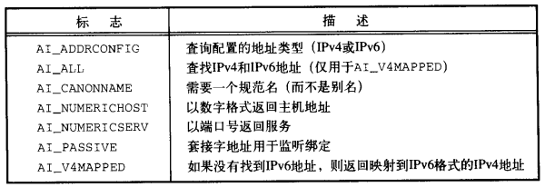
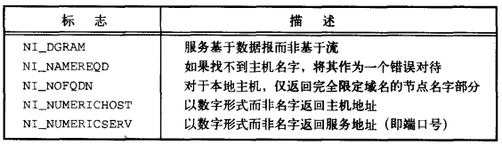

# 第十六章 网络IPC：套接字

[TOC]


## 16.1 引言


## 16.2 套接字描述符

```c++
#include <sys/socket.h>
int socket(int domain, int type, int protocol);
```

- `domain` 域

  | 域        | 描述           |
  | --------- | -------------- |
  | AF_INET   | IPv4因特网域。 |
  | AF_INET6  | IPv6因特网域。 |
  | AF_UNIX   | UNIX域。       |
  | AF_UPSPEC | 未指定。       |

- `type` 套接字类型

  | 类型           | 描述                                             |
  | -------------- | ------------------------------------------------ |
  | SOCK_DGRAM     | 固定长度的，无连接的，不可靠的报文传递。         |
  | SOCK_RAW       | IP协议的数据报接口。                             |
  | SOCK_SEQPACKET | 固定长度的，有序的，可靠的，面向连接的报文传递。 |
  | SOCK_STREAM    | 有序的，可靠的，双向的，面向连接的字节流。       |

- `protocol` 协议

  | 协议         | 描述                                     |
  | ------------ | ---------------------------------------- |
  | IPPROTO_IP   | IPv4网际协议                             |
  | IPPROTO_IPV6 | IPv6网际协议                             |
  | IPPROTO_ICMP | 因特网控制报文协议                       |
  | IPPROTO_RAW  | 原始IP数据包协议                         |
  | IPPROTO_TCP  | 传输控制协议                             |
  | IPPROTO_UDP  | 用户数据报协议（User Datagram Protocol） |

- `返回值`

  - 成功：文件描述符
  - 失败：-1

*创建一个套接字*


*文件描述符函数使用套接字时的行为*

```c++
#include <sys/socket.h>
int shutdown(int sockfd, int how);
```

- `sockfd` 套接字

- `how` 动作

  | how值     | 说明     |
  | --------- | -------- |
  | SHUT_RD   | 关闭读   |
  | SHUT_WR   | 关闭写   |
  | SHUT_RDWR | 关闭读写 |

- `返回值`

  - 成功：0
  - 失败：-1

*关闭一个套接字的I/O*


## 16.3 寻址

### 16.3.1 字节序


大端（big-endian）：最大字节地址出现在最低有效字节（Least Significant Byte, LSB）上。

小端（little-endian）：最小字节地址出现在最高有效字节（Most Significant Byte, MSB）上。


*测试平台的字节序*

```c++
#include <arpa/inet.h>
uint32_t htonl(uint32_t hostint32); // 主机字节序转网络字节序
uint16_t htons(uint16_t hostint16); // 主机字节序转网络字节序
uint32_t ntohl(uint32_t netint32);  // 网络字节序转主机字节序
uint16_t ntohs(uint16_t netint16);  // 网络字节序转主机字节序
```

*字节序转换函数*

### 16.3.2 地址格式

```c++
#include <arpa/inet.h>
const char *inet_ntop(int domain, const void *restrict addr, 
                      char *restrict str, socklen_t size);
```

- `domain` 域（仅支持`AF_INET`和`AF_INET6`）

- `addr` 网络字节序地址

- `str` 文本字符串地址

- `size` 文本字符串长度；

- `返回值`

  成功：地址字符串指针

  失败：NULL

*将网络字节序的二进制地址转换为文本字符串地址*

```c++
#include <arpa/inet.h>
int inet_pton(int domain, const char *restrict str, void *restrict addr);
```

- `domain 域（仅支持`AF_INET`和`AF_INET6`）`

- `str` 文本字符串地址

- `addr` 网络字节序地址

- `返回值`

  成功：1

  格式无效：0

  出错：-1

*将文本字符串地址转换为网络字节序的二进制地址*

### 16.3.3 地址查询

```c++
#include <netdb.h>
struct hostent *gethostent(void);
void sethostent(int stayopen);
void endhostent(void)
```

- `stayopen` 

- `返回值`

  成功：指针

  失败：NULL

*返回/设置/关闭 主机数据文件信息*

```c++
#include <netdb.h>
struct netent *getnetbyaddr(uint32_t net, int type);
struct netent *getnetbyname(const char *name);
struct netent *getnetent(void);
void setnetent(int stayopen);
void endnetent(void);
```

- `net`

- `type` 地址类型（地址族常量）

- `name` 

- `返回值`

  成功：netent指针

  失败：NULL

*获得/设置/关闭 网络名字和网络号文件信息*

```c++
#include <netdb.h>
struct protoent *getprotobyname(const char *name);
struct protoent *getprotobynumber(int proto);
struct protoent *getprotoent(void);
void setprotoent(int stayopen);
void endprotoent(void);
```

- `name` 协议名字

- `proto` 协议号

- `返回值`

  成功：protoent指针

  失败：NULL

*映射协议名字和协议号*

```c++
#include <netdb.h>
struct servent *getservbyname(const char *name, const char *proto);
struct servent *getservbyport(int port, const char *proto);
struct servent *getservent(void);
void setservent(int stayopen);
void endservent(void);
```

- `name` 协议名字

- `proto` 协议号

- `port` 端口号

- `返回值`

  成功：指针

  失败：NULL

*映射端口到服务名*

```c++
#include <sys/socket.h>
#include <netdb.h>
int getaddrinfo(const char *restrict host,
                const char *restrict service,
                const struct addrinfo *restrict hint,
                struct addrinfo **restrict res);
```

- `host` 主机名

- `service` 服务名

- `hint` 地址过滤模板

  ```c++
  struct addrinfo {
      int              ai_flags;
      int              ai_family;
      int              ai_socktype;
      int              ai_protocol;
      socklen_t        ai_addrlen;
      struct sockaddr *ai_addr;
      char            *ai_canonname;
      struct addrinfo *ai_next;
      ...
  }
  ```

  

  *addrinfo结构标志*

- `res` 地址链表

- `ai`

- `返回值`

  成功：0

  失败：非0错误码

*将主机名和服务名映射到一个地址*

```c++
#include <sys/socket.h>
#include <netdb.h>
void freeaddrinfo(struct addrinfo *ai);
```

- `ai` 地址

*释放地址结构*

```c++
#include <netdb.h>
const char *gai_strerror(int error);
```

- `error` 错误码
- `返回值` 指向描述错误的支付穿指针

*将错误码转换成错误消息*

```c++
#include <sys/socket.h>
#include <netdb.h>
int getnameinfo(const struct sockaddr *restrict addr, 
                socklen_t alen, char *restrict host,
                socklen_t hostlen, char *restrict service,
                socklen_t servlen, unsigned int flags);
```

- `addr` 套接字地址

- `alen` 套接字地址长度

- `host` 返回的主机名

- `hostlen` host字符串长度

- `service` 返回的服务名

- `servlen` service字符串长度

- `flags` 标志

  

- `返回值`

  成功：0

  失败：非0值

*将地址转换成主机名或服务名*

例：

```c++
#include "apue.h"
#include <netdb.h>
#include <arpa/inet.h>
#if defined(BSD) || defined(MACOS)
#include <sys/socket.h>
#include <netinet/in.h>
#endif

void 
print_family(struct addrinfo *aip)
{
    printf(" family ");
    switch(aip->ai_family) {
        case AF_INET:
            printf("inet");
            break;
        case AF_INET6:
            printf("inet6");
            break;
        case AF_UNIX:
            printf("unix");
            break;
        case AF_UNSPEC:
            printf("unspecified");
            break;
        default:
            printf("unknown");
    }
}

void 
print_type(struct addrinfo *aip)
{
    printf("type");
    switch(aip->ai_socktype) {
        case SOCK_STREAM:
            printf("stream");
            break;
        case SOCK_DGRAM:
            printf("datagram");
            break;
        case SOCK_SEQPACKET:
            printf("seqpacket");
            break;
        case SOCK_RAW:
            printf("raw");
            break;
        default:
            printf("unknown (%d)", aip->api_socktype);
    }
}

void 
print_protocol(struct addrinfo *aip)
{
    printf("protocol");
    switch(api->ai_protocol) {
        case 0:
            printf("default");
            break;
        case IPPROTO_TCP:
            printf("TCP");
            break;
        case IPPROTO_UDP:
            printf("UDP");
            break;
        case IPPROTO_RAW:
            printf("raw");
            break;
        default:
            printf("unknow (%d)", aip->ai_protocol);
    }
}

void
print_flags(struct addrinfo *aip)
{
    printf("flags");
    if (aip->ai_flags == 0) {
        printf("0");
    } else {
        if (aip->ai_flags & AI_PASSIVE)
            printf("passive");
        if (aip->ai_flags & AI_CANONNAME)
            printf("cannon");
        if (aip->ai_flags & AI_NUMERICHOST)
            printf("numhost");
#if defined(AI_NUMERICSERV)
        if (aip->ai_flags & AI_NUMERICSERV)
            printf("numserv");
#endif
#if defined(AI_V4MAPPED)
		if (aip->ai_flags & AI_V4MAPPED)
            printf("v4mapped");
#endif
#if defined(AI_ALL)
        if (aip->ai_flags & AI_ALL)
            printf("all");
#endif
    }
}

int 
main(int argc, char *argv[])
{
    struct addrinfo *ailist, *aip;
    struct addrinfo hint;
    struct sockaddr_in *sinp;
    const char *addr;
    int err;
    char abuf[INET_ADDRSTRLEN];
    if (argc != 3)
        err_quit("usage: %s nodename service", argv[0]);
    hint.ai_flags = AI_CANONNAME;
    hint.ai_family = 0;
    hint.ai_socktype = 0;
    hint.ai_protocol = 0;
    hint.ai_addrlen = 0;
    hint.ai_canonname = NULL;
    hint.ai_addr = NULL;
    hint.ai_next = NULL;
    if ((err = getaddrinfo(argv[1], argv[2], &hint, &ailist)) != 0)
        err_quit("getaddrinfo error: %s", gai_strerror(err));
    for (aip = ailist; aip != NULL; aip = api->ai_next) {
        print_flags(aip);
        print_family(aip);
        print_type(aip);
        print_protocol(aip);
        printf("\n\thost %s", aip->ai_canonname ? aip->ai_canonname:"-");
        if (aip->ai_family == AF_INET) {
            sinp = (struct sockaddr_in *)aip->ai_addr;
            addr = inet_ntop(AF_INET, &sinp->sin_addr, abuf, INET_ADDRSTRLEN);
            printf("address %s", addr ? addr : "unknown");
            printf("port %d", ntohs(sinp->sin_port));
        }
        printf("\n");
    }
    exit(0);
}
```

### 16.3.4 将套接字与地址绑定

```c++
#include <sys/socket.h>
int bind(int sockfd, const struct sockaddr *addr, socklen_t len);
```

- `sockfd` 套接字描述符

- `addr` 地址链表

- `len` 链表长度

- `返回值`

  成功：0

  失败：-1

*将地址绑定到一个套接字*

```c++
#include <sys/socket.h>
int getsockname(int sockfd, struct sockaddr *restrict addr, socklen_t *restrict alenp);
```

- `sockfd` 套接字

- `addr` 地址列表

- `alenp` 地址列表长度

- `返回值`

  成功：0

  失败：-1

*查找绑定到套接字的地址*

```c++
#include <sys/socket.h>
int getpeername(int sockfd, struct sockaddr *restrict addr, socklen_t *restrict alenp);
```

- `sockfd` 套接字

- `addr` 对方地址列表

- `alenp` 对方地址列表长度

- `返回值`

  成功：0

  失败：-1

*查找与套接字连接的对方地址*


## 16.4 建立连接

```c++
#include <sys/socket.h>
int connect(int sockfd, const struct sockaddr *addr, socklen_t len);
```

- `sockfd`

- `addr`

- `len`

- `返回值`

  成功：0

  失败：-1

**
