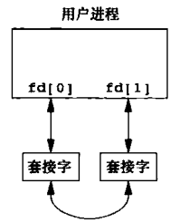
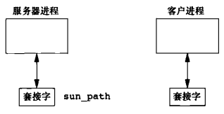
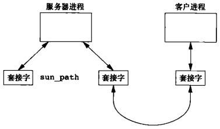
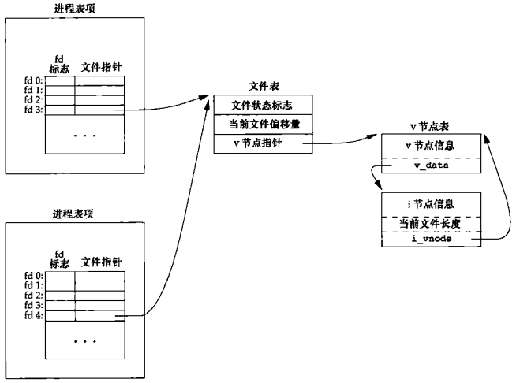

# 第十七章 高级进程间通信

[TOC]


## 17.1 引言


## 17.2 UNIX域套接字

```c++
#include <sys/socket.h>
int socketpair(int domain, int type, int protocol, int sockfd[2]);
```

- `domain` 域
- `type` 套接字类型
- `protocol` 协议
- `sockfd` 套接字描述符
- `返回值`
  成功：0
  
  失败：-1

*创建一对无命名的，相互连接的UNIX域套接字*



*套接字对*

例：

```c++
#include "apue.h"
#include <sys/socket.h>

int 
fd_pipe(int fd[2])
{
    return(socketpair(AF_UNIX, SOCK_STREAM, 0, fd));
}
```

*创建一个全双工管道*

例：

```c++
#include "apue.h"
#include <poll.h>
#include <pthread.h>
#include <sys/msg.h>
#include <sys/socket.h>

#define NQ     3
#define MAXMSZ 512
#define KEY    0x123

struct threadinfo {
    int qid;
    int fd;
};

struct mymesg {
    long mtype;
    char mtext[MAXMSZ];
};

void *
helper(void *arg)
{
    int n;
    struct mymesg m;
    struct threadinfo *tip = arg;
    for (;;) {
        memset(&m, 0, sizeof(m));
        if ((n = msgrcv(tip->qid, &m, MAXSZ, 0, MSG_NOERROR)) < 0)
            err_sys("msgrcv error");
        if (write(tip->fd, m.mtext, n) < 0)
            err_sys("write error");
    }
}

int 
main()
{
    int               i, n, err;
    int               fd[2];
    int               qid[NQ];
    struct pollfd     pfd[NQ];
    struct threadinfo ti[NQ];
    pthread_t         tid[NQ];
    char              buf[MAXMSZ];
    
    for (i = 0; i < NQ; i++) {
        if ((qid[i] = msgget((KEY + i), IPC_CREAT|0666)) < 0)
            err_sys("msgget error");
        printf("queue ID %d is %d\n", i, qid[i]);
        if (socketpair(AF_UNIX, SOCK_DGRAM, 0, fd) < 0)
            err_sys("socketpair error");
        pfd[i].fd = fd[0];
        pfd[i].events = POLLIN;
        ti[i].qid = qid[i];
        ti[i].fd = fd[1];
        if ((err = pthread_create(&tid[i], NULL, helper, &ti[i])) != 0)
            err_exit(err, "pthread_create error");
    }
    
    for (;;) {
        if (poll(pfd, NQ, -1) < 0)
            err_sys("poll error");
        for (i = 0; i < NQ; i++) {
            if (pfd[i].revents & POLLIN) {
                if ((n = read(pfd[i].fd, buf, sizeof(buf))) < 0)
                    err_sys("read error");
                buf[n] = 0;
                printf("queue id %d, message %s\n", qid[i], buf);
            }
        }
    }
    exit(0);
}
```

*使用UNIX域套接字轮询XSI消息队列*

```c++
#include "apue.h"
#include <sys/msg.h>

#define MAXMSZ 512

struct mymesg {
    long mtype;
    char mtext[MAXMSZ];
};

int 
main(int argc, char *argv[])
{
    key_t key;
    long qid;
    size_t bytes;
    struct mymesg m;
    
    if (argc != 3) {
        fprintf(stderr, "usage: sendmsg KEY message\n");
        exit(1);
    }
    key = strtol(argv[1], NULL, 0);
    if ((qid = msgget(key, 0)) < 0)
        err_sys("can't open queue key %s", argv[1]);
    memset(&m, 0, sizeof(m));
    strncpy(m.mtext, argv[2], MAXMSZ - 1);
    bytes = strlen(m.mtext);
    m.mtype = 1;
    if (msgsnd(qid, &m, nbytes, 0) < 0)
        err_sys("can't send message");
    exit(0);
}
```

*给XSI消息队列发送消息*

例：

```c++
#include "apue.h"
#include <sys/socket.h>
#include <sys/un.h>

int 
main(void)
{
    int fd, size;
    struct sockaddr_un un;
    
    un.sun_family = AF_UNIX;
    strcpy(un.sun_path, "foo.socket");
    if ((fd = socket(AF_UNIX, SOCK_STREAM, 0)) < 0)
        err_sys("socket failed");
    size = offsetof(struct sockaddr_un, sun_path) + strlen(un.sun_path);
    if (bind(fd, (struct sockaddr *)&un, size) < 0)
        err_sys("bind failed");
    printf("UNIX domain socket bound\n");
    exit(0);
}
```

*将地址绑定到UNIX域套接字*


## 17.3 唯一连接



*connect之前的客户端套接字和服务端套接字*



*connect之后的客户端套接字和服务器端套接字*

```c++
#include "apue.h"
int serv_listen(const char *name);
```

- `name` 监听地址

- `返回值`

  成功：要监听的文件描述符

  失败：负值

*声明一个路径监听连接请求*

```c++
#include "apue.h"
int serv_accept(int listenfd, uid_t *uidptr);
```

- `listenfd` 要监听的文件描述符

- `uidptr` 有效用户ID

- `返回值`

  成功：新的文件描述符

  失败：负值

*等待连接请求，并创建新套接字*

```c++
#include "apue.h"
int cli_conn(const char *name);
```

- `name` 监听地址

- `返回值`

  成功：文件描述符

  失败：负值

*连接至服务器进程*

```c++
#include "apue.h"
#include <sys/socket.h>
#include <sys/un.h>
#include <errno.h>

#define QLEN 10

int 
serv_listen(const char *name)
{
    int fd, len, err, rval;
    struct sockaddr_un un;
    if (strlen(name) >= sizeof(un.sun_path)) {
        errno = ENAMETOOLONG;
        return(-1);
    }
    if ((fd = socket(AF_UNIX, SOCK_STREAM, 0)) < 0)
        return(-2);
    
    unlink(name);
    memset(&un, 0, sizeof(un));
    un.sun_family = AF_UNIX;
    strcpy(un.sun_path, name);
    len = offsetof(struct sockaddr_un, sun_path) + strlen(name);
    
    if (bind(fd, (struct sockaddr *)&un, len) < 0) {
        rval = -3;
        goto errout;
    }
    
    if (listen(fd, QLEN) < 0) {
        rval = -4;
        goto errout;
    }
    return(fd);
    
errout:
    err = errno;
    close(fd);
    errno = err;
    return(rval);
}
```

*serv_listen函数实现*

```c++
#include "apue.h"
#include <sys/socket.h>
#include <sys/un.h>
#include <time.h>
#incldue <errno.h>

#define STALE 30

int 
serv_accept(int listenfd, uid_t *uidptr)
{
    int                clifd, err, rval;
    socklen_t          len;
    time_t             staletime;
    struct sockaddr_un un;
    struct stat        statbuf;
    char *name;
    
    if ((name = malloc(sizeof(un.sun_path) + 1)) == NULL)
        return(-1);
    len = sizeof(un);
    if ((clifd = accept(listenfd, (struct sockaddr *)&un, &len)) < 0) {
        free(name);
        return(-2);
    }
    
    len -= offsetof(struct sockaddr_un, sun_path);
    memcpy(name, un.sun_path, len);
    name[len] = 0;
    if (stat(name, &statbuf) < 0) {
        rval = -3;
        goto errout;
    }
    
#ifdef S_ISSOCK
    if (S_ISSOCK(statbuf.st_mode) == 0) {
        rval = -4;
        goto errout;
    }
#endif
    
    if ((statbuf.st_mode & (S_IRWXG | S_IRWXO)) || 
        (statbuf.st_mode & S_IRWXU) != S_IRWXU) {
        rval = -5;
        goto errout;
    }
    
    staletime = time(NULL) - STALE;
    if (statbuf.st_atime < staletime || 
        statbuf.st_ctime < staletime ||
        statbuf.st_mtime < staletime) {
        rval = -6;
        goto errout;
    }
    
    if (uidptr != NULL)
        *uidptr = statbuf.st_uid;
    unlink(name);
    free(name);
    return(clifd);
    
errout:
    err = errno;
    close(clifd);
    free(name);
    errno = err;
    return(rval);
}
```

*serv_accept函数实现*

```c++
#include "apue.h"
#include <sys/socket.h>
#include <sys/un.h>
#include <errno.h>

#define CLI_PATH "/var/tmp/"
#define CLI_PERM S_IRWXU

int 
cli_conn(const char *name) 
{
    int fd, len, err, rval;
    struct sockaddr_un un, sun;
    int do_unlink = 0;
    
    if (strlen(name) >= sizeof(un.sun_path)) {
        errno = ENAMETOOLONG;
        return(-1);
    }
    
    if ((fd = socket(AF_UNIX, SOCK_STREAM, 0)) < 0)
        return(-1);
    
    memset(&un, 0, sizeof(un));
    un.sun_family = AF_UNIX;
    sprintf(un.sun_path, "%s%05ld", CLI_PATH, (long)getpid());
    len = offsetof(struct sockaddr_un, sun_path) + strlen(un.sun_path);
    
    unlink(un.sun_path);
    if (bind(fd, (struct sockaddr *)&un, len) < 0) {
        rval = -2;
        goto errout;
    }
    if (chmod(un.sun_path, CLI_PERM) < 0) {
        rval = -3;
        do_unlink = 1;
        got errout;
    }
    
    memset(&sun, 0, sizeof(sun));
    sun.sun_family = AF_UNIX;
    strcpy(sun.sun_path, name);
    len = offsetof(struct sockaddr_un, sun_path) + strlen(name);
    if (connect(fd, (struct sockaddr *)&sun, len) < 0) {
        rval = -4;
        do_unlink = 1;
        goto errout;
    }
    return(fd);
    
errout:
    err = errno;
    close(fd);
    if (do_unlink)
        unlink(un.sun_path);
    errno = err;
    return(rval);
}
```

*cli_conn函数实现*


## 17.4 传送文件描述符



*从顶部进程传送一个打开文件至底部进程*

```c++
#include "apue.h"
int send_fd(int fd, int fd_to_send);
int send_err(int fd, int status, const char *errmsg);
```

- `fd` UNIX域套接字描述符

- `fd_to_send` 要发送的文件描述符

- `status` 字节数

- `errmsg` 错误消息

- `返回值`

  成功：0

  失败：-1

*使用UNIX域套接字描述符发送文件/错误消息*

```c++
#incldue "apue.h"
int recv_fd(int fd, ssize_t (*userfunc)(int, const void *, size_t));
```

- `fd` UNIX域套接字描述符

- `userfunc` 处理函数

- `返回值`

  成功：文件描述符

  失败：负值

*接收文件描述符*

```c++
#include "apue.h"

int 
send_err(int fd, int errcode, const char *msg)
{
    int n;
    if ((n = strlen(msg)) > 0)
        if (writen(fd, msg, n) != n)
            return(-1);
    
    if (errcode >= 0)
        errcode = -1;
    
    if (send_fd(fd, errcode) < 0)
        return(-1);
    
    return(0);
}
```

*send_err函数实现*

```c++
struct msghdr {
    void         *msg_name;
    socklen_t     msg_namelen;
    struct iovec *msg_iov;
    int           msg_iovlen;
    void         *msg_control;
    socklen_t     msg_controllen;
    int           msg_flags;
};

struct cmsghdr {
    socklen_t cmsg_len;
    int       cmsg_level;
    int       cmsg_type;
};
```

*要发送/接收的消息结构*

```c++
#include <sys/socket.h>
unsigned char *CMSG_DATA(struct cmsghdr *cp);
```

- `cp` cmsghdr指针
- `返回值` 指向与`cmsghdr`结构相关联的数据

*返回指向与cmsghdr结构相关联的数据指针*

```c++
#include <sys/socket.h>
struct cmsghdr *CMSG_FIRSTHDR(struct msghdr *mp);
```

- `mp` msghdr指针

- `返回值`

  成功：指向与`msghdr`结构相关联的第一个`cmsghdr`结构

  失败：NULL

*返回与`msghdr`结构相关联的第一个`cmsghdr`结构*

```c++
#include <sys/socket.h>
struct cmsghdr *CMSG_NXTHDR(struct msghdr *mp, struct cmsghdr *cp);
```

- `mp` msghdr指针

- `cp` cmsghdr指针

- `返回值`

  成功：指向与`msghdr`结构相关联的下一个`cmsghdr`结构，该`msghdr`结构给出了当前的`cmsghdr`结构

  当前`cmsghdr`结构是最后一个：NULL

*返回与`msghdr`结构相关联的下一个`cmsghdr`结构*

```c++
#include <sys/socket.h>
unsigned int CMSG_LEN(unsigned int bytes);
```

- `nbytes` 数据长度
- `返回值` 存储数据对象所需长度

*返回存储nbytes长的数据对象所需的字节数*

例：

```c++
#include "apue.h"
#include <sys/socket.h>

#define CONTROLLEN CMSG_LEN(sizeof(int))

static struct cmsghdr *cmptr = NULL;

int 
send_fd(int fd, int fd_to_send)
{
    struct iovec  iov[1];
    struct msghdr msg;
    char          buf[2];
    
    iov[0].iov_base = buf;
    iov[0].iov_len  = 2;
    msg.msg_iov     = iov;
    msg.msg_iovlen  = 1;
    msg.msg_name    = NULL;
    msg.msg_namelen = 0;
    
    if (fd_to_send < 0) {
        msg.msg_control = NULL;
        msg.msg_controllen = 0;
        buf[1] = -fd_to_send;
        if(buf[1] == 0)
            buf[1] = 1;
    } else {
        if (cmptr == NULL && (cmptr = malloc(CONTROLLEN)) == NULL)
            return(-1);
        cmptr->cmsg_level = SOL_SOCKET;
        cmptr->cmsg_type  = SCM_RIGHTS;
        cmptr->cmsg_len   = CONTROLLEN;
        msg.msg_control   = cmptr;
        msg.msg_controllen= CONTROLLEN;
        *(int *)CMSG_DATA(cmptr) = fd_to_send;
        buf[1] = 0;
    }
    
    buf[0] = 0;
    if (sendmsg(fd, &msg, 0) != 2)
        return(-1);
    return(0);
}
```

*通过UNIX域套接字发送文件描述符*

```c++
#include "apue.h"
#include <sys/socket.h>

#define CONTROLLEN CMSG_LEN(sizeof(int))

static struct cmsghdr *cmptr = NULL;

int 
recv_fd(int fd, ssize_t (*userfunc)(int, const void *, size_t))
{
    int newfd, nr, status;
    char *ptr;
    char buf[MAXLINE];
    struct iovec iov[1];
    struct msghdr msg;
    
    status = -1;
    for (;;) {
        iov[0].iov_base = buf;
        iov[0].iov_len  = sizeof(buf);
        msg.msg_iov     = iov;
        msg.msg_iovlen  = 1;
        msg.msg_name    = NULL;
        msg.msg_namelen = 0;
        if (cmptr == NULL && (cmptr = malloc(CONTROLLEN)) == NULL)
            return(-1);
        msg.msg_control = cmptr;
        msg.msg_controllen = CONTROLLEN;
        if ((nr = recvmsg(fd, &msg, 0)) < 0) {
            err_ret("recvmsg error");
            return(-1);
        } else if (nr == 0) {
            err_ret("connection closed by server");
            return(-1);
        }
        
        for (ptr = buf; ptr < &buf[nr]; ) {
            if (*ptr++ == 0) {
                if (ptr != &buf[nr-1])
                    err_dump("message format error");
                status = *ptr & 0xFF;
                if (status == 0) {
                    if (msg.msg_controllen < CONTROLLEN)
                        err_dump("status = 0 but no fd");
                    newfd = *(int *)CMSG_DATA(cmptr);
                } else {
                    newfd = -status;
                }
                nr -= 2;
            }
        }
        if (nr > 0 && (*userfunc)(STDERR_FILENO, buf, nr) != nr)
            return(-1);
        if (status >= 0)
            return(newfd);
    }
}
```

*通过UNIX域套接字接收文件描述符*

```c++
#define CMGROUP_MAX 16
struct cmsgcred {
    pid_t cmcred_pid;
    uid_t cmcred_uid;
    uid_t cmcred_euid;
    gid_t cmcred_gid;
    short cmcred_ngroups;
    gid_t cmcred_groups[CMGROUP_MAX];
};

struct ucred {
    pid_t pid;
    uid_t uid;
    gid_t gid;
};
```

*传递证书的结构*

例：

```c++
#include "apue.h"
#include <sys/socket.h>

#if defined(SCM_CREDS)
#define CREDSTRUCT cmsgcred
#define SCM_CREDTYPE SCM_CREDS
#elif defined(SCM_CREDENTIALS)
#define CREDSTRUCT ucred
#define SCM_CREDTYPE SCM_CREDENTIALS
#else
#error passing credentials is unsupported!
#endif

#define RIGHTLEN CMSG_LEN(sizeof(int))
#define CREDSLEN CMSG_LEN(sizeof(struct CREDSTRUCT))
#define CONTROLLEN (RIGHTSLEN + CREDSLEN)

static struct cmsghdr *cmptr = NULL;

int 
send_fd(int fd, int fd_to_send)
{
    struct CREDSTRUCT *credp;
    struct cmsghdr *cmp;
    struct iovec iov[1];
    struct msghdr msg;
    char buf[2];
    
    iov[0].iov_base = buf;
    iov[0].iov_len = 2;
    msg.msg_iov = iov;
    msg.msg_iovlen = 1;
    msg.msg_name = NULL;
    msg.msg_namelen = 0;
    msg.msg_flags = 0;
    if (fd_to_send < 0) {
        msg.msg_control = NULL;
        msg.msg_controllen = 0;
        buf[1] = -fd_to_send;
        if (buf[1] == 0)
            buf[1] = 1;
    } else {
        if (cmptr == NULL && (cmptr = malloc(CONTROLLEN)) == NULL)
            return(-1);
        msg.msg_control = cmptr;
        msg.msg_controllen = CONTROLLEN;
        cmp = cmptr;
        cmp->cmsg_level = SOL_SOCKET;
        cmp->cmsg_type = SCM_RIGHTS;
        cmp->cmsg_len = RIGHTSLEN;
        *(int *)CMSG_DATA(cmp) = fd_to_send;
        cmp = CMSG_NXTHDR(&msg, cmp);
        cmp->cmsg_level = SOL_SOCKET;
        cmp->cmsg_type = SCM_CREDTYPE;
        cmp->cmsg_len = CREDSLEN;
        credp = (struct CREDSTRUCT *)CMSG_DATA(cmp);
#if defined(SCM_CREDENTIALS)
        credp->uid = getuid();
        credp->gid = getgid();
        credp->pid = getpid();
#endif
        buf[1] = 0;
    }
    buf[0] = 0;
    if (sendmsg(fd, &msg, 0) != 2)
        return(-1);
    return(0);
}
```

*通过UNIX域套接字发送证书*

```c++
#include "apue.h"
#include <sys/socket.h>
#include <sys/un.h>

#if defined(SCM_CREDS)         /* BSD interface */
#define CREDSTRUCT   cmsgcred
#define CR_UID       cmcred_uid
#define SCM_CREDTYPE SCM_CREDS
#elif defined(SCM_CREDENTIALS) /* Linux interface */
#define CREDSTRUCT   ucred
#define CR_UID       uid
#define CREDOPT      SO_PASSCRED
#define SCM_CREDTYPE SCM_CREDENTIALS
#else
#error passing credentials is unsupported!
#endif

#define RIGHTSLEN CMSG_LEN(sizeof(int))
#define CREDSLEN CMSG_LEN(sizeof(struct CREDSTRUCT))
#define CONTROLLEN (RIGHTSLEN + CREDSLEN)

static struct cmsghdr *cmptr = NULL:

int 
recv_ufd(int fd, uid_t *uidptr,
         ssize_t (*userfunc)(int, const void *, size_t))
{
    struct cmsghdr    *cmp;
    struct CREDSTRUCT *credp;
    char              *ptr;
    char              buf[MAXLINE];
    struct iovec      iov[1];
    struct msghdr     msg;
    int               nr;
    int               newfd = -1;
    int               status = -1;
#if defined(CREDOPT)
	const int on = 1;
    
    if (setsockopt(fd, SOL_SOCKET, CREDOPT, &on, sizeof(int)) < 0) {
        err_ret("setsockopt error");
        return(-1);
    }
#endif
    for (;;) {
        iov[0].iov_base = buf;;
        iov[0].iov_len  = sizeof(buf);
        msg.msg_iov     = iov;
        msg.msg_iovlen  = 1;
        msg.msg_name    = NULL;
        msg.msg_namelen = 0;
        if (cmptr == NULL && (cmptr = malloc(CONTROLLEN)) == NULL)
            return(-1);
        msg.msg_control    = cmptr;
        msg.msg_controllen = CONTROLLEN;
        if ((nr = recvmsg(fd, &msg, 0)) < 0) {
            err_ret("recvmsg error");
            return(-1);
        } else if (nr == 0) {
            err_ret("connection closed by server");
            return(-1);
        }
        
        for (ptr = buf; ptr < &buf[r]; ) {
            if (*ptr++ == 0) {
                if (ptr != &buf[nr-1])
                    err_dump("message format error");
                status = *ptr & 0xFF;
                if (status == 0) {
                    if (msg.msg_controllen != CONTROLLEN)
                        err_dump("status = 0 but no fd");
                    
                    for (cmp = CMSG_FIRSTHDR(&msg); cmp != NULL; 
                         cmp = CMSG_NXTHDR(&msg, cmp)) {
                        if (cmp->cmsg_level != SOL_SOCKET)
                            continue;
                        switch(cmp->cmsg_type) {
                            case SCM_RIGHTS:
                                newfd = *(int *)CMSG_DATA(cmp);
                                break;
                            case SCM_CREDTYPE:
                                credp   = (struct CREDSTRUCT *)CMSG_DATA(cmp);
                                *uidptr = credp->CR_UID;
                        }
                    }
                } else {
                    newfd = -status;
                }
                nr -= 2;
            }
        }
        if (nr > 0 && (*userfunc)(STDERR_FILENO, buf, nr) != nr)
            return(-1);
        if (status >= 0)
            return(newfd);
    }
}
```

*通过UNIX域套接字接收证书*


## 17.5 open服务器进程第1版

```c++
#include "apue.h"
#include <errno.h>

#define CL_OPEN "open"

int csopen(char *, int);
```

*open.h*

```c++
#include "open.h"
#include <sys/uio.h>

int 
csopen(char *name, int oflag)
{
    pid_t        pid;
    int          len;
    char         buf[10];
    struct iovec iov[3];
    static int   fd[2] = {-1, -1};
    
    if (fd[0] < 0) {
        if (fd_pipe(fd) < 0) {
            err_ret("fd_pipe error");
            return(-1);
        }
        if ((pid = fork()) < 0) {
            err_ret("fork error");
            return(-1);
        } else if (pid == 0) {
            close(fd[0]);
            if (fd[1] != STDIN_FILENO && dup2(fd[1], STDIN_FILENO) != STDIN_FILENO)
                err_sys("dup2 error to stdin");
            if (fd[1] != STDOUT_FILENO && dup2(fd[1], STDOUT_FILENO) != STDOUT_FILENO)
                err_sys("dup2 error to stdout");
            if (execl("./opend", "opend", (char *)0) < 0)
                err_sys("execl error");
        }
        close(fd[1]);
    }
    sprintf(buf, "%d", oflag);
    iov[0].iov_base = CL_OPEN " ";
    iov[0].iov_len  = strlen(CL_OPEN) + 1;
    iov[1].iov_base = name;
    iov[1].iov_len  = strlen(name);
    iov[2].iov_base = buf;
    iov[2].iov_len  = strlen(buf) + 1;
    len = iov[0].iov_len + iov[1].iov_len + iov[2].iov_len;
    if (writev(fd[0], &iov[0], 3) != len) {
        err_ret("writen error");
        return(-1);
    }
    
    return(recv_fd(fd[0], write));
}
```

*open.c*

```c++
#include "apue.h"
#include <errno.h>

#define CL_OPEN "open"

extern char errmsg[];
extern int  oflag;
extern char *pathname;

int cli_args(int, char **);
void handle_request(char *, int, int);
```

*opend.h*

```c++
#include "opend.h"
#include <fcntl.h>

#define MAXARGC 50
#define WHITE "\t\n"

int 
buf_args(char *buf, int (*optfunc)(int, char **))
{
    char *ptr, *argv[MAXARGC];
    int argc;
    
    if (strtok(buf, WHITE) == NULL)
        return(-1);
    argv[argc = 0] = buf;
    while ((ptr = strtok(NULL, WHITE)) != NULL) {
        if (++argc >= MAXARGC - 1)
            return(-1);
        argv[argc] = ptr;
    }
    argv[++argc] = NULL;
    
    return ((*optfunc)(argc, argv));
}

int 
cli_args(int argc, char **argv)
{
    if (argc != 3 || strcmp(argv[0], CL_OPEN) != 0) {
        strcpy(errmsg, "usage: <pathname> <oflag>\n");
        return(-1);
    }
    
    pathname = argv[1];
    oflag = atoi(argv[2]);
    return(0);
}

void 
handle_request(char *buf, int nread, int fd)
{
    int newfd;
    
    if (buf[nread-1] != 0) {
        snprintf(errmsg, MAXLINE - 1,
                 "request not null terminated: %*.*s\n", nread, nread, buf);
        send_err(fd, -1, errmsg);
        return;
    }
    if (buf_args(buf, cli_args) < 0) {
        send_err(fd, -1, errmsg);
        return;
    }
    if ((newfd = open(pathname, oflag)) < 0) {
        snprintf(errmsg, MAXLINE-1, "can't open %s: %s\n", pathname, strerror(errno));
        send_err(fd, -1, errmsg);
        return;
    }
    if (send_fd(fd, newfd) < 0)
        err_sys("send_fd error");
    close(newfd);
}
```

*opend.c*

```c++
#include "open.h"
#include <fcntl.h>

#define BUFSIZE 8192

int 
main(int argc, char *argv[])
{
    int n, fd;
    char buf[BUFFSIZE];
    char line[MAXLINE];
    
    while (fgets(line, MAXLINE, stdin) != NULL) {
        if (line[strlen(line) - 1] == '\n')
            line[strlen(line) - 1] = 0;
        
        if ((fd = csopen(line, O_RDONLY)) < 0)
            continue;
        
        while ((n = read(fd, buf, BUFFSIZE)) > 0)
            if (write(STDOUT_FILENO, buf, n) != n)
                err_sys("write error");
        if (n < 0)
            err_sys("read error");
        close(fd);
    }
}
```

*main.c*


## 17.6 open服务器进程第2版

```c++
#include <unistd.h>
int getopt(int argc, char *const argv[], const char *options);
extern int optind, opterr, optopt;
extern char *optarg;
```

- `argc` 参数数组长度

- `argv` 参数数组

- `options` 包含该命令支持的选项字符的字符串

- `返回值`

  所有选项被处理完：-1

  所有选项未被处理完：下一个选项字符

*获得命令行参数*

例：

```c++
#include "apue.h"
#include <errno.h>

#define CS_OPEN "/tmp/opend.socket"
#define CL_OPEN "open"

extern int debug;
extern char errmsg[];
extern int oflag;
extern char *pathname;

typedef struct {
    int fd;
    uid_t uid;
} Client;

extern Client *client;
extern int client_size;

int cli_args(int, char **);
int client_add(int, uid_t);
void client_del(int);
void loop(void);
void handle_request(char *, int int , uid_t);
```

*opend.h*

```c++
#include "open.h"
#include <sys/uio.h>

#define NALLOC 10

static void 
client_alloc(void)
{
    int i;
    if (client == NULL)
        client = malloc(MALLOC * sizeof(Client));
    else
        client = realloc(client, (client_size + NALLOC) * sizeof(Client));
    if (client == NULL)
        err_sys("can.t alloc for client array");
    
    for (i = client_size; i < client_size + NALLOC; i++)
        client[i].fd = -1;
    
    client_size += NALLOC;
}

int 
client_add(int fd, uid_t uid)
{
    int i;
    if (client == NULL)
        client_alloc();
again:
    for(i = 0; i < client_size; i++) {
        if (client[i].fd == -1) {
            client[i].fd = fd;
            client[i].uid = uid;
            return(i);
        }
    }
    
    client_alloc();
    goto again;
}

void 
client_del(int fd)
{
    int i;
    for (i = 0; i < client_size; i++) {
        if (client[i].fd == fd) {
            client[i].fd = -1;
        	return;
        }
    }
    log_quit("can't find client entry for fd %d", fd);
}

int 
csopen(char *name, int oflag)
{
    int len;
    char buf[12];
    struct iovec iov[3];
    static int csfd = -1;
    
    if (csfd < 0) {
        if ((csfd = cli_conn(CS_OPEN)) < 0) {
            err_ret("cli_conn error");
            return(-1);
        }
    }
    
    sprintf(buf, "%d", oflag);
    iov[0].iov_base = CL_OPEN " ";
    iov[0].iov_len  = strlen(CL_OPEN) + 1;
    iov[1].iov_base = name;
    iov[1].iov_len  = strlen(name);
    iov[2].iov_base = buf;
    iov[2].iov_len  = strlen(buf) + 1;
    len = iov[0].iov_len + iov[1].iov_len + iov[2].iov_len;
    if (writev(csfd, &iov[0], 3) != len) {
        err_ret("writev error");
        return(-1);
    }
    
    return(recv_fd(csfd, write));
}

static struct pollfd *
grow_pollfd(struct pollfd *pfd, int *maxfd)
{
    int i;
    int oldmax = *maxfd;
    int newmax = oldmax + NALLOC;
    
    if ((pfd = realloc(pfd, newmax * sizeof(struct pollfd))) == NULL)
        err_sys("realloc error");
    for (i = oldmax; i < newmax; i++) {
        pfd[i].fd = -1;
        pfd[i].events = POLLIN;
        pfd[i].revents = 0;
    }
    *maxfd = newmax;
    return(pfd);
}

// 使用poll函数的loop
void
loop(void)
{
    int i, listenfd, clifd, nread;
    char buf[MAXLINE];
    uid_t uid;
    struct pollfd *pollfd;
    int numfd = 1;
    int maxfd = NALLOC;
    
    if ((pollfd = malloc(NALLOC * sizeof(struct pollfd))) == NULL)
        err_sys("malloc error");
    for (i = 0; i < NALLOC; i++) {
        pollfd[i].fd = -1;
        pollfd[i].events = POLLIN;
        pollfd[i].revents = 0;
    }
    
    if ((listenfd = serv_listen(CS_OPEN)) < 0)
        log_sys("serv_listen error");
    client_add(listenfd, 0);
    pollfd[0].fd = listenfd;
    
    for (;;) {
        if (poll(pollfd, numfd, -1) < 0)
            log_sys("poll error");
        if (pollfd[0].revents & POLLIN) {
            if ((clifd = serv_accept(listenfd, &uid)) < 0)
                log_sys("serv_accept error: %d", clifd);
            client_add(clifd, uid);
            
            if (numfd == maxfd)
                pollfd = grow_pollfd(pollfd, &maxfd);
            pollfd[numfd].fd = clifd;
            pollfd[numfd].events = POLLIN;
            pollfd[numfd].revents = 0;
            numfd++;
            log_msg("new connection: uid %d, fd %d", uid, clifd);
        }
        
        for (i = 1; i < numfd; i++) {
            if (pollfd[i].revents & POLLHUP) {
                goto hungup;
            } else if (pollfd[i].revents & POLLIN) {
hungup:
                log_msg("closed: uid %d, fd %d", client[i].uid, pollfd[i].fd);
                client_del(pollfd[i].fd);
                close(pollfd[i].fd);
                if (i < (numfd - 1)) {
                    pollfd[i].fd = pollfd[numfd-1].fd;
                    pollfd[i].events = pollfd[numfd-1].events;
                    pollfd[i].revents = pollfd[numfd-1].revents;
                    i--;
                }
                numfd--;
            } else [
                handle_request(buf, nread, pollfd[i].fd, client[i].uid);
            ]
        }
    }
}

void 
handle_request(char *buf, int nread, int clifd, uid_t uid)
{
    int newfd;
    if (buf[nread-1] != 0) {
        snprintf(errmsg, MAXLINE - 1,
                 "request from uid %d not null terminated:%*.*s\n",
                 uid, nread, nread, buf);
        send_err(clifd, -1, errmsg);
        return;
    }
    
    log_msg("request: %s, from uid %d", buf, uid);
    if (buf_args(buf, cli_args) < 0) {
        send_err(clifd, -1, errmsg);
        log_msg(errmsg);
        return;
    }
    
    if ((newfw = open(pathname, oflag)) < 0) {
        snprintf(errmsg, MAXLINE - 1, "can't open %s:%s\n",
                 pathname, strerror(errno));
        send_err(clifd, -1, errmsg);
        log_msg(errmsg);
        return;
    }
    
    if (send_fd(clifd, newfd) < 0)
        log_sys("send_fd error");
    log_msg("sent fd %d over fd %d for %s", newfd, clifd, pathname);
    close(newfd);
}
```

*opend.c*

```c++
#include "opend.h"
#include <syslog.h>

int debug, oflag, client_size, log_to_stderr;
char errmsg[MAXLINE];
char *pathname;
Client *client = NULL;

int 
main(int argc, char *argv[])
{
    int c;
    log_open("open.serv", LOG_PID, LOG_USER);
    opterr = 0;
    while ((c = getopt(argc, argv, "d")) != EOF) {
        switch(c) {
            case 'd':
                debug = log_to_stderr = 1;
                break;
            case '?':
                err_quit("unrecognized option: -%c", optopt);
        }
    }
    if (debug == 0)
        daemonize("opend");
    loop();
}
```

*main.c*


## 17.7 小结

