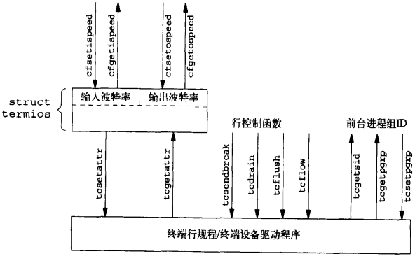

# 第18章 终端I/O

[TOC]


## 18.1 引言


## 18.2 综述

终端I/O有两种不同的工作模式：

1. `规范模式输入处理（Canonical mode input processing，默认）` 终端输入以行为单位进行处理。
2. `非规范模式输入处理（Noncanonical mode input processing）` 输入字符并不组成行。


*终端设备的输入，输出队列逻辑结构*


*终端行规程*


*c_cflag终端标志*


*c_iflag终端标志*


*c_lflag终端标志*


*c_oflag终端标志*


*终端I/O函数摘要*



*与终端有关的函数之间的关系*


## 18.3 特殊输入字符


*终端特殊输入字符*

例：

```c++
#include "apue.h"
#include <termios.h>

int 
main(void)
{
    struct termios term;
    long vdisable;
    
    if (isatty(STDIN_FILENO) == 0)
        err_quit("standard input is not terminal device");
    
    if ((vdisable = fpathconf(STDIN_FILENO, _PC_VDISABLE)) < 0)
        err_quit("fpathconf error or _POSIX_VDISABLE not in effect");
    
    if (tcgetattr(STDIN_FILENO, &term) < 0)
        err_sys("tcgetattr error");
    
    term.c_cc[VINTR] = vdisable;
    term.c_cc[VEOF]  = 2;
    
    if (tcsetattr(STDIN_FILENO, TCSAFLUSH, &term) < 0)
        err_sys("tcsetattr error");
    
    exit(0);
}
```

*禁用中断字符和更改文件结束字符*

| 特殊输入字符 | 说明                                                         |
| ------------ | ------------------------------------------------------------ |
| CR           | 回车符                                                       |
| DISCARD      | 删除符                                                       |
| DSUSP        | 延迟-挂起作业控制字符（delayed-suspend job-control character） |
| EOF          | 文件结束符                                                   |
| EOL          | 附加的行定界符                                               |
| EOL2         | 另一个行定界符                                               |
| ERASE        | 擦除字符（退格）                                             |
| ERASE2       | 另一个擦除字符（退格）                                       |
| INTR         | 中断字符                                                     |
| KILL         | kill（杀死）字符                                             |
| LNEXT        | 字面上的下一个字符（literal-next character）                 |
| NL           | 新行字符或行定界符                                           |
| QUIT         | 退出字符                                                     |
| REPRINT      | 再打印字符                                                   |
| START        | 启动字符                                                     |
| STATUS       | BSD的状态-请求字符                                           |
| STOP         | 停止字符                                                     |
| SUSP         | 挂起作业控制字符                                             |
| WERASE       | 字擦除字符                                                   |


## 18.4 获得和设置终端属性

```c++
#include <termios.h>
int tcgetattr(int filedes, struct termios *termptr);
int tcsetattr(int filedes, int opt, const struct termios *termptr);
```

- `filedes` 终端设备

- `termptr` 返回的终端属性指针

- `opt` 选项

  - TCSANOW 更改立即发生；
  - TCSADRAIN 发送了所有输出后更改才发生（若更改输出参数则应使用此选项）；
  - TCSAFLUSH 发送了所有输出后更改才发生（更进一步，在更改发生时未读的所有输入数据都被删除（刷清））；

- `返回值`

  成功：0

  失败：-1

*获得/设置终端属性*


## 18.5 终端选项标志

例：

```c++
#include "apue.h"
#include <termios.h>

int 
main(void)
{
    struct termios term;
    
    if (tcgetattr(STDIN_FILENO, &term) < 0)
        err_sys("tcgetattr error");
    switch (term.c_cflag & CSIZE) {
        case CS5:
            printf("5 bits/byte\n");
            break;
        case CS6:
            printf("6 bits/byte\n");
            break;
        case CS7:
            printf("7 bits/byte\n");
            breka;
        case CS8:
            printf("8 bits/byte\n");
            break;
        default:
            printf("unknown bits/byte\n");
    }
    term.c_cflag &= ~CSIZE;
    term.c_cflag |= CSS;
    if (tcsetattr(STDIN_FILENO, TCSANOW, &term) < 0)
        err_sys("tcsetattr error");
    exit(0);
}
```

*tcgetattr和tcsetattr实例*

| 选项标志   | 说明                                                         |
| ---------- | ------------------------------------------------------------ |
| ALTWERASE  | （c_lflag, FreeBSD, Mac OS X）此标志设置时，若输入了WERASE字符，则使用一个替换的字擦除算法。 |
| BRKINT     | （c_iflag, POSIX.1, FreeBSD, Linux, Mac OS X, Solaris）若此标志设置，而IGNBRK未设置，则再接到BREAK时，刷清输入，输出队列，并产生一个SIGINT信号。如果此终端设备是一个控制终端，则将此信号送给前台进程组各进程。<br>如果IGNBRK和BRKINT都没有设置，但是设置了PARMRK，则BREAK被读作为三个字节序列\377，\0和\0，如果PARMRK也没有设置，则BREAK被读作为单个字符\0。 |
| BSDLY      | （c_oflag，XSI，Linux，Solaris）退格延迟屏蔽，此屏蔽的值是BS0或BS1。 |
| CBAUDEXT   | （c_cflag，Solaris）扩充的波特率。用于允许大于B38400的波特率。 |
| CCAR_OFLOW | （c_cflag，FreeBSD，Mac OS X）打开输出的硬件流控制，该输出使用RS-232调制解调器载波信号（DCD，被称为数据-载波-检测）。这与早期的MDMBUF标志相同。 |
| CCTS_OFLOW | （c_cflag，FreeBSD，Mac OS X，Solaris）使用Clear-To-Send（CTS）RS-232信号进行输出硬件的流控制。 |
| CDSR_OFLOW | （c_cflag，FreeBSD，Mac OS X）按Data-Set-Ready（DSR）RS-232信号进行输出流控制。 |
| CDTR_IFLOW | （c_cflag，FreeBSD，Mac OS X）按Data-Terminal-Ready（DTR）RS-232信号进行输入流控制。 |
| CIBAUDEXT  | （c_cflag，Solaris）扩充的输入波特率，用于允许大于B28400的输入波特率。 |
| CIGNORE    | （c_cflag，FreeBSD，Mac OS X）忽略控制标志。                 |
| CLOCAL     | （c_cflag，POSIX.1，FreeBSD，Linux，Mac OS X，Solaris）如若设置，则忽略调制解调器状态线。这通常意味着该设备是直接连接的。若此标志未设置，则打开一个终端设备常常会阻塞直到调制解调器回应呼叫并建立连接。 |
| CMSPAR     | （c_oflag，Linux）选择标记或空奇偶校验。如果PARODD设置，则奇偶校验位总是1（标记奇偶校验），否则奇偶校验位总是0（空奇偶校验）。 |
| CRDLY      | （c_oflag，XSI，Linux，Solaris）回车延迟屏蔽。此屏蔽的值是CR0，CR1，CR2和CR3。 |
| CREAD      | （c_cflag，POSIX.1，FreeBSD，Linux，Mac OS X，Solaris）如若设置，则接收装置启用，可以接收字符。 |
| CRTSCTS    | （c_cflag，FreeBSD，Linux，Mac OS X，Solaris）其行为依赖于平台。对于Solaris，如果设置则允许输出硬件流控制。在另外三个平台上，以及内需输入，输出硬件流控制（等效于CCTS_OFLOW\|CRTS_IFLOW）。 |
| CRTS_IFLOW | （c_cflag，FreeBSD，Mac OS X，Solaris）输入的Request-TO-Send（RTS）流控制。 |
| CRTSXOFF   | （c_cflag，Solaris）如果设置，允许输入硬件流控制，Request-To-Send RS-232信号状态控制了流控制。 |
| CSIZE      | （c_cflag，POSIX.1，FreeBSD，Linux，Mac OS X，Solaris）此字段是一个屏蔽标志，它指明发送和接收的每个字节的位数。此长度不包括可能的奇偶校验位。由此屏蔽标志定义的字段值是CS5，CS6，CS7和CS8，分别表示每个字节包含5，6，7和8位。 |
| CSTOPB     | （c_cflag，POSIX.1，FreeBSD，Linux，Mac OS X，Solaris）如若设置，则使用两位作为停止位，否则只使用一位作为停止位。 |
| ECHO       | （c_lflag，POSIX.1，FreeBSD，Linux，Mac OS X，Solaris）如若设置，则将输入字符回显（回送）到终端设备。在规范模式和非规范模式下都可以回显字符。 |
| ECHOCTL    | （c_lflag，FreeBSD，Linux，Mac OS X，Solaris），如果设置并且ECHO也设置，则除ASCII TAB，ASCII NL，START和STOP字符外，其它ASCII控制符（ASCII字符集中的0~037）都被回显为`^X`，其中，`X`是相应控制字符代码值加8进制100所构成的字符。这就意味着ASCII Ctrl + A字符（8进制1）被回显为`^A`。ASCII DELETE字符（8进制177）则回显为`^?`。如若此标志未设置，则ASCII控制字符按其原样回显。如同ECHO标志，在规范模式和非规范模式下此标志对控制字符回显都起作用。<br>应当了解的是：某些系统回显EOF字符产生的作用有所不同，其原因是EOF的典型值是Ctrl+D，而这是ASCII EOT字符，它可能使某些终端挂断。 |
| ECHOE      | （c_lflag，POSIX.1，FreeBSD，Linux，Mac OS X，Solaris）如若设置并且ICANON也设置，则ERASE字符从显示中擦除当前行中的最后一个字符。这通常是在终端驱动程序中写三个字符序列“退格-空格-退格”而实现的。如若支持WERASE字符，则ECHOE用一个或若干个上述三字符序列擦除前一个字。 |
| ECHOK      | （c_lflag，POSIX.1，FreeBSD，Linux，Mac OS X，Solaris）如若设置并且ICANON也设置，则KILL字符从显示中擦除当前行，或者输出NL字符（用以强调已擦除整个行）。<br>如若支持ECHOKE标志，则这里的说明假定ECHOKE标志没有设置。 |
| ECHOKE     | （c_lflag，FreeBSD，Linux，Mac OS X，Solaris）如若设置并且ICANON也设置，则回显KILL字符的方式是擦去行中的每个字符。擦除每个字符的方法则由ECHO和ECHOPRT标志选择。 |
| ECHONL     | （c_lflag，POSIX.1，FreeBSD，Linux，Mac OS X，Solaris）如若设置并且ICANON也设置，即使没有设置ECHO也回显NL字符。 |
| ECHOPRT    | （c_lflag，FreeBSD，Linux，Mac OS X，Solaris）如若设置并且ICANON和ECHO也都设置，则ERASE字符（以及WERASE字符，若受到支持）使所有正被擦除的字符按它们被擦除的方式打印。在硬拷贝终端上这常常是有用的，这样可以确切地看到那些字符正被删除。 |
| EXTPROC    | （c_lflag，FreeBSD，Mac OS X）如若设置，规范字符处理在操作系统之外执行。如果串行通信外设卡执行某些行规程处理从而减轻主机处理器负载，或者使用伪终端，那么就可作这种设置。 |
| FFDLY      | （c_lflag，XSI，Linux，Solaris）换页延迟屏蔽。此屏蔽标志值是FF0或FF1。 |
| FLUSHO     | （c_lflag，FreeBSD，Linux，Mac OS X，Solaris）如若设置，则刷清输出。当键入DISCARD字符时设置此标志；当键入另一个DISCARD字符时，此标志被清除。设置或清除此终端标志也可设置或清除此条件。 |
| HUPCL      | （c_cfalg，POSIX.1，FreeBSD，Linux，Mac OS X，Solaris）如若设置，则当最后一个进程关闭此设备时，调制解调器控制线降至低电平（调制解调器的连接断开）。 |
| ICANON     | （c_lflag，POSIX.1，FreeBSD，Linux, Mac OS X, Solaris）如若设置，则按规范模式工作。这使下列字符起作用：EOF, EOL, EOL2, ERASE, KILL, REPRINT, STATUS和WERASE。输入字符被装配成行。<br>如果不以规范模式工作，则读请求直接从输入队列取字符。在至少接到MIN个字节或已超过TIME值之前，read将不返回。 |
| ICRNL      | （c_iflag, POSIX.1, FreeBSD, Linux, Mac OS X, Solaris）如若设置并且IGNCR未设置，则将接收到的CR字符转换成一个NL字符。 |
| IEXTEN     | （c_lflag, POSIX.1, FreeBSD, Linux, Mac OS X, Solaris）如若设置，则识别并处理扩充的，实现定义的特殊字符。 |
| IGNBRK     | （c_iflag, POSIX.1, FreeBSD, Linux, Mac OS X, Solaris）在设置时，忽略输入中BREAK条件。关于BREAK条件是产生SIGINT信号还是被读作为数据，请见BRKINT。 |
| IGNCR      | （c_iflag, POSIX.1, FreeBSD, Linux, Mac OS X, Solaris）如若设置，忽略接收到的CR字符。若此标志未设置而设置了ICRNL标志，则将接受到的CR字符转换成一个NL字符。 |
| IGNPAR     | （c_iflag, POSIX.1, FreeBSD, Linux, Mac OS X, Solaris）在设置时，忽略带有结构错误（非BREAK）或奇偶错的输入字节。 |
| IMAXBEL    | （c_iflag, FreeBSD, Linux, Mac OS X, Solaris）当输入队列满时响铃。 |
| INLCR      | （c_iflag, POSIX.1, FreeBSD, Linux, Mac OS X, Solaris）如果设置，则将接收到的NL字符转换成CR字符。 |
| INPCK      | （c_iflag, POSIX.1, FreeBSD, Linux, Mac OS X, Solaris）当设置时，使输入奇偶校验起作用。如若未设置INPCK，则使输入奇偶校验不起作用。奇偶“产生和检测”和“输入奇偶性校验”是不同的两件事。奇偶位的产生和检测是由PARENB标志控制的。设置该标志后使串行接口的设备驱动程序对输出字符产生奇偶位，对输入字符则验证其奇偶性。标志PARODD决定该奇偶性应当是奇还是偶。如果一个到来的字符其奇偶性为错的，则检查INPCK标志的状态。若此标志已设置，则检查IGNPAR标志（以决定是否应忽略带奇偶错的输入字节），若不应忽略此输入字节，则检查PARMRK标志以决定向读进程应传送那些字符。 |
| ISIG       | （c_lflag, POSIX.1, FreeBSD, Linux, Mac OS X, Solaris）如若设置，则判别输入字符是否要产生终端信号的特殊字符（INTR, QUIT, SUSP和DSUSP），若是，则产生相应的信号。 |
| ISTRIP     | （c_iflag, POSIX.1, FreeBSD, Linux, Mac OS X, Solaris）当设置时，有效输入字节被剥离为7位。当此标志未设置时，则保留全部8位。 |
| IUCLC      | （c_iflag, Linux, Solaris）将输入的大写字符映射为小写字符。  |
| IXANY      | （c_iflag, XSI, FreeBSD, Linux, Mac OS X, Solaris）使任一字符都能重新启动输出。 |
| IXOFF      | （c_iflag, POSIX.1, FreeBSD, Linux, Mac OS X, Solaris）如果设置，则使启动-停止输入控制起作用。当终端驱动程序发现输入队列将要填满时，输出一个STOP字符。此字符应当由发送数据的设备识别，并使该设备暂停。此后，当已对输入队列中的字符进行了处理后，该终端驱动程序将输出一个START字符，使该设备恢复发送数据。 |
| IXON       | （c_iflag, POSIX.1, FreeBSD, Linux, Mac OS X, Solaris）如果设置，则使启动-停止输出控制起作用。当终端驱动程序接收到一个STOP字符时，输出暂停。在输出暂停时，下一个START字符恢复输出。如若未设置此标志，则START和STOP字符由进程读作为一般字符。 |
| MDMBUF     | （c_cfalg, FreeBSD, Mac OS X）按照调制解调器的载波标志进程输出流控制。这是CCAR_OFLOW标志的曾用名。 |
| NLDLY      | （c_oflag, XSI, Linux, Solaris）换行延迟屏蔽。此屏蔽的值是NL0和NL1。 |
| NOFLSH     | （c_lflag, POSIX.1, FreeBSD, Linux, Mac OS X, Solaris）按系统默认，当终端驱动程序产生SIGINT和SIGQUIT信号时，输入，输出队列都被刷新。另外，当它产生SIGSUSP信号时，输入队列被刷新。如若设置了NOFLSH标志，则在这些信号产生时，输入队列被刷新。如若设置了NOFLSH标志，则在这些信号产生时，不对输入，输出队列进行刷新。 |
| NOKERNINFO | （c_lflag, FreeBSD, Mac OS X）当设置时，此标志防止STATUS字符把前台进程组的状态信息显示在终端上。但是不论本标志是否设置，STATUS字符使SIGINFO信号送至前台进程组中的所有进程。 |
| OCRNL      | （c_oflag, XSI, FreeBSD, Linux, Solaris）如果设置，将输出的CR字符映射为NL。 |
| OFDEL      | （c_oflag, XSI, Linux, Solaris）如若设置，则输出填充字符是ASCII DEL，否则它是ASCII NUL。参见OFILL标志。 |
| OFILL      | （c_oflag, XSI, Linux, Solaris）如果设置，则为了实现延迟，发送填充字符（ASCII DEL或ASCII NUL，参见OFDEL标志），而不使用时间延迟。参见如下6个延迟屏蔽标志：BSDLY, CRDLY, FFDLY, NLDLY, TABDLY以及VTDLY。 |
| OLCUC      | （c_oflag, Linux, Solaris）如果设置，将输出的小写字符映射为大写。 |
| ONLCR      | （c_oflag, XSI, FreeBSD, Linux, Mac OS X, Solaris）如若设置，将输出的NL字符映射为CR-NL。 |
| ONLRET     | （c_oflag, XSI, FreeBSD, Linux, Solaris）如果设置，则输出的NL字符应该执行回车功能。 |
| ONOCR      | （c_oflag, XSI, FreeBSD, Linux, Solaris）如果设置，则在0列不输出CR。 |
| ONOEOT     | （c_oflag, FreeBSD, Mac OS X）如果设置，则在输出中删除EOT字符(^D)。在将Ctrl + D解释为挂断的终端上这可能是需要的。 |
| OPOST      | （c_oflag, POSIX.1, FreeBSD, Linux, Mac OS X, Solaris）如若设置，则进行实现定义的输出处理。关于c_oflag字的各种实现定义的标志。 |
| OXTABS     | （c_oflag, FreeBSD, Mac OS X）如若设置，制表符在输出中被扩展为空格。这与将水平制表延迟（TABDLY）设置为XTABS或TAB3产生的效果相同。 |
| PARENB     | （c_cflag, POSIX.1, FreeBSD, Linux, Mac OS X, Solaris）如若设置，则对输出字符产生奇偶位，对输入字符则执行奇偶性校验。若PARODD已设置，则奇偶校验是奇校验，否则是偶校验。参见对INPCK, IGNPAR和PARMRK标志的讨论。 |
| PAREXT     | （c_cflag, Solaris）选择标志或空奇偶性。若PARODD设置，则奇偶位总是1（标记奇偶性）；否则奇偶位总是0（空奇偶性）。 |
| PARMRK     | （c_iflag, POSIX.1, FreeBSD, Linux, Mac OS X, Solaris）当设置时，如果IGNPAR未设置，则结构性错（非BREAK）或奇偶错的字节由进程读作为三个字符序列\377, \0和X，其中X是接收到的具有错误的字节。如若ISTRIP未设置，则一个有效的\377被传送给进程时为\377, \377。如若IGNPAR和PARMRK都未设置，则结构性错或奇偶错的字节都被读作为一个字符\0。 |
| PARODD     | （c_cflag, POSIX.1, FreeBSD, Linux, Mac OS X, Solaris）如若色湖之，则输出和输入字符的奇偶性都是奇，否则为偶。**注意，PARENB标志控制奇偶性的产生和检测。**<br>当CMSPAR或PAREXT标志设置时，PARODD标志也控制是否使用标记或空格的奇偶性。 |
| PENDIN     | （c_lflag, FreeBSD, Linux, Mac OS X, Solaris）如果设置，则在下一个字符输入时，尚未读的任何输入都由系统重新打印。这一动作与键入REPRINT字符时的作用相类似。 |
| TABDLY     | （c_oflag, XSI, Linux, Solaris）水平制表延迟屏蔽标志。此屏蔽标志的值是TAB0，TAB1，TAB2或TAB3。<br>XTABS的值等于TAB3。此值使系统将制表符扩展成空格。系统假定制表符在屏幕上每8个空格处设置一个。我们不能更改此假设。 |
| TOSTOP     | （c_lflag, POSIX.1, FreeBSD, Linux, Mac OS X, Solaris）如果设置，并且该实现支持作业控制，则将信号SIGTTOU送到试图写控制终端的一个后台进程的进程组。按默认，此信号暂停该进程组中所有进程。如果写控制终端的进程忽略或阻塞此信号，则终端驱动程序不产生此信号。 |
| VTDLY      | （c_oflag, XSI, Linux, Solaris）垂直制表延迟屏蔽标志。此屏蔽标志的值是VTO或VT1。 |
| XCASE      | （c_lflag, Linux, Solaris）如若设置，并且ICANON也设置，则认为终端只是大写终端，所有输入都变换为小写。为了输入一个大写字符，须在其前加一个\。与之类似，输出一个大写字符也在其前加一个\。（这一标志如今已经过时，现在几乎所有终端都支持大，小写字符）。 |


## 18.6 stty命令

显示终端的所有选项命令：

```sh
stty -a
```


## 18.7 波特率函数

```c++
#include <termios.h>
speed_t cfgetispeed(const struct termios *termptr);
speed_t cfgetospeed(const struct termios *termptr);
```

- `termptr` 终端
- `返回值` 波特率

*获取波特率*

```c++
#include <termios.h>
int cfsetispeed(struct termios *termptr, speed_t speed);
int cfsetospeed(struct termios *termptr, speed_t speed);
```

- `termptr` 终端

- `speed` 波特率

- `返回值`

  成功：0

  失败：-1

*设置波特率*


## 18.8 行控制函数

```c++
#include <termios.h>
int tcdrain(int filedes);
```

- `filedes` 终端设备

- `返回值`

  成功：0

  失败：-1

*等待所有输出都被发送*

```c++
#include <termios.h>
int tcflow(int filedes, int action);
```

- `filedes` 终端设备

- `action` 控制动作

  - TCOOFF 输出被挂起；
  - TCOON 重新启动以前被挂起的输出；
  - TCIOFF 系统发送一个STOP字符（这将使终端设备暂停发送数据）；
  - TCION 系统发送一个START字符（这将使终端恢复发送数据）。

- `返回值`

  成功：0

  失败：-1

*对输入和输出流的控制命令进行控制*

```c++
#include <termios.h>
int tcflush(int filedes, int queue);
```

- `filedes` 终端设备

- `queue` 控制动作

  - TCIFLUSH 刷清输入队列
  - TCOFLUSH 刷清输出队列
  - TCIOFLUSH 刷清输入，输出队列

- `返回值`

  成功：0

  失败：-1

*刷清（抛弃）输入/输出缓冲区*

```c++
#include <termios.h>
int tcsendbreak(int filedes, int duration);
```

- `filedes` 终端设备

- `duration` 时长（值为0时，此种发送延续0.25至0.5之间）

- `返回值`

  成功：0

  失败：-1

*在一个指定的时间区间内发送连续的0位流*


## 18.9 终端标识

```c++
#include <stdio.h>
char *ctermid(char *ptr);
```

- `ptr` 控制终端名

- `返回值`

  成功：返回指向控制终端名的指针

  失败：返回指向空字符串的指针

*设置控制终端名*

例：

```c++
#include <stdio.h>
#include <string.h>

static char ctermid_name[L_ctermid];

char *
ctermid(char *str)
{
    if (str = NULL)
        str = ctermid_name;
    return(strcpy(str, "/dev/tty"));
}
```

*POSIX.1 ctermid函数的实现*

```c++
#include <unistd.h>
int isatty(int filedes);
```

- `filedes` 终端

- `返回值`

  是终端设备：1

  不是终端设备：0

*判断是否为终端设备*

```c++
#include <unistd.h>
char *ttyname(int filedes);
```

- `filedes` 终端

- `返回值`

  成功：指向终端路径名的指针

  失败：NULL

*返回在文件描述符上打开的终端设备的路径名*

例：

```c++
#include <termios.h>

int 
isatty(int fd)
{
    struct termios ts;
    return(tcgetattr(fd, &ts) != -1);
}
```

*POSIX.1 isatty函数的实现*

例：

```c++
#include "apue.h"

int 
main(void)
{
    printf("fd 0: %s\n", isatty(0) ? "tty" : "not a tty");
    printf("fd 1: %s\n", isatty(1) ? "tty" : "not a tty");
    printf("fd 2: %s\n", isatty(2) ? "tty" : "not a tty");
    exit(0);
}
```

*测试isatty函数*

例：

```c++
#include <sys/stat.h>
#include <dirent.h>
#include <limits.h>
#include <string.h>
#include <termios.h>
#include <unistd.h>
#include <stdlib.h>

struct devdir {
    struct devdir *d_next;
    cahr *d_name;
};

static struct devdir *head;
static struct devdir *tail;
static char pathname[_POSIX_PATH_MAX + 1];

static void 
add(char *dirname)
{
    struct devdir *ddp;
    int len;
    len = strlen(dirname);
    if ((dirname[len - 1] == '.') && (dirname[len - 2] == '/' ||
         (dirname[len - 2] == '.' && dirname[len - 3] == '/')))
        return;
    if (strcmp(dirname, "/dev/fd") == 0)
        return;
    
    ddp = malloc(sizeof(struct devdir));
    if (ddp == NULL)
        return;
    
    ddp->d_name = strdup(dirname);
    if (ddp->d_name == NULL) {
        free(ddp);
        return;
    }
    ddp->d_next = NULL;
    if (tail == NULL) {
        head = ddp;
        tail = ddp;
    } else {
        tail->d_next = ddp;
        tail = ddp;
    }
}

static void 
cleanup(void)
{
    struct devdir *ddp, *nddp;
    ddp = head;
    while (ddp != NULL) {
        nddp = ddp->d_next;
        free(ddp->d_name);
        free(ddp);
        ddp = nddp;
    }
    head = NULL;
    tail = NULL;
}

static char *
searchdir(char *dirname, struct stat *fdstatp)
{
    struct stat devstat;
    DIR *dp;
    int devlen;
    struct dirent *dirp;
    
    strcpy(pathname, dirname);
    if ((dp = opendir(dirname)) == NULL)
        return(NULL);
    strcat(pathname, "/");
    devlen = strlen(pathname);
    while ((dirp = readdir(dp)) != NULL) {
        strncpy(pathname + devlen, dirp->d_name,
                _POSIX_PATH_MAX - devlen);
        if (strcmp(pathname, "/dev/stdin") == 0 ||
            strcmp(pathname, "/dev/stdout") == 0 ||
            strcmp(pathname, "/dev/stderr") == 0)
            continue;
        if (stat(pathname, &devstat) < 0)
            contineue;
        if (S_ISDIR(devstat.st_mode)) {
            add(pathname);
            continue;
        }
        if (devstat.st_ino == fdstatp->st_ino && 
            devstat.st_dev == fdstatp->st_dev) {
            closedir(dp);
            return(pathname);
        }
    }
    closedir(dp);
    return(NULL);
}

char *
ttyname(int fd)
{
    struct stat fdstat;
    struct devdir *ddp;
    char *rval;
    if (isatty(fd) == 0)
        return(NULL);
    if (fstat(fd, &fdstat) < 0)
        return(NULL);
    if (S_ISCHR(fdstat.st_mode) == 0)
        return(NULL);
    rval = searchdir("/dev", &fdstat);
    if (rval == NULL) {
        for (ddp = head; ddp != NULL; ddp = ddp->d_next)
            if ((rval = searchdir(ddp->d_name, &fdstat)) != NULL)
                break;
    }
    cleanup();
    return(rval);
}
```

*POSIX.1 ttyname函数的实现*

例：

```c++
#include "apue.h"

int 
main(void)
{
    char *name;
    if (isatty(0)) {
        name = ttyname(0);
        if (name = NULL)
            name = "undefined";
    } else {
        name = "not a tty";
    }
    printf("fd 0: %s\n", name);
    if (isatty(1)) {
        name = ttyname(1);
        if (name == NULL)
            name = "undefined";
    } else {
        name = "not a tty";
    }
    printf("fd 1: %s\n", name);
    if (isatty(2)) {
        name = ttyname(2);
        if (name == NULL)
            name = "undefined";
    } else {
        name = "not a tty";
    }
    printf("fd 2: %s\n", name);
    exit(0);
}
```

*测试ttyname函数*


## 18.10 规范模式

以下几个条件都会导致规范模式下读返回：

- 所要求的字节数已读到时，读返回；
- 当读到一个行定界符时，读返回；
- 如果捕捉到信号且该函数并不自动重启动，则读返回。

例：

```c++
#include <signal.h>
#include <stdio.h>
#include <termios.h>

#define MAX_PASS_LEN 8

char *
getpass(const char *prompt)
{
    static char    buf[MAX_PASS_LEN + 1];
    char           *ptr;
    sigset_t       sig, osig;
    struct termios ts, ots;
    FILE           *fp;
    int            c;
    
    if ((fp = fopen(ctermid(NULL), "r+")) == NULL)
        return(NULL);
    setbuf(fp, NULL);
    
    sigemptyset(&sig);
    sigaddset(&sig, SIGINT);
    sigaddset(&sig, SIGSTP);
    sigprocmask(SIG_BLOCK, &sig, &osig);
    
    tcgetattr(fileno(fp), &ts);
    ots = ts;
    ts.c_lflag &= ~(ECHO | ECHOE | ECHOK | ECHOL);
    tcsetattr(fileno(fp), TCSAFLUSH, &ts);
    fputs(prompt, fp);
    
    ptr = buf;
    while ((c = getc(fp)) != EOF && c != '\n')
        if (ptr < &buf[MAX_PASS_LEN])
            *ptr++ = c;
    *ptr = 0;
    putc('\n', fp);
    tcsetattr(fileno(fp), TCSAFLUSH, &ots);
    sigprocmask(SIG_SETMASK, &osig, NULL);
    fclose(fp);
    return(buf);
}
```

*getpass函数的实现*

例：

```c++
#include "apue.h"
char *getpass(const char *);
int 
main(void)
{
    char *ptr;
    if ((ptr = getpass("Enter password:")) == NULL)
        err_sys("getpass error");
    printf("password: %s\n", ptr);
    while (*ptr != 0)
        *ptr++ = 0;
    exit(0);
}
```

*调用getpass函数*


## 18.11 非规范模式


*非规范输入的四种情形*

例：

```c++
#include "apue.h"
#include <termios.h>
#include <errno.h>

static struct termios save_termios;
static int    ttysavefd = -1;
static enum { RESET, RAW, CBREAK } ttystate = RESET;

int 
tty_cbreak(int fd)
{
    int            err;
    struct termios buf;
    
    if (ttystate != RESET) {
        errno = EINVAL;
        return(-1);
    }
    if (tcgetattr(fd, &buf) < 0)
        return(-1);
    save_termios = buf;
    
    buf.c_lflag &= ~(ECHO | ICANON);
    
    buf.c_cc[VMIN] = 1;
    buf.c_cc[VTIME] = 0;
    if (tcsetatrr(fd, TCSAFLUSH, &buf) < 0)
        return(-1);
    
    if (tcgetattr(fd, &buf) < 0) {
        err = errno;
        tcsetattr(fd, TCSAFLUSH, &save_termios);
        errno = err;
        return(-1);
    }
    if ((buf.c_lflag & (ECHO | ICANON)) || buf.c_cc[VMIN] != 1 ||
         buf.c_cc[VTIME] != 0) {
        tcsetattr(fd, TCSAFLUSH, &save_termios);
        errno = EINVAL;
        return(-1);
    }
    ttystate = CBREAK;
    ttysavefd = fd;
    return(0);
}

int 
tty_raw(int fd)
{
    int err;
    struct termios buf;
    
    if (ttystate != RESET) {
        errno = EINVAL;
        return(-1);
    }
    if (tcgetattr(fd, &buf) < 0)
        return(-1);
    save_termios = buf;
    
    buf.c_lflag &= ~(ECHO | ICANON | IEXTEN | ISIG);
    
    buf.c_iflag &= ~(BRKINT | ICRNL | INPCK | ISTRIP | IXON);
    
    buf.c_cflag &= ~(CSIZE | PARENB);
    
    buf.c_cflag |= CS8;
    
    buf.c_oflag &= ~(OPOST);
    
    buf.c_cc[VMIN] = 1;
    buf.c_cc[VTIME] = 0;
    if (tcsetattr(fd, TCSAFLUSH, &buf) < 0)
        return(-1);
    
    if (tcgetattr(fd, &buf) < 0) {
        err = errno;
        tcsetattr(fd, TCSAFLUSH, &save_termios);
        errno = err;
        return(-1);
    }
    if ((buf.c_lflag & (ECHO | ICANON | IEXTEN | ISIG)) || 
        (buf.c_iflag & (BRKINT | ICRNL | INPCK | ISTRIP | IXON)) ||
        (buf.c_cflag & (CSIZE | PARENB | CS8)) != CS8 ||
        (buf.c_oflag & OPOST) || buf.c_cc[VMIN] != 1 ||
        buf.c_cc[VTIME] != 0) {
        tcsetattr(fd, TCSAFLUSH, &save_termios);
        errno = EINVAL;
        return(-1);
    }
    ttystate = RAW;
    ttysavefd = fd;
    return(0);
}

int 
tty_reset(int fd)
{
    if (ttystate == RESET)
        return(0);
    if (tcsetattr(fd, TCSAFLUSH, &save_termios) < 0)
        return(-1);
    ttystate = RESET;
    return(0);
}

void 
tty_atexit(void)
{
    if (ttysavefd >= 0)
        tty_reset(ttysavefd);
}

struct termios *
tty_termios(void)
{
    return(&save_termios);
}
```

*将终端模式设置为原始或chreak模式*

例：

```c++
#include "apue.h"

static void 
sig_catch(int signo)
{
    printf("signal caught\n");
    tty_reset(STDIN_FILENO);
    exit(0);
}

int 
main(void)
{
    int i;
    char c;
    if (signal(SIGINT, sig_catch) == SIG_ERR)
        err_sys("signal(SIGINT) error");
    if (signal(SIGQUIT, sig_catch) == SIG_ERR)
        err_sys("signal(SIGQUIT) error");
    if (signal(SIGTERM, sig_catch) == SIG_ERR)
        err_sys("signal(SIGTERM) error");
    if (tty_raw(STDIN_FILENO) < 0)
        err_sys("tty_raw error");
    printf("Enter raw mode characters, terminate with DELETE\n");
    while ((i = read(STDIN_FILENO, &c, 1)) == 1) {
        if ((c &= 255) == 0177)
            break;
        printf("%o\n", c);
    }
    if (tty_reset(STDIN_FILENO) < 0)
        err_sys("tty_reset error");
    if (i <= 0)
        err_sys("read error");
    if (tty_cbreak(STDIN_FILENO) < 0)
        err_sys("tty_cbreak error");
    printf("\nEnter cbreak mode characters, terminate with SIGINT\n");
    while ((i = read(STDIN_FILENO, &c, 1)) == 1) {
        c &= 255;
        printf("%o\n", c);
    }
    if (tty_reset(STDIN_FILENO) < 0)
        err_sys("tty_reset error");
    if (i <= 0)
        err_sys("read error");
    exit(0);
}
```

*测试原始终端模式和cbreak终端模式*


## 18.12 终端的窗口大小

```c++
struct winsize {
    unsigned short ws_row;
    unsigned short ws_col;
    unsigned short ws_xpixel;
    unsigned short ws_ypixel;
};
```

*内核为每个终端和伪终端保存一个winsize结构*

winsize结构作用如下：

- 用ioctl的TIOCGWINSZ命令可以取此结构的当前值；
- 用ioctl的TIOCSWINSZ命令可以将此结构的新值存放到内核中；如果此新值与存放在内核中的当前值不同，则向前台进程组发送SIGWINCH信号；
- 除了存放结构的当前值以及在此值改变时产生一个信号以外，内核对该结构不进行任何其它操作；
- 提供这种功能的目的是，当窗口大小发生变化时通知应用程序；应用程序接到此信号后，他可以取窗口大小的新值，然后重绘屏幕。

例：

```c++
#include "apue.h"
#include <termios.h>
#ifndef TIOCGWINSZ
#include <sys/ioctl.h>
#endif

static void 
pr_winsize(int fd)
{
    struct winsize size;
    if (ioctl(fd, TIOCGWINSZ, (char *)&size) < 0)
        err_sys("TIOCGWINSZ error");
    printf("%d rows, %d columns\n", size.ws_row, size.ws_col);
}

static void
sig_winch(int signo)
{
    printf("SIGWINCH received\n");
    pr_winsize(STDIN_FILENO);
}

int 
main(void)
{
    if (isatty(STDIN_FILENO) == 0)
        exit(1);
    if (signal(SIGWINCH, sig_winch) == SIG_ERR)
        err_sys("signal error");
    pr_winsize(STDIN_FILENO);
    for (;;)
        pause();
}
```

*打印窗口大小*


## 18.13 termcap, terminfo和curses


## 18.14 小结

