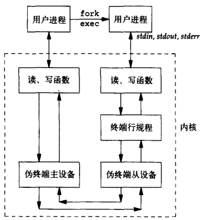
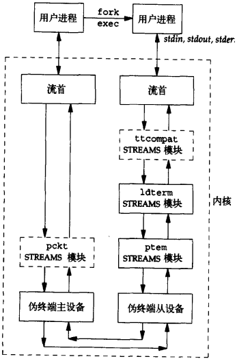
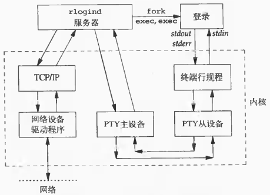
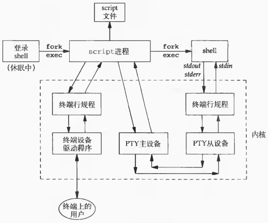
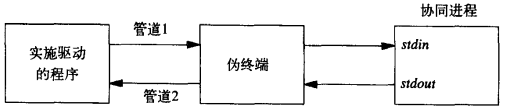
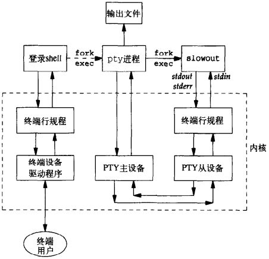
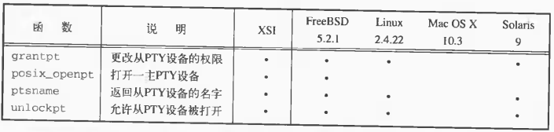
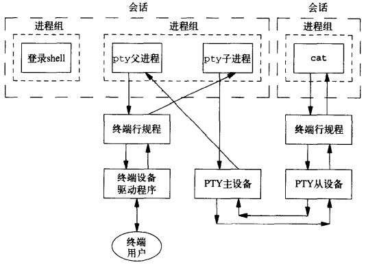
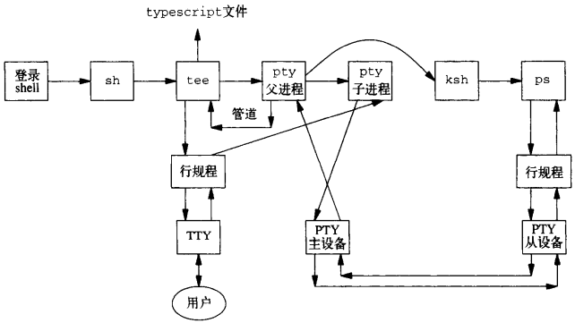
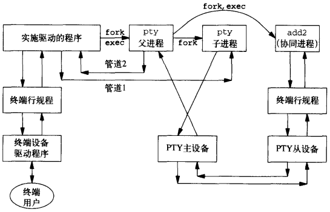

# 第19章 伪终端

[TOC]


## 19.1 引言


## 19.2 概述



*使用伪终端的相关进程的典型结构*



*Solaris中的伪终端结构*



*rlogind服务器的进程组织结构*



*script程序*



*用伪终端驱动一个协同进程*


## 19.3 打开伪终端设备



*使用伪终端运行一个缓慢输出的程序*

```c++
#include <stdlib.h>
#include <fcntl.h>
int posix_openpt(int oflag);
```

- `oflag` 位屏蔽字

- `返回值`

  成功：下一个可用的PTY主设备的文件描述符

  失败：-1

*打开下一个可用的伪终端主设备*

```c++
#include <stdlib.h>
int grantpt(int filedes);
```

- `filedes` 终端

- `返回值`

  成功：0

  失败：-1

*设置伪终端从设备权限*

```c++
#include <stdlib.h>
int unlockpt(int filedes);
```

- `filedes` 终端

- `返回值`

  成功：0

  失败：-1

*允许对伪终端从设备的访问*

```c++
#include <stdlib.h>
char *ptsname(int filedes);
```

- `filedes` 终端

- `返回值`

  成功：指向PTY从设备名的指针

  失败：NULL

*找到从伪终端设备的路径名*



*XSI伪终端函数*

```c++
#include "apue.h"
int ptym_open(char *pts_name, int pts_namesz);
```

- `pts_name` PTY主设备名

- `pts_namesz` PTY主设备名长度

- `返回值`

  成功：PTY主设备的文件描述符

  失败：-1

*打开下一个可用的PTY主设备*

```c++
#include "apue.h"
int ptys_open(char *pts_name);
```

- `pts_name` PTY主设备名

- `返回值`

  成功：PTY从设备的文件描述符

  失败：-1

*打开对应的从设备*

### 19.3.1 基于STREAMS的伪终端

```c++
TODO
```

*基于STREAMS的伪终端打开函数*

### 19.3.2 基于BSD的伪终端

```c++
TODO
```

*BSD和Linux的伪终端打开函数*

### 19.3.3 基于LInux的伪终端

```c++
TODO
```

*Linux的伪终端open函数*


## 19.4 pty_fork函数

```c++
#include "apue.h"
#include <termios.h>
#include <sys/ioctl.h>
pid_t pty_fork(int *ptrfdm, char *slave_name, int slave_namesz,
               const struct termios *slave_termios,
               const struct winsize *slave_winsize);
```

- `ptrfdm` PTY主设备文件描述符
- `slave_name` 存放从设备名字符数组
- `slave_namesz` 从设备名字符数组长度
- `slave_termios` 初始化从设备的终端行规程
- `slave_winsize` 初始化从设备的窗口大小
- `返回值` 子进程中返回0，父进程中返回子进程的进程ID，出错返回-1

*用fork调用打开主设备和从设备，创建作为会话首进程的子进程并使其具有控制终端*

例：

```c++
TODO
```

*pty_fork函数*


## 19.5 pty程序

例：

```c++
TODO
```

*pty程序的main函数*

例：

```c++
TODO
```

*loop函数*


## 19.6 使用pty程序



*pty cat的进程组和会话*



*script shell脚本*



*运行一协同进程，以伪终端作为其输入和输出*

```c++
TODO
```

*pty程序的do_driver函数*


## 19.7 高级特性


## 19.8 小结

