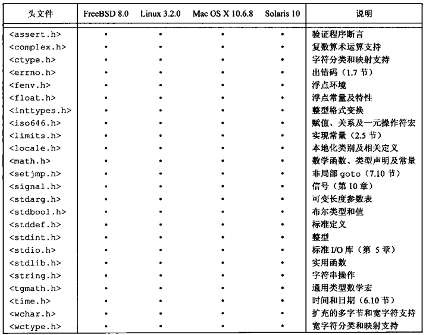

# 第二章 UNIX标准化及实现

[TOC]


## 2.1 引言


## 2.2 UNIX标准化

### 2.2.1 ISO C



*ISO C标准定义的头文件*

### 2.2.2 IEEE POSIX


*POSIX标准定义的必需的头文件*


*POSIX标准定义的XSI扩展头文件*


*POSIX标准定义的可选头文件*


*POSIX.1可选接口组和代码*

### 2.2.3 Single UNIX Specification

### 2.2.4 FIPS


## 2.3 UNIX系统实现

### 2.3.1 SVR4

### 2.3.2 4.4BSD

### 2.3.3 FreeBSD

### 2.3.4 Linux

### 2.3.5 Mac OS X

### 2.3.6 Solaris

### 2.3.7 其它UNIX系统


## 2.4 标准和实现的关系


## 2.5 限制

### 2.5.1 ISO C限制


*<limits.h>中定义的整型值大小*


*在各种平台上的ISO限制*

### 2.5.2 POSIX限制


*<limits.h>中的POSIX.1不变最小值*

### 2.5.3 XSI限制

XSI定义了处理实现限制的下面的常量：

- 不变最小值；

  

  *<limits.h>中的XSI不变最小值*

- 数值限制：`LONG_BIT`和`WORD_BIT`；

- 运行时不变值：`ATEXIT_MAX`, `IOV_MAX`以及`PAGE_SIZE`。

### 2.5.4 sysconf,pathconf和fpathconf函数

```c++
#include <unistd.h>
long sysconf(int name);
long pathconf(const char *pathname, int name);
long fpathconf(int filedes, int name);
```

- `name` 限制名

  

  *sysconf的限制及name参数*

  

  *pathconf和fpathconf的限制及name参数*

- `pathname` 文件路径

- `filedes` 文件描述符

- `返回值`

  成功：运行时限制

  失败：-1

*获得运行时限制*

例：

```c++
TODO
```

*构建C程序以打印所有得到支持的系统配置限制*

例：

```c++
TODO
```

*打印所有可能的sysconf和pathconf值*


*配置限制的实例*

### 2.5.5 不确定的运行时限制

例：

```c++
TODO
```

*为路径名动态地分配空间*

例：

```c++
TODO
```

*确定文件描述符数*


## 2.6 选项


*sysconf的选项及name参数*


*pathconf和fpathconf的选项及name参数*


*配置选项的实例*


## 2.7 功能测试宏


## 2.8 基本系统数据类型


*某些常用的基本系统数据类型*


## 2.9 标准之间的冲突


## 2.10 小结

