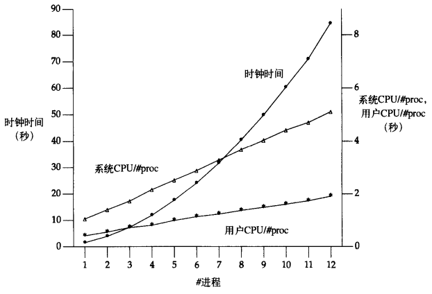

# 第20章 数据库函数库

[TOC]


## 20.1 引言


## 20.2 历史


*多种平台支持的数据库函数库*


## 20.3 函数库

```c++
#include "apue_db.h"
DBHANDLE db_open(const char *pathname, int oflag, ...);
```

- `pathname` 数据库文件路径

- `oflag` 打开模式

- `...` 文件访问权限

- `返回值`

  成功：数据库句柄

  失败：NULL

*打开/创建数据库文件*

```c++
#include "apue_db.h"
void db_close(DBHANDLE db);
```

- `db` 数据库句柄

*关闭数据库*

```c++
#include "apue_db.h"
int db_store(DBHANDLE db, const char *key, const char *data, int flag);
```

- `db` 数据库句柄

- `key` 键

- `data` 数据

- `flag` 标志

  - DB_INSERT 加一条新纪录
  - DB_REPLACE 替换一条已有的记录
  - DB_STORE 加一条新纪录或替换一条已有记录

- `返回值`

  成功：0

  失败：非0

*向数据库添加记录*

```c++
#include "apue_db.h"
char *db_fetch(DBHANDLE db, const char *key);
```

- `db` 数据库句柄

- `key` 键

- `返回值`

  成功：指向数据的指针

  失败：NULL

*从数据库中取出一条记录*

```c++
#include "apue_hdb.h"
int db_delete(DBHANDLE db, const char *key);
```

- `db` 数据库句柄

- `key` 键

- `返回值`

  成功：0

  失败：-1

*从数据库删除一条记录*

```c++
#include "apue_db.h"
void db_rewind(DBHANDLE db);
```

- `db` 数据库句柄

- `key` 键

- `返回值`

  成功：指向数据的指针

  到达数据库结尾：NULL

*回滚到数据库的第一条记录*

```c++
#include "apue_db.h"
char *db_nextrec(DBHANDLE db, char *key);
```

- `db` 数据库句柄

- `key` 键

- `返回值`

  成功：指向数据的指针

  到达数据库结尾：NULL

*查找下一条记录*


## 20.4 实现概述


*索引文件和数据文件结构*

例：

```c++
#include "apue.h"
#include "apue_db.h"
#include <fcntl.h>

int 
main(void)
{
    DBHANDLE db;
    
    if ((db = db_open("db4", O_RDWR | O_CREAT | O_TRUNC, 
                             FILE_MODE)) == NULL)
        err_sys("db_open error");
    
    if (db_store(db, "Alpha", "data1", DB_INSERT) != 0)
        err_quit("db_store error for alpha");
    if (db_store(db, "beta", "Data for beta", DB_INSERT) != 0)
        err_quit("db_store error for gamma");
    
    db_close(db);
    exit(0);
}
```

*建立一个数据库并向其中写三条记录*


## 20.5 集中式或非集中式

当有多个进程访问同一个数据库时，有两种方法可实现库函数：

1. 集中式：由一个进程作为数据库管理者，所有的数据库访问工作由此进程完成。其它进程通过IPC机制与此中心进程进行联系。
2. 非集中式：每个库函数独立申请并发控制（加锁），然后自己调用I/O函数。


*集中式数据库访问*


*非集中式数据库访问*


## 20.6 并发

对数据库文件加锁方式：

1. `粗锁（coarse-grained locking）` 将索引文件或数据文件中的一个作为整个数据库的锁，并要求调用者在对数据库进行操作前必须获得这个锁。
2. `细锁（fine-grained locking）` 要求一个读进程或写进程在操作一条记录前必须先获得此记录所在散列链的读锁或写锁，一个散列链同时允许多个进程读，只允许一个进程写。


## 20.7 构造函数库


## 20.8 源代码

```c++
TODO
```

*db.h*

```c++
TODO
```

*db.c*


## 20.9 性能

1. 单进程的结果

   

   *nrec为500时，每个子进程*

   

   *单子进程，不同的nrec和不同的加锁方法*

2. 多进程的结果

   

   *nrec=500时，不同加锁方法比较*


## 20.10 小结



*表20-4中使用建议细琐的数据*


