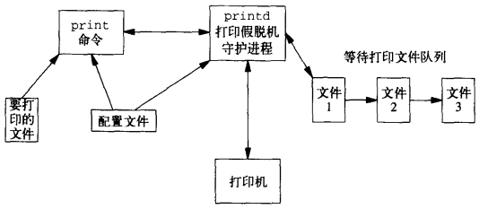

# 第21章 与网络打印机通信

[TOC]


## 21.1 引言

`网络打印协议（Internet Printing Protocol，IPP）`


## 21.2 网络打印协议


*IPP报文结构*


*IPP首部结构*


*IPP属性编码示例*


*打印作业请求的属性*


*主要的IPP RFC*


## 21.3 超文本传输协议


## 21.4 打印假脱机技术



*打印假脱机组件*


## 21.5 源代码

```c++
TODO
```

*ipp.h*

```c++
TODO
```

*print.h*

```c++
TODO
```

*util.c*

```c++
TODO
```

*print.c*

```c++
TODO
```

*printd.c*

```c++
#include <fcntl.h>
int getopt(int argc, const *const argv[], const char *options);
extern int optind, opterr, optopt;
extern char *optarg;
```

- `argc` 参数数量

- `argv` 参数数组

- `options` 命令支持的选项字符

- `返回值`

  成功：下一个选项字符

  全部选项处理完毕：-1

*按照一致的方式来处理命令行选项*


## 21.6 小结

